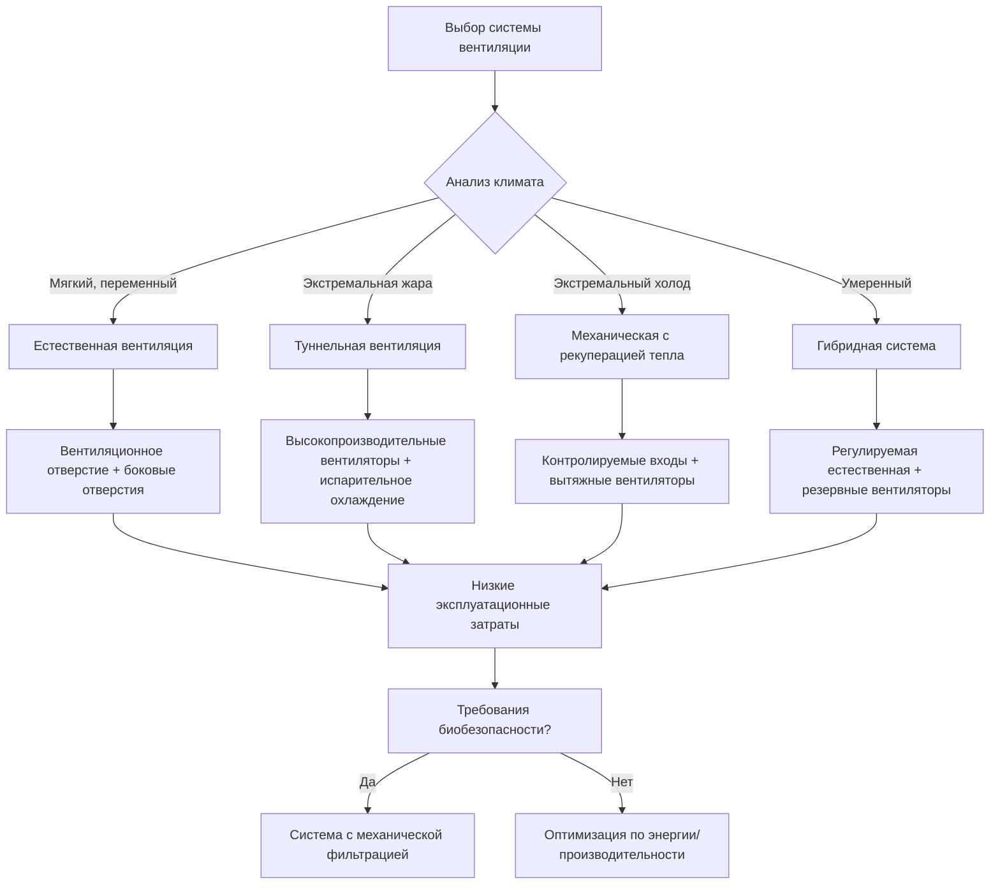

Системы вентиляции сельскохозяйственных помещений поддерживают тепловой комфорт, качество воздуха и здоровье животных путем контролируемого воздухообмена в животноводческих зданиях. В отличие от коммерческих приложений HVAC, сельскохозяйственные сооружения сталкиваются с уникальными проблемами, включая высокие явные и скрытые тепловые нагрузки от метаболизма животных, выделение влаги из дыхания и отходов, повышенные концентрации аммиака и твердых частиц, а также широкие колебания наружных условий. Правильное проектирование вентиляции балансирует эти конкурирующие требования при минимизации потребления энергии и соблюдении требований биологической безопасности.

## Основные требования к вентиляции

Вентиляция служит трем основным функциям в животноводческих сооружениях: регулирование температуры, удаление влаги и разбавление загрязняющих веществ. Каждая функция требует различных расходов воздуха, которые варьируются в зависимости от сезона, размера животных и конфигурации помещения. Проектирование должно учитывать наиболее требовательное условие, обеспечивая приемлемую производительность во всех сценариях эксплуатации.

Регулирование температуры является доминирующим фактором в теплое время года, когда производство метаболического тепла превышает потери тепла зданием. Воздухообмен удаляет явное тепло путем замены теплого внутреннего воздуха более холодным наружным воздухом. Требуемый расход вентиляции зависит от допустимого повышения температуры между входом и выходом:

$$Q_s = \frac{H_s}{\rho c_p \Delta T}$$

где $Q_s$ — расход вентиляции для удаления явного тепла (CFM), $H_s$ представляет общее производство явного тепла (кДж/ч), $\rho$ обозначает плотность воздуха (1,225 кг/м³ при стандартных условиях), $c_p$ равна удельной теплоемкости воздуха (1005 Дж/кг·°C), и $\Delta T$ — допустимое повышение температуры (°C).

Удаление влаги становится критическим, когда контроль влажности предотвращает конденсацию и респираторные заболевания. Животные выделяют значительное количество влаги через дыхание и испарение с влажных поверхностей. Расход вентиляции для удаления влаги рассчитывается следующим образом:

$$Q_m = \frac{W}{\rho (\omega_{out} - \omega_{in})}$$

где $Q_m$ — расход для удаления влаги (CFM), $W$ представляет общее производство влаги (кг/ч), и $\omega$ обозначает влагосодержание (кг влаги/кг сухого воздуха) для условий на выходе и входе.

Разбавление загрязняющих веществ поддерживает приемлемое качество воздуха путем замены загрязненного воздуха свежим наружным воздухом. Концентрации углекислого газа, аммиака и пыли должны оставаться ниже пороговых значений, которые нарушают здоровье и производительность животных. Минимальные расходы вентиляции на основе массы животных или объема здания обеспечивают адекватное разбавление независимо от тепловых условий.

## Определение расходов вентиляции

Расходы вентиляции в сельском хозяйстве варьируются в зависимости от сезона и возраста животных. Расчеты проектирования должны определить требования для летнего максимума, зимнего минимума и переходных условий.

| Сезон | Условие | Типичный расход | Определяющий фактор |
|--------|-----------|--------------|-------------------|
| Лето | Максимальная вентиляция | 100-200 CFM (170-340 м³/ч) на животное | Удаление явного тепла |
| Зима | Минимальная вентиляция | 5-15 CFM (8-25 м³/ч) на животное | Разбавление влаги и загрязняющих веществ |
| Весна/Осень | Переходный период | 30-60 CFM (51-102 м³/ч) на животное | Переменные тепловые нагрузки |

Летние расходы вентиляции зависят от допустимого повышения температуры выше наружной. Консервативное проектирование ограничивает внутренние температуры на 3-4 °C выше наружной при пиковых условиях. Системы испарительного охлаждения позволяют более высокие расходы вентиляции и скорости воздуха, которые повышают эффективное снижение температуры за счет конвективной передачи тепла от поверхностей животных.

Зимняя вентиляция обеспечивает минимальный воздухообмен для удаления влаги без чрезмерных потерь тепла. Сооружения в холодном климате требуют предварительно нагретого воздуха вентиляции или систем рекуперации тепла для предотвращения конденсации на поверхностях здания. Животные выделяют влагу с расходами, пропорциональными массе тела и скорости метаболизма. Рыночная свинья массой 68 кг производит примерно 0,23-0,32 кг/ч влаги, в то время как молочная корова массой 635 кг производит 1,13-1,59 кг/ч.

## Принципы распределения воздуха

Эффективная вентиляция требует равномерного распределения воздуха, которое предотвращает застойные зоны, сквозняки и температурную стратификацию. Схемы движения воздуха зависят от конструкции входа, расположения выхода и движущей силы (естественная плавучесть или механические вентиляторы).

Скорость входящего воздуха и направление определяют начальные характеристики смешивания. Высокоскоростные струи проникают дальше в здание перед потерей импульса и опусканием на уровень животных. Расстояние броска для свободной струи рассчитывается следующим образом:

$$L = V_0 \left(\frac{A_0}{K}\right)^{0.5}$$

где $L$ представляет расстояние броска (м), $V_0$ — начальная скорость (м/мин), $A_0$ равна площади входа (м²), и $K$ — эмпирический коэффициент (обычно 5-7 для сельскохозяйственных входов).

Боковые входы должны направлять воздух вверх вдоль потолка в холодное время года для прогрева перед достижением животных. Летняя эксплуатация направляет воздух горизонтально или вниз для максимального смешивания и скорости на уровне животных. Регулируемые входные жалюзи учитывают сезонные требования.

Температурная стратификация развивается, когда силы плавучести преодолевают энергию смешивания. Теплый воздух накапливается у потолка, а холодный воздух оседает на уровне пола. Разница температур между потолком и полом зависит от распределения источника тепла и эффективности вентиляции:

$$\Delta T_{vertical} = \frac{H_s}{Q \rho c_p} \times \frac{h}{L_{mix}}$$

где $h$ — высота здания, и $L_{mix}$ представляет характеристическую длину смешивания, определяемую конструкцией входа.

## Методология выбора системы

Системы вентиляции сельскохозяйственных помещений делятся на три категории: естественная вентиляция с использованием сил ветра и плавучести, механическая вентиляция с приводными вентиляторами и гибридные системы, сочетающие оба подхода. Выбор зависит от климата, размера здания, плотности животных и предпочтений эксплуатации.

Естественная вентиляция подходит для умеренного климата с управляемыми летними температурами и адекватными ветровыми ресурсами. Капитальные затраты остаются низкими, а электроэнергия не потребляется в благоприятную погоду. Однако производительность полностью зависит от погодных условий, и точное управление окружающей средой невозможно.

Механическая вентиляция обеспечивает надежную производительность независимо от наружных условий. Емкость вентилятора и ступенчатое управление вмещают широко варьирующиеся требования к расходу воздуха. Работа под отрицательным давлением улучшает биобезопасность, предотвращая попадание нефильтрованного воздуха. Основные недостатки включают более высокие капитальные и эксплуатационные затраты, а также полный отказ системы при отключении электроэнергии.

Туннельная вентиляция представляет специализированный механический подход для многоплотного жилья в жарком климате. Большие вентиляторы на одном конце здания всасывают воздух по всей длине со скоростью 122-213 м/мин, создавая значительные эффекты охлаждения ветром. Пады испарительного охлаждения у входа дополнительно снижают температуру входящего воздуха.

Гибридные системы используют естественную вентиляцию в благоприятных условиях и механическую поддержку, когда естественные движущие силы недостаточны. Автоматизированные элементы управления управляют переходом между режимами на основе температуры, влажности и эффективности вентиляции.

## Физические принципы, управляющие производительностью

Естественная вентиляция использует две движущие силы: эффект стека от разницы температур и ветровое давление. Эти силы могут работать вместе или противодействовать друг другу в зависимости от направления ветра и ориентации здания.

Эффект стека развивается, когда температура внутреннего воздуха превышает температуру наружного воздуха, создавая разницу в плотности. Теплый воздух поднимается и выходит через верхние отверстия, а прохладный воздух поступает через нижние отверстия. Разница давлений, вызывающая этот поток, равна:

$$\Delta P_{stack} = h \times (\rho_{out} - \rho_{in}) \times g = h \times \rho_{out} \times g \times \left(1 - \frac{T_{out}}{T_{in}}\right)$$

где $h$ — вертикальное расстояние между входом и выходом (м), $g$ представляет ускорение свободного падения (9,81 м/с²), и температуры указаны в абсолютных единицах (K = °C + 273,15).

Ветровое давление на поверхностях здания зависит от скорости ветра и направления относительно здания. Наветренные поверхности испытывают положительное давление, а подветренные поверхности имеют отрицательное давление:

$$\Delta P_{wind} = C_p \times \frac{\rho V^2}{2}$$

где $C_p$ — коэффициент давления (-0,6 до +0,8 для сельскохозяйственных зданий) и $V$ представляет скорость ветра (м/мин).

Системы механической вентиляции создают контролируемые разницы давления путем работы вентилятора. Системы под отрицательным давлением вытяживают воздух из здания, создавая всасывание, которое втягивает свежий воздух через спроектированные входы. Системы под положительным давлением нагнетают воздух в здание, создавая внутреннее давление, которое выталкивает воздух через выходы.

## Рассмотрение энергоэффективности

Потребление энергии вентиляции включает электрическую мощность вентилятора и тепловую энергию для нагрева или охлаждения воздуха вентиляции. Общие годовые затраты на энергию зависят от суровости климата, конструкции системы и стратегий управления.

Требования мощности вентилятора подчиняются стандартным законам вентиляторов, при этом мощность пропорциональна расходу воздуха и повышению давления:

$$P_{fan} = \frac{Q \times \Delta P}{6356 \times \eta_{fan}}$$

где $P_{fan}$ — мощность на валу (л.с.), $Q$ — расход воздуха (CFM), $\Delta P$ представляет общее повышение давления (см вод. ст.), и $\eta_{fan}$ равна эффективности вентилятора (обычно 0,45-0,65 для сельскохозяйственных вентиляторов).

Тепловая энергия для нагрева воздуха вентиляции доминирует в холодном климате:

$$Q_{heat} = 1,225 \times \text{м³/ч} \times 1005 \times (T_{in} - T_{out}) / 3600$$

где $Q_{heat}$ в кВт и температуры в °C.

Эффективные системы управления минимизируют потребление энергии при поддержании приемлемых условий. Вентиляторы с переменной скоростью регулируют расход воздуха в соответствии с мгновенными требованиями, а не циклировать включение/выключение. Теплообменники рекуперируют тепло из выходящего воздуха для предварительного нагрева холодного входящего воздуха, снижая потребность в дополнительном нагреве.

Сельскохозяйственная вентиляция представляет специализированную дисциплину, требующую интеграции наук о животных, физики зданий и принципов механической инженерии. Успешные проекты учитывают экстремальные вариации нагрузок, суровые среды и строгие требования биологической безопасности при поддержании экономической жизнеспособности сельскохозяйственных операций.
