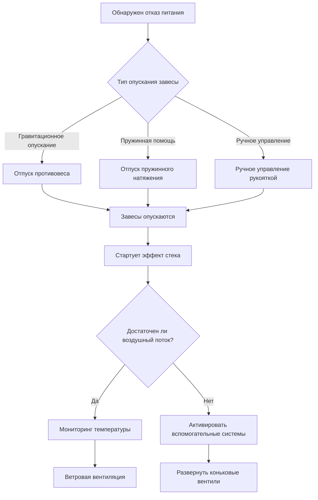

## Обзор

Системы вентиляции на случай чрезвычайных ситуаций обеспечивают критически важный воздушный поток при отказе первичной механической вентиляции в помещениях с ограниченным содержанием животных. Перебои в подаче электроэнергии продолжительностью даже 15-30 минут могут привести к катастрофическому тепловому стрессу и гибели животных на современных предприятиях животноводства с высокой плотностью размещения. Системы на случай чрезвычайных ситуаций должны активироваться автоматически и обеспечивать достаточную вентиляцию для предотвращения стресса у животных до восстановления подачи электроэнергии или эвакуации.

## Физика отказа вентиляции

### Скорость накопления тепла

При прекращении работы механической вентиляции явное тепло от животных накапливается в соответствии с уравнением:

$$\frac{dT}{dt} = \frac{q_{sensible} \cdot N}{m_{air} \cdot c_p}$$

Где:
- $\frac{dT}{dt}$ = скорость повышения температуры (°C/мин)
- $q_{sensible}$ = производство явного тепла на одно животное (кДж/ч или Вт)
- $N$ = количество животных
- $m_{air}$ = масса воздуха в помещении (кг)
- $c_p$ = удельная теплоемкость воздуха (1,005 кДж/кг·°C)

**Пример расчета:** Птицефабрика размером 12 м × 61 м с высотой потолка 2,4 м содержит 1 813 м³ воздуха (масса ≈ 2 180 кг при стандартных условиях). С 20 000 бройлерами, каждый из которых производит 17,6 кВт явного тепла:

$$\frac{dT}{dt} = \frac{17,6 \times 20,000}{2,180 \times 1,005} = \frac{352,000}{2,191} = 160,6 \text{ °C/ч} ≈ 2,68 \text{ °C/мин}$$

Это демонстрирует, как быстро условия становятся летальными без вентиляции.

### Критическое временное окно

Допустимое время до появления признаков стресса у животных зависит от начальной температуры и теплотолерантности вида:

$$t_{critical} = \frac{T_{stress} - T_{initial}}{\frac{dT}{dt}}$$

Для птицы при начальной температуре 24°C с порогом теплового стресса 32°C и указанной выше скоростью критическое время составляет примерно 3,5 минуты.

## Системы вентиляции на случай чрезвычайных ситуаций

### Резервная естественная вентиляция

#### Вентиляция с эффектом стека

Естественная вентиляция зависит от тепловой плавучести:

$$Q_{stack} = C_d \cdot A \cdot \sqrt{2 \cdot g \cdot h \cdot \frac{\Delta T}{T_{avg}}}$$

Где:
- $Q_{stack}$ = объемный воздушный поток (CFM или м³/с)
- $C_d$ = коэффициент расхода (0,6-0,65 типично)
- $A$ = эффективная площадь открытия (м²)
- $g$ = ускорение свободного падения (9,81 м/с²)
- $h$ = вертикальное расстояние между входом и выходом (м)
- $\Delta T$ = разница температур помещения и атмосферы (°C)
- $T_{avg}$ = средняя абсолютная температура (K)

**Требование проекта:** Размеры открытий должны обеспечивать минимум 25% от механической емкости вентиляции при температурном перепаде 5,6°C.

### Системы опускания завес

| Компонент | Спецификация | Время активации |
|-----------|---------------|-----------------|
| Гравитационный противовес | Соотношение 1,5:1 | < 30 секунд |
| Пружинный отпуск | Натяжение 222-445 Н | < 15 секунд |
| Электромагнитный замок | 24V DC с отказоустойчивостью | < 5 секунд |
| Ручная рукоятка | Снижение передачи 10:1 | 2-3 минуты |
| Площадь боковой завесы | 15-25% площади стены | Н/Д |
| Открытие конькового вентиля | 0,45-0,76 м ширина | < 60 секунд |

#### Расчет размеров завесы

Минимальная площадь открытия завесы:

$$A_{curtain} = \frac{Q_{min}}{V_{air} \cdot C_d}$$

Где $Q_{min}$ = 25% от летней механической вентиляции и $V_{air}$ = 0,3-0,6 м/с естественная скорость воздуха.

### Системы резервного питания

#### Расчет мощности генератора

Расчет общей нагрузки:

$$P_{generator} = 1,25 \times (P_{fans} + P_{controls} + P_{lights} + P_{aux})$$

Множитель 1,25 учитывает пусковой ток и резервную емкость.

**Минимальная емкость вентилятора:** Размер резервного генератора должен обеспечивать достаточную мощность для вентиляторов, рассчитанных на 0,35-0,53 CFM (м³/ч)/кг живого веса животного или 50% летней емкости вентиляции, в зависимости от того, что больше.

| Тип животного | Вентиляция в чрезвычайных ситуациях (CFM/кг) | Приоритет генератора |
|-------------|--------------------------------|-------------------|
| Бройлерные цыпленки | 0,35-0,53 | Высокий (< 5 мин критич.) |
| Содержанные куры | 0,40-0,58 | Высокий (< 5 мин критич.) |
| Поросята | 0,88-1,32 | Высокий (< 10 мин критич.) |
| Откармливаемые свиньи | 1,32-2,20 | Высокий (< 8 мин критич.) |
| Молочный скот | 17,7-70,8 CFM/животное | Средний (< 30 мин критич.) |

### Системы оповещения

Многоуровневая конфигурация оповещения:

**Этап 1: Отказ питания**
- Активация: Немедленно при отключении сетевого питания
- Сигнал: Локальная звуковая сигнализация, автоматическое уведомление
- Действие: Инициирован отпуск завесы, последовательность запуска генератора

**Этап 2: Высокая температура**
- Активация: Температура превышает установку + 2,8°C
- Сигнал: Усиленные уведомления, SMS/email-оповещения
- Действие: Проверка развертывания систем в чрезвычайных ситуациях

**Этап 3: Критическая температура**
- Активация: Температура превышает установку + 5,6°C
- Сигнал: Экстренные контакты, непрерывная сигнализация
- Действие: Требуется ручное вмешательство, возможна эвакуация

### Мониторинг температуры

Разместите избыточные датчики температуры:

$$\Delta T_{alarm} = \frac{q_{total} \cdot t_{response}}{m_{air} \cdot c_p}$$

Установите пороги сигналов тревоги на основе ожидаемого повышения температуры во время времени отклика системы.

**Расположение датчиков:**
- На уровне животных (45-61 см над полом)
- В потоке выходящего воздуха (проверка работы вентилятора)
- Внешний эталонный датчик (условия окружающей среды)
- Избыточные датчики (2+ на зону)

## Соображения благополучия животных

### Прогрессия теплового стресса

| Стадия | Температура выше комфорта | Физиологический ответ | Время начала |
|-------|---------------------------|------------------------|---------------|
| Легкий стресс | 2,8-4,4°C | Увеличение дыхания | 5-10 минут |
| Умеренный стресс | 4,4-6,7°C | Одышка, снижение аппетита | 10-20 минут |
| Тяжелый стресс | 6,7-10°C | Опухание, дыхание с открытым ртом | 20-40 минут |
| Угроза жизни | >10°C | Отказ органов, смертность | 40-90 минут |

### Протокол аварийного реагирования

1. **Немедленный (0-2 минуты):** Подтверждение развертывания завесы и запуска генератора
2. **Краткосрочный (2-10 минут):** Проверка адекватности воздушного потока, мониторинг тенденции температуры
3. **Среднесрочный (10-30 минут):** Оценка поведения животных, подготовка к эвакуации при необходимости
4. **Длительный (>30 минут):** Внедрение туманообразования водой, сокращение плотности размещения, предоставление дополнительного охлаждения

## Стандарты проектирования

**Стандарты ASABE:**
- EP270.5: Проектирование систем вентиляции для птицеводческих и животноводческих помещений
- EP296.3: Общая терминология для приводов ВОМ тракторов
- S430: Отопление, вентиляция и охлаждение теплиц

**MWPS (Служба планирования Среднего Запада):**
- MWPS-1: Справочник по конструкциям и окружающей среде

**Минимальные требования:**
- Автоматический отпуск завесы при отказе питания
- Резервное питание или естественная вентиляция ≥50% летней емкости
- Система оповещения с удаленным уведомлением
- Ежемесячное испытание систем на случай чрезвычайных ситуаций
- Ежегодный осмотр и техническое обслуживание

## Протокол обслуживания

**Еженедельно:**
- Тестирование функциональности системы оповещения
- Осмотр кабелей завесы и шкивов

**Ежемесячно:**
- Нагрузочное испытание генератора (минимум 30 минут)
- Тестирование автоматического переключателя передачи
- Проверка механизмов отпуска завесы

**Ежегодно:**
- Замена масла/фильтра генератора и техническое обслуживание
- Замена батарей в системе оповещения
- Осмотр и смазка всех механических соединений
- Калибровка датчиков температуры

Надежность систем вентиляции на случай чрезвычайных ситуаций напрямую определяет выживаемость скота при отключениях электроэнергии. Правильно спроектированные системы обеспечивают автоматическую отказоустойчивую защиту с несколькими избыточными механизмами для обеспечения благополучия животных при всех предвидимых сценариях отказа.
