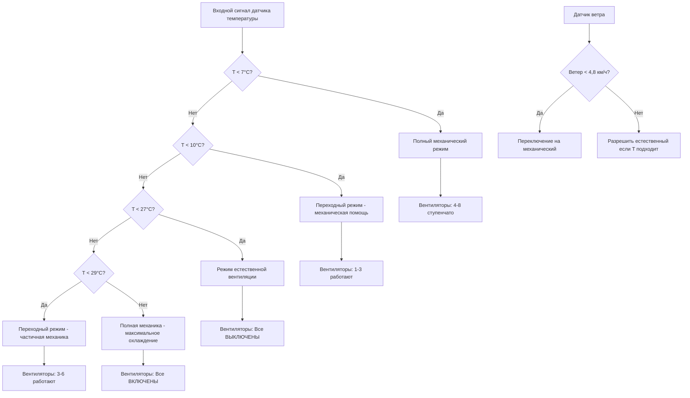

Гибридные системы вентиляции сочетают естественную вентиляцию в благоприятных погодных условиях с механической помощью вентиляторов, когда естественных движущих сил недостаточно. Данный подход оптимизирует потребление энергии путем исключения работы вентилятора в мягкую погоду при одновременном обеспечении надежной вентиляции во все сезоны посредством автоматического переключения режимов на основе температуры, влажности и эффективности вентиляции.

## Архитектура системы

Гибридные системы интегрируют компоненты как естественного, так и механического подходов:

**Элементы естественной вентиляции:**
- Регулируемые боковые занавески или панели входа
- Коньковые вентиляционные отверстия или открытия на торцевых стенах
- Входы в свес для работы по принципу тяги

**Элементы механической вентиляции:**
- Вытяжные вентиляторы (обычно 4-8 единиц)
- Механические входы на потолке или боковых стенах
- Приводы с переменной скоростью для модуляции производительности

**Система управления:**
- Датчики температуры (несколько зон)
- Датчик статического давления
- Автоматические лебедки занавесок или исполнительные механизмы
- Контроллер ступенчатого включения вентиляторов

## Критерии переключения режимов

Система работает в отдельных режимах в зависимости от наружных условий и требований вентиляции:

### Режим естественной вентиляции

**Критерии активации:**
- Наружная температура: 10-27°C
- Скорость ветра: > 4,8 км/ч
- Разница температур внутри-снаружи: > 5,6°C (зима)
- Требование вентиляции: < 60% максимальной

**Работа:**
- Все вентиляторы ВЫКЛЮЧЕНЫ
- Занавески или входы отрегулированы для достижения целевого воздушного потока
- Коньковые вентиляционные отверстия полностью открыты
- Свободное охлаждение за счет плавучести и ветра

### Переходный режим

**Критерии активации:**
- Наружная температура: 7-10°C или 27-29°C
- Переменные условия ветра
- Требование вентиляции: 60-85% максимальной

**Работа:**
- Минимальное количество работающих вентиляторов (1-3 вентилятора)
- Занавески частично открыты
- Вспомогательная механическая помощь
- Гибридный естественный + механический воздушный поток

### Полностью механический режим

**Критерии активации:**
- Наружная температура: < 7°C или > 29°C
- Безветренные условия (ветер < 4,8 км/ч)
- Требование вентиляции: > 85% максимальной
- Необходим точный контроль окружающей среды

**Работа:**
- Ступенчатая работа вентилятора (4-8 вентиляторов)
- Занавески закрыты, механические входы активны
- Полный контроль окружающей среды
- Минимальная вентиляция зимой или максимальное охлаждение летом

## Логика последовательности управления

## Стратегия управления занавесками

Автоматизированное управление занавесками оптимизирует площадь открытия в текущих условиях:

**Алгоритм позиционирования занавески:**

$$A_{opening} = \frac{Q_{required}}{9.4 \cdot \sqrt{h \cdot \Delta T + k \cdot V_{wind}^2}}$$

где:
- $A_{opening}$ = требуемая площадь открытия (м²/м длины здания)
- $Q_{required}$ = целевой расход вентиляции (м³/ч на м длины)
- $h$ = вертикальное разделение открытий (м)
- $\Delta T$ = разница температур внутри-снаружи (°C)
- $k$ = коэффициент воздействия ветра (0,1-0,2)
- $V_{wind}$ = скорость ветра (км/ч)

**Таблица управления позицией:**

| Температура (°C) | Ветер (км/ч) | Опускание занавески | Работающие вентиляторы | Режим |
|-----------|-----------|--------------|----------------|------|
| < 4 | Любой | 8-15 см | 4-6 | Полная механика |
| 4-10 | < 8 | 30-60 см | 2-4 | Переходный |
| 4-10 | > 8 | 60-90 см | 0-2 | Естественный + помощь |
| 10-21 | < 8 | 90-120 см | 1-2 | Переходный |
| 10-21 | > 8 | 120-150 см | 0 | Полностью естественный |
| 21-27 | Любой | Полностью открыто | 0-2 | Естественный |
| > 27 | Любой | Полностью открыто | 4-8 | Механическое охлаждение |

## Оптимизация энергии

Гибридные системы снижают потребление энергии путем исключения работы вентилятора в периоды благоприятной естественной вентиляции.

**Расчет энергии вентилятора:**

Годовая энергия вентилятора (кВт·ч) = $\sum_{i=1}^{n} P_i \cdot h_i \cdot 0.746$

где $P_i$ - мощность вентилятора (л.с.) и $h_i$ - часы работы режима $i$.

**Сравнительный анализ:**

| Тип системы | Годовые часы работы вентилятора | Энергия (кВт·ч) | Стоимость при $0,10/кВт·ч |
|-------------|---------------------------|--------------|------------------|
| Полностью механическая | 6 500 | 21 700 | $2 170 |
| Гибридная (70% естественная) | 1 950 | 6 500 | $650 |
| **Экономия** | **4 550** | **15 200** | **$1 520** |

Для нагрузки 7,5 кВт в общей сложности в цехе откорма на 500 голов: **3,04 доллара экономии на одного животного в год**

## Требования минимальной вентиляции

Работа в холодную погоду поддерживает минимальный воздухообмен для качества воздуха при одновременной минимизации потерь тепла:

**Таймерная минимальная вентиляция:**

Вместо непрерывной работы на низкой скорости периодическое циклирование оптимизирует воздухообмен:

$$\text{Цикл работы} = \frac{Q_{min}}{Q_{fan}}$$

где $Q_{min}$ - требование минимальной вентиляции и $Q_{fan}$ - производительность одного вентилятора.

**Пример:**

Требование минимума: 10 000 м³/ч (5 885 CFM)
Производительность одного вентилятора: 20 000 м³/ч (11 770 CFM)
Цикл работы: 10 000 / 20 000 = 50%

Режим работы: 2 минуты ВКЛЮЧЕНО, 2 минуты ВЫКЛЮЧЕНО

**Преимущества:**
- Повышенная эффективность воздухообмена
- Снижение расслоения воздуха
- Улучшенное удаление влаги на м³/ч
- Предотвращение непрерывного сквозняка

## Управление сезонными переходами

Гибридные системы превосходно работают весной и осенью, когда суточные колебания температуры значительны:

**Суточный режим работы (весенний день):**

| Время | Наружная температура | Режим | Занавеска | Вентиляторы |
|------|--------------|------|---------|------|
| 6:00 | 7°C | Механический | Закрыто | 3 |
| 9:00 | 13°C | Переходный | 30 см | 1 |
| 12:00 | 18°C | Естественный | 90 см | 0 |
| 15:00 | 21°C | Естественный | 120 см | 0 |
| 18:00 | 17°C | Естественный | 90 см | 0 |
| 21:00 | 11°C | Переходный | 30 см | 1 |
| 0:00 | 9°C | Механический | 15 см | 2 |

**Экономия энергии:** 12 часов естественной работы исключают 45 кВт·ч дневной энергии вентилятора (7,5 кВт × 12 час × 0,746 × 50% нагрузки).

## Рассмотрение проектирования здания

Гибридные системы требуют архитектурных решений, поддерживающих как естественный, так и механический режимы:

**Критические элементы проектирования:**

1. **Достаточная производительность конькового вентиляционного отверстия:** 9 700-16 100 см²/м длины здания
2. **Регулируемые боковые открытия:** Моторизированные занавески или перегородочные панели
3. **Интеграция механического входа:** Потолочные входы для механического режима
4. **Размещение вентилятора:** Торцевая стенка или боковая стенка для способности перекрестного потока
5. **Ориентация здания:** Длинная ось перпендикулярна преобладающим летним ветрам
6. **Высота потолка:** Минимум 3-3,7 м для эффекта тяги

**Требования к площади открытия:**

Общая площадь открытия боковых стенок:

$$A_{sidewall} = 1.5 \times A_{ridge}$$

Для конькового вентиляционного отверстия 12 900 см²/м:
Площадь боковой стенки = 19 400 см²/м на сторону = 1,94 м²/м

## Проверка производительности

**Контрольный список пусконаладки:**

- [ ] Проверить скорости воздушного потока при естественной вентиляции в расчетных условиях
- [ ] Измерить статическое давление в механическом режиме (-12,5 до -37,5 Па)
- [ ] Проверить точность позиционирования занавески (±8 см)
- [ ] Подтвердить переключение режима на основе температуры
- [ ] Проверить последовательность ступенчатого включения вентилятора
- [ ] Проверить работу таймера минимальной вентиляции
- [ ] Проверить производительность управления влажностью
- [ ] Задокументировать производительность переходного режима

**Параметры мониторинга:**

1. Дневные часы работы режима (естественный против механический)
2. Потребление энергии по режимам
3. Вариация внутренней температуры (целевой ±1,7°C)
4. Уровни влажности (целевой 50-70% ОВ)
5. Показатели качества воздуха (CO₂, NH₃)

## Экономический анализ

**Дополнительные инвестиции против полностью механической:**

- Система моторизированной занавески: +$15-25 за м длины здания
- Автоматизированные контроллеры: +$2 000-4 000
- Система конькового вентиляционного отверстия: +$8-12 за м
- **Общая премия: $3 000-6 000 для цеха 61 м**

**Годовая экономия:**

- Энергия вентилятора: $1 340-1 670
- Энергия отопления (сниженная инфильтрация зимой): $335-535
- Техническое обслуживание (сниженный износ вентилятора): $135-270
- **Общая экономия: $1 810-2 475**

**Период окупаемости: 1,2-2,2 года**

## Лучшие практики

**Успешная реализация:**

1. **Размер механической производительности на наихудший случай:** Спроектировать вентиляторы для пикового охлаждения, не для среднего
2. **Обеспечить адекватные естественные открытия:** Не компрометировать естественный режим для механического
3. **Использовать надежные датчики:** Измерение температуры и ветра критично
4. **Плавные переходы:** Избежать резких переключений режимов, стрессирующих животных
5. **Регулярная калибровка:** Проверить позиции занавесок и производительность вентилятора
6. **Резервное питание:** Генератор для механического режима во время отключений

**Типичные ошибки:**

- Недостаточная площадь конькового вентиляционного отверстия (ограничивает естественный режим)
- Плохое техническое обслуживание занавесок (предотвращает правильное позиционирование)
- Неадекватные системы управления (непостоянное переключение режимов)
- Недостаточная механическая производительность (недостаточная резервная копия)
- Неправильная ориентация здания (снижает эффективность естественной вентиляции)

---

*Гибридные системы естественной и механической вентиляции оптимизируют потребление энергии и управление окружающей средой путем интеллектуального переключения между естественной вентиляцией в благоприятных условиях и механической работой при необходимости, достигая экономии энергии 60-70% при поддержании надежной производительности окружающей среды в животноводческих помещениях.*
