Системы HVAC с биобезопасностью представляют специализированные стратегии экологического контроля, предназначенные для предотвращения передачи болезней воздушным путём на животноводческих объектах посредством контролируемых дифференциальных давлений воздуха, механической фильтрации и управления строительной оболочкой. Эти системы функционируют как основной барьер против вирусных и бактериальных патогенов, которые могут нанести ущерб животноводству, с особым акцентом на болезни, такие как синдром репродуктивной и респираторной недостаточности свиней (PRRS), птичий грипп и вирус пorcine Epidemic Diarrhea (PEDV).

```mermaid
graph TB
    subgraph "Система биобезопасности с положительным давлением"
        A[Наружный воздух] -->|Предфильтр MERV 8| B[Блок обработки воздуха]
        B -->|Фильтр MERV 13| C[HEPA фильтр H13]
        C -->|Вентилятор приточки| D[Напорная камера]
        D -->|+0,05 дюйм вод. ст.| E[Помещение животноводства]
        E -->|Утечка воздуха| F[Щели строительной оболочки]
        F --> G[Внешняя среда]

        H[Датчик давления] -.->|Мониторинг| E
        H -.->|Сигнал управления| C
    end

    subgraph "Система биобезопасности с отрицательным давлением"
        I[Наружный воздух] -->|Фильтрованный приток MERV 13| J[Помещение животноводства]
        J -->|Вентилятор вытяжки| K[Наружная среда]
        J -->|Вакуум -0,03 дюйм вод. ст.| L[Строительная оболочка]

        M[Датчик дифференциального давления] -.->|Мониторинг| J
        M -.->|Сигнал управления| J
    end

    style E fill:#e1f5e1
    style J fill:#ffe1e1
    style C fill:#fff4e1
    style I fill:#e1f0ff
```



## Основы передачи болезней воздушным путём

Передача патогенов через воздух происходит посредством трёх основных механизмов: аэрозольного переноса вирусных частиц, пылевого бактериального загрязнения и движения биоаэрозольных капельных ядер. Критический диапазон размеров частиц для передачи вирусов составляет 0,3–10 микрометров, при котором частицы остаются взвешенными в воздушных потоках достаточно долго, чтобы преодолевать значительные расстояния, оставаясь достаточно малыми для проникновения глубоко в дыхательную систему животных.

Уравнение Уэллса-Райли описывает вероятность заражения воздушным путём:

```
P = 1 - e^(-Iqpt/Q)
```

Где:
- P = вероятность заражения
- I = количество инфицированных особей
- q = скорость образования квант (кванта/час)
- p = скорость лёгочной вентиляции (м³/час)
- t = время воздействия (часы)
- Q = скорость вентиляции помещения (м³/час)

Эта зависимость демонстрирует, почему контроль скорости вентиляции остаётся основополагающим фактором для защиты от биобезопасности, так как удвоение кратности воздухообмена пропорционально снижает вероятность заражения.

## Теория контроля дифференциального давления

Системы биобезопасности поддерживают контролируемые дифференциальные давления между помещениями животноводства и внешней средой для управления направлением потока воздуха. Дифференциальное давление на строительной оболочке следует:

```
ΔP = ρ × (v₂²- v₁²) / 2 + ρ × g × Δh + ΔP_трение
```

Где:
- ΔP = общее дифференциальное давление (Па)
- ρ = плотность воздуха (кг/м³)
- v = скорость воздуха (м/с)
- g = ускорение свободного падения (9,81 м/с²)
- Δh = разница высот (м)
- ΔP_трение = потери на трение

Практические применения биобезопасности поддерживают статические дифференциальные давления от 0,02 до 0,08 дюйма водяного столба (5–20 Па). Конкретная цель зависит от герметичности здания и стратегии фильтрации:

| Стратегия давления | Целевой дифференциал | Применение | Кратность воздухообмена |
|---|---|---|---|
| Отрицательное давление | -5–12 Па | Модернизация существующих объектов | 0,5–2 CFM/фут² |
| Положительное давление | +7–18 Па | Новое строительство | 0,8–3 CFM/фут² |
| Нейтральное с фильтрацией | ±2 Па | Гибридные системы | 1–4 CFM/фут² |

### Системы фильтрации с отрицательным давлением

Биобезопасность с отрицательным давлением работает путём создания разрежения в здании посредством механической вытяжки, заставляя весь входящий воздух проходить через фильтрованные приточные отверстия. Расчёт кратности воздухообмена:

```
ACH = (Q × 60) / V
```

Где:
- ACH = кратность воздухообмена в час
- Q = объёмный расход (CFM)
- V = объём здания (м³)

Для типичного животноводческого объекта размерами 12×61 м с высотой потолка 3,7 м (объём 2720 м³), чтобы достичь 24 кратности воздухообмена зимой минимально необходимо:

```
Q = (24 × 2720) / 60 ≈ 1088 CFM (1844 м³/ч) общей вытяжной способности
```

Этот объём вытяжки должен входить через фильтрованные приточные отверстия, рассчитанные на поддержание целевого отрицательного давления при условии обеспечения надлежащей площади фильтрации для предотвращения чрезмерной скорости, которая снижает эффективность фильтра.

### Системы фильтрации с положительным давлением

Системы с положительным давлением нагнетают фильтрованный воздух в здание, создавая лёгкое повышение давления, предотвращающее инфильтрацию нефильтрованного воздуха через трещины и отверстия в оболочке. Требуемый расход приточного воздуха учитывает как потребности вентиляции, так и компенсацию утечек:

```
Q_приток = Q_вентиляция + Q_утечка
```

Где утечка воздуха зависит от герметичности здания и дифференциального давления:

```
Q_утечка = C × A × √(ΔP)
```

Где:
- C = коэффициент утечки воздуха (CFM/м² при 12 Па)
- A = площадь строительной оболочки (м²)
- ΔP = дифференциальное давление (Па)

Для герметичного строительства (C = 0,10), среднего (C = 0,25) и неплотного (C = 0,50), поддержание 12 Па положительного давления в объекте площадью 930 м² требует:

- Герметичное: Q_утечка = 0,10 × 930 × √12 ≈ 102 CFM (173 м³/ч)
- Среднее: Q_утечка = 0,25 × 930 × √12 ≈ 254 CFM (431 м³/ч)
- Неплотное: Q_утечка = 0,50 × 930 × √12 ≈ 508 CFM (863 м³/ч)

Это демонстрирует, почему [стратегии герметизации здания](building-sealing-strategies/) остаются критичными для эффективности систем с положительным давлением.

## HEPA-фильтрация для сельскохозяйственной биобезопасности

Фильтры высокоэффективной очистки воздуха (HEPA) обеспечивают наивысший уровень удаления патогенов для критических приложений биобезопасности. HEPA H13 фильтры захватывают 99,95% частиц при наиболее проникающем размере частиц (MPPS) 0,3 микрометра, непосредственно решая проблему передачи вирусных аэрозолей.

### Требования к эффективности фильтрации по типам патогенов

| Класс патогена | Диапазон размера частиц | Минимальный класс фильтра | Эффективность захвата | Падение давления |
|---|---|---|---|---|
| Бактерии | 0,5–10 мкм | MERV 13 | 85% @ 0,3–1,0 мкм | 10–20 Па |
| Вирусы (в воздухе) | 0,02–0,3 мкм | MERV 16 / HEPA H13 | 95% / 99,95% | 20–37 Па |
| Грибные споры | 2–20 мкм | MERV 11 | 65% @ 1,0–3,0 мкм | 7–15 Па |
| Капельные биоаэрозоли | 1–100 мкм | MERV 8 | 20% @ 3,0–10,0 мкм | 5–10 Па |

Выбор HEPA-фильтра балансирует захват патогенов в сравнении со штрафами падения давления. Типичный блок обработки воздуха с биобезопасностью, работающий при 10000 CFM (16990 м³/ч) с HEPA H13 фильтрами, требует:

```
Скорость на площадь фильтра = Q / A_фильтр
Целевое значение: 1,3 м/с для долговечности HEPA

A_фильтр = 16990 м³/ч / (1,3 м/с × 3600) ≈ 3,63 м²
```

При 30 Па падения давления на банку HEPA фильтра мощность вентилятора увеличивается на:

```
Мощность = (Q × ΔP) / (6356 × η_вентилятор)
Мощность = (10000 × 1,2) / (6356 × 0,65) ≈ 2,9 л.с. дополнительно
```

### Многоступенчатая конфигурация фильтрации

Системы многоступенчатой фильтрации достигают превосходного захвата частиц вирусов посредством последовательного умножения эффективности:

```
η_общ = 1 - [(1 - η₁) × (1 - η₂) × (1 - η₃)]
```

Для трёхступенчатой системы с фильтрами MERV 8 (30%), MERV 13 (75%) и HEPA H13 (99,95%):

```
η_общ = 1 - [(1 - 0,30) × (1 - 0,75) × (1 - 0,9995)]
η_общ = 1 - [0,70 × 0,25 × 0,0005] = 1 - 0,0000875 = 0,999912 или 99,99%
```

Это демонстрирует преимущество многоступенчатых конфигураций перед одноступенчатой фильтрацией для [систем фильтрации вирусов](virus-filtration-systems/). Предфильтры продлевают срок службы HEPA путём захвата более крупных частиц и снижения пылевой нагрузки.

## Сравнение конфигураций систем

| Параметр | Отрицательное давление | Положительное давление |
|---|---|---|
| Управление направлением воздуха | Внутрь через фильтры | Наружу через утечки |
| Требование герметичности здания | Среднее | Критичное |
| Пригодность для модернизации | Отличная | Плохая |
| Расположение фильтра | Распределённые приточные отверстия | Централизованный блок обработки |
| Стабильность давления | Зависит от погоды | Управляется вентилятором |
| Капитальные затраты | Ниже | Выше |
| Доступность обслуживания | Несколько мест | Одно место |
| Резервное копирование в чрезвычайных ситуациях | Естественная вентиляция | Требует генератора |

## Контроль инфильтрации и экфильтрации

Неконтролируемое движение воздуха через строительную оболочку подрывает защиту биобезопасности, позволяя проникать патогенам или создавая нефильтрованные пути выхода. Скорость инфильтрации зависит от геометрии трещин и дифференциального давления:

```
Q_щель = K × L × W × ΔP^n
```

Где:
- K = коэффициент потока
- L = длина щели
- W = ширина щели
- n = показатель потока (0,5–1,0)

Щель размером 0,3 см вокруг двери размерами 1×2,1 м (периметр 610 см) при дифференциальном давлении 12 Па позволяет примерно 51 CFM (86 м³/ч) инфильтрации, что эквивалентно отходам фильтрованного воздуха для 1,1 м² площади MERV 16 фильтра. Это подчёркивает, почему [контроль инфильтрации-экфильтрации](infiltration-exfiltration-control/) требует комплексной герметизации оболочки.

## Требования к кратности воздухообмена

Объекты с биобезопасностью должны балансировать разбавление патогенов в сравнении с потреблением энергии и пропускной способностью фильтрации:

| Тип объекта | Минимальная ACH | Целевая ACH | Максимальная ACH |
|---|---|---|---|
| Свинофермы репродуктивного сектора | 12 | 24 | 60 |
| Свинофермы доращивания | 20 | 40 | 100 |
| Птицефабрики мясного направления | 24 | 48 | 120 |
| Птицефабрики яичного направления | 18 | 36 | 80 |

Более высокие кратности воздухообмена обеспечивают превосходное разбавление патогенов, но увеличивают размер системы фильтрации, падение давления и потребление энергии вентилятором. Оптимальный баланс зависит от распространённости болезней, плотности животных и экономических факторов.

## Технологии обработки воздуха для инактивации патогенов

Помимо механической фильтрации, дополнительные технологии обработки воздуха обеспечивают дополнительные слои биобезопасности:

| Технология | Механизм | Снижение патогенов | Точка применения | Обслуживание |
|---|---|---|---|---|
| УФ-С облучение (254 нм) | Разрушение ДНК/РНК | 90–99,9% вирусов/бактерий | Возвратный воздух / вытяжка | Замена лампы каждые 9–12 месяцев |
| Биполярная ионизация | Виды реактивных ионов | 70–95% воздушных патогенов | Поток приточного воздуха | Ежегодная очистка электродов |
| Фотокаталитическое окисление | Генерация OH радикалов | 85–99% летучих органических соединений и биоаэрозолей | Секция блока обработки | Замена катализатора каждые 2–3 года |
| Тепловая обработка | Тепловая инактивация >71°C | 99,99% всех патогенов | Отдельная тепловая камера | Минимально |

Системы УФ-С, рассчитанные для приложений с биобезопасностью, требуют минимальную дозу 1000 мкВт·с/см² для инактивации вирусов. Расчёт требуемой мощности лампы:

```
УФ_доза = (Мощность_лампы × Эффективность × Время) / (Q × Сечение)

Для 10000 CFM (16990 м³/ч) и целевого значения 1000 мкВт·с/см²:
Мощность_лампы = минимум 1200 Вт с эффективностью 40%
```

УФ-С обработка дополняет HEPA-фильтрацию путём инактивации патогенов, проникающих через фильтры, и обеспечивает непрерывную дезинфекцию рециркулируемого воздуха.

## Стандарты сельскохозяйственной биобезопасности и соответствие

Системы HVAC с биобезопасностью должны соответствовать нормативно-правовой базе и лучшим практикам отрасли:

### Рекомендации Ветеринарной службы USDA APHIS
- Требования программы защиты здоровья свиней для фильтрованного воздуха в стадах высокого здоровья
- Протоколы профилактики птичьего гриппа, требующие контролируемой вентиляции
- Стандарты готовности к экзотическим болезням животных для локализационной вентиляции

### Протоколы биобезопасности Национального совета по развитию свиноводства
- Минимальная MERV 13 фильтрация для промежуточных свиноматок и хряков-производителей
- Требования по поддержанию дифференциального давления (±0,5 Па непрерывно)
- Спецификации кратности воздухообмена в зависимости от плотности животных и статуса здоровья

### Требования к мониторингу дифференциального давления

| Тип объекта | Частота мониторинга | Установка сигнала тревоги | Время ответа | Документирование |
|---|---|---|---|---|
| Ядро/размножитель | Непрерывный (цифровой) | ±0,25 Па отклонения | Мгновенное оповещение | Каждые 15 минут |
| Племенное стадо | Каждые 4 часа | ±0,38 Па отклонения | Ответ в течение 1 часа | Ежедневные журналы |
| Производство | Ежедневная ручная проверка | ±0,5 Па отклонения | Ответ в течение 24 часов | Еженедельные записи |

Системы непрерывного мониторинга интегрируются с системой управления зданием, обеспечивая проверку статуса биобезопасности в реальном времени и автоматизированные оповещения при выходе дифференциальных давлений за допустимые пределы.

## Требования к герметизации строительной оболочки

Эффективная биобезопасность требует скорости утечки воздуха оболочкой менее 0,8 м³/(ч·м²) при 12 Па, достижимых посредством:

- Непрерывные барьеры в сборках стен и крыш
- Герметизированные проходы для коммунальных услуг, оборудования и конструктивных элементов
- Уплотненные или с уплотнителем двери и панели доступа
- Герметизированные электрические и сантехнические проходы
- Непрерывная герметизация фундамента к стене

Испытание с помощью вентилятора проверяет герметичность оболочки, с целевыми значениями ACH50 < 3,0 для приложений с биобезопасностью, в сравнении с ACH50 от 15–25 для обычных животноводческих объектов. Это 5–8-кратное снижение скорости утечки напрямую улучшает эффективность системы фильтрации и снижает затраты на энергию.

Комплексная защита HVAC с биобезопасностью интегрирует [фильтрацию с положительным давлением](positive-pressure-filtration/) или [фильтрацию с отрицательным давлением](negative-pressure-filtration/) с строгой герметизацией оболочки, непрерывным мониторингом давления, многоступенчатым удалением частиц и дополнительной обработкой воздуха для создания устойчивых к патогенам животноводческих сред, которые защищают здоровье животных и производительность сельского хозяйства.
