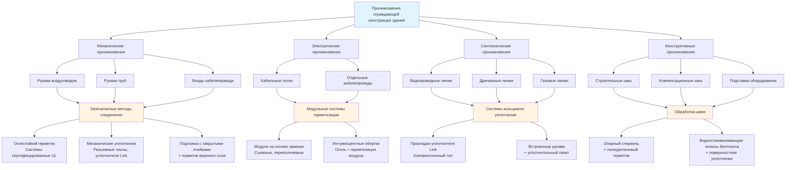

Целостность ограждающей конструкции здания является основой систем изоляции биозащиты. Утечка воздуха через незагерметизированные проникновения, швы и отверстия нарушает дифференциальные давления, увеличивает потребление энергии и создает пути передачи патогенов. Достижение и поддержание герметичности ограждения требует систематических стратегий герметизации во всех компонентах здания.

## Требования к утечкам воздуха ограждающей конструкции здания

Объекты биозащиты работают в соответствии со строгими спецификациями герметичности воздуха для поддержания контролируемых дифференциальных давлений и предотвращения неконтролируемого воздухообмена.

### Ограничения утечек воздуха по уровню биозащиты

| Уровень биозащиты | Максимальная скорость утечки воздуха | Испытательный перепад давления | Применение |
|-------------------|--------------------------------------|--------------------------------|-----------|
| BSL-1 / Низкий риск | 0,40 м³/ч на м² @ 18,75 Па | 18,75 Па | Общие сельскохозяйственные объекты |
| BSL-2 / Средний риск | 0,25 м³/ч на м² @ 18,75 Па | 18,75 Па | Птицепроизводство, свиноводство |
| BSL-3 / Высокий риск | 0,15 м³/ч на м² @ 62,5 Па | 62,5 Па | Научные объекты, карантинные помещения |
| BSL-4 / Максимальная | 0,05 м³/ч на м² @ 125 Па | 125 Па | Лаборатории максимальной изоляции |

**Примечание:** Скорости утечки воздуха основаны на общей площади ограждающей конструкции, включая крышу, стены и конструкции пола.

### Влияние утечек на производительность системы

Инфильтрация воздуха напрямую влияет на требования к производительности HVAC и контроль давления. Для объекта площадью 930 м² с ограждением:

**Утечка при 0,25 м³/ч на м² × 930 м² = 232,5 м³/ч неконтролируемого воздухообмена**

Эта скорость утечки требует:
- Дополнительной производительности вытяжки для поддержания отрицательного давления
- Увеличенной нагрузки на нагрев/охлаждение (232,5 м³/ч × ΔT × 1,20)
- Более высокой загрузки фильтров от нефильтрованной инфильтрации

## Системы уплотнения дверей

Двери представляют наиболее высокий риск проникновений в ограждении биозащиты из-за частоты эксплуатации и сложности уплотнения.

### Компоненты уплотнения дверей

1. **Периметральные компрессионные уплотнения**: Непрерывные прокладки из силикона или EPDM, обеспечивающие сжатие 0,64-1,27 см при закрытии
2. **Уплотнения порога**: Автоматические опускающиеся уплотнения или компрессионные щетки, срабатывающие при закрытии
3. **Герметизация панелей остекления**: Остекление герметизировано структурным силиконом, испытано независимо
4. **Проникновения оборудования**: Все сквозные болты герметизированы прокладками и герметиком

### Требования для самозакрывающихся дверей

Двери биозащиты требуют контролируемого закрытия для предотвращения потери давления при переходах:

- **Усилие закрывания**: 22-36 Н на рукоятке, регулируемые гидравлические закрыватели
- **Время закрывания**: 3-7 секунд от открытия 90° до срабатывания защелки
- **Сжатие уплотнения**: 25-40% первоначальной толщины прокладки
- **Усилие защелкивания**: Минимум 222 Н для обеспечения непрерывного сжатия

### Системы блокировки дверей

Шлюзы используют взаимосвязанные пары дверей для предотвращения одновременного открытия:

- **Электрические блокировки**: Электромагнитные замки, предотвращающие открытие второй двери при открытии первой двери
- **Механические блокировки**: Системы стержневых связей для отказоустойчивой работы при сбое питания
- **Задержка переопределения**: Таймер 15-30 секунд, позволяющий экстренный выход

## Методология герметизации проникновений

Каждое проникновение в ограждающую конструкцию создает потенциальный путь утечки, требующий систематической герметизации.

### Стандарты герметизации проникновений

| Тип проникновения | Метод герметизации | Рейтинг герметизации воздуха | Требуется огнестойкость |
|-------------------|-------------------|------------------------------|------------------------|
| Воздуховод HVAC | Рукав + огнестойкий герметик | < 0,0085 м³/ч @ 62,5 Па | 1-4 часа в зависимости от рейтинга стены |
| Электрический кабелепровод | Модульные герметики из замазки | < 0,0043 м³/ч на проникновение | 2 часа типично |
| Сантехнические трубы | Уплотнитель Link + герметик | < 0,0085 м³/ч @ 62,5 Па | 2 часа типично |
| Кабельные лотки | Системы подушечных/мешочных герметиков | < 0,0085 м³/ч @ 62,5 Па | 2 часа типично |
| Компенсационные швы | Опорный стержень + герметик | По спецификации ограждения | Без рейтинга |

## Протоколы испытания давлением

Проверка целостности ограждающей конструкции требует систематического испытания давлением перед введением объекта в эксплуатацию и периодически в течение жизненного цикла.

### Испытание спада давления

**Процедура испытания:**
1. Герметизируйте все преднамеренные отверстия (регистры подачи/вытяжки, дренажи с гидравлическими затворами)
2. Создайте избыточное давление в помещении до указанного испытательного давления с помощью временного вентилятора
3. Изолируйте помещение и контролируйте спад давления в течение периода испытания
4. Рассчитайте скорость утечки из кривой спада

**Критерии приемки:**

Метод спада давления: ΔP/Δt ≤ указанная скорость

Для начального давления 62,5 Па, максимальный спад:
- **BSL-2**: 6,25 Па за 10 минут
- **BSL-3**: 3,125 Па за 10 минут
- **BSL-4**: 1,25 Па за 10 минут

### Испытание с дверным вентилятором

Испытание с дверным вентилятором количественно определяет полную утечку ограждающей конструкции при стандартизованном давлении:

**Оборудование:** Калиброванный вентилятор (14-3100 м³/ч диапазон), цифровой манометр (±0,1 Па точность)

**Испытательные давления:**
- Стандартное: 18,75 Па
- Высокая биозащита: 62,5-125 Па

**Интерпретация результатов:**

ACH₅₀ (Воздухообмены в час при 50 Па) = (м³/ч при 50 Па × 60) / Объем здания

Целевые значения:
- Сельскохозяйственный BSL-2: ACH₅₀ < 3,0
- Научный BSL-3: ACH₅₀ < 1,5
- Максимальная изоляция BSL-4: ACH₅₀ < 0,5

### Дымовые испытания для определения местоположения утечек

После количественного испытания дымовые карандаши или театральный дым определяют конкретные места утечек:

**Наиболее частые места утечек:**
- Швы коробки двери к стене
- Периметральные уплотнения окна
- Проникновения электрического щитка
- Интерфейсы рукава воздуховода/трубы
- Конструктивные швы на стыках пол-стена и стена-потолок

## Интеграция паровых барьеров

Непрерывные воздушные барьеры функционируют как пароизоляторы в строительстве биозащиты, предотвращая транспортировку воздуха, приводимую в действие влагой.

**Требования непрерывности паровых барьеров:**
- Полиэтилен минимум 0,15 мм или эквивалент проницаемости (< 0,1 перма)
- Все швы перекрыты минимум на 15 см и герметизированы совместимым скотчем или мастикой
- Проникновения герметизированы акустическим герметиком или ленточным мигом
- Переходы к фундаментам герметизированы к подземной гидроизоляции

**Критические детали:**
- Переходы стена-крыша: непрерывность мембраны поддерживается через кровельные подставки
- Переходы стена-пол: мембрана перекрыта на паровой барьер плиты пола
- Грубые отверстия окна/двери: мембрана завернута в отверстие и герметизирована к раме

## Последовательность строительства для целостности герметизации

Надлежащая последовательность строительства предотвращает повреждение уплотнений и обеспечивает доступность:

1. **Фаза черновой работы**: Установите все рукава, загрузочные чехлы проникновений перед воздушным барьером
2. **Установка воздушного барьера**: Применяйте непрерывную мембрану с задокументированным перекрытием и герметизацией
3. **Герметизация проникновений**: Герметизируйте все проникновения при установке услуг, перед скрытием
4. **Промежуточное испытание**: Испытайте сечения ограждающей конструкции перед отделкой предотвращает переделку
5. **Окончательное испытание**: Ввести в эксплуатацию полное ограждающую конструкцию перед запуском HVAC

---

**Ссылки:**
- Стандарт ASHRAE 90.1, Энергетический стандарт для зданий (требования к ограждающей конструкции)
- ASTM E779, Стандартный метод испытания для определения скорости утечки воздуха
- CDC/NIH Биобезопасность в микробиологических и биомедицинских лабораториях (BMBL)
- Стандарты проектирования Службы сельскохозяйственных исследований USDA
- ANSI/AIHA Z9.5, Стандарт вентиляции лабораторий
