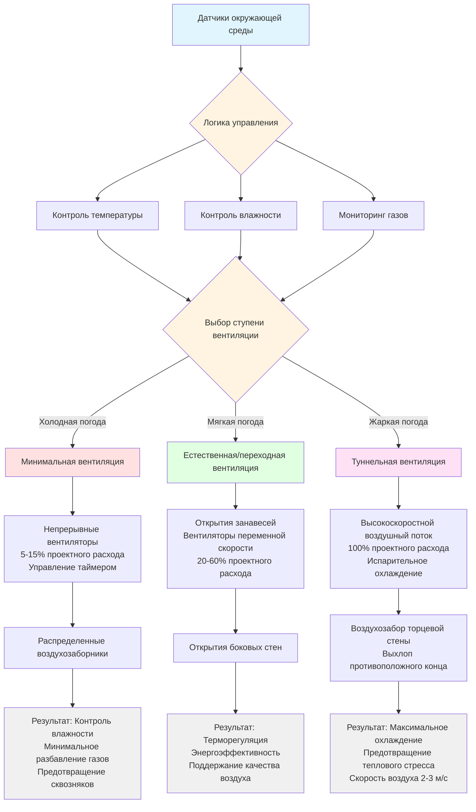

Контроль окружающей среды в животноводческих объектах представляет критическое применение инженерии HVAC, где тепловой комфорт, качество воздуха и управление влажностью напрямую влияют на здоровье животных, производительность и благополучие. В отличие от помещений, занятых людьми, системы содержания животных должны учитывать значительные чувствительные и скрытые тепловые нагрузки, генерируемые метаболизмом скота, высокоспецифичные температурные требования и непрерывное образование загрязнений, требующие точных стратегий вентиляции.

## Тепловая и влажностная нагрузка от животных

Метаболизм животных генерирует как чувствительное тепло (повышение температуры), так и скрытое тепло (влажность), которые составляют основные тепловые нагрузки в животноводческих объектах. Общее теплопроизводство варьируется в зависимости от массы тела животного, уровня активности и температуры окружающей среды.

### Метаболическое производство тепла

Общее теплопроизводство животными следует эмпирическим соотношениям на основе массы тела:

**Общее теплопроизводство:**

$$q_{total} = k \cdot M^{0.75}$$

Где:
- $q_{total}$ = общее теплопроизводство (Вт)
- $M$ = масса тела животного (кг)
- $k$ = видоспецифичный коэффициент (Вт/кг^0.75)

**Распределение чувствительного и скрытого тепла:**

$$q_{sensible} = q_{total} \cdot \left(1 - \frac{T_a - T_{lower}}{T_{upper} - T_{lower}}\right)$$

$$q_{latent} = q_{total} - q_{sensible}$$

Где $T_a$ — температура окружающей среды, $T_{lower}$ и $T_{upper}$ определяют границы терморегуляционной зоны. По мере увеличения температуры окружающей среды животные переключают теплопередачу с чувствительных на скрытые механизмы через увеличенную респирацию.

### Теплопроизводство по типам животных

| Тип животного | Масса тела (кг) | Общее тепло (Вт/животное) | Чувствительное тепло при 20°C (Вт) | Скрытое тепло при 20°C (Вт) | Влагообразование (г/ч) |
|-------------|----------------|----------------------|---------------------------|-------------------------|---------------------------|
| Молочная корова (лактирующая) | 650 | 1800-2200 | 900-1100 | 900-1100 | 370-450 |
| Говядина (откорм) | 450 | 850-1050 | 500-650 | 350-400 | 145-165 |
| Свиноматка с приплодом | 200 | 650-850 | 350-450 | 300-400 | 125-165 |
| Откормочная свинья (90 кг) | 90 | 250-320 | 140-180 | 110-140 | 45-58 |
| Птица-бройлер (2 кг) | 2.0 | 10-14 | 5-7 | 5-7 | 2.0-2.9 |
| Индейка (12 кг) | 12 | 45-60 | 22-30 | 23-30 | 9.5-12.4 |
| Курица-несушка | 2.2 | 12-16 | 6-8 | 6-8 | 2.5-3.3 |

Эти значения представляют животных в терморегуляционных условиях. Теплопроизводство увеличивается на 10-25% во время кормления и варьируется в зависимости от производственного этапа.

## Терморегуляционная зона и требования к температуре

Терморегуляционная зона (ТЗ) определяет диапазон температуры окружающей среды, при котором животное поддерживает постоянную температуру тела с минимальными метаболическими затратами. В пределах этой зоны теплопроизводство равно теплопередаче через неиспарительные механизмы без необходимости увеличения метаболизма или интенсивного охлаждения испарением. Работа вне ТЗ заставляет животных тратить энергию либо на выработку дополнительного тепла (холодовой стресс), либо на усиленную диссипацию через увеличенную респирацию (тепловой стресс), снижая эффективность преобразования кормов и продуктивность.

### Границы терморегуляционной зоны

Нижняя критическая температура (НКТ) обозначает точку, при которой метаболическое теплопроизводство должно увеличиться для поддержания температуры тела. Верхняя критическая температура (ВКТ) указывает на необходимость испарительного охлаждения. Обе границы смещаются в зависимости от массы тела, изоляции (жир, волосяной покров, перья), скорости воздуха и типа пола.

**Границы терморегуляционной зоны смещаются при:**
- Увеличении массы тела: ТЗ смещается ниже (крупные животные лучше переносят холод)
- Увеличении скорости воздуха: НКТ увеличивается на 2-3°C на 1 м/с выше 0.2 м/с
- Влажных условиях: НКТ увеличивается на 5-8°C по сравнению с сухими условиями
- Групповом содержании: НКТ снижается на 2-4°C за счет поведения группировки

### Тепловые зоны комфорта по видам

| Вид | Возраст/этап | Оптимальная температура (°C) | Приемлемый диапазон (°C) | Максимальная влажность (%) | Минимальная вентиляция (м³/ч на животное) |
|---------|-----------|--------------------------|----------------------|---------------------|--------------------------------------|
| Молочный скот | Взрослый | 5-20 | 0-25 | 80 | 170-250 |
| Говяжий скот | Откорм | 10-18 | 5-22 | 75 | 85-140 |
| Свиньи | Свиноматка в опоросе | 16-20 | 14-22 | 70 | 30-50 |
| Свиньи | Поросята (новорожденные) | 32-35 | 30-36 | 70 | 5-10 |
| Свиньи | Откорм (50-100 кг) | 15-20 | 12-23 | 75 | 25-85 |
| Птица | Бройлеры (день 1) | 32-34 | 31-35 | 60-70 | 0.6-1.0 |
| Птица | Бройлеры (неделя 6) | 18-21 | 16-24 | 60-70 | 4.5-6.5 |
| Птица | Несушки (взрослые) | 18-24 | 15-27 | 60-75 | 4.0-7.0 |
| Индейки | Молодняк (день 1) | 35-37 | 34-38 | 60-70 | 0.8-1.2 |

Отклонения температуры за пределы приемлемых диапазонов вызывают тепловой стресс (выше) или холодовой стресс (ниже), оба снижающие эффективность кормов и продуктивность.

## Проектирование систем вентиляции

Вентиляция животноводческих объектов выполняет три критические функции: терморегуляция, удаление влаги и разбавление загрязнений. Скорость вентиляции должна удовлетворять наиболее требовательному из трех требований, которое варьируется сезонно и в зависимости от производственного этапа.

### Определение скорости вентиляции

Требуемая скорость вентиляции представляет максимум из трех вычисленных значений:

**Вентиляция для контроля температуры:**

$$\dot{V}_{temp} = \frac{q_{sensible}}{\rho_{air} \cdot c_p \cdot (T_{inside} - T_{outside})}$$

**Вентиляция для контроля влажности:**

$$\dot{V}_{moisture} = \frac{\dot{m}_{water}}{\rho_{air} \cdot (W_{inside} - W_{outside})}$$

**Вентиляция для контроля загрязнений:**

$$\dot{V}_{contaminant} = \frac{G_{gas}}{C_{max} - C_{outside}}$$

Где $G_{gas}$ — скорость образования, а $C_{max}$ — максимальная допустимая концентрация.

### Многоступенчатые системы вентиляции

Современные животноводческие объекты используют ступенчатую вентиляцию, обеспечивающую минимальный, промежуточный и туннельный режимы:

### Скорости вентиляции по сезонам и назначению

| Тип животного | Зимний минимум (м³/ч) | Весна/осень умеренная (м³/ч) | Летний максимум (м³/ч) | Основание проектирования (зима) | Основание проектирования (лето) |
|-------------|----------------------|---------------------------|---------------------|---------------------|---------------------|
| Молочная корова (650 кг) | 170-200 | 400-600 | 850-1200 | Контроль влажности | Температура + тепловой стресс |
| Откормочная свинья (90 кг) | 25-35 | 60-100 | 170-250 | Разбавление аммиака | Контроль температуры |
| Свиноматка с приплодом | 30-50 | 75-125 | 200-300 | Влажность + аммиак | Контроль температуры |
| Бройлер (6 недель) | 4.5-6.0 | 8-12 | 15-22 | Контроль влажности | Отвод тепла |
| Несушка (взрослая) | 4.0-5.5 | 8-11 | 14-20 | Разбавление аммиака | Контроль температуры |

Зимние скорости вентиляции поддерживают качество воздуха при сохранении тепла. Летние скорости обеспечивают максимальное охлаждение и отвод тепла. Справочник ASHRAE - HVAC Applications, глава 24 (Agricultural Facilities) предоставляет детальные процедуры проектирования вентиляции.

## Оценка теплового стресса

Тепловой стресс возникает, когда условия окружающей среды превышают возможность животного по диссипации тепла. Индекс температуры-влажности (ИТВ) количественно определяет комбинированный тепловой и влажностный стресс:

**Индекс температуры-влажности (ИТВ):**

$$THI = T_{db} + 0.36 \cdot T_{dp} + 41.2$$

Где:
- $T_{db}$ = температура сухого термометра (°C)
- $T_{dp}$ = точка росы (°C)

**Альтернативная формулировка с использованием относительной влажности:**

$$THI = (1.8 \cdot T_{db} + 32) - [(0.55 - 0.0055 \cdot RH) \cdot (1.8 \cdot T_{db} - 26)]$$

Где RH = относительная влажность (%).

### Пороговые значения ИТВ для молочного скота

| Диапазон ИТВ | Уровень стресса | Влияние на молочную продуктивность | Частота дыхания (вдохов/мин) | Мероприятие управления |
|-----------|--------------|------------------------|--------------------------------|---------------------|
| < 68 | Отсутствует | Снижение 0% | 40-60 | Нормальная работа |
| 68-72 | Легкий | Снижение 0-5% | 60-75 | Увеличить вентиляцию |
| 72-80 | Умеренный | Снижение 5-15% | 75-90 | Испарительное охлаждение, обеспечить защиту от солнца |
| 80-90 | Тяжелый | Снижение 15-30% | 90-120 | Максимальное охлаждение, снизить плотность содержания |
| > 90 | Экстренный | Снижение > 30% | > 120 | Экстренные меры, возможность гибели |

Для свиней критические пороги ИТВ, как правило, на 2-4 пункта ниже. Стратегии смягчения теплового стресса включают увеличение скорости воздуха, системы испарительного охлаждения и приложения охлаждения разбрызгиванием или капельным методом, описанные в [смягчение теплового стресса](heat-stress-mitigation/).

## Стратегии управления тепловым стрессом

Эффективное смягчение теплового стресса использует несколько механизмов охлаждения, которые снижают эффективную температуру через конвекцию, испарение и снижение радиации.

### Выбор системы охлаждения по типам животных

| Метод охлаждения | Применение | Снижение эффективной температуры (°C) | Влияние на относительную влажность | Энергетические затраты | Лучше всего подходит для |
|----------------|-------------|-------------------------------------|-------------------------|-------------|----------|
| Увеличение скорости воздуха (2-3 м/с) | Туннельная вентиляция | 4-7 | Без увеличения | Умеренные | Все виды, первое вмешательство |
| Испарительное охлаждение подушками | Обработка приточного воздуха | 5-12 | Увеличивается до 80-90% | Умеренно-высокие | Молочный скот, свиньи в сухом климате |
| Высокого давления туманообразование | Прямая обработка пространства | 3-8 | Увеличивается до 75-85% | Низко-умеренные | Птица, молочный скот при умеренной влажности |
| Системы разбрызгивания/капельного орошения | Прямое смачивание животного | 8-15 | Локальное только | Низкие | Только молочный скот |
| Конструкции навесов | Открытые/полуоткрытые объекты | 3-6 | Без изменения | Низкие (капитал) | Говяжий скот, открытое молочное хозяйство |
| Изоляция крыши + отражающее покрытие | Снижение радиантного тепла | 2-4 | Без изменения | Низкие (капитал) | Все закрытые объекты |

### Эффективность испарительного охлаждения

Эффективность испарительного охлаждения зависит от влажности приточного воздуха. Сухой климат достигает большего снижения температуры:

**Снижение температуры испарительной подушкой:**

$$\Delta T_{evap} = \eta_{pad} \cdot (T_{db} - T_{wb})$$

Где:
- $\eta_{pad}$ = эффективность подушки (0.70-0.85 для целлюлозных подушек)
- $T_{db}$ = температура сухого термометра
- $T_{wb}$ = температура влажного термометра

При 35°C и 40% относительной влажности (температура влажного термометра = 24°C), подушка эффективностью 80% обеспечивает охлаждение примерно на 8.8°C. При 70% относительной влажности, те же условия дают снижение только на 3.2°C.

### Протокол вмешательства при тепловом стрессе

**Поэтапная активация охлаждения на основе ИТВ:**

1. ИТВ 68-72: Увеличить вентиляцию до максимума, активировать циркуляционные вентиляторы
2. ИТВ 72-76: Включить системы испарительного охлаждения, увеличить скорость воздуха до 2.0 м/с
3. ИТВ 76-80: Максимальное испарительное охлаждение, активировать системы смачивания животных (молочный скот)
4. ИТВ > 80: Протоколы экстренного реагирования, включая снижение кормления, увеличение доступа к воде, возможное снижение поголовья

Молочные хозяйства часто используют комбинации разбрызгивания-вентилятора в помещениях ожидания и кормовых коридорах, применяя воду на 1-2 минуты каждые 10-15 минут, когда ИТВ превышает 72.

## Управление концентрацией газов

Респирация животных, разложение навоза и гидролиз мочи генерируют газы, которые накапливаются в плохо проветриваемых объектах. Аммиак (NH₃), углекислый газ (CO₂) и сероводород (H₂S) представляют основные проблемы качества воздуха.

### Скорости образования загрязнений

**Образование аммиака из навоза:**

$$\dot{m}_{NH_3} = k_{NH_3} \cdot N_{excreted} \cdot A_{surface}$$

Где:
- $k_{NH_3}$ = коэффициент эмиссии (мг/м²·ч)
- $N_{excreted}$ = скорость выделения азота (г/животное·день)
- $A_{surface}$ = площадь поверхности навоза (м²)

Коэффициенты эмиссии варьируются от 5-20 мг/м²·ч в зависимости от управления навозом, температуры и рН.

### Максимально допустимые концентрации

| Газ | Формула | Предел непрерывного воздействия | Краткосрочный предел (15 мин) | Основные источники | Эффекты на здоровье |
|-----|---------|---------------------------|---------------------------|-----------------|----------------|
| Аммиак | NH₃ | 25 ppm | 35 ppm | Разложение мочи | Раздражение дыхательных путей, снижение роста |
| Углекислый газ | CO₂ | 5000 ppm | 15000 ppm | Респирация животных | Асфиксия при высоких концентрациях |
| Сероводород | H₂S | 10 ppm | 15 ppm | Разложение навоза | Токсичность, паралич дыхания |
| Метан | CH₄ | 5000 ppm | N/A | Анаэробное разложение | Опасность взрыва выше 50000 ppm |
| Окись углерода | CO | 50 ppm | 200 ppm | Неполное сгорание | Токсичность, снижение переноса кислорода |

Скорости вентиляции должны обеспечивать достаточное разбавление для поддержания концентраций ниже этих пороговых значений. Мониторинг газов и стратегии автоматического управления рассматриваются в [управление контролем газов](gas-monitoring-control/).

## Стратегии контроля аммиака

Аммиак представляет наиболее распространенную проблему качества воздуха в животноводческих объектах. Концентрации выше 25 ppm снижают дыхательную функцию, уменьшают скорость роста и повреждают респираторный эпителий, делая животных более восприимчивыми к болезням.

### Образование аммиака и факторы контроля

Летучесть аммиака из навоза увеличивается экспоненциально с температурой и рН. Стратегии управления направлены на снижение у источника и разбавление через вентиляцию.

**Факторы, влияющие на скорость эмиссии аммиака:**

| Фактор | Влияние на скорость эмиссии | Стратегия управления |
|--------|-------------------------|-----------------|
| Площадь поверхности навоза | Прямо пропорциональная зависимость | Полы с прорезями, частое удаление |
| Температура | Увеличение на 10°C = эмиссия в 1.7-2.2× раз | Охлаждение здания, охлаждение навоза |
| рН (выше 7.0) | Увеличение рН на 1.0 = эмиссия в 10× раз | Манипуляция рационом, подкисление |
| Скорость воздуха над поверхностью | Более высокая скорость = более высокая эмиссия | Баланс вентиляции с площадью поверхности |
| Содержание влаги | Влажный навоз = более высокая эмиссия | Дренаж, управление подстилкой |
| Микробная активность | Активное разложение = пиковая эмиссия | Анаэробное хранилище, контроль температуры |

### Технологии снижения аммиака

**Основные методы управления в порядке эффективности:**

1. **Оптимизация азота в рационе**: Снижение сырого белка на 1-2% при поддержании баланса аминокислот снижает эмиссию аммиака на 15-30%. Требует точной формулировки кормов.

2. **Подкисление навоза**: Снижение рН до 5.5-6.5 с использованием серной кислоты или квасцов снижает летучесть на 50-70%. Применяется в системах шлама.

3. **Частое удаление навоза**: Снижение времени экспозиции поверхности. Системы смыва или механические скребки, работающие 2-6 раз в день, снижают эмиссию на 30-50%.

4. **Системы полов с прорезями**: Минимизация контакта навоза с полом. Частичные прорезные полы (50-60% покрытия) снижают эмиссию на 25-40% по сравнению с сплошными полами.

5. **Биофильтры или скрубберы**: Обработка воздуха выхлопа перед выпуском. Эффективность удаления 50-90%, но высокие капитальные и операционные затраты ограничивают применение специализированными объектами.

6. **Увеличение скорости вентиляции**: Разбавляет концентрацию, но увеличивает общую нагрузку эмиссии. Требуется, когда другие методы недостаточны.

### Вентиляция для контроля аммиака

Зимние минимальные скорости вентиляции часто определяются требованиями разбавления аммиака, а не температурой или влажностью. Соотношение:

$$\dot{V}_{NH_3} = \frac{G_{NH_3}}{C_{max} - C_{outdoor}}$$

Для свинофермы с откормочными свиньями с 1000 голов при среднем весе 90 кг:
- Образование аммиака: приблизительно 6-8 г/ч на животное = 6000-8000 г/ч всего
- Максимальная концентрация: 25 ppm = 17 мг/м³
- Наружная концентрация: типично 0.1-0.5 ppm, предполагаем 0
- Требуемая вентиляция: 6500 г/ч ÷ 0.017 г/м³ = 382,000 м³/ч ÷ 1000 животных = 382 м³/ч на животное

Эта скорость значительно превышает зимние минимальные скорости вентиляции в предыдущей таблице, указывая, что контроль аммиака доминирует в проектировании зимней вентиляции для зданий откорма свиней. Этот спрос на вентиляцию создает значительные отопительные нагрузки в холодном климате, мотивируя внедрение рекуперации тепла.

## Требования к контролю влажности

Чрезмерная влажность способствует размножению патогенов, увеличивает летучесть аммиака и снижает способность животных к теплоотдаче. Баланс влажности требует:

**Скорость образования влаги:**

$$\dot{m}_{water} = N_{animals} \cdot q_{latent,per\ animal} / h_{fg}$$

Где:
- $\dot{m}_{water}$ = общее образование влаги (кг/ч)
- $h_{fg}$ = скрытая теплота испарения (2450 кДж/кг при 20°C)

**Требуемая вентиляция для контроля влажности:**

$$\dot{V}_{humidity} = \frac{\dot{m}_{water}}{\rho_{air} \cdot (W_{inside} - W_{outside})}$$

Где:
- $\dot{V}_{humidity}$ = скорость вентиляции (м³/ч)
- $\rho_{air}$ = плотность воздуха (кг/м³)
- $W$ = влажностное отношение (кг воды/кг сухого воздуха)

Зимняя вентиляция часто требует контроля влажности, а не контроля температуры, требуя минимальные скорости вентиляции даже при низких наружных температурах. Комплексные стратегии управления влажностью обсуждаются в [контроль влажности в животноводческих объектах](moisture-control-animal-facilities/).

## Зональное отопление для молодых животных

Новорожденные и молодые животные имеют ограниченную способность к терморегуляции и требуют локализованных отапливаемых зон в объектах, поддерживаемых при более низких объемных температурах. Этот подход снижает затраты отопления, обеспечивая оптимальные микроклиматы.

**Требование тепла для зонального отопления:**

$$q_{zone} = N_{young} \cdot q_{animal} + UA(T_{zone} - T_{building}) + \dot{V}_{local} \cdot \rho \cdot c_p \cdot (T_{zone} - T_{building})$$

Где второй член представляет кондуктивные потери, а третий член представляет конвективные потери из отапливаемой зоны.

Обычные применения зонального отопления включают:
- Опоросные клетки с нагревательными лампами или матами (32-35°C для поросят против 18-20°C температуры здания)
- Зоны брудеров в птичниках (32-35°C для цыплят против 24-27°C температуры дома)
- Телячьи хижины с подстилкой и защитой от сквозняков

Проектирование и стратегии управления зональным отоплением описаны в [зональное отопление животноводства](zone-heating-livestock/).

## Рекомендации по проектированию ASHRAE

Справочник ASHRAE - HVAC Applications, глава 24 (Agricultural Facilities) предоставляет комплексные данные проектирования для систем контроля окружающей среды животноводства. Ключевые параметры проектирования включают:

**Критические рекомендации ASHRAE:**

- Проектировать системы вентиляции для трех режимов работы: минимального (зима), переходного (весна/осень) и максимального (лето)
- Рассчитывать системы отопления для поддержания минимальной температуры здания во время минимальной вентиляции
- Рассчитывать холодопроизводительность на основе пикового теплогенерирования плюс солнечная нагрузка минус отвод тепла минимальной вентиляцией
- Проектировать распределение воздуха для предотвращения сквозняков на животных во время минимальной вентиляции (скорость воздуха < 0.25 м/с в зоне животных)
- Располагать воздухозаборники для обеспечения длины смешивания 3-5 м перед достижением животных
- Обеспечивать вспомогательные отопительные зоны для молодых животных с независимым термостатическим управлением
- Устанавливать системы экстренной резервной вентиляции и сигнализации для объектов механической вентиляции
- Проектировать механические системы для непрерывной работы с ступенчатым резервированием

**Типичные условия проектирования (ASHRAE Applications, глава 24):**

- Зимний дизайн: Поддерживать 5-10°C выше нижней критической температуры во время минимальной вентиляции
- Летний дизайн: Предотвращать, чтобы внутренняя температура не превышала наружную более чем на 1-2°C
- Статическое давление: Системы отрицательного давления при -12.5 до -37.5 Па для биобезопасности и контроля запаха
- Воздухообмен: 0.5-4.0 объема здания в час в зависимости от сезона и плотности животных
- Изоляция: RSI 0.62-0.93 м²·K/W стены, RSI 0.93-1.23 м²·K/W потолок в холодном климате

## Интеграция систем

Эффективный контроль окружающей среды животноводства требует интегрированного управления системами вентиляции, отопления, охлаждения и мониторинга. Современные объекты используют:

- Датчики температуры и влажности с видоспецифичными уставками
- Многоступенчатую вентиляцию с минимальным, промежуточным и туннельным режимами
- Испарительные охлаждающие подушки или системы высокого давления туманообразования
- Вспомогательное отопление с независимым управлением по зонам
- Непрерывный мониторинг газов с сигнализацией
- Системы автоматизации зданий, координирующие все параметры окружающей среды

Целевое проектирование сосредоточено на поддержании оптимальных условий при различных наружных погодных условиях, сезонных производственных циклах и изменяющихся популяциях животных, минимизируя потребление энергии и обеспечивая соблюдение требований биобезопасности.

## Резюме реализации проектирования

Успешное проектирование системы контроля окружающей среды животноводства требует:

1. **Расчет нагрузки**: Количественно определить чувствительное тепло, скрытое тепло и образование загрязнений для проектного поголовья
2. **Анализ терморегуляционной зоны**: Установить видоспецифичные и возрастные температурные уставки
3. **Определение размеров многорежимной вентиляции**: Рассчитать минимальные (газ/влажность), переходные (температура) и максимальные (охлаждение) скорости
4. **Выбор системы охлаждения**: Выбрать испарительное охлаждение, увеличение скорости воздуха или прямое смачивание животных на основе климата
5. **Мониторинг теплового стресса**: Внедрить расчет ИТВ и протоколы автоматического охлаждения
6. **Стратегия контроля аммиака**: Спроектировать снижение у источника и разбавление вентиляцией, подходящие к системе управления навозом
7. **Проектирование зонального отопления**: Обеспечить вспомогательное тепло для молодых животных независимо от основного управления здания
8. **Интеграция управления**: Координировать все системы с датчиками температуры, влажности и газа, управляющими ступенчатыми реакциями
9. **Системы резервирования**: Установить экстренную вентиляцию, системы сигнализации и резервное питание для критических объектов
10. **Оптимизация энергии**: Уравновесить требования вентиляции с возможностями рекуперации тепла в холодном климате

Этот комплексный подход обеспечивает благополучие животных, максимизирует эффективность производства и поддерживает соответствие экологическим требованиям при всех условиях эксплуатации.
