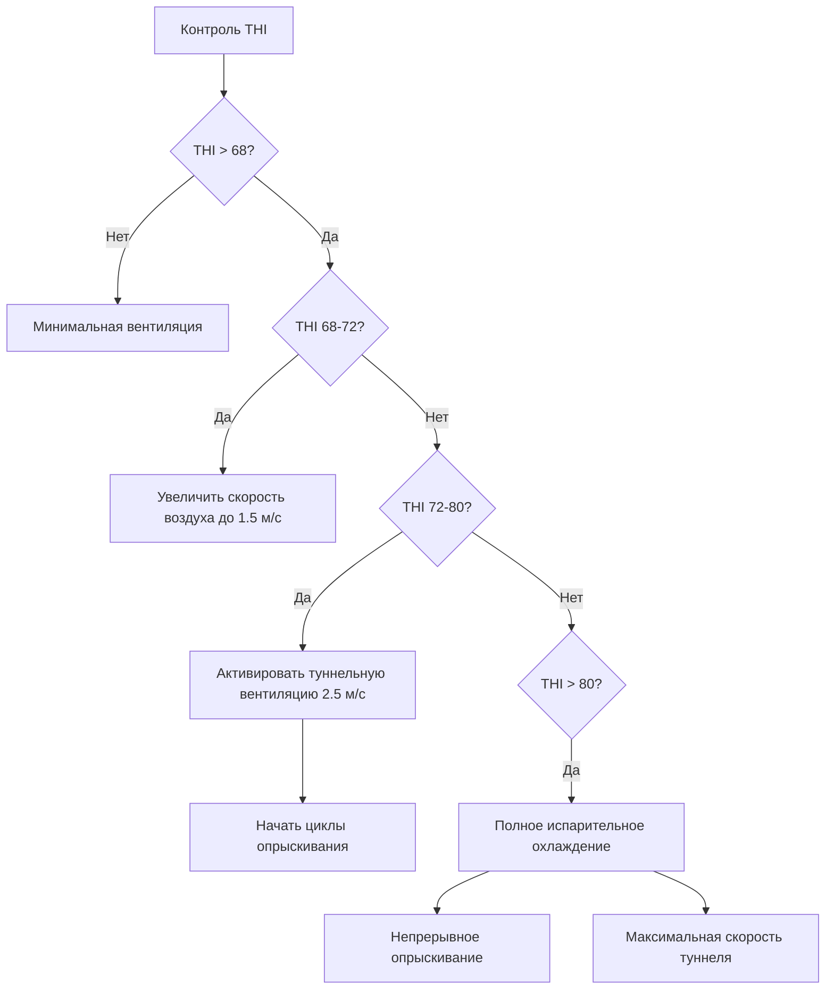

## Основы теплового стресса

Тепловой стресс возникает, когда животные не могут рассеивать метаболическое и окружающее тепло с достаточной скоростью для поддержания гомеостаза. Уравнение теплового баланса управляет теплообменом животного:

$$Q_{metabolic} = Q_{sensible} + Q_{latent} + Q_{storage}$$

Где передача чувствительного тепла включает конвекцию ($Q_{conv}$), излучение ($Q_{rad}$) и проводимость ($Q_{cond}$), в то время как передача скрытого тепла происходит через дыхательное испарение и потери влаги с кожи. Когда условия окружающей среды препятствуют адекватному рассеиванию тепла, температура ядра тела повышается, вызывая физиологические реакции стресса, которые снижают потребление корма, темпы роста, продуктивность молока и репродуктивную функцию.

## Индекс температуры влажности

Индекс температуры влажности (THI) количественно определяет совокупную тепловую нагрузку от температуры окружающей среды и влажности. Для применения в животноводстве:

$$THI = T_{db} + 0.36T_{dp} + 41.2$$

Где $T_{db}$ — температура сухого термометра (°C) и $T_{dp}$ — температура точки росы (°C). Альтернативные формулировки используют относительную влажность:

$$THI = (1.8T_{db} + 32) - [(0.55 - 0.0055 \times RH) \times (1.8T_{db} - 26)]$$

| Вид животных | Порог THI | Физиологический ответ |
|---------|---------------|------------------------|
| Молочный скот | 68-72 | Мягкий стресс, снижение потребления корма |
| Молочный скот | 72-79 | Умеренный стресс, потери продуктивности 10-15% |
| Молочный скот | >80 | Тяжелый стресс, дыхательная недостаточность |
| Свиньи | >74 | Снижение прироста, повышенная смертность |
| Птица | >70 | Дыхание с открытым клювом, расправление крыльев, снижение яйценоскости |

THI не учитывает влияние скорости воздуха, которая значительно улучшает конвективное охлаждение. Скорректированные формулировки THI включают поправки на скорость ветра, но менее стандартизированы.

## Производство метаболического тепла

Выработка тепла животными варьируется в зависимости от массы тела, уровня активности и стадии производства. Для молочного скота:

$$Q_{metabolic} = 5.6 \times M^{0.75} + 22 \times DMI + 0.4 \times (MP - MP_{maintenance})$$

Где $M$ — масса тела (кг), $DMI$ — потребление сухого вещества (кг/день), $MP$ — продуктивность молока (кг/день). Дойная корова массой 680 кг производит примерно 2000–2500 Вт метаболического тепла. Свиньи вырабатывают 10–20 Вт/кг массы тела в зависимости от стадии роста, а птица — 8–12 Вт/кг.

## Стратегии испарительного охлаждения

### Прямые системы испарительных подушек

Испарительные охлаждающие подушки используют энтальпию испарения воды (2442 кДж/кг при 20°C) для снижения температуры воздуха. Психрометрический процесс следует линии постоянной температуры влажного термометра, при этом температура сухого термометра снижается, а влажность увеличивается.

Эффективность охлаждения:

$$\eta = \frac{T_{db,in} - T_{db,out}}{T_{db,in} - T_{wb,in}}$$

Надлежащие целлюлозные подушки достигают эффективности 80–90%. Снижение температуры воздуха:

$$\Delta T = \eta \times (T_{db} - T_{wb})$$

При сухом термометре 35°C и влажном термометре 24°C с эффективностью подушки 85%:

$$\Delta T = 0.85 \times (35 - 24) = 9.35°C$$

Характеристики подушки для систем туннельной вентиляции:

| Параметр | 100 мм целлюлоза | 150 мм целлюлоза |
|-----------|-----------------|-----------------|
| Фронтальная скорость | 1.0–1.5 м/с | 1.5–2.0 м/с |
| Потери давления | 12–25 Па | 25–40 Па |
| Эффективность | 80–85% | 85–90% |
| Расход воды | 3–5 л/мин на м² | 4–6 л/мин на м² |

### Системы распыления воды

Низконапорные системы распыления наносят воду непосредственно на поверхность животного, усиливая испарительное охлаждение с кожи и шерсти. Теплота испарения вызывает значительное удаление тепловой энергии:

$$Q_{evap} = \dot{m}_{water} \times h_{fg}$$

Для эффективного охлаждения циклы опрыскивания должны обеспечивать достаточное время для испарения воды перед повторным увлажнением. Типичные системы для молочного скота работают с циклами увлажнения 1–2 минуты, за которыми следуют интервалы сушки 5–10 минут, когда THI превышает 68.

Расходы: 4–8 л/ч на одну корову при давлении 140–210 кПа.

## Системы туннельной вентиляции

Туннельная вентиляция создает равномерный высокоскоростной поток воздуха по всей длине животноводческого помещения, улучшая конвективный теплообмен. Эффект охлаждения из-за скорости воздуха следует:

$$\Delta T_{effective} = -1.14 + 0.877v - 0.0574v^2$$

Где $v$ — скорость воздуха (м/с) и $\Delta T_{effective}$ представляет эффективное снижение температуры, воспринимаемое животным.

### Параметры проектирования

**Требования по скорости воздуха по видам животных:**

- Молочный скот: 2.0–2.5 м/с на уровне животного
- Откормочные свиньи: 1.5–2.0 м/с
- Цыплята-бройлеры: 2.5–3.0 м/с

**Расчет вентиляции:**

$$Q = \frac{A \times v}{1000}$$

Где $Q$ — расход (м³/с), $A$ — площадь сечения (м²), $v$ — целевая скорость (м/с).

Для скотного сарая длиной 15 м × высотой 4 м с целевой скоростью воздуха 2.5 м/с:

$$Q = \frac{15 \times 4 \times 2.5}{1} = 150 \text{ м}^3\text{/с}$$

Выбор вентилятора должен учитывать статическое давление подушек, длину здания и ограничения на выходе. Типичные системы туннелей работают при статическом давлении 25–75 Па.

## Размещение и конфигурация вентиляторов

Размещение вытяжного вентилятора определяет однородность потока воздуха. Руководящие принципы ASHRAE для сельскохозяйственных объектов рекомендуют:

- Расстояние между вентиляторами: максимум 7–8 раз ширина здания
- Зона действия вентилятора: каждый вентилятор влияет на 1.5–2.0 диаметра
- Резервирование: несколько групп вентиляторов с регулируемым управлением скоростью
- Минимальные вентиляторы: отдельные от туннельных вентиляторов для холодного времени года

**Соображения по эффективности вентиляторов:**

$$P_{fan} = \frac{Q \times \Delta P}{\eta_{fan} \times \eta_{motor}}$$

Где $P_{fan}$ — электрическая мощность (Вт), $Q$ — расход (м³/с), $\Delta P$ — статическое давление (Па), эффективности — десятичные доли. Высокоэффективные вентиляторы достигают общей эффективности 0.50–0.65.

## Козырьки и контроль лучистого тепла

Лучистая тепловая нагрузка от солнечного облучения значительно увеличивает тепловую нагрузку на животное. Черная поверхность с покрытием под прямым солнцем может достичь температуры поверхности 60–70°C. Козырьки перехватывают солнечное излучение перед тем, как оно достигнет животных.

**Снижение лучистого тепла:**

$$Q_{rad} = \epsilon \sigma A (T_{surface}^4 - T_{skin}^4)$$

Где $\epsilon$ — коэффициент излучательности (0.95 для поверхностей животного), $\sigma$ — постоянная Стефана–Больцмана (5.67×10⁻⁸ Вт/м²K⁴), $A$ — площадь поверхности, температуры в Кельвинах.

| Стратегия кровельного покрытия | Солнечная отражательная способность | Тепловая излучательность | Снижение температуры поверхности |
|------------------|-------------------|-------------------|------------------------|
| Голой металл | 0.25–0.35 | 0.25 | Базовое значение |
| Белое покрытие | 0.70–0.85 | 0.90 | 20–30°C |
| Радиационный барьер | 0.05 (нижняя сторона) | 0.03 | 15–25°C |
| Изоляция RSI 3.35 | Варьируется | Варьируется | 10–15°C |

Козырьки должны обеспечивать минимум 3.0–4.5 м² на одну взрослую дойную корову с высотой 3.0–3.5 м для надлежащей циркуляции воздуха.

## Охлаждающие поверхности с теплопроводностью

Маты с проводящим охлаждением передают тепло непосредственно с поверхностей контакта животного. Тепловой поток через контакт:

$$q = \frac{k \cdot A \cdot (T_{animal} - T_{surface})}{L}$$

Где $k$ — теплопроводность, $A$ — площадь контакта, $L$ — толщина материала, $T$ представляет температуры. Бетонные поверхности (k = 1.4 Вт/м·К) проводят тепло более эффективно, чем резиновые коврики (k = 0.3 Вт/м·К) или соломенная подстилка (k = 0.05 Вт/м·К).

## Проектирование интегрированной системы охлаждения

Эффективное снижение теплового стресса требует интегрированных стратегий управления, которые постепенно развертывают механизмы охлаждения по мере увеличения тепловой нагрузки. Проектирование системы должно учитывать местные климатические условия, плотность поголовья, геометрию здания и операционные ограничения для поддержания теплового комфорта во всех производственных циклах.

## Литература

ASHRAE Handbook—HVAC Applications, Chapter 24: Animal Environments
MWPS-1: Structures and Environment Handbook
Livestock Environment VIII, ASABE Standards
