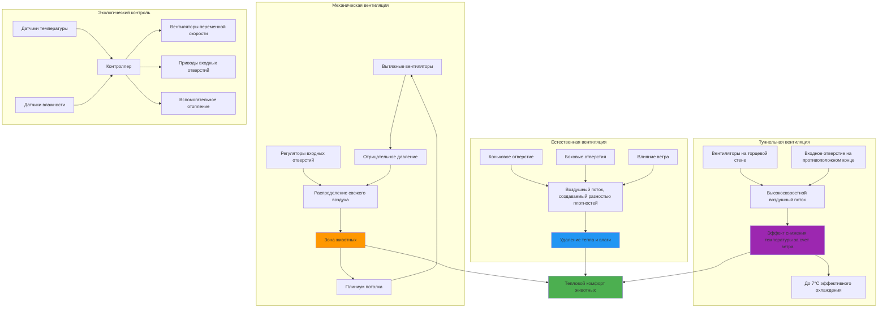

## Основы вентиляции животноводческих помещений

Системы вентиляции животноводческих помещений контролируют температуру, влажность и качество воздуха для оптимизации здоровья животных, производительности и благополучия. Надлежащим образом спроектированные системы удаляют метаболическое тепло, влагу и газообразные загрязнители, обеспечивая адекватное поступление свежего воздуха. В Справочнике ASHRAE по сельскохозяйству приведены комплексные критерии проектирования для всех типов животноводческих сооружений.

### Критические параметры проектирования

Проектирование системы вентиляции зависит от четырех основных факторов:

- **Тепловыделение животными** - метаболическое тепло варьируется в зависимости от вида, массы и уровня продуктивности
- **Влагоотделение** - респираторная и испарительная влага должна быть удалена во избежание конденсации
- **Удаление газов** - ограничение концентрации аммиака, сероводорода и диоксида углерода
- **Контроль температуры** - поддержание оптимальной тепловой среды в условиях сезонных изменений

## Расчеты норм вентиляции

### Формула расчета тепла и влагоотделения

Требуемая норма вентиляции для удаления тепла рассчитывается по формуле:

**Q = SH / (ρ × Cp × ΔT)**

Где:
- Q = объемная норма воздушного потока (CFM или м³/ч)
- SH = производство явного тепла (кДж/ч)
- ρ = плотность воздуха (1.206 кг/м³ при стандартных условиях)
- Cp = удельная теплоемкость воздуха (1.006 кДж/кг·°C)
- ΔT = допустимая разность температур внутри и снаружи помещения (°C)

Для удаления влаги:

**Q = W / (ρ × Δω)**

Где:
- W = производство влаги (кг/ч)
- Δω = разность коэффициента влажности между внутренним и наружным воздухом (кг влаги/кг сухого воздуха)

### Минимальная вентиляция для качества воздуха

В холодную погоду минимальные нормы вентиляции определяются по формуле:

**Q_min = (NH₃_производство) / (NH₃_предел - NH₃_наружный)**

Типичный предел аммиака: 25 ppm при непрерывном воздействии.

## Нормы вентиляции по видам животных

### Птичники

| Вид птицы | Масса (кг) | Тепловыделение (кДж/ч/шт) | Влагоотделение (кг/ч/шт) | Зима CFM/шт | Лето CFM/шт |
|-----------|------------|---------------------------|---------------------------|------------|-----------|
| Бройлер | 1.8 | 20.6 | 0.0063 | 0.25 | 5.0 |
| Несушка | 1.8 | 16.9 | 0.0054 | 0.30 | 4.5 |
| Индейка (самка) | 7.3 | 48.6 | 0.0159 | 1.5 | 15.0 |
| Индейка (самец) | 13.6 | 79.2 | 0.0263 | 2.5 | 25.0 |

### Свинофермы

| Категория животного | Масса (кг) | Тепловыделение (кДж/ч/шт) | Влагоотделение (кг/ч/шт) | Зима CFM | Лето CFM |
|-----------------|-------------|--------------------------------|------------------------|-----------|-----------|
| Поросенок-отъемыш | 13.6 | 89.8 | 0.0272 | 3 | 35 |
| Растущий поросенок | 45.4 | 243.0 | 0.0747 | 7 | 75 |
| Откормочный поросенок | 90.7 | 401.6 | 0.1247 | 12 | 125 |
| Свиноматка с приплодом | 181.4 | 1003.1 | 0.3129 | 20 | 500 |
| Свиноматка в супоросности | 181.4 | 507.0 | 0.1564 | 12 | 150 |

### Молочные коровники

| Вид животного | Масса (кг) | Тепловыделение (кДж/ч/шт) | Влагоотделение (кг/ч/шт) | Зима CFM | Лето CFM |
|-------------|-------------|--------------------------------|------------------------|-----------|-----------|
| Лактирующая корова | 635 | 3328.4 | 1.043 | 100 | 1000 |
| Сухостойная корова | 635 | 1585.0 | 0.498 | 50 | 500 |
| Растущий молодняк | 363 | 1268.0 | 0.395 | 40 | 400 |
| Теленок | 68 | 443.9 | 0.136 | 15 | 75 |

### Мясные коровники

| Вид животного | Масса (кг) | Тепловыделение (кДж/ч/шт) | Влагоотделение (кг/ч/шт) | Зима CFM | Лето CFM |
|-------------|-------------|--------------------------------|------------------------|-----------|-----------|
| Откормочный скот | 454 | 1954.6 | 0.612 | 50 | 600 |
| Коровско-телячья пара | 544 | 2219.1 | 0.693 | 60 | 650 |

*Примечание: Значения основаны на умеренных условиях окружающей среды. Летние нормы предполагают температурный дифференциал 5–6°C; зимние нормы предполагают дифференциал 8–11°C.*

## Архитектура систем вентиляции животноводческих помещений

## Стратегии проектирования систем вентиляции

### Вентиляция в холодную погоду

Зимняя эксплуатация приоритизирует минимальную вентиляцию для качества воздуха при сохранении тепла:

1. **Режим минимальной вентиляции** - прерывистая работа вентилятора поддерживает 15–25% от номинальной производительности
2. **Контроль скорости воздуха на входе** - размер входного отверстия обеспечивает скорость 4–6 м/с для направления свежего воздуха в зону обитания животных
3. **Рекуперация тепла** - теплообменники могут восстанавливать 50–70% тепловой энергии выхлопного воздуха
4. **Вспомогательное отопление** - требуется, когда потери тепла при вентиляции превышают тепловыделение животными

### Вентиляция в теплую погоду

Летняя эксплуатация сосредоточена на максимальном удалении тепла и испарительном охлаждении:

1. **Максимальные нормы воздушного потока** - работа вентилятора на полной мощности с большими входными отверстиями
2. **Туннельная вентиляция** - продольный воздушный поток на скорости 2–3 м/с обеспечивает охлаждение за счет ветра
3. **Испарительное охлаждение** - подушечные системы или туманообразователи могут снизить температуру входящего воздуха на 5–8°C
4. **Излучающая теплоизоляция** - снижает попадание солнечного тепла через кровельные конструкции

### Управление в переходные сезоны

Весенние и осенние условия требуют модуляции вентиляции между крайними значениями:

- Управление вентилятором переменной скорости обеспечивает пропорциональную регулировку производительности
- Многоступенчатые системы вентиляции включают вентиляторы последовательно в зависимости от температуры
- Автоматические регуляторы входных отверстий поддерживают статическое давление на уровне −0.02–0.10 дюймов водяного столба (−5–25 Па)

## Специфические соображения по видам животных

### Системы птичников

Птичники для бройлеров и индеек обычно используют туннельную вентиляцию для высокоплотного производства. Помещения для выращивания молодняка требуют вспомогательного отопления с минимальной вентиляцией. Помещения для несушек часто используют поперечную вентиляцию с системами сушки помета на ленточном транспортере.

### Свинофермы

Комнаты для отъема поросят и опороса требуют точного контроля окружающей среды с диапазоном температур 1–3°C. Откормочники обычно используют подпольную вентиляцию с хранилищем помета типа "pull-plug". Помещения для содержания свиноматок все чаще применяют естественную вентиляцию с механическим резервом.

### Молочное животноводство

Современные молочные коровники с боксовым содержанием преимущественно используют естественную поперечную вентиляцию, дополняемую циркуляционными вентиляторами. Охлаждение в жаркую погоду сочетает высокоскоростные вентиляторы (более 2 м³/ч/корову) с низконапорными оросителями в зоне кормления. Помещения для телят требуют индивидуальных или групповых коровников с естественной вентиляцией до отъема.

### Откормочные комплексы крупного рогатого скота

Откормочные комплексы варьируются от открытых зданий с подстилкой из соломы до полностью закрытых механически вентилируемых сооружений. Конструкции с односкатной кровлей и открытой южной стеной обеспечивают защиту от осадков при сохранении преимуществ естественной вентиляции. Зимние условия могут требовать только 1–2 воздухообмена в час.

## Стандарты и справочные материалы по проектированию

Критические параметры проектирования и подробные методики расчета содержатся в:

- **ASHRAE Handbook - HVAC Applications, Chapter 24**: Agricultural Facilities
- **MWPS-32**: Mechanical Ventilating Systems for Livestock Housing
- **NRCS Agricultural Waste Management Field Handbook**: Ventilation requirements by species

Надлежащее проектирование вентиляции животноводческих помещений требует интеграции физиологии животных, психрометрии и строительной науки для создания оптимальной производственной среды при управлении энергопотреблением и воздействием на окружающую среду.
