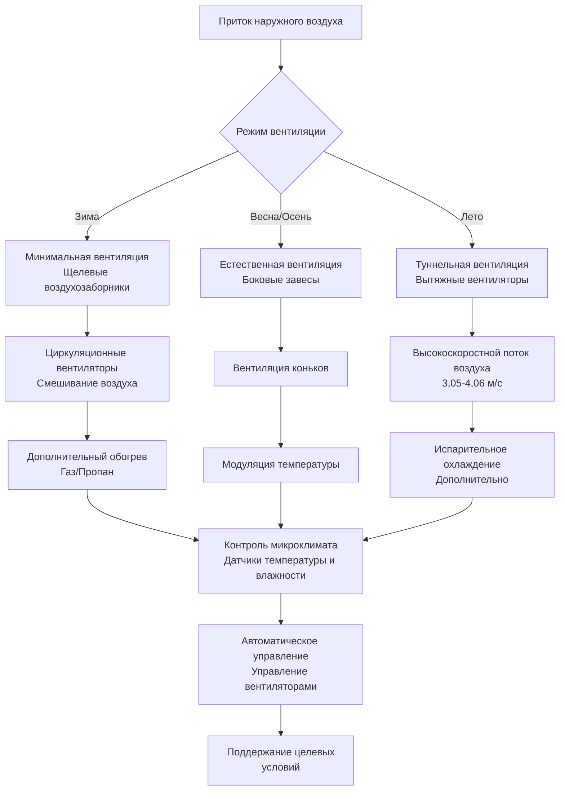

## Основные экологические требования

Помещения для свиней требуют точного контроля микроклимата из-за узких термонейтральных зон свиней на разных стадиях жизни и их высокой чувствительности к качеству воздуха. В отличие от других животных, свиньи не могут регулировать температуру тела посредством потоотделения, что делает системы вентиляции и охлаждения критически важными для теплового управления. Физика теплопередачи в свиноводческих зданиях включает балансировку явной теплоотдачи животными с скрытой теплотой дыхания и испарения с влажных поверхностей.

Общая теплопродукция свиньи описывается следующей формулой:

$$Q_{total} = Q_{sensible} + Q_{latent} = m \cdot q_s + m \cdot q_l$$

где $m$ — масса животного (кг), $q_s$ — удельная теплопродукция явной теплоты (Вт/кг) и $q_l$ — удельная теплопродукция скрытой теплоты (Вт/кг). Эти значения значительно варьируются в зависимости от массы животного, температуры окружающей среды и уровня активности.

## Требования к вентиляции по стадиям производства

### Помещения для опороса

Помещения для опороса представляют наиболее сложный сценарий контроля микроклимата в свиноводстве, требуя одновременного поддержания температуры 32-35°C для новорожденных поросят и комфортной температуры 15-18°C для маток. Этот перепад температур 17°C требует зонального обогрева с использованием зон логова с инфракрасными лампами или излучающими панелями.

Минимальные расходы вентиляции для опороса:

| Условия | Расход на одну матку с пометом | Кратность воздухообмена в час |
|---------|--------------------------------|---------------------------------|
| Зимний минимум | 9,5 м³/ч | 3-4 ACH |
| Мягкая погода | 16,6 м³/ч | 6-8 ACH |
| Летний максимум | 237 м³/ч | 75-100 ACH |

Система вентиляции должна удалять влагу из навоза, мочи и пролитой воды, сохраняя при этом стратификацию температуры. Поток, вызванный плавучестью в помещениях для опороса, описывается следующей формулой:

$$\Delta P = \rho g h \frac{\Delta T}{T_{avg}}$$

где $\Delta P$ — перепад давления (Па), $\rho$ — плотность воздуха, $g$ — ускорение свободного падения, $h$ — разница вертикальной высоты и $\Delta T$ — разница температур между зонами. Избыточное давление предотвращает инфильтрацию холодного воздуха в зоны логова.

### Помещения доращивания

Отнятые поросята (4,5-7 кг до 23-27 кг) требуют начальной температуры 24-29°C, снижаясь на 1,1-1,7°C в неделю. Высокая плотность посадки генерирует значительную явную теплоту, требуя осторожного поэтапного регулирования вентиляции.

Расходы вентиляции для поросят доращивания:

$$Q_{nursery} = N \cdot \left[CFM_{min} + \left(CFM_{max} - CFM_{min}\right) \cdot \frac{T_{ambient} - T_{setpoint-low}}{T_{setpoint-high} - T_{setpoint-low}}\right]$$

где $N$ — количество поросят, $CFM_{min}$ — 0,95-1,42 м³/ч на поросенка, и $CFM_{max}$ — 9,5-11,85 м³/ч на поросенка в летних условиях. Уравнение обеспечивает линейное регулирование между минимальной и максимальной вентиляцией.

### Помещения откорма

Свиньи на откорме (27 кг до 127 кг живой массы) имеют более низкие термонейтральные зоны (15-24°C) и производят 0,2-0,44 кВт явной теплоты на животное. Летний тепловой стресс является основной проблемой, требующей высокопроизводительной вентиляции или испарительного охлаждения.

Требования к скорости воздуха при туннельной вентиляции:

| Масса свиньи (кг) | Скорость воздуха для охлаждения (м/с) | Эквивалентное снижение ощущаемой температуры (°C) |
|-------------------|-------------------------------------|-------------------------------------------------|
| 27-45 | 2,03-2,54 | 2,8-3,9 |
| 45-68 | 2,54-3,05 | 3,9-5,0 |
| 68-127 | 3,05-4,06 | 5,0-6,7 |

Коэффициент конвективной теплопередачи возрастает со скоростью воздуха:

$$h_c = 10.45 - v + 10\sqrt{v}$$

где $h_c$ — коэффициент конвекции (Вт/м²·K) и $v$ — скорость воздуха (м/с). Эта зависимость объясняет эффект ветрового охлаждения, обеспечивающий тепловое облегчение при тепловом стрессе.

## Контроль аммиака и сероводорода

Свиноводческие здания генерируют аммиак (NH₃) при бактериальном разложении мочевины в моче и сероводород (H₂S) при анаэробном разложении навоза. Оба газа представляют опасность для здоровья и снижают продуктивность.

Скорость генерации аммиака:

$$G_{NH_3} = k \cdot A \cdot [NH_4^+] \cdot \left(1 + 10^{pH-pK_a}\right)^{-1}$$

где $k$ — коэффициент массопередачи, $A$ — площадь смачиваемой поверхности, $[NH_4^+]$ — концентрация аммония и $pK_a = 9,25$ для равновесия аммиак-аммоний. Более высокий pH смещает равновесие в сторону газообразного аммиака.

Целевые концентрации газов:

| Газ | Максимально непрерывное воздействие | Кратковременное воздействие | Метод контроля |
|-----|--------------------------------------|-----------------------------|--------------------|
| NH₃ | 25 ppm | 35 ppm | Вентиляция, присадки в яму |
| H₂S | 10 ppm | 20 ppm | Вентиляция ямы, окисление |
| CO₂ | 1500 ppm | 5000 ppm | Обмен свежего воздуха |

Требуемая вентиляция разбавления:

$$Q_{dilution} = \frac{G \cdot 10^6}{C_{max} - C_{inlet}}$$

где $Q_{dilution}$ — расход вентиляции (м³/ч), $G$ — скорость генерации газа (м³/ч чистого газа) и значения $C$ — концентрации в ppm. Для контроля аммиака это обычно требует 1,9-3,8 м³/ч на 45 кг массы животного в холодную погоду.

## Проектирование системы вентиляции

### Стратегия минимальной вентиляции

Вентиляция в холодный период требует непрерывного воздухообмена для контроля влажности и газов при минимизации потерь тепла. Минимальная вентиляция работает на основе циклического таймера, обычно 5 минут включения на 30 минут цикла в самых холодных условиях, с увеличением продолжительности при повышении температуры.

Потери тепла при минимальной вентиляции:

$$Q_{vent} = \dot{m} \cdot c_p \cdot \Delta T = 1.08 \cdot CFM \cdot \Delta T$$

где коэффициент 1,08 объединяет плотность воздуха, удельную теплоемкость и преобразование единиц (кДж/ч на м³/ч·°C). Здание с расходом 4,72 м³/ч при перепаде температур 22°C теряет 111 кВт только при вентиляции, требуя значительного дополнительного обогрева.

Конструкция воздухозаборника предотвращает падение холодного воздуха на животных. Потолочные воздухозаборники создают высокоскоростную струю, которая захватывает теплый воздух помещения:

$$\frac{v_2}{v_1} = \sqrt{\frac{A_1}{A_2}}$$

где $v_1$ — скорость воздухозаборника и $v_2$ — скорость струи на уровне животных. Соотношение площади 4:1 снижает скорость до 50%, предотвращая сквозняки при смешивании свежего воздуха с теплым воздухом помещения перед достижением животных.

### Конфигурация туннельной вентиляции

Летнее охлаждение требует туннельной конфигурации с вытяжными вентиляторами с одной стороны и испарительными охлаждающими панелями с другой стороны. Скорости воздуха 3,05-4,06 м/с обеспечивают ветровое охлаждение, эквивалентное снижению температуры на 5,6-6,7°C.

Проектирование статического давления:

$$\Delta P_{total} = \Delta P_{inlet} + \Delta P_{building} + \Delta P_{evap}$$

Типичные значения: испарительные панели (0,25-0,37 см водяного столба), сопротивление здания (0,05-0,12 см водяного столба), полная система (0,30-0,50 см водяного столба). Вентиляторы должны преодолевать это давление при расходе проектирования.

Эффективность испарительного охлаждения:

$$T_{supply} = T_{db} - \eta \cdot (T_{db} - T_{wb})$$

где $\eta$ — эффективность панели (75-85% для среды CELdek), $T_{db}$ — температура по сухому термометру и $T_{wb}$ — температура по влажному термометру. При 35°C и 60% относительной влажности (25,6°C влажный термометр), охлаждение до 27,2°C достижимо.

## Предотвращение теплового стресса

Свиньи испытывают тепловой стресс, когда температура окружающей среды превышает верхнюю критическую температуру (UCT) их термонейтральной зоны. Свиньи на убой имеют UCT 24-27°C; при превышении этой температуры потребление корма значительно снижается и частота дыхания резко возрастает.

Индекс температуры-влажности для свиней:

$$THI = T_{db} - [0.55 - 0.0055 \cdot RH] \cdot (T_{db} - 14.4)$$

где $T_{db}$ в °C и $RH$ — относительная влажность в процентах. Значения THI выше 23,3 указывают на риск теплового стресса; выше 25,6 указывают на опасные условия, требующие немедленного вмешательства.

Сравнение стратегий снижения теплового стресса:

| Стратегия | Снижение температуры | Стоимость установки | Операционные расходы | Ограничения |
|-----------|----------------------|--------------------|-----------------------|------------|
| Повышенный расход воздуха (4,06 м/с) | 5,6-6,7°C ощущаемая | Низкая | Низкие | Требует длины здания |
| Испарительное охлаждение | 6,7-10°C фактическая | Средняя | Средние | Неэффективно во влажном климате |
| Охлаждение спринклерами/капельное | 2,8-4,4°C эффективная | Низкая | Низкие | Повышает влажность навоза |
| Механическое охлаждение | 8,3-13,9°C фактическая | Очень высокая | Очень высокие | Ограниченное применение |

Системы опрыскивания применяют воду непосредственно на свиней, используя испарительное охлаждение с поверхности кожи. Расход воды 0,11-0,23 л/свинью/час удаляет:

$$Q_{evap} = \dot{m}_{water} \cdot h_{fg}$$

где $h_{fg}$ = 2440 кДж/кг при 26,7°C. Для свиньи массой 113 кг, производящей 0,35 кВт, 0,23 л/ч (0,19 кг/ч) удаляет 1,29 кВт, превышая теплопродукцию и обеспечивая эффективное охлаждение.

## Мониторинг и контроль качества воздуха

Современные свиноводческие помещения используют непрерывный мониторинг температуры, влажности, концентрации аммиака и диоксида углерода. Алгоритмы контроллера регулируют расходы вентиляции для поддержания оптимальных условий при минимизации потребления энергии.

Пропорциональная полоса контроллера:

$$Fan_{speed} = Fan_{min} + (Fan_{max} - Fan_{min}) \cdot \frac{T_{actual} - T_{setpoint}}{T_{band}}$$

Типичные пропорциональные полосы: 2,8-4,4°C для поэтапного управления вентиляторами. Это предотвращает одновременную работу всех вентиляторов, снижая электрическую нагрузку и поддерживая стабильные условия.

Управление с мертвой зоной между обогревом и охлаждением предотвращает одновременную работу:

| Диапазон температур | Действие | Типичные уставки |
|-------------------|---------|------------------|
| Ниже уставки минус 1,1°C | Максимальный обогрев | — |
| Уставка ± 1,1°C | Только минимальная вентиляция | 18,3-21,1°C откорм |
| Уставка + 1,1°C до + 2,8°C | Поэтапные вентиляторы 1-4 | — |
| Выше уставки + 2,8°C | Туннельный режим + охлаждение | — |

## Конструкция ограждающей конструкции

Требования к изоляции свиноводческих зданий превышают типичные сельскохозяйственные сооружения из-за необходимости точного контроля температуры и высокого влагообразования.

Теплопередача через ограждающую конструкцию:

$$Q_{envelope} = U \cdot A \cdot \Delta T$$

Рекомендуемые значения U (кДж/ч·м²·°C):

- Стены: 0,28-0,45 (RSI 2,1-3,5)
- Потолок: 0,17-0,28 (RSI 3,5-5,9)
- Полы: 0,56-0,84 (RSI 1,2-1,8 под опоросом)

Пароизоляция предотвращает миграцию влаги в изоляцию. Местоположение точки росы в сборке стены:

$$x_{dewpoint} = \frac{k \cdot L \cdot (T_{inside} - T_{dewpoint})}{T_{inside} - T_{outside}}$$

где $x_{dewpoint}$ — расстояние от внутренней поверхности, $k$ — теплопроводность и $L$ — толщина стены. Пароизоляция должна быть размещена на теплой (внутренней) стороне для предотвращения конденсации внутри изоляции.

## Интеграция системы и экономика

Полный контроль микроклимата свиноводческих помещений интегрирует вентиляцию, отопление, охлаждение и мониторинг в координированную систему. Затраты на энергию составляют 8-12% от общих производственных затрат в откормочных помещениях.

Годовое требование энергии на отопление:

$$E_{heat} = \sum_{i=1}^{12} \left[\frac{1.08 \cdot CFM \cdot DD_i \cdot 24}{\eta_{furnace}}\right]$$

где $DD_i$ — градусо-дни за месяц и $\eta_{furnace}$ — КПД отопления (0,80-0,85 для прямого сжигания). Помещение для откорма 1000 голов в Айове требует 837-1255 ГДж в год для отопления.

Сложность контроллера варьируется от простых термостатов до сетевых систем, обеспечивающих удаленный мониторинг и логирование данных. Передовые системы оптимизируют между конкурирующими целями: комфорт животных, качество воздуха и энергоэффективность. Экономический оптимум обычно поддерживает температуру в пределах 1,7-2,8°C от идеальной уставки при минимизации расходов вентиляции в холодную погоду.

Современное точное животноводство интегрирует мониторинг живой массы, отслеживание потребления корма и надзор за здоровьем с контролем микроклимата, позволяя принимать управленческие решения на основе данных, которые улучшают как благополучие животных, так и эффективность производства.
