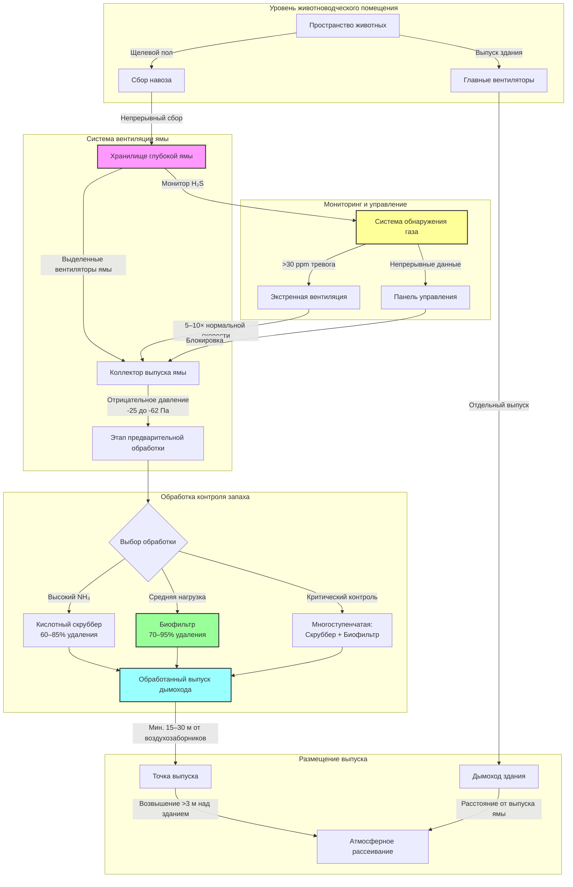

Системы управления сельскохозяйственными отходами представляют критические интерфейсы между биологическими процессами и проектированием HVAC, где вентиляция хранилища навоза, контроль запаха и требования по разбавлению газов напрямую влияют на качество воздуха в помещении и безопасность. Интеграция систем обращения с отходами со стратегиями экологического контроля требует понимания явлений массопереноса, кинетики образования газов и принципов разбавляющей вентиляции для поддержания безопасных условий в атмосфере при контроле выбросов запахов.

## Основы вентиляции хранилища навоза

Управление отходами включает координацию систем сбора, хранения и обработки навоза с вентиляцией зданий для контроля запаха, разбавления опасных газов и обеспечения безопасности рабочих. Основная проблема заключается в управлении выбросами летучих соединений из разлагающихся органических веществ при предотвращении накопления токсичных газов в жилых помещениях и помещениях хранения.

### Генерация газов при хранении навоза

Анаэробное разложение при хранении навоза производит множество газообразных компонентов, требующих вентиляционного контроля. Скорости генерации зависят от температуры, глубины хранилища, перемешивания и состава навоза:

**Скорость генерации аммиака:**

$$G_{NH_3} = k_a \cdot A_s \cdot (T-T_{ref}) \cdot C_N$$

Где:
- $G_{NH_3}$ = скорость генерации аммиака (г/ч)
- $k_a$ = коэффициент волатилизации аммиака (0,001–0,005 г/м²·ч·°C)
- $A_s$ = площадь поверхности навоза (м²)
- $T$ = температура навоза (°C)
- $T_{ref}$ = контрольная температура, обычно 10°C
- $C_N$ = коэффициент концентрации азота (1,0–2,5)

**Генерация сероводорода:**

$$G_{H_2S} = k_s \cdot V_m \cdot f_{sulfur} \cdot e^{0.07(T-20)}$$

Где:
- $G_{H_2S}$ = скорость генерации H₂S (мг/ч)
- $k_s$ = коэффициент восстановления серы (0,5–2,0 мг/м³·ч при 20°C)
- $V_m$ = объем навоза (м³)
- $f_{sulfur}$ = коэффициент содержания серы (0,8–1,5 для типичного корма животных)
- Температурная поправка следует экспоненциальной зависимости

### Требования по вентиляции для разбавления

Вентиляция для контроля газов следует принципам разбавления, при которых расход воздуха на выхлопе должен поддерживать концентрации ниже опасных пороговых значений:

**Требуемая вентиляция для разбавления:**

$$Q_{dilution} = \frac{G \cdot 10^6}{(C_{max} - C_{ambient}) \cdot \rho_{air} \cdot 60}$$

Где:
- $Q_{dilution}$ = требуемая скорость вентиляции (CFM)
- $G$ = скорость генерации газа (г/ч или мг/ч)
- $C_{max}$ = максимально допустимая концентрация (ppm)
- $C_{ambient}$ = концентрация поступающего воздуха (ppm, обычно 0)
- $\rho_{air}$ = плотность воздуха (1,2 кг/м³)
- Коэффициенты преобразования обеспечивают согласованность единиц

**Применение коэффициента безопасности:**

$$Q_{design} = Q_{dilution} \cdot SF \cdot F_{agitation}$$

Где:
- $Q_{design}$ = скорость вентиляции при проектировании (CFM)
- $SF$ = коэффициент безопасности (2,0–3,0 для жилых помещений, 1,5 для хранения)
- $F_{agitation}$ = коэффициент перемешивания (1,0 спокойное состояние, 5,0–50,0 при перекачивании)

## Пределы концентрации газов и опасности

| Вид газа | Средневзвешенная граница (TWA) | Краткосрочный предел экспозиции (STEL) | Сразу опасное (IDLH) | Типичная концентрация в яме |
|----------|--------------------------------|--------------------------------------|-----------------------|------------------------------|
| Аммиак (NH₃) | 25 ppm | 35 ppm | 300 ppm | 50–200 ppm |
| Сероводород (H₂S) | 10 ppm | 15 ppm | 100 ppm | 200–5000 ppm |
| Метан (CH₄) | — | — | 50 000 ppm (5% LEL) | 1 000–10 000 ppm |
| Диоксид углерода (CO₂) | 5 000 ppm | 30 000 ppm | 40 000 ppm | 10 000–50 000 ppm |
| Оксид углерода (CO) | 35 ppm | — | 1 200 ppm | Переменная в зависимости от оборудования |

**Критическое соображение безопасности:** Перемешивание навозной ямы может привести к выбросу накопленного H₂S при концентрациях, превышающих 1000 ppm в течение секунд, создавая немедленно летальные условия в атмосфере, требующие протоколов экстренной вентиляции.

## Системы щелевых полов и вентиляция ямы

Конфигурации щелевых полов позволяют навозу падать через отверстия в подземные ямы хранения, требуя выделенной вентиляции ямы, отделенной от вентиляции пространства животных для контроля миграции газа и запаха.

### Проектирование скорости вентиляции ямы

**Непрерывная вентиляция ямы:**

$$Q_{pit} = A_{floor} \cdot q_{specific}$$

Где:
- $Q_{pit}$ = скорость вентиляции ямы (CFM)
- $A_{floor}$ = площадь щелевого пола (м²)
- $q_{specific}$ = удельная скорость вентиляции ямы (CFM/м²)

**Типичные скорости вентиляции ямы:**

| Тип животных | Непрерывная вентиляция | Минимальная вентиляция | Вентиляция перед перемешиванием |
|--------------|----------------------|----------------------|--------------------------------:|
| Свини (откорм) | 1,7–3,4 (м³/ч)/м² | 0,85 (м³/ч)/м² | 8,5–17 (м³/ч)/м² |
| Свини (опорос) | 2,55–4,25 (м³/ч)/м² | 1,36 (м³/ч)/м² | 12,8–25,5 (м³/ч)/м² |
| Молочный скот (свободно стоящие) | 1,36–2,55 (м³/ч)/м² | 0,68 (м³/ч)/м² | 6,8–13,6 (м³/ч)/м² |
| Птица (высотные фермы) | 3,4–5,1 (м³/ч)/м² | 1,7 (м³/ч)/м² | 17–34 (м³/ч)/м² |

### Контроль соотношения давления

Системы вентиляции ямы должны поддерживать отрицательное давление относительно пространства животных для предотвращения миграции газа вверх через щелевые полы:

$$\Delta P_{pit} = P_{animal} - P_{pit} \geq 25 \text{ Па}$$

Минимальный перепад давления в 25–62 Па предотвращает обратный поток во время ветровых эффектов или циклирования системы вентиляции здания.

## Конфигурации систем хранения навоза

| Тип хранения | Типичный объем | Метод вентиляции | Уровень опасности газа | Стратегия контроля запаха |
|-------------|----------------|-----------------|----------------------|--------------------------|
| Глубокая яма (ниже пола) | 6–12 месяцев | Выделенные вентиляторы ямы | Очень высокий | Отдельный выпуск, биофильтры |
| Неглубокая яма (15–30 см) | Еженедельно–раз в две недели | Выпуск здания | Средне-высокий | Частое удаление, скрубберы |
| Желоба с выпуском пробки | 1–7 дней | Выпуск здания | Средний | Ежедневное промывание |
| Внешнее хранилище жидкости | 6–12 месяцев | Естественная конвекция | Высокий (при перемешивании) | Расстояние, высота дымохода, покрытия |
| Системы компостирования | Непрерывная партия | Принудительная аэрация | Низко-средний | Контроль аэробного процесса |

## Контроль запаха и рассеивание

Генерация запаха при управлении сельскохозяйственными отходами следует принципам массопереноса, где летучие органические соединения (VOC) и восстановленные соединения серы переходят из жидкой/твердой фаз в воздух:

**Требование по разбавлению запаха:**

$$D = \frac{C_e}{C_t}$$

Где:
- $D$ = коэффициент разбавления к пороговому значению
- $C_e$ = концентрация выброса (единицы запаха/м³)
- $C_t$ = концентрация порога запаха (обычно 1 ОЕ/м³)

**Расстояние атмосферного рассеивания:**

$$x_{min} = h_s \cdot \left(\frac{D \cdot u}{Q_e}\right)^{0.5}$$

Где:
- $x_{min}$ = минимальное расстояние для разбавления до порога (м)
- $h_s$ = эффективная высота дымохода (м)
- $u$ = скорость ветра (м/с)
- $Q_e$ = скорость потока выхлопа (м³/с)
- Упрощенное приближение гауссовского рассеивания

### Архитектура интеграции отходов и HVAC

### Спецификации технологии контроля запаха

| Технология контроля | Эффективность удаления | Стоимость капитала | Стоимость эксплуатации | Перепад давления | Оптимальное применение |
|---------------------|----------------------|-------------------|----------------------|-----------------|----------------------|
| Биофильтр | 70–95% | Средняя | Низкая | 25–100 Па | Установившийся выпуск |
| Мокрый скруббер (кислотный) | 60–85% NH₃ | Высокая | Средне-высокая | 62–186 Па | Высокие нагрузки аммиака |
| Химический скруббер | 85–99% | Высокая | Высокая | 93–248 Па | Критический контроль запаха |
| УФ-окисление | 40–70% | Средняя | Средняя | 15–62 Па | Контроль VOC |
| Активированный уголь | 80–95% | Низко-средняя | Высокая (замена) | 25–93 Па | Низкий поток, высокая концентрация |
| Термическое окисление | >99% | Очень высокая | Очень высокая | 124–310 Па | Только промышленного масштаба |

### Параметры проектирования биофильтра

Биофильтры представляют наиболее экономически эффективную технологию контроля запаха для выхлопа сельскохозяйственных отходов, используя биологическое окисление одоростических соединений через органический фильтровальный материал.

**Уравнение размеров биофильтра:**

$$A_{biofilter} = \frac{Q_{exhaust}}{v_{superficial}}$$

Где:
- $A_{biofilter}$ = требуемая площадь поверхности биофильтра (м²)
- $Q_{exhaust}$ = скорость потока выхлопа (CFM)
- $v_{superficial}$ = поверхностная скорость через материал (CFM/м²)

**Спецификации проектирования биофильтра:**

| Параметр | Типичное значение | Оптимальный диапазон | Влияние на проектирование |
|---------|------------------|---------------------|--------------------------|
| Поверхностная скорость | 0,85–1,7 м³/(м²·мин) | 0,68–2,0 м³/(м²·мин) | Выше = меньше площадь, ниже эффективность |
| Глубина материала | 90–120 см | 75–150 см | Глубже = лучше удаление, выше перепад давления |
| Время пребывания (расчётное) | 30–60 с | 20–90 с | Дольше = выше эффективность удаления |
| Влажность материала | 40–60% | 35–65% | Критично для биологической активности |
| Диапазон pH | 6,5–8,0 | 6,0–8,5 | За пределами диапазона снижает производительность |
| Рабочая температура | 15–37°C | 10–43°C | Ниже 4°C значительно снижает активность |
| Перепад давления (чистый) | 37–93 Па | 25–124 Па | Увеличивается при уплотнении материала со временем |
| Интервал замены материала | 3–5 лет | 2–7 лет | Зависит от нагрузки и обслуживания |

**Выбор материала биофильтра:**

| Тип материала | Объёмная плотность | Доля пустот | Срок службы | Удаление NH₃ | Удаление H₂S | Стоимость |
|---------------|------------------|-------------|-----------|------------|------------|----------|
| Компост/щепа | 400–560 кг/м³ | 55–70% | 3–5 лет | Хорошо | Отлично | Низкая |
| Кора/мульча | 320–480 кг/м³ | 60–75% | 4–6 лет | Хорошо | Хорошо | Низкая |
| Торфяной мох | 240–400 кг/м³ | 70–85% | 2–4 года | Отлично | Хорошо | Средняя |
| Синтетический материал | 80–240 кг/м³ | 80–95% | 7–10 лет | Удовлетворительно | Удовлетворительно | Высокая |
| Инженерная керамика | 480–640 кг/м³ | 50–65% | 10+ лет | Хорошо | Хорошо | Очень высокая |

### Системы мокрых скрубберов

Мокрые скрубберы используют массоперенос в жидкой фазе для удаления растворимых загрязнений, особенно аммиака, посредством кислотно-щелочных реакций.

**Эффективность скруббера:**

$$\eta = 1 - e^{-\frac{k \cdot A \cdot L}{Q}}$$

Где:
- $\eta$ = эффективность удаления (доля)
- $k$ = общий коэффициент массопередачи (CFM/м²)
- $A$ = площадь поверхности заполнителя скруббера (м²)
- $L$ = расход жидкости (л/мин)
- $Q$ = расход газа (CFM)

**Параметры проектирования кислотного скруббера:**

| Параметр | Свини | Молочный скот | Птица | Критерий проектирования |
|---------|-------|--------------|-------|----------------------|
| Отношение жидкость/газ | 50–85 л/1000 CFM | 34–68 л/1000 CFM | 68–102 л/1000 CFM | Выше для большего NH₃ |
| Концентрация кислоты | 0,5–2% H₂SO₄ | 0,5–1,5% H₂SO₄ | 1–3% H₂SO₄ | Поддерживать pH 2–4 |
| Перепад давления | 93–155 Па | 62–124 Па | 124–186 Па | Функция заполнителя |
| Высота заполнителя | 1,8–3,0 м | 1,5–2,4 м | 2,4–3,7 м | Больше для выше эффективности |
| Скорость в пустой башне | 1,0–2,0 м/с | 1,0–2,0 м/с | 1,0–2,0 м/с | Выше = меньший диаметр |
| Эффективность удаления NH₃ | 70–85% | 65–80% | 75–90% | Производительность одной ступени |

### Размещение выпуска и проектирование дымохода

Надлежащее размещение выпуска предотвращает повторное попадание загрязненного воздуха в воздухозаборники здания и максимизирует атмосферное разбавление.

**Расчёт эффективной высоты дымохода:**

$$h_{effective} = h_{physical} + \frac{v_s \cdot d_s}{u_{wind}}$$

Где:
- $h_{effective}$ = эффективная высота дымохода (м)
- $h_{physical}$ = физическая высота дымохода выше крыши (м)
- $v_s$ = скорость выхода из дымохода (м/с)
- $d_s$ = диаметр дымохода (м)
- $u_{wind}$ = скорость ветра на высоте дымохода (м/с)

**Требования по размещению выпуска дымохода:**

| Компонент объекта | Минимальное расстояние разделения | Требование по возвышению | Скорость выпуска |
|-------------------|--------------------------------|--------------------------|-----------------|
| Воздухозаборники здания | 15–30 м по ветру | >3 м выше воздухозаборника | 10–15 м/с |
| Границы участка | 60–150 м (зависит от кода) | Переменная | По моделированию рассеивания |
| Занятые здания (не ферма) | 150–300 м | >6 м выше линии крыши | >12,5 м/с |
| Соседние фермы | 90–240 м | >4,5 м выше смежных конструкций | >10 м/с |
| Колодцы водоснабжения | 30–60 м | Неприменимо | — |
| Публичные дороги | 30–90 м | >4,5 м выше дорожной поверхности | >12,5 м/с |

**Скорость выхода из дымохода:**

$$v_{exit} = \frac{Q \cdot 0,00508}{A_{stack}}$$

Где:
- $v_{exit}$ = скорость выхода из дымохода (м/с)
- $Q$ = скорость потока выхлопа (CFM)
- $A_{stack}$ = площадь поперечного сечения дымохода (м²)

**Минимальная скорость выхода:** 10 м/с предотвращает нисходящий поток и обеспечивает подъём шлейфа. Скорости, превышающие 17,5 м/с, могут создать избыточный шум и увеличить потребление энергии вентиляторов.

## Контроль выбросов аммиака

Аммиак представляет доминирующую озабоченность по запаху и качеству воздуха при управлении отходами животноводства, с выбросами, пропорциональными площади поверхности и pH:

**Массоперенос аммиака:**

$$J_{NH_3} = k_L \cdot (C_{liquid} - C_{air}/H)$$

Где:
- $J_{NH_3}$ = поток аммиака (г/(м²·ч))
- $k_L$ = коэффициент массопередачи в жидкой фазе (0,5–2,0 м/ч)
- $C_{liquid}$ = концентрация аммиака в навозе (г/м³)
- $C_{air}$ = концентрация в воздушной фазе (г/м³)
- $H$ = константа закона Генри для NH₃ (температурозависимая)

**Стратегии смягчения:**
- **Снижение pH:** Подкисление до pH <6,5 снижает волатилизацию на 50–80%
- **Минимизация площади поверхности:** Покрытия снижают выбросы на 40–90%
- **Контроль температуры:** Каждое снижение на 5°C снижает выбросы приблизительно на 30%
- **Частое удаление:** Снижает время накопления и общий летучий азот

## Интеграция с вентиляцией здания

Вентиляция системы управления отходами должна координироваться с управлением окружающей средой пространства животных для предотвращения помех и поддержания надлежащих соотношений давлений:

**Координация выпуска:**
- Выделенные вентиляторы ямы работают независимо от вентиляции здания
- Местоположения выпуска ямы предотвращают повторное попадание в воздухозаборники здания
- Минимальное расстояние разделения: 15–30 м по ветру, разница в возвышении >3 м

**Интеграция управления:**
- Вентиляторы ямы работают непрерывно или по таймерам независимо от контроля температуры здания
- Вентиляция перед перемешиванием увеличивает 5–10× нормальные скорости на 30–60 минут перед перекачиванием
- Экстренная вентиляция активируется при H₂S >30 ppm или CH₄ >1%

**Управление давлением:**
- Здание работает при лёгком отрицательном давлении (-25 до -62 Па)
- Яма работает при дополнительном отрицательном давлении относительно здания (-25 до -62 Па)
- Общий перепад от улицы к яме: -40 до -125 Па

## Стандарты и соответствие управлению сельскохозяйственными отходами

Интеграция управления отходами с системами HVAC должна соответствовать нескольким нормативно-правовым базам, регулирующим качество воздуха, безопасность рабочих и защиту окружающей среды.

### Применяемые стандарты и рекомендации

**Стандарты ASHRAE:**
- Стандарт ASHRAE 62.1: Вентиляция приемлемого качества внутреннего воздуха (промышленные пространства)
- Справочник ASHRAE – Приложения HVAC, Глава 24: Экологический контроль для животных и растений
- Руководство ASHRAE по проектированию сельскохозяйственных объектов

**Стандарты ASABE (Американское общество сельскохозяйственных и биологических инженеров):**
- ASABE EP470.2: Производство и характеристики навоза
- ASABE D384.2: Производство и характеристики навоза (стандартная практика)
- ASABE S607: Проектирование вентиляции для животноводческих помещений

**Нормы OSHA:**
- 29 CFR 1910.146: Замкнутые пространства, требующие разрешения
- 29 CFR 1910.1000: Загрязнители воздуха (значения PEL)
- 29 CFR 1910.134: Респираторная защита

**Рекомендации EPA:**
- Clean Air Act: Национальные стандарты выбросов опасных загрязнителей (NESHAP)
- Национальная система исключения выбросов загрязнителей (NPDES) для AFOs/CAFOs
- Программа AgSTAR: Восстановление и использование биогаза

**Стандарты NRCS (Служба сохранения природных ресурсов):**
- Стандарт практики сохранения 313: Объект хранения отходов
- Стандарт практики сохранения 360: Закрытие объекта хранения отходов
- Стандарт практики сохранения 367: Крыши и покрытия

### Требования по скорости вентиляции по стандарту

| Стандарт/Источник | Применение | Минимальная скорость вентиляции | Основа проектирования | Метрика соответствия |
|-------------------|-----------|------------------------------|----------------------|---------------------|
| ASABE EP470.2 | Глубокая яма свиней | 20–50 CFM на животное | Разбавление газа + запах | H₂S <10 ppm TWA |
| ASABE EP470.2 | Молочный скот (свободно стоящие) | 1,36–2,55 (м³/ч)/м² ямы | Основа площади поверхности | NH₃ <25 ppm TWA |
| ASHRAE Глава 24 | Птица (высотные фермы) | 3,4–5,1 (м³/ч)/м² пола | Площадь пола + плотность птиц | CO₂ <5 000 ppm |
| OSHA 1910.146 | Замкнутое пространство | 100% воздухообмен/5 мин | Полное вытеснение | O₂ >19,5%, <23,5% |
| Государственные нормы | Переменный по штату | 0,85–3,4 (м³/ч)/м² | Контроль запаха на границе участка | Соответствие отступу от запаха |

### Стандарты производительности контроля выбросов

**Расстояния отступления от запаха (в зависимости от штата):**

| Категория штата | Отступление жилого района | Отступление коммерческое | Требование обработки | Метод обеспечения |
|-----------------|-------------------------|------------------------|--------------------|-----------------|
| Строгое регулирование | 450–750 м | 240–450 м | Обязательно при >500 АU | Моделирование рассеивания |
| Умеренное регулирование | 240–450 м | 150–300 м | Требуется для новых | Соответствие фиксированному расстоянию |
| Минимальное регулирование | 90–240 м | 60–150 м | Добровольная лучшая практика | Соответствие по жалобам |

*Примечание: AU (Единица животного) = 450 кг живой массы животного*

**Требования производительности системы обработки:**

| Регулируемый параметр | Типичный предел | Частота мониторинга | Демонстрация соответствия |
|----------------------|----------------|--------------------|--------------------------|
| Эффективность снижения NH₃ | >60% | Ежеквартально | Расчёт баланса массы |
| Концентрация H₂S на границе участка | <30 ppb (среднее за 30 мин) | Непрерывная при перемешивании | Мониторинг окружающей среды |
| Выбросы VOC | <50% исходного | Ежегодное тестирование | Методология коэффициента выбросов |
| Твёрдые частицы (PM₁₀) | Специфично для объекта | Полугодовое | Тестирование методом EPA Method 5 |

### Проектирование многоступенчатой системы обработки

Для объектов, требующих максимального контроля запаха и выбросов, многоступенчатая обработка объединяет дополнительные технологии:

**Конфигурация цепи обработки:**

| Ступень | Технология | Целевые соединения | Эффективность удаления | Совокупное сокращение |
|--------|-----------|------------------|----------------------|---------------------|
| Ступень 1 | Кислотный скруббер | NH₃, растворимые VOC | 70–85% NH₃ | 70–85% |
| Ступень 2 | Биофильтр | H₂S, восстановленная сера, остаточные VOC | 80–95% запаха | 94–99% всего |
| Ступень 3 (опционально) | Полировка активированного угля | Остаточные VOC, меркаптаны | 85–95% | 99,5%+ всего |

**Производительность комбинированной системы:**

$$\eta_{total} = 1 - \prod_{i=1}^{n} (1 - \eta_i)$$

Где:
- $\eta_{total}$ = общая эффективность удаления
- $\eta_i$ = эффективность отдельной ступени
- $n$ = количество ступеней обработки

**Пример:** Двухступенчатая система с эффективностью скруббера 75% и эффективностью биофильтра 90% достигает 97,5% общего удаления.

## Протоколы безопасности и мониторинг

Интеграция управления сельскохозяйственными отходами требует постоянного мониторинга и протоколов экстренного реагирования:

**Обязательный мониторинг газов:**
- Непрерывный мониторинг H₂S в выпуске ямы или здании при работе вентиляции ямы
- Уставки тревоги: 10 ppm предупреждение, 30 ppm эвакуация, 50 ppm экстренная вентиляция
- Портативные мультигазовые детекторы требуются для входа в замкнутое пространство
- Проверка калибровки ежеквартально минимум

**Надёжность системы вентиляции:**
- Резервные вентиляторы ямы или сигнализация при отказе вентилятора
- Экстренное резервное питание для критической вентиляции
- Визуальная/слуховая сигнализация при отказе системы вентиляции
- Процедуры блокировки/отключения при обслуживании во время перемешивания

**Документирование соответствия:**
- Расчёты проектирования системы вентиляции, заверенные лицензированным профессиональным инженером
- Чертежи по факту строительства, показывающие размещение выпуска относительно воздухозаборников и границ участка
- Отчёты об испытаниях производительности системы обработки (ежеквартально до ежегодно)
- Записи мониторинга газов, ведущиеся минимум 3 года
- Журналы обслуживания замены среды биофильтра, замены раствора скруббера
- Документирование и записи обучения процедурам экстренного реагирования

### Требования к обслуживанию системы обработки

| Компонент системы | Задача обслуживания | Частота | Влияние на производительность при пренебрежении |
|------------------|-------------------|--------|----------------------------------------------|
| Среда биофильтра | Проверка влажности | Еженедельно | Потеря 50–80% эффективности при высыхании |
| Среда биофильтра | Тестирование pH и регулировка | Ежемесячно | Потеря 30–60% эффективности за пределами диапазона |
| Среда биофильтра | Замена/возобновление | 3–5 лет | Прогрессирующее снижение эффективности |
| Кислотный скруббер | Мониторинг pH раствора | Ежедневно | Полная потеря удаления NH₃ |
| Кислотный скруббер | Инспекция насоса и распылителя | Ежемесячно | Снижение контакта, низкая эффективность |
| Кислотный скруббер | Очистка заполнителя | Раз в полгода | Увеличение перепада давления, распределение |
| Вентиляторы выпуска | Натяжение ремня и смазка подшипников | Ежемесячно | Снижение потока воздуха, преждевременный отказ |
| Вентиляторы выпуска | Проверка потребления тока | Ежеквартально | Проверка производительности |
| Датчики газа | Калибровка датчика | Ежеквартально | Ложные показания, нарушение безопасности |
| Воздуховод | Инспекция и герметизация утечек | Ежегодно | Потеря контроля отрицательного давления |

Интеграция управления сельскохозяйственными отходами с системами HVAC требует строгого применения принципов разбавляющей вентиляции, постоянного мониторинга газов и многоуровневых протоколов безопасности для защиты благополучия животных, здоровья рабочих и качества окружающей среды. Надлежащее проектирование учитывает нормальную эксплуатацию, события перемешивания и сценарии экстренного положения с надлежащими коэффициентами безопасности и резервированием при соответствии федеральным, государственным и местным нормативным требованиям к качеству воздуха и контролю запаха.
