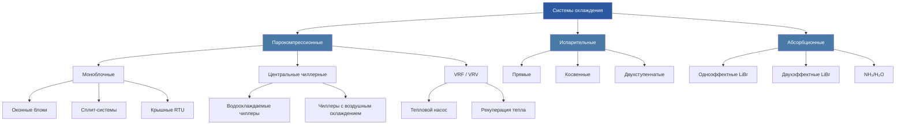

Системы кондиционирования воздуха (air conditioning systems) удаляют явное и скрытое тепло из обслуживаемых помещений, поддерживая тепловой комфорт и качество воздуха (indoor air quality, IAQ). Фундаментальное термодинамическое ограничение — второй закон термодинамики: перенос теплоты от холодного источника к горячему стоку требует подвода механической или тепловой энергии. Инженер обязан учитывать это ограничение при любой оценке энергоэффективности и при сравнении альтернативных технологий охлаждения.

По определению ASHRAE Handbook HVAC Systems and Equipment (гл. 1), кондиционирование воздуха — это одновременное управление температурой, влажностью, чистотой и распределением воздуха в помещении. В коммерческих зданиях охлаждение доминирует в годовом балансе электропотребления из-за внутренних тепловыделений от людей, освещения и офисного оборудования, а также из-за теплопоступлений через наружные ограждающие конструкции и остекление. Стандарт СП 60.13330.2020 устанавливает нормативные параметры микроклимата и минимальные требования к системам ОВК для объектов, проектируемых и строящихся на территории Российской Федерации; расчётные параметры наружного климата определяются по СП 131.13330.2020.

## Фундаментальные термодинамические циклы

### Парокомпрессионный цикл (vapor-compression refrigeration cycle)

Парокомпрессионный цикл является основой современного кондиционирования и промышленного холодоснабжения. Хладагент поглощает теплоту испарения при низком давлении в испарителе (evaporator), затем сжимается компрессором (compressor) до высокого давления и отдаёт теплоту конденсации в конденсаторе (condenser). Расширительный вентиль (expansion valve) — терморегулирующий (TXV) или электронный (EEV) — дросселирует переохлаждённую жидкость до давления испарения, замыкая цикл.

Коэффициент холодильной мощности (coefficient of performance, COP) — отношение полезной холодопроизводительности к подводимой компрессором мощности:


\mathrm{COP}_{\text{охл}} = \frac{Q_{\text{исп}}}{W_{\text{комп}}}


где $Q_{\text{исп}}$ — холодопроизводительность испарителя (Вт), $W_{\text{комп}}$ — мощность, потребляемая компрессором (Вт).

Теоретический предел задаётся идеальным обратным циклом Карно:


\mathrm{COP}_{\text{Карно}} = \frac{T_L}{T_H - T_L}


где $T_L$ и $T_H$ — абсолютные температуры испарения и конденсации (К).

**Числовой пример.** Водоохлаждаемый чиллер (water-cooled chiller) работает при температуре кипения хладагента $T_L = 5{,}0\,{}^\circ\text{C}$ (278 К) и конденсации $T_H = 35{,}0\,{}^\circ\text{C}$ (308 К). Теоретический COP Карно:


\mathrm{COP}_{\text{Карно}} = \frac{278}{308 - 278} = \frac{278}{30} \approx 9{,}27


Реальные водоохлаждаемые чиллеры при расчётных условиях AHRI 550/590 и EN 14511 достигают COP 4,5–6,5, что составляет 50–70 % от теоретического предела. Потери обусловлены необратимостями в компрессоре (механическое трение, перегрев всасываемого пара), дросселированием (замена изоэнтропийного расширения изоэнтальпийным) и конечными температурными напорами теплообменников. Чиллеры с воздушным охлаждением (air-cooled chiller) имеют COP 2,5–3,5 из-за более высокой температуры конденсации при использовании атмосферного воздуха в качестве теплового стока.

Помимо COP, для оценки сезонной энергоэффективности применяют интегральные показатели: IPLV (integrated part-load value) — для рынка США по AHRI 550/590; ESEER (European seasonal energy efficiency ratio) или SEPR — по EN 14825. Эти метрики учитывают работу оборудования при четырёх уровнях нагрузки (100 %, 75 %, 50 %, 25 %) и соответствующих температурах наружного воздуха или охлаждающей воды. ASHRAE 90.1-2022 нормирует минимальные IPLV для всех классов чиллеров и корректирует требования в зависимости от климатической зоны.

### Испарительное охлаждение (evaporative cooling)

Прямое испарительное охлаждение (direct evaporative cooling) использует скрытую теплоту парообразования воды (~2 501 кДж/кг при 0 °C). Адиабатическое насыщение происходит вдоль линии постоянной температуры по влажному термометру (wet-bulb temperature, WBT) на психрометрической диаграмме: сухая температура воздуха снижается, его энтальпия и влагосодержание практически не меняются.

Эффективность прямого испарительного охладителя (direct evaporative cooler efficiency):


\varepsilon_{\text{прям}} = \frac{T_{\text{вх}} - T_{\text{вых}}}{T_{\text{вх}} - T_{\text{вм}}} \times 100\,\%


где $T_{\text{вх}}$ и $T_{\text{вых}}$ — температуры воздуха на входе и выходе из охладителя (°C), $T_{\text{вм}}$ — температура по влажному термометру входящего воздуха (°C). Типичные значения: 70–90 % для прямых систем; 50–80 % для косвенных (indirect evaporative cooling), где охлаждение обеспечивается через промежуточный теплообменник без увлажнения подаваемого воздуха.

**Числовой пример.** Наружный воздух: $T_{\text{вх}} = 36{,}0\,{}^\circ\text{C}$, $T_{\text{вм}} = 18{,}0\,{}^\circ\text{C}$, $\varepsilon = 85\,\%$. Температура на выходе из прямого охладителя:


T_{\text{вых}} = T_{\text{вх}} - \varepsilon\,(T_{\text{вх}} - T_{\text{вм}}) = 36{,}0 - 0{,}85 \times (36{,}0 - 18{,}0) = 36{,}0 - 15{,}3 = 20{,}7\,{}^\circ\text{C}


Испарительное охлаждение экономически целесообразно в регионах с сухим климатом при психрометрическом потенциале охлаждения более 8 °C. В условиях жаркого влажного климата (высокий WBT) применяется только как первая ступень двухступенчатой системы.

### Абсорбционное охлаждение (absorption cooling)

Абсорбционные холодильные машины (absorption chillers) замещают механический компрессор тепловым термохимическим циклом с бинарной рабочей парой. Наиболее распространены пары бромид лития — вода (LiBr/H₂O) для кондиционирования воздуха (температура охлаждения выше 5 °C) и аммиак — вода (NH₃/H₂O) для систем с температурой охлаждения ниже 0 °C. Привод от сбросного тепла или газовых горелок делает эти машины привлекательными при дешёвой тепловой энергии: выхлопные газы промышленных процессов, пар низкого давления тепловых электростанций, солнечные коллекторы.


| Тип машины | COP тепловой | Температура привода | Источник тепла |
|---|---|---|---|
| Одноэффектная (single-effect) | 0,60–0,80 | 80–100 °C | Пар низкого давления, горячая вода |
| Двухэффектная (double-effect) | 1,00–1,40 | 120–170 °C | Пар среднего давления, прямой газ |
| Трёхэффектная (triple-effect) | 1,60–2,00 | 200–230 °C | Высокотемпературные технологические процессы |


## Классификация систем охлаждения





## Методы отвода тепла

Завершение термодинамического цикла требует отвода конденсационной теплоты (heat rejection) в окружающую среду. Выбор метода определяет энергоэффективность системы, потребление воды и эксплуатационные расходы. В регионах с ограниченным водопользованием или строгими нормами сброса воды этот выбор становится ключевым проектным решением.


| Метод | Температурный напор | Потребление воды | Типичный COP системы | Область применения |
|---|---|---|---|---|
| Воздушный конденсатор (air-cooled condenser) | 8–14 K выше DBT | Отсутствует | 2,5–3,5 | Малые и средние системы; засушливые регионы |
| Открытая градирня (open cooling tower) | 3–6 K выше WBT | Высокое (испарение + продувка) | 4,5–6,5 | Крупные центральные чиллерные установки |
| Закрытая градирня (closed cooling tower) | 6–9 K выше WBT | Среднее | 3,5–5,0 | Технологическое охлаждение, гликолевые системы |
| Испарительный конденсатор (evaporative condenser) | 6–9 K выше WBT | Среднее | 3,5–5,0 | Промышленная холодильная техника, склады |
| Геотермальный контур (ground source) | Температура грунта ±2 K | Отсутствует | 4,0–6,0 | Тепловые насосы, здания с нулевым углеродным балансом |


Открытая градирня с охлаждающей башней (cooling tower) даёт наименьшую температуру охлаждающей воды, что обеспечивает максимальный COP чиллера. Разница в температуре конденсации между воздушным и водяным охлаждением (10–20 K) приводит к разнице COP в 1,5–2,0 раза. Для крупных объектов с нагрузкой охлаждения более 1 МВт водяное охлаждение, как правило, экономически обосновано даже с учётом затрат на градирню и систему водоподготовки.

## Психрометрические основы расчёта нагрузок

Проектировщик обязан учитывать обе составляющие тепловой нагрузки: явную (sensible) и скрытую (latent). Отношение явного тепла (sensible heat ratio, SHR) характеризует состав нагрузки и является определяющим параметром при подборе охлаждающего оборудования:


\mathrm{SHR} = \frac{Q_s}{Q_s + Q_l}


где $Q_s$ — явная нагрузка (Вт), $Q_l$ — скрытая нагрузка (Вт). Для коммерческих систем комфортного охлаждения SHR обычно составляет 0,70–0,80; в офисах с активной вентиляцией наружным воздухом при жарком влажном климате SHR может снижаться до 0,60–0,65. Несоответствие SHR оборудования и нагрузки ведёт к неудовлетворительному контролю влажности: при завышенном SHR прибора относительная влажность воздуха в помещении остаётся чрезмерной, что провоцирует конденсацию на поверхностях, рост плесени и биологических агентов.

**Числовой пример — расчёт SHR.** Офисный этаж площадью 1 200 м²: явная нагрузка $Q_s = 96\,\text{кВт}$ (люди, освещение, оргтехника, солнечная инсоляция), скрытая нагрузка $Q_l = 28\,\text{кВт}$ (люди, вентиляция наружным воздухом):


\mathrm{SHR} = \frac{96}{96 + 28} = \frac{96}{124} = 0{,}774


Для подбора охлаждающей катушки линия состояния (apparatus dew point line, ADP) проводится через состояние воздуха в помещении до пересечения с кривой насыщения на психрометрической диаграмме.

Стандарт ASHRAE 62.1 регулирует минимальные нормы подачи наружного воздуха (outdoor air ventilation rates). В жарком влажном климате наружный воздух формирует 20–40 % суммарной нагрузки на охлаждение. Выделенная система подачи наружного воздуха (dedicated outdoor air system, DOAS) с энтальпийным рекуператором (energy recovery ventilator, ERV) снижает эту нагрузку на 40–65 % согласно ASHRAE Handbook Fundamentals (гл. 26), одновременно обеспечивая независимое управление нормой вентиляции.

## Энергоэффективность и нормативные требования

ASHRAE 90.1-2022 устанавливает минимальные требования к коэффициентам эффективности оборудования в зависимости от климатической зоны и типа нагрузки. Ключевые метрики:

- **EER** (energy efficiency ratio) — для чиллеров с воздушным охлаждением при стандартных условиях AHRI; единица измерения: БТЕ/(Вт·ч).
- **COP** — для чиллеров с водяным охлаждением по AHRI 550/590 и EN 14511; безразмерная величина.
- **IPLV / NPLV** (non-standard part-load value) — интегральный показатель при частичных нагрузках; определяет экономию энергии в реальных условиях эксплуатации с учётом переменных нагрузок и климата.
- **SEER / SCOP** (seasonal EER / seasonal COP) — для бытовых и малых коммерческих систем по EN 14825; учитывает сезонный профиль нагрузок.


| Тип чиллера | Диапазон мощности | Минимальный COP | Минимальный IPLV |
|---|---|---|---|
| Водоохлаждаемый, поршневой/спиральный | < 528 кВт | 4,20 | 5,05 |
| Водоохлаждаемый, центробежный | 528–1 055 кВт | 5,00 | 6,10 |
| Водоохлаждаемый, центробежный | > 1 055 кВт | 5,50 | 7,00 |
| Воздушного охлаждения | < 528 кВт | 2,80 | 3,05 |
| Воздушного охлаждения | ≥ 528 кВт | 2,90 | 3,20 |


СП 60.13330.2020 нормирует класс энергоэффективности здания в целом; системы ОВК должны соответствовать расчётному классу, а проект обязан подтверждать показатели удельного потребления энергии на кондиционирование.

## Критерии выбора системы

Выбор технологии охлаждения основывается на комплексном инженерно-экономическом анализе:

- **Расчётная пиковая нагрузка.** Методика ASHRAE Handbook Fundamentals — метод переходных тепловых нагрузок (radiant time series method, RTSM) или программные расчёты по ASHRAE Standard 140. Достоверность результата критична: завышение нагрузки на 20–30 % — типичная причина неоптимальной работы оборудования на частичных режимах.
- **Профиль нагрузок и коэффициент одновременности.** Определяет преимущество систем с переменной производительностью: чиллеры с магнитными подшипниками и инвертором, VRF-системы.
- **Тарифная структура на электроэнергию.** Ставки за мощность (demand charge) и дифференцированные тарифы по времени суток существенно влияют на сравнение вариантов и могут обосновывать применение теплового аккумулятора (thermal energy storage, TES).
- **Доступность воды.** Ограничения водопользования и нормы сброса могут исключать открытые градирни в пользу воздушного охлаждения.
- **Требования к помещениям.** Машинные залы, вертикальные шахты, несущая способность кровли и требования к шуму от наружных блоков.
- **Стоимость жизненного цикла (life cycle cost, LCC).** Горизонт анализа 15–25 лет; первоначальные инвестиции, эксплуатационные затраты, техническое обслуживание, утилизационная стоимость.

## Содержание раздела


| Тема | Описание |
|---|---|
| Воздушная фильтрация | Типы фильтров, рейтинги MERV/HEPA/ISO 16890, перепад давления, подбор и техническое обслуживание |
| Блоки обработки воздуха (AHU) | Компоновка секций, расчёт расходов воздуха, системы VAV, конфигурации теплообменных змеевиков |
| Центральные чиллерные установки | Водоохлаждаемые и воздушного охлаждения, первично-вторичные схемы насосной обвязки, IPLV |
| Системы VRF/VRV | Переменный расход хладагента, режим теплового насоса, одновременное отопление и охлаждение |
| Градирни | Противоточные и поперечноточные, гибридные системы, водоподготовка, контроль легионеллёза |
| Специализированное охлаждение | Охлаждение ЦОД (precision cooling), технологическое охлаждение, тепловые аккумуляторы |


*Версия 5.1 — переработана 2026-04-15 по стандартам ASHRAE Handbook HVAC Systems and Equipment (гл. 1–4, 35–38), ASHRAE 90.1-2022, AHRI 550/590-2023, EN 14511:2022, EN 14825:2022, СП 60.13330.2020, СП 131.13330.2020.*
