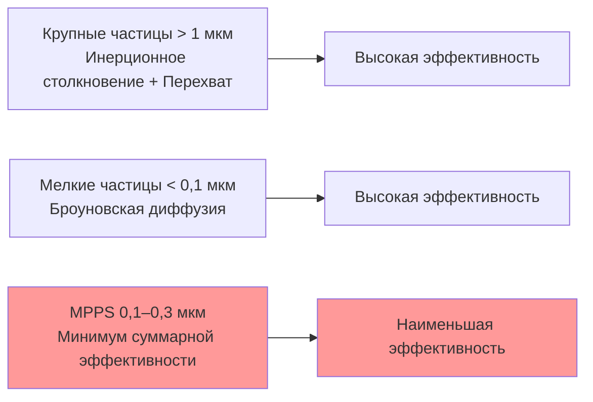

Воздушная фильтрация является критически важным компонентом систем отопления, вентиляции и кондиционирования воздуха (HVAC). Она обеспечивает три взаимосвязанные функции: защиту здоровья людей, находящихся в помещении, от воздействия взвешенных частиц и биоаэрозолей; защиту теплообменных поверхностей чиллеров и змеевиков AHU от загрязнения с последующей деградацией теплообмена; соответствие нормативным требованиям по качеству воздуха (indoor air quality, IAQ). Правильно подобранная и систематически обслуживаемая система фильтрации снижает заболеваемость персонала, продлевает межсервисные интервалы оборудования и минимизирует стоимость жизненного цикла (life cycle cost, LCC) всей системы ОВК.

По данным ВОЗ (обновлённые руководящие принципы качества воздуха, 2021), загрязнение воздуха внутри помещений входит в десятку ведущих факторов риска для здоровья. Частицы PM2,5 (аэродинамический диаметр ≤ 2,5 мкм) достигают альвеолярного отдела лёгких и ассоциированы с сердечно-сосудистыми и респираторными заболеваниями, а также с онкологической патологией при хроническом воздействии. Эффективная фильтрация в системах ОВК — один из наиболее рентабельных инструментов снижения экспозиционных доз PM2,5 в помещениях.

## Физические механизмы захвата частиц

Волокнистые фильтры (fibrous filters) захватывают частицы несколькими параллельно действующими механизмами. Доминирующий механизм определяется размером частицы, скоростью воздуха в канале между волокнами и геометрическими характеристиками фильтрующего материала.

### Перехват (Interception)

Частица движется вблизи волокна по линии тока; когда расстояние от центра частицы до поверхности волокна становится меньше радиуса частицы $d_p/2$, она касается волокна и удерживается ван-дер-ваальсовыми силами. Безразмерный параметр перехвата:


R_f = \frac{d_p}{d_f}


где $d_p$ — диаметр частицы (м), $d_f$ — диаметр волокна (м). Механизм перехвата доминирует в диапазоне 0,1–1,0 мкм и усиливается при уменьшении диаметра волокна: именно поэтому субмикронные нановолоконные покрытия (electrospun nanofibers) дают значительный прирост эффективности без пропорционального роста сопротивления.

### Инерционное столкновение (Inertial Impaction)

Частицы с достаточной инерцией не успевают следовать за изгибами линий тока при огибании волокна и сталкиваются с его поверхностью. Вероятность столкновения определяется числом Стокса (Stokes number):


Stk = \frac{\rho_p\,d_p^2\,U\,C_c}{18\,\mu\,d_f}


где $\rho_p$ — плотность частицы (кг/м³), $U$ — скорость потока на лицевой поверхности фильтра (м/с), $\mu$ — динамическая вязкость воздуха (Па·с), $C_c$ — поправочный коэффициент Каннингема (Cunningham slip correction factor). При $Stk > 0{,}2$ инерционное столкновение становится основным механизмом захвата. Для частиц крупнее 1–2 мкм при типичных скоростях 1,5–3,0 м/с через фильтрующую секцию это условие выполняется.

### Броуновская диффузия (Brownian Diffusion)

Субмикронные частицы испытывают хаотичное броуновское движение вследствие теплового удара молекул газа. Коэффициент диффузии по уравнению Эйнштейна–Стокса:


D = \frac{k_B\,T\,C_c}{3\pi\,\mu\,d_p}


где $k_B = 1{,}38 \times 10^{-23}$ Дж/К — постоянная Больцмана, $T$ — абсолютная температура (К). Эффективность захвата за счёт диффузии обратно пропорциональна числу Пекле (Peclet number):


\eta_D \propto Pe^{-2/3}, \quad Pe = \frac{U\,d_f}{D}


Диффузионный механизм доминирует для частиц менее 0,1 мкм и усиливается при малых скоростях потока и повышенных температурах воздуха.

### Электростатическое притяжение (Electrostatic Attraction)

Заряженные частицы притягиваются к противоположно заряженным волокнам электретных фильтров (electret filters) кулоновской силой; нейтральные частицы притягиваются к заряженным волокнам силой наведённого изображения (image force). Электростатическое усиление повышает эффективность захвата по всему диапазону размеров без увеличения перепада давления. Однако заряд электретных материалов нейтрализуется под воздействием масляных аэрозолей, высоких концентраций тонкодисперсной пыли и при испытаниях по методу ISO 16890 (кондиционирование изопропиловым спиртом), что раскрывает только постоянную механическую составляющую эффективности.

## Размер частицы с максимальной проникающей способностью (MPPS)

Суперпозиция механизмов порождает характерный минимум суммарной эффективности фильтра в диапазоне 0,1–0,3 мкм — так называемый размер частицы с максимальной проникающей способностью (most penetrating particle size, MPPS). Ниже этого значения доминирует диффузия с возрастающей эффективностью; выше — перехват и импакция с возрастающей эффективностью.





Именно при MPPS проводятся квалификационные испытания фильтров HEPA: стандарт EN 1822-2019 требует эффективности не менее 99,95 % (класс H13) или 99,995 % (класс H14) при MPPS конкретного испытываемого материала. Американский стандарт IEST-RP-CC001 использует фиксированный размер 0,3 мкм (близкий к MPPS большинства материалов HEPA) и требует эффективности ≥ 99,97 %.

## Классификация фильтров по конструкции

### Панельные фильтры (Panel Filters, MERV 1–4)

Простейшая конструкция — плоский волокнистый материал (стекловолокно или полиэфир) в жёсткой картонной или металлической рамке. Начальный перепад давления: 12–38 Па (0,05–0,15 дюйма вод. ст.); пылеёмкость: 100–300 г/м²; срок службы: 30–60 суток. Назначение: предфильтры первой ступени для защиты оборудования от крупного загрязнения и жилые здания с минимальными требованиями к IAQ.

### Плиссированные фильтры (Pleated Filters, MERV 5–14)

Гофрированная структура материала многократно увеличивает эффективную площадь фильтрации относительно лицевой поверхности рамки:


A_{\text{мат}} = A_{\text{лиц}} \times \left(1 + 2\frac{h_{\text{гоф}}}{w_{\text{гоф}}}\right) \times n_{\text{гоф}}


где $h_{\text{гоф}}$ — высота складки (м), $w_{\text{гоф}}$ — шаг складки (м), $n_{\text{гоф}}$ — число складок. Типичное увеличение площади — в 5–15 раз по сравнению с лицевой поверхностью рамки, что одновременно снижает лицевую скорость на материале, уменьшает сопротивление и увеличивает пылеёмкость. Начальный перепад давления: 38–127 Па; пылеёмкость: 400–1 200 г/м²; срок службы: 3–12 месяцев. Основной тип фильтра для коммерческих зданий.

### Карманные (мешочные) фильтры (Bag Filters, MERV 10–15)

Несколько карманов из синтетического нетканого материала крепятся к жёсткой сборной головке. Глубина карманов 300–900 мм обеспечивает пылеёмкость 2–5 кг и межсервисный интервал 12–24 месяца в условиях нормальной загрязнённости наружного воздуха. Рабочий перепад давления при значительной нагрузке нередко ниже, чем у эквивалентного плиссированного фильтра, — благодаря существенно большей площади фильтрующего материала.

### Фильтры HEPA и ULPA

Субмикронное стекловолокно (диаметр 0,5–2 мкм) с глубокой гофровкой, разделённой алюминиевыми или бумажными сепараторами, образует плотный фильтрующий пакет. Металлический корпус с полиуретановым или неопреновым герметиком обеспечивает нулевой обход потока при соблюдении требований к монтажу.


| Класс | Минимальная эффективность при MPPS | Максимальная проникающая способность | Назначение |
|---|---|---|---|
| H13 | 99,95 % | 0,05 % | Медицинские учреждения, фармацевтика |
| H14 | 99,995 % | 0,005 % | Чистые комнаты ISO 5–6 |
| U15 | 99,9995 % | 0,0005 % | Производство полупроводников ISO 4 |
| U16 | 99,99995 % | 0,00005 % | Чистые комнаты ISO 3 |
| U17 | 99,999995 % | 0,000005 % | Сверхчистые производства ISO 1–2 |


Начальный перепад давления: 250–500 Па (1,0–2,0 дюйма вод. ст.).

## Рейтинговые системы

### MERV (ASHRAE 52.2)

Минимальное значение отчёта об эффективности (minimum efficiency reporting value, MERV) по стандарту ASHRAE 52.2-2017 определяется как наименьшая эффективность фильтра, зафиксированная за весь цикл запыления стандартной тестовой пылью в трёх диапазонах размеров: E1 (0,3–1,0 мкм), E2 (1,0–3,0 мкм), E3 (3,0–10 мкм). Такой подход исключает ситуацию, когда фильтр показывает высокую начальную эффективность с последующей резкой деградацией по мере нагрузки.


| MERV | E1 (0,3–1,0 мкм) | E2 (1,0–3,0 мкм) | E3 (3,0–10 мкм) | Типичное применение |
|---|---|---|---|---|
| 1–4 | — | — | < 20–80 % | Жилые здания, предфильтры с минимальными требованиями |
| 5–8 | — | < 20–70 % | 80–90 % | Коммерческие здания, базовый уровень по ASHRAE 62.1 |
| 9–12 | — | 50–90 % | 90–95 % | Коммерческий повышенный класс, лаборатории |
| 13–16 | 75–95 % | 90–99 % | > 95 % | Больницы, защитные помещения, чистые зоны |
| 17–20 | > 99,97 % | — | — | HEPA-фильтры: чистые комнаты, операционные |


### ISO 16890

Глобальный стандарт ISO 16890:2016 (заменил EN 779 в 2018 году) классифицирует фильтры по фракциям PM, значимым для здоровья человека. Обязательное кондиционирование изопропиловым спиртом (IPA discharge) перед испытанием нейтрализует электретный заряд, оставляя только постоянную механическую эффективность материала — более объективную и долгосрочную характеристику, чем рейтинги, полученные без нейтрализации:


| Класс | Фракция PM | Биологическое значение | Минимальная эффективность после нейтрализации |
|---|---|---|---|
| ePM1 | ≤ 1 мкм | Альвеолярное осаждение | ≥ 50 % |
| ePM2,5 | ≤ 2,5 мкм | Трахеобронхиальное осаждение | ≥ 50 % |
| ePM10 | ≤ 10 мкм | Верхние дыхательные пути | ≥ 50 % |
| Coarse | > 10 мкм | Носовые проходы | < 50 % ePM10 |


## Перепад давления и потребление энергии

Перепад давления через волокнистый материал при ламинарном режиме обтекания описывается уравнением Дэвиса (Davies equation):


\Delta P = \frac{64\,\alpha^{1{,}5}(1 + 56\,\alpha^3)\,\mu\,U\,t}{d_f^2}


где $\alpha$ — плотность упаковки волокон (безразмерная; типично 0,03–0,15), $t$ — толщина материала (м). Мощность, потребляемая вентилятором для преодоления сопротивления фильтра:


\dot{W}_{\text{вент}} = \frac{\dot{V}\,\Delta P}{\eta_{\text{вент}}\,\eta_{\text{мот}}}


**Числовой пример.** Приточная установка AHU: расход воздуха $\dot{V} = 4{,}72$ м³/с; среднее сопротивление фильтров MERV 13 $\Delta P = 200$ Па; совокупный КПД вентиляторного агрегата $\eta = 0{,}65$; 3 000 ч/год при тарифе 0,12 $/кВт·ч:


\dot{W} = \frac{4{,}72 \times 200}{0{,}65} = 1{,}452\,\text{кВт}; \quad C_{\text{год}} = 1{,}452 \times 3\,000 \times 0{,}12 \approx 523\,\text{\$/год}


Анализ полной стоимости жизненного цикла (LCC) учитывает первоначальные затраты, расходы на замену фильтров и затраты на привод вентилятора:


LCC = C_{\text{нач}} + \sum_{i=1}^{n} \frac{C_{\text{замена},i} + C_{\text{энергия},i}}{(1+r)^i}


где $r$ — ставка дисконтирования, $n$ — горизонт анализа (лет). В долгосрочной перспективе затраты на энергию вентилятора нередко превышают совокупную стоимость самих фильтров.

## Интеграция в систему ОВК

### Расположение фильтров в воздуховодной сети

- **Перед теплообменниками**: защита змеевиков от загрязнения — наиболее распространённая схема для коммерческих AHU; предотвращает биообрастание влажных охлаждающих поверхностей.
- **После теплообменников (downstream)**: применяется в критичных помещениях; исключает вторичное загрязнение воздуха от поверхностей змеевиков, поддонов и воздуховодов.
- **Смесительная камера**: фильтрация смеси наружного и рециркуляционного воздуха до поступления на теплообменники.
- **Выделенная система DOAS**: отдельная ступень фильтрации вентиляционного воздуха с независимым управлением и соответствием нормам ASHRAE 62.1.

### Допустимые скорости на лицевой поверхности


| Тип фильтра | Оптимальная скорость | Максимальная скорость |
|---|---|---|
| Панельный | 2,0 м/с | 2,5 м/с |
| Плиссированный | 2,0 м/с | 2,5 м/с |
| HEPA | 1,3 м/с | 1,5 м/с |
| Активированный уголь | 0,2–0,4 м/с | 0,5 м/с |


### Обход фильтра (Bypass)

Системная эффективность снижается при наличии потоков, минующих фильтрующий материал через щели в раме и корпусе:


\eta_{\text{сист}} = \eta_{\text{фильтр}} \times (1 - f_{\text{обход}})


Качественное уплотнение рамы и корпуса обязательно. Для HEPA-установок выполняется испытание на герметичность (leak test) по IEST-RP-CC034: допустимая локальная проникающая способность — не более 0,01 % для H14 и не более 0,05 % для H13.

## Нормативные требования по типу помещения


| Тип помещения | Нормативный документ | Минимальная ступень фильтрации |
|---|---|---|
| Коммерческие здания (общий случай) | ASHRAE 62.1 | MERV 8 (наружный воздух); рекомендуется MERV 13 |
| Общие зоны больниц | ASHRAE 170 | MERV 14 |
| Операционные, изоляторы с положительным давлением | ASHRAE 170 | HEPA H13/H14 (MERV 17–20) |
| Чистые комнаты ISO класс 5–6 | ISO 14644-1 | HEPA H14 |
| Чистые комнаты ISO класс 3–4 | ISO 14644-1 | ULPA U15–U16 |
| Системы вентиляции зданий (РФ) | СП 60.13330.2020 | По категории помещения согласно приложению |


## Содержание подраздела


| Тема | Ключевые вопросы |
|---|---|
| Рейтинги эффективности | MERV, ISO 16890, EN 1822, FOM, сравнительные таблицы стандартов |
| Перепад давления | Уравнение Дэвиса, нагрузочные характеристики, мониторинг, оптимизация |
| Выбор и техническое обслуживание | Алгоритм выбора, LCC, монтаж, программы ТО, безопасная замена |
| Типы фильтров | Панельные, плиссированные, карманные, HEPA/ULPA, ESP, активированный уголь |
| Газообразные загрязнители | ЛОС, неорганические газы, адсорбция, PCO, расчёт времени прорыва |
| Фильтрация частиц | Механизмы захвата, MPPS, эффективность волокна, нагрузочные характеристики |


*Ссылки: ASHRAE Handbook HVAC Systems and Equipment гл. 29 (Air Cleaners for Particulate Contaminants), ASHRAE 52.2-2017, ISO 16890-1:2016, EN 1822-1:2019, ASHRAE 170-2021, ISO 14644-1:2015, NFPA 90A-2021, СП 60.13330.2020.*
