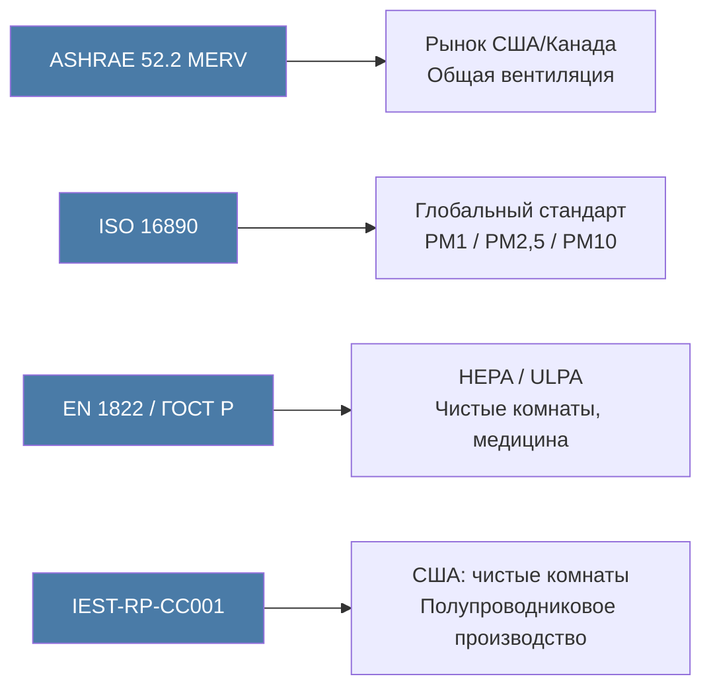

Рейтинги эффективности фильтров — стандартизированный инструмент для объективного сравнения воздушных фильтров различных производителей и однозначного задания требований в проектной документации. Инженер систем HVAC должен свободно ориентироваться в трёх действующих системах оценки: MERV (рынок США и Канады), ISO 16890 (глобальный стандарт), EN 1822 (фильтры HEPA/ULPA, Европа и Россия). Непонимание различий в методологиях испытаний приводит к ошибкам в спецификациях, занижению требований по IAQ и неоправданным энергетическим потерям.

## Система MERV по ASHRAE 52.2

Минимальное значение отчёта об эффективности (minimum efficiency reporting value, MERV) по стандарту ASHRAE 52.2-2017 оценивает фильтры по способности задерживать частицы в трёх диапазонах размеров:

- **E1**: 0,3–1,0 мкм — наиболее критичный диапазон; охватывает MPPS и включает бактерии, вирусные агрегаты и частицы горения.
- **E2**: 1,0–3,0 мкм — грибковые споры, мелкие частицы пыли.
- **E3**: 3,0–10 мкм — крупная пыль, пыльца растений, шерсть животных.

Рейтинг MERV присваивается по *минимальной* эффективности, зафиксированной в любом из трёх диапазонов за весь цикл запыления стандартной тестовой пылью ASHRAE (Arizona road dust). Такой подход исключает ситуацию, когда фильтр демонстрирует высокую начальную эффективность с последующей деградацией по мере нагрузки. Рейтинг MERV отражает наихудший зафиксированный результат — а не усреднённый.

### Полная таблица рейтингов MERV


| MERV | E1 (0,3–1,0 мкм) | E2 (1,0–3,0 мкм) | E3 (3,0–10 мкм) | Типичное применение |
|---|---|---|---|---|
| 1–4 | — | — | < 20–80 % | Жилые здания, предфильтры с минимальными требованиями |
| 5–8 | — | < 20–70 % | 80–90 % | Коммерческие здания, базовый уровень по ASHRAE 62.1 |
| 9–12 | — | 50–90 % | 90–95 % | Коммерческий повышенный класс, лаборатории |
| 13–16 | 75–95 % | 90–99 % | > 95 % | Больницы, защитные помещения, чистые зоны |
| 17–20 | > 99,97 % | — | — | HEPA-фильтры: чистые комнаты, операционные |


### Методология испытаний по ASHRAE 52.2

1. Генерация тестового аэрозоля хлорида калия (KCl) с контролируемым гранулометрическим составом и медианным размером частиц по числу.
2. Оптический счётчик частиц (optical particle counter, OPC) измеряет концентрации по размерным фракциям одновременно до и после фильтра в реальном времени.
3. Фильтр поэтапно запыляется стандартной тестовой пылью ASHRAE; каждый шаг запыления соответствует определённой расчётной дозе.
4. После каждого шага запыления фиксируется эффективность по всем трём диапазонам E1, E2, E3.
5. MERV присваивается по наименьшей из всех измеренных эффективностей на протяжении всего испытания.

Стандарт ASHRAE 52.2 вводит показатель MERV-A (electrostatic filter correction): если рейтинг зависит от электретного заряда, рекомендуется указывать MERV-A, измеренный после нейтрализации заряда изопропиловым спиртом. MERV-A даёт более консервативную и долгосрочно достоверную оценку, особенно для фильтров из электростатически заряженных материалов.

## Классификация HEPA и ULPA по EN 1822

Фильтры высокой (high-efficiency particulate air, HEPA) и сверхвысокой (ultra-low penetration air, ULPA) эффективности испытываются при наихудшем для конкретного материала размере частицы — MPPS (most penetrating particle size), который составляет 0,1–0,2 мкм для большинства промышленных материалов. Стандарт EN 1822-2019 (принят в России как ГОСТ Р ИСО 29463) применяется в Европе и России; американский аналог — IEST-RP-CC001.7:


| Класс | Минимальная эффективность при MPPS | Максимальная проникающая способность |
|---|---|---|
| E10 | 85,00 % | 15 % |
| E11 | 95,00 % | 5 % |
| E12 | 99,50 % | 0,5 % |
| H13 | 99,95 % | 0,05 % |
| H14 | 99,995 % | 0,005 % |
| U15 | 99,9995 % | 0,0005 % |
| U16 | 99,99995 % | 0,00005 % |
| U17 | 99,999995 % | 0,000005 % |


По американскому стандарту IEST-RP-CC001, порог HEPA — 99,97 % при фиксированном размере 0,3 мкм. Это приближённо соответствует классу H13 по EN 1822 для большинства промышленных материалов; однако принципиальное различие в том, что EN 1822 испытывает при MPPS конкретного материала, тогда как IEST использует единый размер 0,3 мкм. Для ультратонких материалов MPPS может быть значительно меньше 0,3 мкм, и тогда материал, прошедший испытание EN 1822 с классом H13, может не соответствовать критерию IEST-RP-CC001 при 0,3 мкм.

### Суммарная эффективность одиночного волокна

Полная эффективность захвата одиночным волокном складывается из независимых вкладов каждого механизма:


\eta_{\text{total}} = 1 - (1-\eta_D)(1-\eta_R)(1-\eta_I)(1-\eta_E)


где $\eta_D$, $\eta_R$, $\eta_I$, $\eta_E$ — эффективности диффузии, перехвата, инерционного столкновения и электростатических сил соответственно. При малых значениях каждого слагаемого используется аддитивное приближение:


\eta_{\text{total}} \approx \eta_D + \eta_R + \eta_I + \eta_E


### Эффективность фильтрующего слоя конечной толщины

Суммарная эффективность фильтра связана с эффективностью одиночного волокна логарифмической зависимостью:


\eta_{\text{фильтр}} = 1 - \exp\!\left(\frac{-4\,\alpha\,\eta_{\text{total}}\,t}{\pi\,d_f\,(1-\alpha)}\right)


где $\alpha$ — плотность упаковки волокон (solidity), $t$ — толщина материала (м). Уменьшение диаметра волокна вдвое при той же плотности упаковки удваивает число волокон на единицу площади и экспоненциально повышает эффективность — отсюда радикальное превосходство материалов HEPA с диаметром волокна 0,5–2 мкм над обычными фильтрами с диаметром волокна 5–15 мкм.

**Числовой пример.** Материал HEPA: $d_f = 1{,}5\,\text{мкм} = 1{,}5 \times 10^{-6}$ м; $\alpha = 0{,}05$; $t = 4$ мм; $\eta_{\text{total}} = 0{,}18$ при MPPS:


\eta_{\text{фильтр}} = 1 - \exp\!\left(\frac{-4 \times 0{,}05 \times 0{,}18 \times 0{,}004}{\pi \times 1{,}5 \times 10^{-6} \times 0{,}95}\right) = 1 - \exp(-32{,}2) \approx 100{,}0\,\%


Высокая эффективность HEPA достигается за счёт огромного числа волокон на единицу площади, а не за счёт исключительно высокой эффективности одиночного волокна при MPPS.

## Глобальный стандарт ISO 16890

ISO 16890:2016 заменил европейский стандарт EN 779 и обеспечивает гармонизированную методику, ориентированную на размеры частиц, значимые для здоровья человека в соответствии с классификацией ВОЗ (PM1, PM2,5, PM10).

### Ключевое отличие: нейтрализация электростатического заряда

Стандарт ISO 16890 обязывает кондиционировать фильтр изопропиловым спиртом (IPA discharge) перед испытанием. Процедура нейтрализует электретный заряд, раскрывая только постоянную механическую эффективность материала. Электретные фильтры теряют значительную часть заряда в течение нескольких месяцев эксплуатации под воздействием масляных аэрозолей и загрязнений. Рейтинги EN 779 без нейтрализации систематически завышали долгосрочную эффективность таких фильтров и вводили в заблуждение при составлении спецификаций.

### Классификация ISO 16890


| Обозначение | Фракция PM | Осаждение в дыхательных путях | Минимальная эффективность |
|---|---|---|---|
| ePM1 | ≤ 1 мкм | Альвеолярный отдел (глубокие лёгкие) | ≥ 50 % |
| ePM2,5 | ≤ 2,5 мкм | Трахеобронхиальный отдел | ≥ 50 % |
| ePM10 | ≤ 10 мкм | Верхние дыхательные пути | ≥ 50 % |
| Coarse | > 10 мкм | Носовые проходы | < 50 % ePM10 |


Пример маркировки: **ISO ePM2,5 65 %** означает, что фильтр задерживает не менее 65 % частиц ≤ 2,5 мкм после нейтрализации электретного заряда — долгосрочно устойчивая характеристика, пригодная для сравнения продукции разных производителей. Это принципиально более информативно, чем аналогичный рейтинг EN 779, не требовавший нейтрализации.

## Показатель качества фильтра (Figure of Merit, FOM)

Для сравнения фильтров по соотношению эффективность/сопротивление применяют безразмерный показатель качества (figure of merit, FOM):


FOM = \frac{-\ln(1 - \eta)}{\Delta P}


Более высокое значение FOM соответствует лучшей эффективности на единицу перепада давления. Современные технологии фильтрующих материалов направлены на увеличение FOM за счёт субмикронных нановолоконных покрытий (electrospun nanofibers), структур с градиентной плотностью (graded-density media), оптимизированного распределения диаметров волокон и усовершенствованных методов электретного заряжания.

**Числовой пример.** Фильтр MERV 13 (вариант A) с эффективностью $\eta_A = 0{,}90$ при перепаде давления $\Delta P_A = 150$ Па:


FOM_A = \frac{-\ln(1-0{,}90)}{150} = \frac{2{,}303}{150} \approx 0{,}01535\,\text{Па}^{-1}


Конкурирующий фильтр MERV 13 (вариант B) с той же эффективностью $\eta_B = 0{,}90$ при $\Delta P_B = 100$ Па:


FOM_B = \frac{-\ln(1-0{,}90)}{100} = \frac{2{,}303}{100} \approx 0{,}02303\,\text{Па}^{-1}


Фильтр B превосходит фильтр A по FOM на 50 % при одинаковой очищающей способности. В расчёте LCC на 10 лет при $\dot{V} = 3$ м³/с, $\eta_{\text{агр}} = 0{,}65$ и 3 000 ч/год экономия электроэнергии вентилятора при тарифе 0,12 $/кВт·ч составит:


\Delta\dot{W} = \frac{3 \times (150 - 100)}{0{,}65 \times 1\,000} = 0{,}231\,\text{кВт}; \quad \Delta C_{10\,\text{лет}} = 0{,}231 \times 3\,000 \times 0{,}12 \times 10 = 831\,\text{\$}


## Требования по типу объекта

### Коммерческие здания (ASHRAE 62.1)

- Минимум для фильтрации наружного воздуха: MERV 8.
- Рекомендуется для улучшенного IAQ: MERV 13 (соответствует ISO ePM2,5 ≥ 50 %).
- При высокой плотности людей (более 25 чел./100 м²) или неблагоприятном наружном воздухе (PM2,5 > 25 мкг/м³): MERV 14–16.

### Медицинские учреждения (ASHRAE 170-2021)

- Общие зоны и коридоры: MERV 14 в первой ступени, MERV 16 во второй.
- Операционные, реанимационные, изоляторы с положительным давлением: HEPA H13/H14 в концевой ступени.
- Двухступенчатая система с независимой заменой предфильтров (MERV 8) и финальных фильтров (MERV 14–16 или HEPA).
- После каждой замены финального фильтра обязателен сканирующий leak test по IEST-RP-CC034.

### Чистые комнаты (ISO 14644-1)

- ISO класс 5 (ранее класс 100): концевые HEPA H14 по EN 1822; испытание методом аэрозольной фотометрии.
- ISO класс 3–4: ULPA U15–U16; in-situ испытание на герметичность при допустимой локальной проникающей способности менее 0,001 %.
- Непрерывный мониторинг оптическими счётчиками частиц (OPC или CPC) в соответствии с ISO 14644-2.

## Взаимное соответствие стандартов


| ASHRAE MERV | ISO 16890 | EN 1822 | Область применения |
|---|---|---|---|
| 8 | ePM10 ≥ 50 % | — | Базовые коммерческие здания |
| 11–12 | ePM2,5 50–65 % | — | Повышенный коммерческий класс |
| 14–15 | ePM1 ≥ 50 % | E11–E12 | Больницы, лаборатории |
| 16 | ePM1 ≥ 70 % | E12 | Специализированные помещения |
| 17–20 | — | H13–H14 | HEPA-применения |
| 19–20 | — | U15–U17 | ULPA-применения, ядерные объекты |


Соответствие стандартов является приблизительным: методологии испытаний различаются по тестовому аэрозолю, скорости потока и способу обработки электростатических эффектов. Для критически важных применений следует испытывать фильтры по всем актуальным стандартам или выбирать продукцию с независимыми сертификатами по нескольким системам классификации.





*Ссылки: ASHRAE 52.2-2017, ISO 16890-1–4:2016, EN 1822-1:2019, IEST-RP-CC001.7, ASHRAE 170-2021, ISO 14644-1:2015, ASHRAE Handbook HVAC Systems and Equipment гл. 29, СП 60.13330.2020.*
