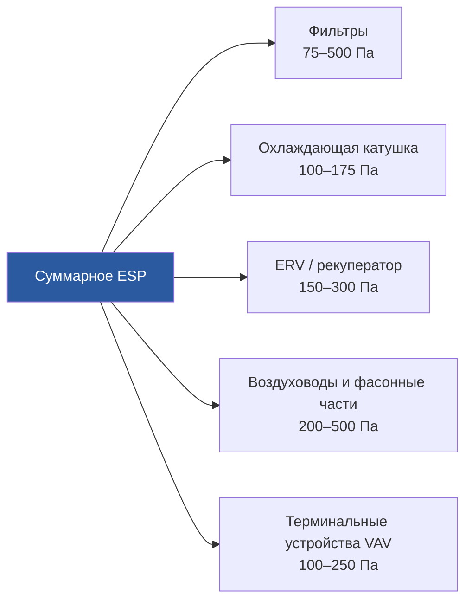

Перепад давления на фильтрах (filter pressure drop) — ключевой параметр проектирования систем ОВК, напрямую определяющий мощность привода вентилятора и стоимость эксплуатации на всём сроке службы системы. Среднестатистический фильтровой узел потребляет 20–40 % совокупной мощности вентиляторной секции приточной установки (AHU) при новых фильтрах; несвоевременная замена и неоптимальный выбор материала переводят эту долю на уровень 60–80 %. Таким образом, правильный расчёт, подбор и мониторинг перепада давления на фильтрах имеют прямое экономическое и энергетическое значение в течение всего жизненного цикла системы.

## Физика перепада давления

### Чистый фильтр: уравнение Дэвиса

Для однородного волокнистого фильтрующего материала перепад давления при ламинарном режиме обтекания волокон (что характерно для стандартных условий HVAC) описывается уравнением Дэвиса (Davies equation):


\Delta P = \frac{64\,\alpha^{1{,}5}(1 + 56\,\alpha^3)\,\mu\,U\,t}{d_f^2}


где:
- $\alpha$ — плотность упаковки волокон (solidity, безразмерная; типичные значения 0,03–0,15);
- $\mu$ — динамическая вязкость воздуха ($1{,}81 \times 10^{-5}$ Па·с при 20 °C и 101,325 кПа);
- $U$ — скорость воздуха на лицевой поверхности фильтра (face velocity, м/с);
- $t$ — толщина фильтрующего материала (м);
- $d_f$ — диаметр волокна (м).

Уравнение справедливо при числе Рейнольдса для волокна $Re_f = \rho\,U\,d_f / \mu \ll 1$, что выполняется при $d_f < 10$ мкм и $U < 3$ м/с. При значениях $Re_f > 0{,}5$ (крупные волокна, высокие скорости) вводится квадратичная поправка на инерционное сопротивление.

Из уравнения следует, что перепад давления пропорционален скорости потока, толщине материала и обратно пропорционален квадрату диаметра волокна. Уменьшение $d_f$ вдвое при том же $\alpha$ и $t$ увеличивает сопротивление в четыре раза — именно поэтому нановолоконные покрытия с диаметром волокна 100–500 нм требуют ультратонкого слоя.

### Зависимость от скорости потока

В практическом диапазоне скоростей (1–3 м/с) перепад давления подчиняется квазилинейной зависимости:


\Delta P = K_1\,U + K_2\,U^2


Линейный член (вязкостное сопротивление, $K_1$) доминирует при типичных скоростях HVAC. Квадратичный член (инерционное сопротивление, $K_2$) становится значимым при $U > 3$ м/с или при значительном накоплении пыли на поверхности материала.

**Числовой пример.** Плиссированный фильтр MERV 13 с характеристиками материала $K_1 = 60\,\text{Па·с/м}$ и $K_2 = 8\,\text{Па·с}^2/\text{м}^2$:

При лицевой скорости $U_1 = 2{,}0$ м/с:


\Delta P_1 = 60 \times 2{,}0 + 8 \times 4{,}0 = 120 + 32 = 152\,\text{Па}


При снижении скорости до $U_2 = 1{,}5$ м/с (увеличение площади фильтровой секции на 33 %):


\Delta P_2 = 60 \times 1{,}5 + 8 \times 2{,}25 = 90 + 18 = 108\,\text{Па}


Снижение лицевой скорости на 25 % даёт уменьшение начального сопротивления на 29 % — непропорциональный выигрыш, обусловленный доминированием линейного вязкостного члена.

## Поведение при накоплении пыли

### Поверхностная нагрузка (Surface Loading)

Панельные и неглубокие плиссированные фильтры накапливают пыль преимущественно на наружной поверхности материала, формируя пылевой кек (dust cake). Перепад давления нарастает практически линейно с накопленной массой:


\Delta P(t) = \Delta P_0 + K_d\,m_d


где $\Delta P_0$ — начальное сопротивление чистого фильтра (Па), $K_d$ — удельное сопротивление пылевого кека (Па·м²/кг), $m_d$ — осаждённая масса пыли на единицу площади (кг/м²). Важно: пылевой кек сам действует как дополнительный фильтрующий слой, поэтому поверхностная нагрузка сопровождается нарастанием эффективности фильтра одновременно с ростом сопротивления.

### Глубинная нагрузка (Depth Loading)

Карманные (bag filters) и HEPA-фильтры захватывают пыль по всей толщине материала. Нарастание сопротивления при глубинной нагрузке носит экспоненциальный характер:


\Delta P(t) = \Delta P_0\,\exp(\beta\,m_d)


где $\beta$ — эмпирический коэффициент, зависящий от дисперсности пыли и структуры волокна. На начальном этапе сопротивление нарастает медленно; при закупорке пор характер кривой меняется и начинается лавинообразный рост давления — эта точка является сигналом к замене фильтра.

### Сравнение типов фильтров по нагрузочным характеристикам


| Тип фильтра | Начальное ΔP, Па | Предельное ΔP, Па | Режим нагрузки |
|---|---|---|---|
| Панельный (MERV 4) | 25–50 | 125–200 | Поверхностный кек |
| Плиссированный MERV 8 | 50–100 | 250–375 | Комбинированный |
| Плиссированный MERV 13 | 100–175 | 300–500 | Преимущественно глубинный |
| Карманный MERV 14 | 100–150 | 300–450 | Глубинный |
| HEPA H13/H14 | 250–375 | 500–750 | Глубинный |


## Влияние на потребление энергии вентилятора

Мощность, потребляемая вентилятором при преодолении сопротивления фильтра:


\dot{W}_{\text{вент}} = \frac{\dot{V}\,\Delta P}{\eta_{\text{вент}}\,\eta_{\text{мот}}}


где $\dot{V}$ — объёмный расход воздуха (м³/с), $\eta_{\text{вент}}$ — аэродинамический КПД вентилятора, $\eta_{\text{мот}}$ — КПД электродвигателя.

**Числовой пример — годовые затраты и окупаемость.** Приточная установка: $\dot{V} = 4{,}72$ м³/с; среднее $\Delta P = 200$ Па (при $\Delta P_{\text{нач}} = 130$ Па и $\Delta P_{\text{предел}} = 280$ Па, замена раз в 6 месяцев); $\eta_{\text{вент}} = 0{,}70$; $\eta_{\text{мот}} = 0{,}93$; 3 000 ч/год; тариф 0,12 $/кВт·ч:


\dot{W} = \frac{4{,}72 \times 200}{0{,}70 \times 0{,}93} = \frac{944}{0{,}651} = 1{,}450\,\text{кВт}



C_{\text{год}} = 1{,}450 \times 3\,000 \times 0{,}12 = 522\,\text{\$/год}


Замена на материал с улучшенным FOM, обеспечивающим среднее $\Delta P_{\text{новый}} = 130$ Па при той же эффективности MERV 13:


\dot{W}_{\text{новый}} = \frac{4{,}72 \times 130}{0{,}651} = 942\,\text{Вт}; \quad \Delta C = (1{,}450 - 0{,}942) \times 3\,000 \times 0{,}12 = 183\,\text{\$/год}


При стоимости замены улучшенных фильтров на 90 $ дороже стандартных за комплект (2 замены в год = 180 $/год), срок окупаемости составляет менее одного года. При этом сокращение нагрузки на вентилятор дополнительно продлевает ресурс подшипников.

## Стратегии оптимизации

### Увеличение площади фильтровой секции

Снижение лицевой скорости даёт непропорциональное уменьшение сопротивления из-за доминирования вязкостного члена:


\frac{\Delta P_2}{\Delta P_1} \approx \left(\frac{U_2}{U_1}\right)^{1{,}8}


Удвоение площади фильтровой секции (снижение скорости вдвое) сокращает начальное сопротивление примерно на 72 % и пропорционально снижает скорость накопления пыли — срок службы фильтра при этом возрастает примерно вдвое. Первоначальные капиталовложения в увеличенный корпус AHU, как правило, окупаются за 2–4 года за счёт экономии на энергозатратах и затратах на замену фильтров.

### Двухступенчатая фильтрация

Предфильтр MERV 8 задерживает крупные частицы и существенно продлевает ресурс дорогостоящего финального фильтра MERV 14–16:

- Предфильтр MERV 8: начальное $\Delta P = 50$ Па; замена каждые 3 месяца; стоимость ~15 $/шт.
- Финальный MERV 14: начальное $\Delta P = 150$ Па; замена раз в 12–18 месяцев; стоимость ~70 $/шт.
- Суммарное начальное сопротивление: 200 Па — сопоставимо с одиночным MERV 14, однако срок службы финального фильтра возрастает в 3–4 раза.

### Низкоомные фильтрующие материалы

Современные технологии позволяют снизить перепад давления без потери механической эффективности:

- синтетические полиолефиновые волокна вместо стекловолокна: на 20–30 % ниже $\Delta P$ при том же MERV;
- нановолоконные покрытия (nanofiber coatings) с диаметром волокна 100–500 нм поверх несущей основы;
- структуры с градуированной плотностью (graded-density media): крупные волокна на входе задерживают крупную пыль, тонкие волокна на выходе обеспечивают эффективность при малом сопротивлении;
- оптимизированная геометрия гофр в плиссированных фильтрах — трапециевидное поперечное сечение вместо прямоугольного, увеличенный шаг складок.

## Мониторинг и критерии замены

### Средства измерения

**Дифференциальный манометр Magnehelic**: механический индикатор перепада давления на мембранном чувствительном элементе. Диапазон: 0–500 Па; точность ±2 % от верхнего предела шкалы. Применяется для местного визуального контроля без интеграции в систему автоматики.

**Электронный преобразователь давления**: выходной сигнал 4–20 мА или цифровой интерфейс BACnet/Modbus. Интеграция с системой автоматизации здания (building automation system, BAS) обеспечивает архив трендов, расчёт производной (скорость нарастания сопротивления) и предиктивное техническое обслуживание. Такой подход позволяет заменять фильтры строго по техническому состоянию, а не по фиксированному календарному интервалу.

### Критерии замены по перепаду давления


| Тип фильтра | Начальное ΔP | Предельное ΔP | Кратность |
|---|---|---|---|
| Низкой эффективности (MERV 1–7) | 25–50 Па | 125–200 Па | 2,5–5× |
| Средней эффективности (MERV 8–12) | 75–125 Па | 250–375 Па | 2–3× |
| Высокой эффективности (MERV 13–16) | 125–175 Па | 375–500 Па | 2–3× |
| HEPA H13/H14 | 250–375 Па | 500–750 Па | 1,5–2× |


## Проектные соображения

### Выбор расчётной точки вентилятора

При выборе вентилятора необходимо учитывать изменение сопротивления фильтра в течение всего срока его службы. Рекомендуемый подход — расчёт по точке середины жизненного цикла (mid-life design point):


\Delta P_{\text{расч}} = \Delta P_{\text{чист}} + \frac{\Delta P_{\text{предел}} - \Delta P_{\text{чист}}}{2}


Это обеспечивает работу вентилятора вблизи зоны максимального КПД на протяжении большей части срока службы фильтра, избегая как недогрузки при новых фильтрах, так и перегрузки при фильтрах, исчерпавших ресурс.

### Системы с переменным расходом воздуха (VAV)

При снижении расхода в системе VAV перепад давления на фильтрах падает непропорционально:


\Delta P_{\text{частич}} = \Delta P_{\text{расч}} \times \left(\frac{\dot{V}_{\text{частич}}}{\dot{V}_{\text{расч}}}\right)^{1{,}8}


Важное предостережение: снижение лицевой скорости ниже 1,0 м/с может нарушить баланс механизмов захвата в электретных материалах — диффузионный механизм при очень малых скоростях не компенсирует ослабление импакционного. Для систем VAV с глубоким дросселированием (менее 40 % от расчётного расхода) предпочтительны фильтры с преимущественно механической (а не электростатической) эффективностью.

### Суммарное аэродинамическое сопротивление системы

Перепад давления на фильтрах является одной из нескольких составляющих статического давления, которое должен развивать вентилятор:


\Delta P_{\text{полн}} = \Delta P_{\text{фильтр}} + \Delta P_{\text{змеевик}} + \Delta P_{\text{рекуп}} + \Delta P_{\text{воздухов}} + \Delta P_{\text{терминал}}


В системах с рекуператором энергии (ERV) суммарное сопротивление возрастает на 150–300 Па, поэтому снижение сопротивления фильтрующей секции приобретает особую значимость для итогового КПД системы. Комплексный анализ всех составляющих является обязательным шагом при выборе класса вентилятора и при технико-экономическом обосновании применения высококачественных низкоомных фильтрующих материалов.





*Ссылки: ASHRAE Handbook HVAC Systems and Equipment гл. 29, ASHRAE 52.2-2017, SMACNA HVAC Systems Duct Design, EN 1822-2019, СП 60.13330.2020.*
