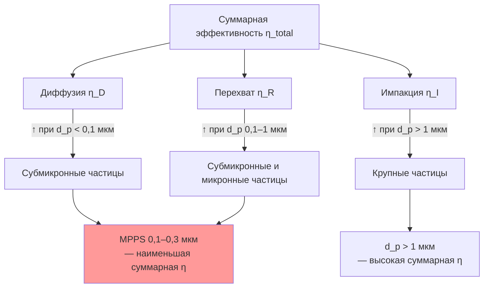

Фильтрация частиц — удаление твёрдых и жидких аэрозолей из воздушного потока — решает двойную задачу: защиту здоровья людей от вдыхания PM2,5 и PM10 и защиту теплообменного оборудования от загрязнения и деградации теплопередачи. Количественное понимание механизмов захвата частиц необходимо как для обоснованного выбора фильтров, так и для правильной интерпретации стандартных рейтингов эффективности.

## Характеристики взвешенных частиц

### Распределение по размерам и биологическое значение

Воздух внутри и снаружи помещений содержит частицы, охватывающие диапазон более четырёх порядков размеров:


| Диапазон размеров | Примеры | Осаждение в дыхательных путях |
|---|---|---|
| < 0,1 мкм (ультрамелкие) | Ядра горения, нуклеационные частицы | Альвеолы; часть проникает в кровоток и лимфатическую систему |
| 0,1–1 мкм | Бактерии, вирусные агрегаты, частицы дыма и смога | Альвеолярный отдел (PM1) |
| 1–10 мкм | Пыльца растений, грибковые споры, частицы пыли | Трахея, бронхи (PM2,5, PM10) |
| > 10 мкм | Фрагменты растений, строительная пыль, волокна | Носовые проходы; захватываются мерцательным эпителием |


Частицы PM2,5 (аэродинамический диаметр ≤ 2,5 мкм) признаны ВОЗ наиболее опасными: они достигают альвеол, откуда возможно системное проникновение с развитием воспалительных реакций, сердечно-сосудистой патологии и злокачественных новообразований при длительном воздействии. Целевой показатель IAQ по ВОЗ (2021): PM2,5 ≤ 15 мкг/м³ (24-часовое среднее).

### Внутренние источники частиц

- деятельность людей: слущивание клеток кожи (desquamation), волокна одежды, аэрозоли при движении;
- приготовление пищи: частицы горения и жировые аэрозоли 0,1–1 мкм;
- принтеры и лазерные устройства: частицы тонера 0,1–0,3 мкм;
- компоненты систем ОВК: волокна изоляции, пыль из загрязнённых воздуховодов, биопленки.

## Механизмы захвата частиц волокнами

### Перехват (Interception)

Частица движется вблизи волокна по линии тока; когда центр частицы приближается к поверхности волокна на расстояние, меньшее радиуса частицы $R = d_p/2$, она касается волокна и удерживается ван-дер-ваальсовыми силами. Параметр перехвата:


R_f = \frac{d_p}{d_f}


Упрощённая зависимость эффективности перехвата от $R_f$:


\eta_R \propto R_f^2 = \left(\frac{d_p}{d_f}\right)^2


Уменьшение диаметра волокна вдвое при неизменном размере частицы учетверяет вклад перехвата. Механизм перехвата доминирует в диапазоне 0,1–1,0 мкм при умеренных скоростях потока.

### Инерционная импакция (Inertial Impaction)

Крупные частицы обладают достаточной инерцией, чтобы не следовать за искривлёнными линиями тока при огибании волокна, и ударяются о его поверхность. Определяющий параметр — число Стокса (Stokes number):


Stk = \frac{\rho_p\,d_p^2\,U\,C_c}{18\,\mu\,d_f}


где $C_c$ — поправочный коэффициент Каннингема (Cunningham slip correction factor), учитывающий скольжение газа при $d_p < 1$ мкм:


C_c = 1 + \frac{2\lambda}{d_p}\!\left(1{,}257 + 0{,}4\,e^{-1{,}1 d_p / (2\lambda)}\right)


где $\lambda \approx 66$ нм — длина свободного пробега молекул воздуха при 20 °C и 101,325 кПа. При $Stk > 0{,}2$ импакция становится основным механизмом; для частиц 1–2 мкм при $U = 2$ м/с число Стокса обычно превышает это пороговое значение. Эффективность импакции:


\eta_I \propto Stk^2


### Броуновская диффузия (Brownian Diffusion)

Субмикронные частицы (< 0,1 мкм) испытывают хаотичные тепловые перемещения под воздействием молекулярного удара газа. Коэффициент диффузии по уравнению Эйнштейна–Стокса:


D = \frac{k_B\,T\,C_c}{3\pi\,\mu\,d_p}


Для частицы $d_p = 0{,}01$ мкм при $T = 293$ К: $D \approx 5{,}3 \times 10^{-8}$ м²/с — на три порядка выше, чем у частицы 1 мкм. Эффективность захвата за счёт диффузии определяется числом Пекле:


\eta_D \propto Pe^{-2/3}, \quad Pe = \frac{U\,d_f}{D}


Эффективность диффузии возрастает при уменьшении скорости потока и размера частицы. При снижении $U$ вдвое, $\eta_D$ возрастает в $2^{2/3} \approx 1{,}59$ раза.

### Электростатические эффекты

**Кулоновская сила** (Coulomb force) действует, когда частица и волокно несут заряды противоположных знаков:


F_c = \frac{q_p\,q_f}{4\pi\varepsilon_0\,r^2}


**Сила изображения** (image force) обеспечивает притяжение заряженной частицы к нейтральному диэлектрическому волокну за счёт наведения зеркального заряда:


F_i = \frac{q_p^2}{16\pi\varepsilon_0\,r^2} \cdot \frac{\varepsilon_f - 1}{\varepsilon_f + 1}


где $\varepsilon_f$ — относительная диэлектрическая проницаемость волокна, $r$ — расстояние от центра частицы до поверхности волокна. Электретные фильтры используют постоянно заряженные полимерные волокна (PTFE, полипропилен) для повышения эффективности без увеличения сопротивления. Заряд нейтрализуется при воздействии масляных аэрозолей и при кондиционировании изопропиловым спиртом по методу ISO 16890.

### Гравитационное осаждение (Gravitational Settling)

Для частиц > 10 мкм при малых скоростях потока (< 0,3 м/с) гравитационная составляющая заметна. Скорость седиментации по закону Стокса:


v_s = \frac{\rho_p\,d_p^2\,g\,C_c}{18\,\mu}


В типичных фильтровых секциях ОВК (скорость 1,5–3,0 м/с) гравитационным осаждением пренебрегают.

## Размер частицы с максимальной проникающей способностью (MPPS)

Суперпозиция всех механизмов порождает минимум суммарной эффективности. Диффузия снижается с ростом размера частицы; импакция и перехват снижаются с уменьшением размера. Точка минимума — MPPS (most penetrating particle size) — лежит в диапазоне 0,1–0,3 мкм:





Положение MPPS определяется условиями потока:


MPPS \propto \left(\frac{d_f\,\mu}{U\,\rho_p}\right)^{0{,}5}


При увеличении скорости потока MPPS смещается в сторону меньших размеров, так как диффузия ослабевает быстрее импакции. Стандарты HEPA используют 0,3 мкм (IEST-RP-CC001) или MPPS конкретного материала (EN 1822) как наихудший случай для квалификационных испытаний.

## Эффективность одиночного волокна и фильтрующего слоя

### Суммарная эффективность волокна

Строгое выражение для независимых механизмов:


\eta_{\text{волокно}} = 1 - (1-\eta_D)(1-\eta_R)(1-\eta_I)(1-\eta_E)


При малых значениях каждого слагаемого:


\eta_{\text{волокно}} \approx \eta_D + \eta_R + \eta_I + \eta_E


### Эффективность фильтрующего слоя конечной толщины


\eta_{\text{фильтр}} = 1 - \exp\!\left(\frac{-4\,\alpha\,\eta_{\text{волокно}}\,t}{\pi\,d_f\,(1-\alpha)}\right)


где $\alpha$ — плотность упаковки (solidity), $t$ — толщина материала (м).

**Числовой пример 1.** Материал HEPA: $d_f = 2$ мкм, $\alpha = 0{,}06$, $t = 5$ мм, $\eta_{\text{волокно}} = 0{,}20$ при MPPS:


\eta_{\text{фильтр}} = 1 - \exp\!\left(\frac{-4 \times 0{,}06 \times 0{,}20 \times 0{,}005}{\pi \times 2 \times 10^{-6} \times 0{,}94}\right) = 1 - \exp(-40{,}6) \approx 100\,\%


**Числовой пример 2.** Грубый материал для панельного фильтра: $d_f = 10$ мкм, $\alpha = 0{,}04$, $t = 2$ мм, $\eta_{\text{волокно}} = 0{,}10$:


\eta_{\text{фильтр}} = 1 - \exp\!\left(\frac{-4 \times 0{,}04 \times 0{,}10 \times 0{,}002}{\pi \times 10 \times 10^{-6} \times 0{,}96}\right) = 1 - \exp(-1{,}06) \approx 65\,\%


Разница в эффективности при том же принципе действия обусловлена на порядок меньшим диаметром волокна и большей толщиной материала в HEPA.

## Нагрузочные характеристики фильтра

### Стадии нагрузки

1. **Чистый фильтр**: частицы осаждаются преимущественно непосредственно на поверхности волокон; эффективность соответствует начальной.
2. **Переходная стадия (dendritic growth)**: на волокнах формируются дендритные пылевые структуры, увеличивающие реальную площадь захвата и повышающие эффективность.
3. **Стадия пылевого кека (cake formation)**: поверхностное накопление доминирует; эффективность продолжает нарастать, сопротивление нарастает быстрее.

### Изменение эффективности при нагрузке

Большинство механических фильтров с накоплением пыли повышают эффективность:


\eta(t) = 1 - (1-\eta_0)\,\exp(-k\,m_d)


где $k$ — эмпирический коэффициент нагрузочного усиления, $m_d$ — накопленная масса пыли (кг/м²). Электретные фильтры могут деградировать: нейтрализация заряда масляными аэрозолями или высокими нагрузками тонкодисперсной пыли снижает электростатическое усиление до уровня механической эффективности незаряженного материала.

### Нарастание перепада давления при нагрузке

Поверхностная нагрузка (панельные и плоские фильтры):


\Delta P(t) = \Delta P_0 + K_d\,m_d


Глубинная нагрузка (карманные, HEPA):


\Delta P(t) = \Delta P_0\,\exp(\beta\,m_d)


## Нормативные требования по объекту


| Тип объекта | Целевые частицы | Рекомендуемый класс | Нормативный документ |
|---|---|---|---|
| Жилые здания | Пыль, пыльца, PM10 | MERV 8–11 | — |
| Коммерческие здания | PM2,5, биоаэрозоли | MERV 11–14 | ASHRAE 62.1 |
| Медицинские учреждения | Бактерии, грибковые споры | MERV 14–16 + HEPA | ASHRAE 170 |
| Чистые комнаты ISO класс 5–6 | Субмикронные частицы | HEPA H13/H14 | ISO 14644-1 |
| Чистые комнаты ISO класс 3–4 | Ультрамелкие частицы | ULPA U15–U16 | ISO 14644-1 |


## Полевое тестирование установленных фильтров

### Испытание аэрозольной фотометрией (HEPA)

По стандарту IEST-RP-CC034 выполняется сканирующее испытание лицевой поверхности HEPA-фильтра аэрозольным фотометром при введении тестового аэрозоля PAO (polyalphaolefin) или DOP на стороне потока до фильтра:


\mathrm{Penetration} = \frac{C_{\text{вых}}}{C_{\text{вх}}} \times 100\,\%


Параметры испытания: концентрация аэрозоля 20–80 мкг/л; скорость сканирования не более 0,93 м²/мин; расстояние зонда от поверхности 25 мм. Критерии приёмки: локальная проникающая способность < 0,05 % (H13) и < 0,01 % (H14). Выявленные протечки устраняются герметиком с последующей повторной проверкой.

### Счётчики частиц

Оптический счётчик частиц (optical particle counter, OPC) или конденсационный счётчик (condensation particle counter, CPC) измеряет концентрацию по размерным фракциям одновременно до и после фильтра. Фракционная эффективность:


\eta(d_p) = 1 - \frac{C_{\text{вых}}(d_p)}{C_{\text{вх}}(d_p)}


Для систем непрерывного мониторинга в чистых комнатах (ISO 14644-2) отклонение концентрации в обслуживаемой зоне от базовой линии на заданную величину автоматически инициирует внеплановый осмотр фильтра и проверку на герметичность.

*Ссылки: ASHRAE Handbook HVAC Systems and Equipment гл. 29, ASHRAE 52.2-2017, ISO 16890-2016, EN 1822-2019, IEST-RP-CC034.4, ISO 14644-1:2015, ASHRAE 170-2021, СП 60.13330.2020.*
