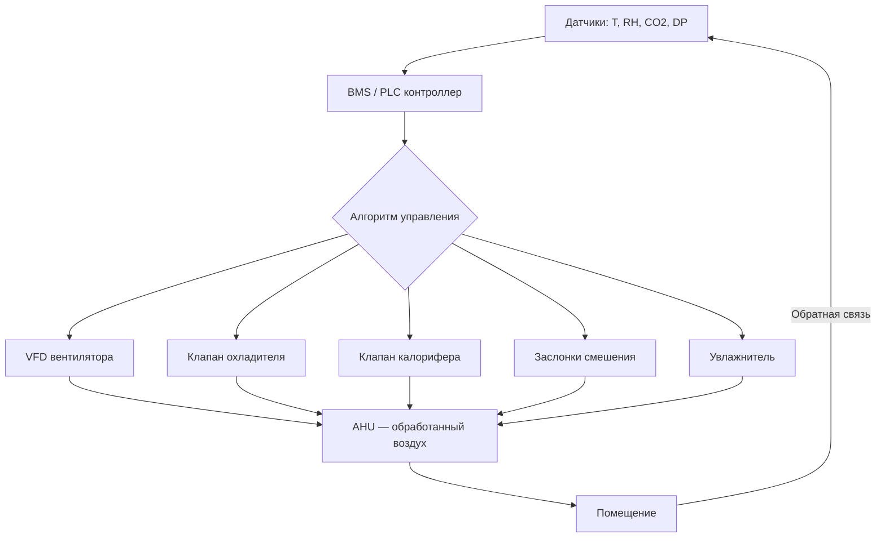

Система управления приточно-вытяжной установкой (AHU, air handling unit) — комплекс автоматических алгоритмов и исполнительных механизмов, поддерживающих заданный микроклимат при минимальном энергопотреблении. Контроллер координирует калорифер, охладитель, увлажнитель, вентиляторы и заслонки смешения, обеспечивая соответствие ASHRAE 62.1, ASHRAE 90.1, EN 13779 и СП 60.13330.2020. На долю ОВК приходится 40–50 % суммарного энергопотребления здания, поэтому качество управления AHU напрямую влияет на годовые эксплуатационные затраты.

## Физические законы, положенные в основу управления

**Тепловой баланс:**


$$Q = \dot{m} \cdot c_p \cdot (T_{\text{вых}} - T_{\text{вх}})$$


где $Q$ — теплопроизводительность, кВт; $\dot{m}$ — расход воздуха, кг/с; $c_p \approx 1{,}005$ кДж/(кг·К); $T_{\text{вых}}, T_{\text{вх}}$ — температуры на выходе и входе, °C.

**Влагосодержание воздуха:**


$$d = 621{,}99 \cdot \frac{\varphi \cdot P_{\text{нас}}}{P_{\text{атм}} - \varphi \cdot P_{\text{нас}}}$$


где $d$ — абсолютная влажность, г/кг с.в.; $\varphi$ — относительная влажность; $P_{\text{нас}}$ — давление насыщения пара; $P_{\text{атм}}$ — атмосферное давление.

**Уравнение для управления статическим давлением (Бернулли):**


$$\Delta P = \rho g h + \frac{1}{2}\rho v^2$$


где $\rho \approx 1{,}2$ кг/м³, $v$ — скорость воздуха, м/с.

## Управление температурой

### Температура приточного воздуха (supply air temperature)

Датчик температуры на выходе AHU (RTD Pt100 или NTC-термистор) передаёт сигнал в контроллер, который модулирует трёхходовой клапан калорифера или охладителя через PID-алгоритм. Типовая полоса пропорциональности 2–5 °C, интегральное время 60–300 с, дифференциальное время 10–60 с. Погрешность стабилизации: ±0,5–1 °C.

Заданное значение: $T_{\text{зад}} = 18$–25 °C в зависимости от режима и сезона.

### Температура смешанного воздуха (mixed air)

Смешение наружного воздуха с рециркуляционным описывается:


$$T_{\text{смес}} = \frac{\dot{V}_{\text{нар}} \cdot T_{\text{нар}} + \dot{V}_{\text{рец}} \cdot T_{\text{рец}}}{\dot{V}_{\text{нар}} + \dot{V}_{\text{рец}}}$$


При $T_{\text{нар}} < 0$ °C контроллер прикрывает заслонку наружного воздуха до минимально допустимого уровня для защиты от замерзания калорифера и для экономии тепла.

## Управление статическим давлением

### Давление в сети приточного воздуха

Датчик статического давления в магистральном воздуховоде поддерживает заданное значение 200–400 Па путём модуляции скорости вентилятора через преобразователь частоты (VFD, variable frequency drive). Мощность вентилятора пропорциональна кубу частоты вращения:


$$P \propto n^3$$


Снижение частоты вращения $n$ на 20 % уменьшает потребляемую мощность примерно на 49 %, что является основным аргументом применения VFD на всех крупных AHU согласно требованиям ASHRAE 90.1.

**Пример (SI).** AHU с расходом 15 000 м³/ч при полной нагрузке потребляет 11 кВт. При снижении нагрузки до 70 % расхода мощность составит: $11 \times 0{,}70^3 \approx 3{,}8$ кВт — экономия 65 %.

### Давление в здании (building pressure)

Дифференциальный датчик между внутренней и наружной средой удерживает разрежение 5–15 Па. При избыточном давлении > 10 Па система сокращает подачу, при разрежении — увеличивает, предотвращая неконтролируемую инфильтрацию наружного воздуха.

## Управление влажностью

Нормируемый диапазон по ASHRAE 62.1 и СП 60.13330: 30–60 % относительной влажности (RH).

- **Увлажнение:** электродный или паровой увлажнитель включается при $\varphi < 30$ %;
- **Осушение:** охлаждение ниже точки росы с последующим подогревом до заданной температуры («деhumidification reheat»).

Типовая последовательность обработки воздуха в летний период: охлаждение → конденсация влаги → подогрев до заданной температуры приточного воздуха.

## Управление концентрацией CO₂ и вентиляция по требованию (DCV)

Датчик CO₂ (NDIR, диапазон 0–2000 ppm) интегрируется в BMS (building management system). При превышении порога 800–1000 ppm система увеличивает долю наружного воздуха:


$$\dot{V}_{\text{нар}} = \dot{V}_{\text{мин}} + k \cdot (C_{\text{CO}_2} - C_{\text{ref}})$$


где $k$ — коэффициент усиления; $C_{\text{ref}} = 400$–500 ppm (концентрация наружного воздуха).

Вентиляция по требованию (DCV, demand controlled ventilation) сокращает энергозатраты на вентиляцию на 20–30 % по сравнению с постоянным расчётным расходом, адаптируя подачу к фактической занятости помещений. В системах VAV (variable air volume) каждая зона управляется независимым контроллером.

## Экономайзерный режим (economizer)

В переходные периоды при благоприятных параметрах наружного воздуха система максимально открывает заслонку, отключая холодильную машину и охладитель. Условие включения: $10 °C < T_{\text{нар}} < 24 °C$, $\varphi_{\text{нар}} < 60$ %. Потенциальная экономия: 30–40 % затрат на охлаждение при умеренном климате.

## Минимальный расход наружного воздуха

Минимальный расход наружного воздуха по ASHRAE 62.1:

- по числу людей: 3–5 л/(с·чел);
- по площади: 0,3–0,5 л/(с·м²).

Заслонка наружного воздуха не закрывается ниже положения, соответствующего этому минимуму, что обеспечивается механическим ограничителем хода или программной логикой контроллера.

## Методы регулирования


| Метод | Исполнительный орган | Точность | Применение |
|-------|---------------------|----------|------------|
| On-Off | Двухпозиционный клапан | ±3–5 °C | Простые системы |
| Пропорциональный | Трёхходовой клапан 0–100 % | ±1–2 °C | Типовые AHU |
| PID | Сервопривод + VFD | ±0,5 °C | Ответственные объекты |
| Каскадный | Вложенные контуры PID | ±0,3 °C | Чистые помещения, больницы |


## Интеграция с BMS

Система управления AHU передаёт в BMS значения: температуры приточного, вытяжного и наружного воздуха; влажности; концентрации CO₂; статического давления в воздуховодах; расходов воздуха; энергопотребления вентиляторов. BMS формирует тренды, архивирует отказы и координирует работу нескольких AHU в составе системы централизованного управления здания.

## Стандарты и нормативная база

- **ASHRAE 62.1** — нормы качества воздуха в помещениях; требование минимум 25 м³/ч на человека;
- **ASHRAE 90.1** — энергетическая эффективность зданий; требования к управлению AHU и применению VFD;
- **EN 13779** — классификация систем вентиляции, классы качества воздуха IDA 1–4;
- **ГОСТ Р 51251-99** — фильтры воздуха для общей вентиляции;
- **СП 60.13330.2020** — системы отопления, вентиляции и кондиционирования.

## Практические рекомендации по эксплуатации

1. **Калибровка датчиков:** ежегодная поверка датчиков температуры (допуск ±0,5 °C) и CO₂ (допуск ±30 ppm).

2. **Настройка PID:** пропорциональная полоса 2–5 °C, интегральное время 60–300 с, дифференциальное время 10–60 с; настройку выполнять методом Циглера–Николса или по данным производителя.

3. **Минимальная доля наружного воздуха:** в экономайзерном режиме нельзя снижать ниже 20–25 % от номинального расхода без обеспечения фильтрации не ниже класса F7 (EN 13779).

4. **Контроль перепада давления на фильтрах:** при превышении проектного значения на 50 % — замена фильтрующих элементов.

5. **Логирование и диагностика:** BMS должна хранить архив параметров не менее 12 месяцев для анализа сезонных паттернов и выявления дрейфа оборудования.
