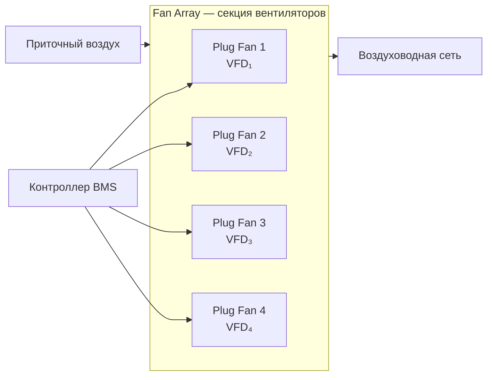

Вентилятор — ключевой силовой элемент приточно-вытяжной установки (AHU, air handling unit), обеспечивающий транспортировку воздуха через теплообменники, фильтры и сеть воздуховодов. Выбор типа вентилятора определяет надёжность системы, уровень акустического комфорта и годовые затраты на электроэнергию. Требования ASHRAE 90.1 и СП 60.13330.2020 устанавливают минимально допустимый КПД вентиляторов для коммерческих зданий.

## Основы аэродинамики вентиляторов

Рабочая точка вентилятора — пересечение характеристики вентилятора (зависимость давления от расхода) с характеристикой сопротивления системы:


$$\Delta P_{\text{сист}} = R \cdot \dot{V}^2$$


где $R$ — гидравлическое сопротивление сети, Па·с²/м⁶; $\dot{V}$ — расход, м³/с.

Электрическая мощность вентилятора:


$$P_{\text{эл}} = \frac{\dot{V} \cdot \Delta P}{\eta_{\text{вент}} \cdot \eta_{\text{мот}}}$$


где $\eta_{\text{вент}}$ — КПД вентилятора, $\eta_{\text{мот}}$ — КПД электродвигателя.

## Центробежные вентиляторы с загнутыми вперёд лопатками (forward-curved)

Лопатки изогнуты в направлении вращения ротора. Характеристика давление–расход пологая, что делает вентилятор чувствительным к изменению сопротивления сети — при падении давления расход резко возрастает (риск перегрузки двигателя).


| Параметр | Значение |
|----------|---------|
| Диапазон расходов | 500–15 000 м³/ч |
| Статическое давление | 50–800 Па |
| КПД | 65–75 % |
| Уровень шума | 70–85 дБ(А) |
| Кривая мощности | Нарастающая (риск перегрузки) |


**Область применения:** системы с умеренным сопротивлением сети (до 500 Па), постоянный объём воздуха, ограниченный бюджет. Обязательно применение VFD для стабилизации расхода при переменной нагрузке.

## Центробежные вентиляторы с загнутыми назад лопатками (backward-curved, BC)

Лопатки отклонены против направления вращения. Самоограничивающаяся характеристика мощности исключает риск перегрузки двигателя при снижении сопротивления сети.


| Параметр | Значение |
|----------|---------|
| Диапазон расходов | 300–20 000 м³/ч |
| Статическое давление | 100–2 000 Па |
| КПД | 78–85 % |
| Уровень шума | 65–80 дБ(А) |
| Кривая мощности | Самоограничивающаяся |


Рекомендуется по умолчанию для систем с переменным объёмом воздуха (VAV) и высокими требованиями к энергоэффективности согласно ASHRAE 90.1.

## Центробежные вентиляторы с аэродинамическим профилем лопаток (airfoil, AF)

Профиль лопаток повторяет аэродинамику крыла самолёта, обеспечивая минимальный отрыв потока и максимальный КПД.


| Параметр | Значение |
|----------|---------|
| Диапазон расходов | 200–18 000 м³/ч |
| Статическое давление | 150–2 500 Па |
| КПД | 85–88 % |
| Уровень шума | 60–75 дБ(А) |
| Кривая мощности | Самоограничивающаяся |


Наиболее дорогие в изготовлении, однако обеспечивают лучший долгосрочный экономический эффект для установок непрерывного действия (круглосуточная работа, здания классов LEED Gold/Platinum). КПД системы «вентилятор + двигатель + VFD» достигает 78–83 %.

**Пример (SI).** AHU с расходом 5 м³/с и статическим давлением 400 Па:

- Вентилятор AF ($\eta = 0{,}87$), двигатель ($\eta = 0{,}93$):
  $$P_{\text{эл}} = \frac{5 \times 400}{0{,}87 \times 0{,}93} = 2{,}47 \text{ кВт}$$

- Вентилятор FC ($\eta = 0{,}70$), двигатель ($\eta = 0{,}90$):
  $$P_{\text{эл}} = \frac{5 \times 400}{0{,}70 \times 0{,}90} = 3{,}17 \text{ кВт}$$

Разница в потребляемой мощности 0,7 кВт = 6 130 кВт·ч/год при 8 760 ч/год непрерывной работы.

## Осевые вентиляторы (axial)

Перемещают воздух вдоль оси вращения. В составе AHU применяются ограниченно из-за низкого создаваемого давления.


| Параметр | Значение |
|----------|---------|
| Диапазон расходов | 500–50 000 м³/ч |
| Статическое давление | 20–200 Па |
| КПД | 70–82 % |
| Уровень шума | 60–75 дБ(А) |


**Применение в ОВК:** конденсаторы воздушного охлаждения, сухие градирни, установки рециркуляции воздуха с малым сопротивлением, вытяжные секции.

## Вентиляторы типа plug fan

Компактный центробежный вентилятор без кожуха (scroll casing), встроенный непосредственно в корпус AHU. Колесо с загнутыми назад или аэродинамическими лопатками вращается в свободном потоке; давление создаётся непосредственно в секции AHU.

Преимущества: нет потерь в кожухе, компактность, возможность установки нескольких вентиляторов в одной секции для обеспечения резервирования. Применяется в системах VAV с диапазоном регулирования 25–100 % номинального расхода.

## Групповые установки вентиляторов (fan array)

Крупные AHU (расход > 30 000 м³/ч) оснащаются несколькими вентиляторами plug fan в одной секции. Каждый вентилятор управляется независимым VFD.

При отказе одного вентилятора система автоматически увеличивает скорость остальных, сохраняя 75–80 % производительности. Равномерность распределения скоростей по сечению секции ±5 %.

## Преобразователи частоты (VFD, variable frequency drive)

Законы подобия вентилятора (affinity laws):


$$\frac{\dot{V}_2}{\dot{V}_1} = \frac{n_2}{n_1}, \quad \frac{\Delta P_2}{\Delta P_1} = \left(\frac{n_2}{n_1}\right)^2, \quad \frac{P_2}{P_1} = \left(\frac{n_2}{n_1}\right)^3$$


где $n$ — частота вращения. Снижение частоты на 20 % даёт экономию мощности ~49 %; снижение на 30 % — ~66 %. Именно кубическая зависимость обосновывает экономическую целесообразность VFD при любом изменении нагрузки более 10–15 % от номинала.

Дополнительный КПД VFD: 95–97 %. Эффективность системы «двигатель + VFD» при частоте 50 Гц сравнима с прямым пуском; при частоте 35–45 Гц — выше за счёт снижения потерь в двигателе.

## Аэродинамическое сопротивление типовых компонентов AHU


| Компонент | Сопротивление, Па |
|-----------|------------------|
| Фильтры ePM2.5 (чистые) | 25–50 |
| Фильтры ePM2.5 (загрязнённые) | 100–200 |
| Водяной теплообменник | 30–100 |
| Хладагентный теплообменник | 50–150 |
| Рекуператор пластинчатый | 20–50 |
| Воздуховодная сеть (100 м) | 100–300 |
| Заслонки и смесительная камера | 15–50 |
| **Суммарное сопротивление AHU** | **300–700** |


## Стандарты и нормативная база

- **ASHRAE 90.1** — требования к минимальному КПД вентиляторов и обязательному применению VFD;
- **ISO 5801:2017** — аэродинамические испытания вентиляторов в нормированных условиях;
- **EN 12599** — испытания и наладка вентиляционных систем;
- **ГОСТ 12.4.021** — системы вентиляции и кондиционирования; требования безопасности;
- **СП 60.13330.2020** — проектирование систем вентиляции и кондиционирования.

## Рекомендации по выбору и эксплуатации


| Параметр | Рекомендуемое значение |
|----------|----------------------|
| КПД вентилятора (рабочая точка) | 80–88 % |
| Скорость в основных воздуховодах | 5–7 м/с |
| Скорость в распределительных ветвях | 3–4 м/с |
| Уровень шума в помещении | ≤ 35 дБ(А) |
| Отклонение от точки максимального КПД | ± 15 % по расходу |
| Рабочий диапазон температур | −10 … +50 °C |


Для большинства коммерческих AHU рекомендуются центробежные вентиляторы с загнутыми назад лопатками или с аэродинамическим профилем, оснащённые VFD. Вентиляторы с загнутыми вперёд лопатками применяются только при ограниченном бюджете и постоянном объёме воздуха. Осевые вентиляторы — исключительно в конденсаторных и вытяжных секциях с малым сопротивлением.
