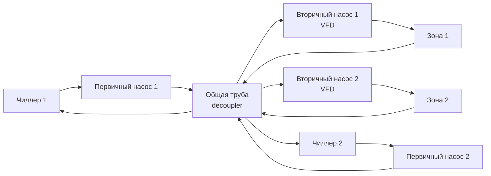

Системы охлаждённой воды (chilled water systems) — основной метод распределения холода в средних и крупных коммерческих, институциональных и промышленных зданиях. Вместо прямой подачи хладагента к концевым устройствам, охлаждённая вода (CHW, chilled water) транспортируется насосами от центральных чиллеров к воздухообрабатывающим установкам (AHU) и фанкойлам. Такая архитектура обеспечивает гибкость зонирования, более высокую энергоэффективность при масштабировании и возможность тонкой оптимизации режимов работы. Настоящая статья охватывает физику системы, конфигурации гидравлических схем, методы подбора насосов, управление давлением, системы свободного охлаждения, тепловое аккумулирование и обработку воды.

## Физические основы теплопередачи

Холодопроизводительность, доставляемая системой охлаждённой воды, определяется уравнением явного теплообмена:


$$\dot{Q} = \dot{m} \cdot c_p \cdot \Delta T = \rho \cdot \dot{V} \cdot c_p \cdot \Delta T$$


где $\dot{Q}$ — холодопроизводительность, кВт; $\dot{m}$ — массовый расход, кг/с; $c_p = 4{,}186$ кДж/(кг·К); $\Delta T$ — разность температур подачи и возврата, К; $\rho = 1000$ кг/м³; $\dot{V}$ — объёмный расход, м³/с.

**Пример (SI).** Расход CHW 5 л/с при $\Delta T = 6$ °C (подача 6 °C, возврат 12 °C):


$$\dot{Q} = 1000 \times 0{,}005 \times 4{,}186 \times 6 = 125{,}6 \text{ кВт}$$


### Выбор расчётного перепада температур (delta-T)

Расчётный $\Delta T$ — ключевой параметр, определяющий расход воды, диаметры трубопроводов и энергопотребление насосов:


| Delta-T | Комментарий |
|---------|-------------|
| 5,6 °C (10 °F) | Классическое проектирование, консервативный подход |
| 6,7–7,8 °C (12–14 °F) | Современная практика, баланс эффективности и стоимости |
| 8,9–11,1 °C (16–20 °F) | Высокий delta-T, требует тщательного подбора концевых устройств |


Расчётный расход при заданной нагрузке:


$$\dot{V} = \frac{\dot{Q}}{\rho \cdot c_p \cdot \Delta T}$$


### Синдром дельта-Т (delta-T syndrome)

Деградация delta-T возникает, когда фактический перепад температур в системе оказывается ниже расчётного, вынуждая насосы перекачивать избыточный объём воды и увеличивая энергопотребление по кубическому закону:


$$P_{\text{нас}} \propto \dot{V}^3$$


Типичные причины: неправильная балансировка концевых устройств, перемерные насосы, сброс температуры подачи чиллером, проектные ошибки трубопроводной сети. Увеличение расхода на 20 % из-за деградации delta-T увеличивает потребляемую мощность насосов в $1{,}2^3 = 1{,}73$ раза (+73 %).

## Конфигурации систем

### Первично-вторичная система (primary-secondary pumping)

Разделяет расход чиллера (первичный контур, постоянный расход) от расхода распределительной сети (вторичный контур, переменный расход) через общую трубу малого сопротивления (decoupler). Чиллеры работают при оптимальном расходе независимо от изменений нагрузки здания.

Температура смешения при превышении вторичного расхода над первичным:


$$T_{\text{подача,смес}} = \frac{\dot{V}_{\text{пер}} \cdot T_{\text{LCHWT}} + (\dot{V}_{\text{втор}} - \dot{V}_{\text{пер}}) \cdot T_{\text{возврат}}}{\dot{V}_{\text{втор}}}$$


Длина общей трубы: 10–20 диаметров, скорость в ней не более 0,6–1,2 м/с для исключения взаимодействия контуров.

### Переменная первичная прокачка (variable primary flow, VPF)

Исключает вторичный контур: первичные насосы с VFD модулируют расход по потребности здания. Упрощает схему, снижает количество насосов и первоначальную стоимость, но требует жёсткой защиты минимального расхода через чиллер.


$$C_v = \frac{\dot{V}_{\text{обх}}}{\sqrt{\dfrac{\Delta P}{\text{SG}}}}$$


где $C_v$ — пропускная способность перепускного клапана; $\Delta P$ — перепад давления, Па; SG — относительная плотность (1,0 для воды).

Клапан обхода открывается, когда системный расход падает ниже минимума чиллера (обычно 30–40 % номинала), предотвращая замерзание испарителя.

## Кривые производительности чиллера и IPLV

Эффективность чиллера оценивается по IPLV (integrated part-load value) согласно AHRI 550/590:


$$\text{IPLV} = 0{,}01A + 0{,}42B + 0{,}45C + 0{,}12D$$


где A, B, C, D — эффективность (кВт/кВт) при нагрузке 100 %, 75 %, 50 % и 25 % соответственно. Весовые коэффициенты отражают типичное распределение нагрузки коммерческого здания в климате США; для российского климата IPLV смещается в сторону 50 % и 25 % нагрузки.

Поправочная кривая центробежного чиллера с VFD:


$$\frac{\text{кВт}}{\text{кВт охл.}} = a + b \cdot PLR + c \cdot PLR^2 + d \cdot PLR^3$$


Типовые коэффициенты: $a=0{,}15$, $b=0{,}20$, $c=0{,}30$, $d=0{,}35$.


| Тип чиллера | Диапазон кВт | Эффективность кВт/кВт | Работа при частичной нагрузке |
|-------------|-------------|----------------------|------------------------------|
| Воздушное охлаждение, винтовой | 525–1750 | 0,85–1,05 | Хорошая |
| Водяное охлаждение, винтовой | 525–2625 | 0,55–0,70 | Отличная |
| Водяное охлаждение, центробежный | 700–35 000+ | 0,45–0,60 | Отличная |
| Магнитные подшипники, центробежный | 525–7000 | 0,40–0,55 | Превосходная |
| Абсорбционный | 350–5250 | 15–20 кг пара/кВт | Хорошая |


Стратегия последовательного включения чиллеров (staging): следующий чиллер вводится в работу, когда его подключение снижает суммарный удельный расход энергии установки (кВт/кВт) в сравнении с текущей конфигурацией — согласно требованию ASHRAE 90.1, раздел 6.5.

## Выбор и расчёт насосов

### Напор насоса

Суммарный расчётный напор:


$$H = H_{\text{трен}} + H_{\text{стат}} + H_{\text{оборуд}} + H_{\text{клап}}$$


Потери трения по уравнению Дарси–Вайсбаха:


$$\Delta P_f = f \cdot \frac{L}{D} \cdot \frac{\rho v^2}{2}$$


Коэффициент трения $f$ по уравнению Колбрука–Уайта (Colebrook-White):


$$\frac{1}{\sqrt{f}} = -2\log_{10}\!\left(\frac{\varepsilon/D}{3{,}7} + \frac{2{,}51}{Re\sqrt{f}}\right)$$


где $\varepsilon = 0{,}046$ мм для стальных труб; $Re = \rho v D / \mu$ — число Рейнольдса.


| Компонент | Потери давления |
|-----------|----------------|
| Испаритель чиллера | 30–60 кПа |
| Змеевик AHU | 24–46 кПа |
| Фанкойл | 15–30 кПа |
| Регулирующий клапан (открыт) | 9–15 кПа |
| Фильтр | 6–15 кПа |
| Пластинчатый теплообменник | 24–46 кПа |


### Мощность насоса и законы подобия

Гидравлическая мощность насоса:


$$P_{\text{гидр}} = \frac{\rho g \dot{V} H}{1000}, \text{ кВт}$$


Полная мощность с учётом КПД:


$$P_{\text{мот}} = \frac{P_{\text{гидр}}}{\eta_{\text{нас}} \cdot \eta_{\text{мот}}}$$


Типовые КПД: насос 70–85 %, двигатель IE3 90–95 %, VFD 95–97 %.

Законы подобия (affinity laws) для насоса с VFD:


$$\frac{\dot{V}_2}{\dot{V}_1} = \frac{N_2}{N_1}, \quad \frac{H_2}{H_1} = \left(\frac{N_2}{N_1}\right)^2, \quad \frac{P_2}{P_1} = \left(\frac{N_2}{N_1}\right)^3$$


Снижение частоты вращения до 75 % от номинала уменьшает потребляемую мощность до $0{,}75^3 = 0{,}42$ от номинала (экономия 58 %).

## Управление перепадом давления

Три стратегии управления скоростью насосов VFD:

1. **Фиксированный перепад давления** — поддерживает постоянный DP в концевой точке сети. Просто, но создаёт избыточное давление при частичной нагрузке.

2. **Сброс уставки DP** — снижает уставку, когда регулирующие клапаны приближаются к 100 % открытия. Экономия энергии насосов 20–40 % по сравнению с фиксированным управлением:


$$\Delta P_{\text{сброс}} = \Delta P_{\text{макс}} - (\Delta P_{\text{макс}} - \Delta P_{\text{мин}}) \cdot \frac{N_{\text{откр}}}{N_{\text{всего}}}$$


3. **Управление по расходу** — прямо регулирует расход на основе суммы запросов концевых устройств (измеренных расходомерами или рассчитанных по положению клапанов).

Орган управления регулирующего клапана (valve authority):


$$\beta = \frac{\Delta P_{\text{клап}}}{\Delta P_{\text{клап}} + \Delta P_{\text{змеев}}} = 0{,}25\text{–}0{,}50$$


При $\beta < 0{,}25$ регулятор теряет устойчивость; при $\beta > 0{,}50$ — избыточные потери давления на клапане.

## Водяной экономайзер (free cooling)

При низкой температуре влажного термометра наружного воздуха градирня обеспечивает «свободное охлаждение» через пластинчатый теплообменник без работы компрессора чиллера.

Условие включения экономайзера:


$$T_{\text{WB}} + \Delta T_{\text{гр}} + \Delta T_{\text{HX}} < T_{\text{CHW,подача}} - 1{,}1 \text{ °C}$$


где $T_{\text{WB}}$ — температура влажного термометра; $\Delta T_{\text{гр}} = 3$–4 °C — подход градирни; $\Delta T_{\text{HX}} = 1$–3 °C — потери на теплообменнике.

Доступная холодопроизводительность:


$$\dot{Q}_{\text{своб}} = \dot{m} \cdot c_p \cdot (T_{\text{возврат}} - T_{\text{подача,цель}})$$


КПД пластинчатого теплообменника:


$$\varepsilon = \frac{T_{\text{CW,вх}} - T_{\text{CW,вых}}}{T_{\text{CW,вх}} - T_{\text{CHW,вх}}} = 0{,}60\text{–}0{,}85$$


Удельная энергия экономайзера (насос + вентилятор градирни): 0,05–0,15 кВт/кВт охлаждения против 0,50–0,70 кВт/кВт для компрессионного режима — прямая экономия.

## Тепловое аккумулирование (TES, thermal energy storage)

Накопленная энергия в резервуаре:


$$E = \rho \cdot V \cdot c_p \cdot \Delta T$$


где $V$ — объём резервуара, м³; $\Delta T$ — рабочий перепад температур между зарядом и разрядом.


| Технология | Рабочая температура | Энергетическая плотность | КПД кругового цикла |
|------------|--------------------|--------------------------|--------------------|
| Охлаждённая вода | 5–10 °C | ~35 кДж/(кг·К) | 90–95 % |
| Лёд (полное накопление) | −10 … −4 °C | ~334 кДж/кг | 85–90 % |
| Лёд (частичное накопление) | −4 … +4 °C | ~210 кДж/кг | 87–92 % |
| PCM — эвтектические соли | 8 °C | ~140 кДж/кг | 88–93 % |


Объём резервуара для полного накопления:


$$V = \frac{\dot{Q}_{\text{пик}} \cdot t_{\text{разряд}}}{\rho \cdot c_p \cdot \Delta T}$$


Стратификация резервуара — число Фруда при входе должно быть < 1:


$$Fr = \frac{v_{\text{вх}}}{\sqrt{g \cdot H \cdot \dfrac{\Delta\rho}{\rho}}} < 1$$


Частичное накопление (load leveling) экономически предпочтительно: уменьшает объём резервуара и мощность чиллеров, сохраняя снижение пиковой нагрузки на электросеть.

## Системы конденсаторной воды и градирни

Тепловая нагрузка на градирню:


$$\dot{Q}_{\text{гр}} = \dot{Q}_{\text{охл}} \cdot \left(1 + \frac{1}{\text{COP}}\right)$$


**Пример.** Чиллер 1750 кВт, COP = 5,5:
$$\dot{Q}_{\text{гр}} = 1750 \times \left(1 + \frac{1}{5{,}5}\right) = 2068 \text{ кВт}$$

Эффективность градирни:


$$\varepsilon = \frac{T_{\text{возврат}} - T_{\text{подача}}}{T_{\text{возврат}} - T_{\text{WB}}}$$


Типовые параметры: подход 3–4 °C, диапазон охлаждения 5–8 °C.

Оптимальная температура конденсаторной воды балансирует эффективность чиллера и мощность вентилятора градирни:


$$\frac{dP_{\text{чиллер}}}{dT_{\text{CWS}}} + \frac{dP_{\text{гр}}}{dT_{\text{CWS}}} = 0$$


Снижение температуры конденсаторной воды на 1 °C улучшает COP чиллера на 2–3 % (0,01–0,02 кВт/кВт на °C), но увеличивает мощность вентилятора градирни. Оптимальный диапазон: 18–24 °C.

Потери воды градирни (испарение, продувка, снос):


$$\dot{V}_{\text{подпиток}} = \dot{V}_{\text{испар}} + \dot{V}_{\text{продувка}} + \dot{V}_{\text{снос}}$$



$$\dot{V}_{\text{продувка}} = \frac{\dot{V}_{\text{испар}}}{\text{КЦ} - 1}$$


где КЦ — циклы концентрации (3–6); снос < 0,01 % расхода при наличии брызгоуловителей.

## Качество воды и защита от коррозии


| Параметр | Контур CHW | Контур CW | Воздействие |
|----------|-----------|-----------|-------------|
| pH | 7,5–9,0 | 6,5–8,5 | Коррозия, накипь |
| Жёсткость, мг/л CaCO₃ | < 50 | < 400 | Накипь |
| Хлориды, мг/л | < 100 | < 500 | Питтинг нержавеющей стали |
| TDS, мг/л | < 500 | < 1500 | Коррозия, накипь |
| Микробиологический счёт, КОЕ/мл | < 1000 | < 10 000 | Биозагрязнение |


Контроль коррозии: ингибиторы на основе молибдата натрия или органических карбоксилатов для контура CHW; биоциды (гипохлорит, изотиазолинон) и диспергаторы для контура CW. Мониторинг — еженедельный анализ pH и хлоридов, ежеквартальный полный химический анализ.

## Коэффициенты разнообразия нагрузок

Системы, обслуживающие несколько зон, редко испытывают одновременные пиковые нагрузки:


$$\text{КР} = \frac{\dot{Q}_{\text{систем,пик}}}{\sum \dot{Q}_{\text{зона,пик}}}$$



| Тип объекта | Коэффициент разнообразия |
|-------------|------------------------|
| Одна зона | 1,00 |
| Несколько этажей одного здания | 0,85–0,95 |
| Здание смешанного использования | 0,70–0,85 |
| Кампусная система | 0,60–0,80 |
| Районное холодоснабжение | 0,50–0,70 |


Применение: $\dot{Q}_{\text{установка}} = (\sum \dot{Q}_{\text{зона,пик}} / \text{КР}) \times \text{КБ}$, где КБ = 1,10–1,20 — коэффициент безопасности.

## Нормативная база

- **ASHRAE 90.1** — энергетические требования к системам охлаждения, управлению насосами и последовательному включению чиллеров;
- **AHRI 550/590** — методика испытаний и сертификации чиллеров с паровым сжатием (COP, IPLV, NPLV);
- **ASHRAE Handbook — HVAC Systems and Equipment**, глава 43: Liquid Chillers;
- **EN 14511 / EN 14825** — европейские стандарты испытаний чиллеров при номинальных и частичных нагрузках;
- **СП 60.13330.2020** — проектирование систем холодоснабжения, требования к гидравлике и КПД оборудования.
