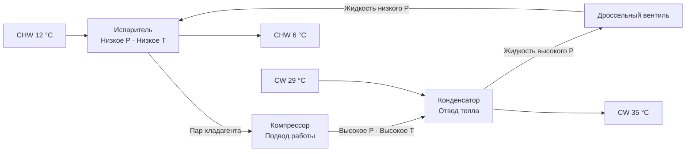
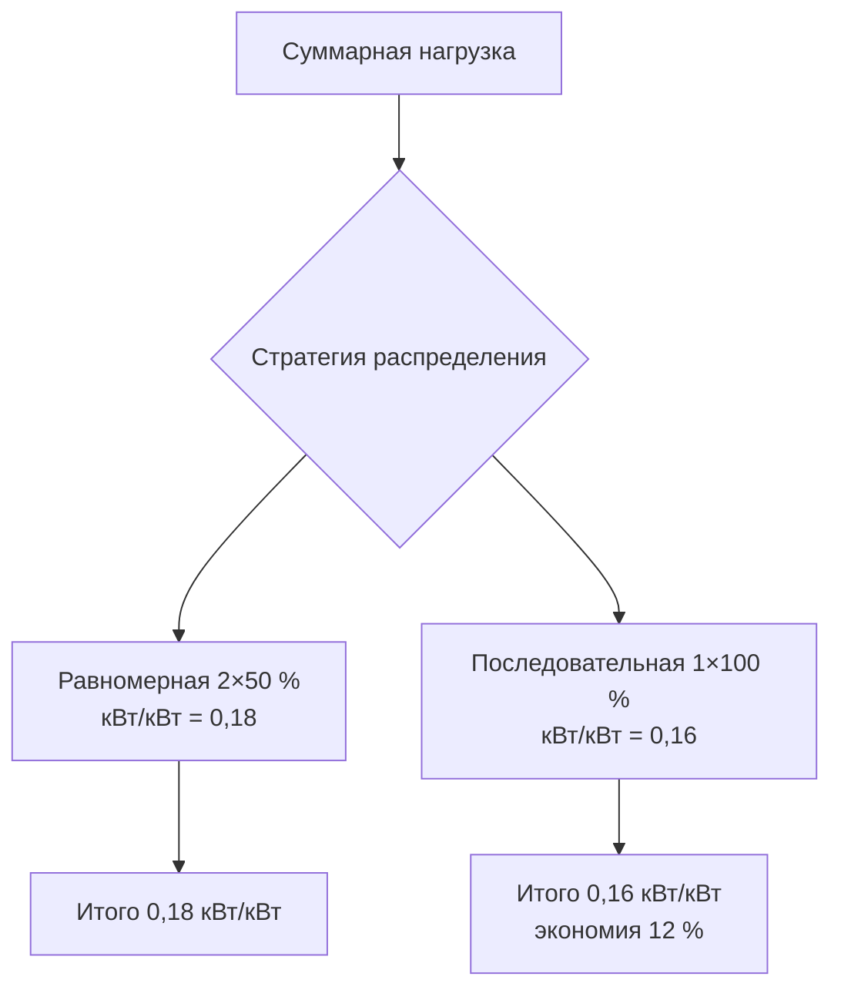

Чиллеры (chillers) — центральные холодильные машины, преобразующие электрическую или тепловую энергию в холодопроизводительность и обеспечивающие охлаждённой водой воздухообрабатывающие установки, фанкойлы и технологическое оборудование в коммерческих, институциональных и промышленных зданиях. Стандартная температура подаваемой охлаждённой воды — 6–8 °C. Настоящий раздел охватывает оба фундаментальных принципа: паровое сжатие (vapor-compression cycle) и абсорбционный цикл (absorption cycle).

## Чиллеры с паровым сжатием

### Термодинамика цикла

Чиллер с паровым сжатием реализует обратный цикл Карно с фазовыми переходами хладагента. Коэффициент производительности (COP):


$$\text{COP} = \frac{Q_{\text{исп}}}{W_{\text{комп}}} = \frac{h_1 - h_4}{h_2 - h_1}$$


где $h_1$ — энтальпия пара на выходе испарителя; $h_2$ — энтальпия на выходе компрессора; $h_4$ — энтальпия жидкости на входе дроссельного вентиля.

Теоретический максимум (предел Карно):


$$\text{COP}_{\text{Карно}} = \frac{T_{\text{исп}}}{T_{\text{конд}} - T_{\text{исп}}}$$


с температурами в Кельвинах. Реальные чиллеры достигают 40–60 % КПД Карно из-за необратимостей в компрессоре, теплообменниках и расширителе.

**Пример (SI).** Чиллер с испарением при $T_{\text{исп}} = 2$ °C (275 К) и конденсацией при $T_{\text{конд}} = 40$ °C (313 К):

$$\text{COP}_{\text{Карно}} = \frac{275}{313 - 275} = 7{,}24$$

При реальном КПД 55 %: $\text{COP}_{\text{реальный}} \approx 7{,}24 \times 0{,}55 = 3{,}98$, что соответствует 0,25 кВт/кВт.

### Типы компрессоров


| Тип | Диапазон мощности | Эффективность | Работа при частичной нагрузке | Применение |
|-----|-------------------|--------------|------------------------------|------------|
| Спиральный (scroll) | 20–60 кВт | Хорошая | Удовлетворительная (ступенчатая) | Малые коммерческие |
| Винтовой (screw) | 60–925 кВт | Очень хорошая | Отличная | Средние объекты |
| Центробежный (centrifugal) | 120–12 000+ кВт | Отличная | Хорошая (ограничения помпажа) | Крупные ЦХУ |
| Магнитные подшипники (magnetic bearing) | 90–2460 кВт | Превосходная | Отличная (0,1 % регулирование) | Высокоэффективные объекты |


Уравнение Эйлера для центробежного компрессора:


$$\Delta h = U_2 C_{u2} - U_1 C_{u1}$$


где $U$ — окружная скорость рабочего колеса; $C_u$ — тангенциальная составляющая абсолютной скорости. Приводы с VFD (variable frequency drive) модулируют скорость рабочего колеса, заменяя регулирование направляющими лопатками и повышая КПД при частичной нагрузке.

## Абсорбционные чиллеры

Абсорбционные чиллеры (absorption chillers) заменяют механический компрессор тепловым компрессором: абсорбер + насос раствора + генератор. Пара рабочих веществ — вода (хладагент) и бромид лития LiBr (абсорбент) для температур выше 0 °C; аммиак–вода для низкотемпературных применений.

COP одноступенчатой абсорбционной машины:


$$\text{COP}_{\text{абс}} = \frac{Q_{\text{исп}}}{Q_{\text{ген}} + W_{\text{нас}}} \approx 0{,}65\text{–}0{,}75$$


Двухступенчатые машины: COP = 1,0–1,2; трёхступенчатые: COP до 1,7.

## Водяное и воздушное охлаждение: сравнение


| Параметр | Водяное охлаждение | Воздушное охлаждение |
|----------|-------------------|---------------------|
| Эффективность | 0,14–0,18 кВт/кВт | 0,24–0,33 кВт/кВт |
| Температура конденсации | 29–41 °C | 37–54 °C |
| Требуется | Градирня + трубопроводы | Нет |
| Первоначальная стоимость | Выше | Ниже |
| Работа при частичной нагрузке | 10–100 % | 25–100 % |
| Уровень шума | Ниже | Выше |
| Срок службы | 20–30 лет | 15–20 лет |


Эффективность водяного охлаждения определяется более низкой температурой конденсации. По уравнению LMTD:


$$Q = UA \cdot \Delta T_{\text{ср}} = UA \cdot \frac{\Delta T_1 - \Delta T_2}{\ln(\Delta T_1/\Delta T_2)}$$


Снижение температуры конденсаторной воды с 29 °C до 24 °C улучшает COP чиллера на 8–12 %.

## Показатели эффективности и стандарты

### IPLV / NPLV по AHRI 550/590

IPLV (integrated part-load value) — взвешенный показатель эффективности при переменной нагрузке:


$$\text{IPLV} = 0{,}01A + 0{,}42B + 0{,}45C + 0{,}12D$$


где A, B, C, D — эффективность (кВт/кВт охлаждения) при 100 %, 75 %, 50 % и 25 % нагрузки соответственно. Современные водяные центробежные чиллеры с магнитными подшипниками достигают IPLV = 0,11–0,14 кВт/кВт.

NPLV (non-standard part-load value) рассчитывается аналогично для нестандартных условий эксплуатации по климату конкретного объекта.

Чувствительность эффективности к температуре конденсаторной воды:


$$\frac{\text{кВт/кВт}_2}{\text{кВт/кВт}_1} \approx \left(\frac{T_{\text{конд,2}}}{T_{\text{конд,1}}}\right)^{1{,}5}$$


### Конфигурации с несколькими чиллерами

Центральные холодильные установки используют 2–4 чиллера для обеспечения резервирования и оптимизации режима частичной нагрузки. Стратегия последовательного включения чиллеров по ASHRAE 90.1: следующий чиллер вводится, когда это снижает суммарный удельный расход энергии установки.

## Методология расчёта холодопроизводительности

Тепловой баланс чиллера:


$$Q_{\text{чиллер}} = \dot{m} \cdot c_p \cdot \Delta T_{\text{CHW}}$$


Стандартные расчётные параметры:
- расход CHW: 0,043 л/(с·кВт) при $\Delta T = 5{,}6$ °C;
- расход конденсаторной воды: 0,054 л/(с·кВт) при $\Delta T = 5{,}6$ °C;
- подход испарителя: 0,6–1,2 °C;
- подход конденсатора: 0,6–1,5 °C.

Центральные установки предпочтительны перед распределёнными системами прямого расширения (DX) при площади здания > 4 000 м² или суммарной нагрузке > 500 кВт: эффективность 0,14–0,17 кВт/кВт против 0,24–0,31 кВт/кВт для крышных блоков.

## Нормативная база

- **AHRI 550/590** — испытание и сертификация чиллеров с паровым сжатием (COP, IPLV, NPLV);
- **AHRI 560** — абсорбционные чиллеры;
- **EN 14511** — европейские испытания при номинальных условиях;
- **EN 14825** — испытания при частичных нагрузках (ESEER);
- **ASHRAE 90.1** — минимальные требования к эффективности чиллеров и управлению последовательностью включения;
- **ASHRAE Handbook — HVAC Systems and Equipment**, гл. 43: Liquid Chillers;
- **СП 60.13330.2020** — требования к холодильным машинам и системам холодоснабжения.
