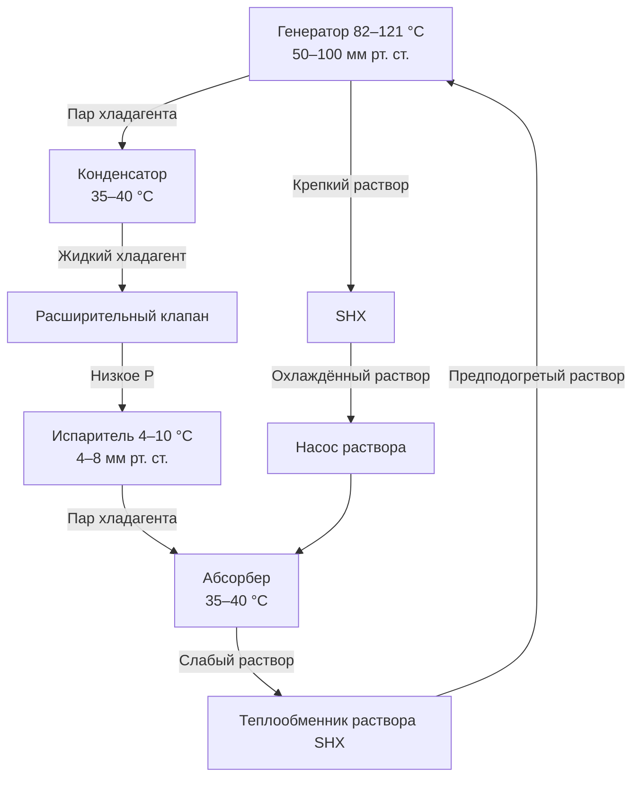

Абсорбционные холодильные машины (АХМ, absorption chillers) производят холод за счёт тепловой энергии, а не механического сжатия хладагента. Термохимический цикл поглощения и выделения паров хладагента позволяет утилизировать отработанное тепло промышленных процессов, теплоту выхлопных газов когенерационных установок или солнечную тепловую энергию. Наиболее распространённая рабочая пара: бромид лития–вода (LiBr–H₂O) для температур охлаждения выше 0 °C; аммиак–вода (NH₃–H₂O) — для низкотемпературных применений.

## Термодинамика абсорбционного цикла

Абсорбционный цикл заменяет механический компрессор «тепловым компрессором», состоящим из абсорбера, насоса раствора и генератора. Тепловой баланс генератора:


$$Q_g = \dot{m}_r \cdot h_{fg} + Q_{\text{пот}}$$


где $Q_g$ — тепловой поток в генератор, кВт; $\dot{m}_r$ — расход хладагента, кг/с; $h_{fg}$ — теплота парообразования воды при рабочем давлении.

Общий энергетический баланс:


$$Q_g + Q_e = Q_a + Q_c + W_p$$


где $Q_e$ — холодопроизводительность испарителя; $Q_a$ — тепловой поток в абсорбере; $Q_c$ — тепловой поток в конденсаторе; $W_p$ — работа насоса раствора (обычно < 1–2 % от $Q_g$).

Коэффициент производительности (COP):


$$\text{COP}_{\text{абс}} = \frac{Q_e}{Q_g + W_p} \approx \frac{Q_e}{Q_g}$$


Одноступенчатые машины: COP = 0,65–0,75; двухступенчатые: COP = 1,0–1,2; трёхступенчатые: COP до 1,7.

## Цикл LiBr–H₂O

Система LiBr–H₂O использует воду как хладагент и бромид лития как абсорбент. Цикл работает в условиях глубокого вакуума (3–7 мм рт. ст. = 0,4–0,9 кПа) для испарения воды при 4–10 °C.

Разность концентраций между слабым (55–60 % LiBr, из генератора) и крепким (60–65 % LiBr, в генератор) растворами движет процесс абсорбции. Равновесие описывается соотношением Дюринга:


$$\log P = A - \frac{B}{T + C}$$


где $P$ — давление пара; $T$ — температура раствора; $A$, $B$, $C$ — константы, зависящие от концентрации LiBr.

## Теплопередача в компонентах

### Генератор


$$Q_g = U A \cdot \Delta T_{\text{ср}}$$


Прямонагреваемые генераторы — газовые горелки с КПД 80–85 %; косвенные — горячая вода 82–121 °C, пар 83–103 кПа или высококонцентрированное выхлопное тепло когенерационных установок.

### Абсорбер


$$Q_a = \dot{m}_r \cdot (h_{fg} + h_{\text{разб}})$$


где $h_{\text{разб}} \approx 186$–233 кДж/кг — теплота разбавления LiBr–H₂O. Абсорбер отводит тепло охлаждающей воде 29–35 °C. Суммарный тепловой отвод:


$$Q_a + Q_c \approx Q_e + Q_g$$


Это означает: абсорбционные машины отводят в градирню в 2,4–2,5 раза больше тепла относительно холодопроизводительности, против 1,25–1,35 для компрессионных машин. Градирня для АХМ должна быть увеличена соответственно.

### Теплообменник раствора (SHX)

Рекуперирует теплоту горячего крепкого раствора из генератора для предподогрева слабого раствора из абсорбера. Эффективность $\varepsilon = 0{,}60$–0,80, улучшение COP на 10–15 %:


$$\varepsilon = \frac{T_{\text{кр,вх}} - T_{\text{кр,вых}}}{T_{\text{кр,вх}} - T_{\text{сл,вх}}}$$


## Сравнительная характеристика АХМ


| Параметр | Одноступенчатая | Двухступенчатая | Компрессионная (для сравнения) |
|----------|----------------|----------------|-------------------------------|
| COP | 0,65–0,75 | 1,0–1,2 | 3,0–6,0 (электрическая) |
| Температура источника тепла | 82–121 °C | 138–193 °C | — |
| Электрическая нагрузка | 20–40 Вт/кВт охл. | 70–100 Вт/кВт охл. | 0,5–0,8 кВт/кВт охл. |
| Температура холодной воды | 4–13 °C | 4–13 °C | 2–13 °C |
| Нагрузка градирни | 2,4–2,5 × охл. | 1,8–2,0 × охл. | 1,25–1,35 × охл. |
| Хладагент | Вода (ODP=0, GWP=0) | Вода (ODP=0, GWP=0) | ГФУ (GWP варьируется) |
| Срок службы | 20–30 лет | 20–25 лет | 15–25 лет |


## Области применения

**Когенерация (CHP).** Утилизация тепловой рубашки двигателя (82–104 °C) или теплоты выхлопных газов (427–649 °C) через HRSG (heat recovery steam generator). Суммарная эффективность системы когенерации с абсорбционным охлаждением > 80 % по первичной энергии.

**Районные системы.** Университеты и промышленные комплексы с центральными паровыми станциями используют АХМ для балансирования нагрузок отопления и охлаждения, снижая пиковое потребление электроэнергии на 0,5–0,8 кВт на кВт холода.

**Солнечное охлаждение.** Одноступенчатые АХМ хорошо сочетаются с вакуумными трубчатыми или параболическими желобчатыми коллекторами (82–121 °C). Солнечная доля покрытия 0,4–0,7 достижима в климатах с высокой инсоляцией; резервный источник — природный газ.

**Пример (SI).** АХМ мощностью 1750 кВт (500 т охлаждения), COP = 0,70:
$$Q_g = \frac{1750}{0{,}70} = 2500 \text{ кВт}$$

При горячей воде $\Delta T = 10$ °C расход теплоносителя в генераторе:
$$\dot{m}_g = \frac{2500}{4{,}186 \times 10} = 59{,}7 \text{ кг/с} = 215 \text{ м}^3/\text{ч}$$

## Эксплуатационные особенности

**Кристаллизация LiBr** — основной операционный риск. При концентрации раствора > 65–68 % или снижении температуры ниже кривой насыщения твёрдый LiBr выпадает в осадок, блокируя трубопроводы. Меры предотвращения: цикл разбавления, электрические обогреватели раствора при остановке, алгоритмы блокировки.

**Неконденсируемые газы** (воздух, водород от коррозии) снижают теплопередачу на 30–50 % при накоплении 1–2 % по объёму. Автоматические системы очистки (purge systems) извлекают газы, минимизируя потери хладагента.

**Ингибиторы коррозии:** молибдат лития 0,1–0,4 % — рекомендуемый экологичный вариант; исторически применялись хроматы (сейчас запрещены в ЕС). Ежегодный анализ раствора: концентрация LiBr, pH, содержание металлов-индикаторов коррозии.

## Методология проектирования по ASHRAE 90.1

При проектировании АХМ учитываются:

1. Доступная температура и расход источника тепла;
2. Требуемая температура и производительность холодной воды;
3. Температура и расход охлаждающей воды;
4. Профиль частичной нагрузки (АХМ хуже справляются с нагрузкой < 20–30 %);
5. Ограничения по габаритам и нагрузкам на перекрытия;
6. Экономический анализ жизненного цикла (LCC) с учётом тарифов на тепло и электроэнергию.

Расчёт теплового потока источника с учётом КПД теплообменника:


$$Q_{\text{ист}} = \frac{Q_g}{\varepsilon_{\text{HX}} \cdot \eta_{\text{ген}}}$$


где $\varepsilon_{\text{HX}} = 0{,}70$–0,85 — КПД теплообменника; $\eta_{\text{ген}} = 0{,}95$–0,98 — КПД генератора с учётом потерь через корпус.

## Нормативная база

- **AHRI 560** — испытание и сертификация абсорбционных водоохладителей;
- **ASHRAE 90.1** — минимальные требования к COP абсорбционных машин при расчёте базовой эффективности здания;
- **ASHRAE 15-2019** — безопасность холодильных систем (материалы, герметизация);
- **EN 14511 / EN 14825** — испытания при номинальных и частичных нагрузках;
- **СП 60.13330.2020** — проектирование систем холодоснабжения с абсорбционными машинами.
