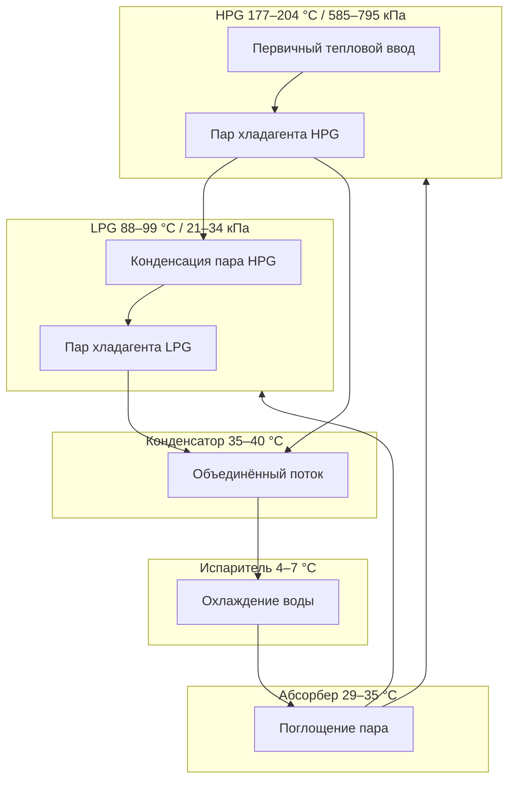

Абсорбционные холодильные машины двойного эффекта (double-effect absorption chillers) используют двухступенчатый процесс генерации хладагента, обеспечивая COP порядка 1,2 — примерно на 60–70 % выше, чем одноступенчатые машины (COP 0,65–0,75). Принцип — каскадное использование тепловой энергии: пар хладагента из генератора высокого давления конденсируется в генераторе низкого давления, приводя вторую ступень генерации без дополнительного подвода тепла.

## Принцип двухступенчатой генерации

Генератор высокого давления (HPG, high-pressure generator) работает при 177–204 °C, получая первичный тепловой ввод. Образующийся пар хладагента поступает в генератор низкого давления (LPG, low-pressure generator), конденсируясь там и высвобождая скрытую теплоту для второй ступени генерации. Оба потока хладагента объединяются в конденсаторе, далее цикл совпадает с одноступенчатым.

Термодинамический прирост COP:


$$\text{COP}_{\text{двойной}} = \frac{Q_{\text{исп}}}{Q_{\text{HPG}}} = \frac{T_{\text{исп}}(T_{\text{HPG}} - T_{\text{конд}})}{T_{\text{HPG}}(T_{\text{конд}} - T_{\text{исп}})} \times \eta_{\text{каск}}$$


где $\eta_{\text{каск}} = 0{,}85$–0,92 — КПД теплообмена между ступенями.

## Конфигурации потока раствора

### Последовательный поток (series flow)

Раствор циркулирует: абсорбер → HPG → LPG → абсорбер через один насос раствора.

Преимущества: упрощённые трубопроводы, один насос, более низкая первоначальная стоимость. Недостаток: HPG получает наиболее концентрированный раствор, повышен риск кристаллизации при неправильном управлении.

### Параллельный поток (parallel flow)

Раздельные контуры раствора для HPG и LPG с независимыми насосами.

Преимущества: независимое управление, лучшая эффективность при частичной нагрузке, оптимизированные расходы раствора.


| Параметр | Последовательный | Параллельный |
|----------|-----------------|-------------|
| COP при 100 % нагрузке | 1,15–1,20 | 1,18–1,25 |
| COP при 50 % нагрузке | 0,90–1,00 | 1,05–1,15 |
| Насосы раствора | 1 | 2 |
| Паразитная мощность | 28–42 кВт/1000 кВт охл. | 42–63 кВт/1000 кВт охл. |
| Диапазон регулирования | 3:1 | 4:1–5:1 |
| Первоначальная стоимость | Базовая | +15–20 % |


**Пример (SI).** АХМ двойного эффекта, параллельный поток, нагрузка 700 кВт при COP = 1,20:
$$Q_g = \frac{700}{1{,}20} = 583 \text{ кВт тепловой мощности}$$

При паре 690 кПа ($h_{fg} \approx 2050$ кДж/кг) расход пара в HPG:
$$\dot{m}_{\text{пар}} = \frac{583}{2050} = 0{,}284 \text{ кг/с} = 1022 \text{ кг/ч}$$

## Источники тепла

### Прямое горение (direct-fired)

Интегрированная газовая горелка нагревает HPG. Модуляция горелки 25–100 % мощности. Характеристики:
- тепловой ввод: 11,3–12,3 МДж/кВт·ч охлаждения;
- расход природного газа: 0,34–0,37 м³/кВт·ч охлаждения;
- температура дымовых газов: 177–232 °C;
- потенциал рекуперации выхлопа: 20–25 % от теплового ввода.

Баланс тепла сгорания:


$$Q_{\text{топл}} \times \text{LHV} \times \eta_{\text{сгор}} = Q_{\text{HPG}} + Q_{\text{дымовые}} + Q_{\text{рубашка}}$$


LHV природного газа = 37,3 МДж/м³; $\eta_{\text{сгор}} = 0{,}82$–0,85.

**Применение:** объекты без инфраструктуры пара, срезание пиков электронагрузки, системы тригенерации (CCHP).

### Пар (steam-fired)

Насыщенный пар 585–795 кПа питает теплообменник HPG.

- Расход пара: 7,3–8,2 кг/кВт·ч охлаждения;
- Температура конденсата: 88–99 °C;
- COP: 1,18–1,25.

Расчёт расхода пара:


$$\dot{m}_{\text{пар}} = \frac{Q_{\text{охл}}}{\text{COP} \cdot h_{fg}}$$


при $h_{fg} \approx 2050$ кДж/кг для 690 кПа.

**Применение:** промышленные объекты с технологическим паром, больницы со стерилизационными системами, когенерационные установки.

### Горячая вода высокой температуры

Горячая вода 160–193 °C из теплоаккумулятора или высокоэффективных солнечных коллекторов. COP: 1,05–1,15 (ниже из-за передачи через теплообменник). Расход: 0,39–0,55 м³/(ч·100 кВт охлаждения).

## Рекуперация выхлопного тепла

АХМ прямого горения сбрасывают тепло с дымовыми газами. Рекуперация снижает удельный расход топлива:


$$Q_{\text{рекуп}} = \dot{m}_{\text{дым}} \cdot c_p \cdot (T_{\text{дым}} - T_{\text{стек}}) \cdot \eta_{\text{HX}}$$


Типичная рекуперация: 2,36–3,30 МДж/кВт·ч охлаждения при КПД теплообменника 60–70 %. Суммарный COP (охлаждение + рекуперированное тепло): 1,5–1,7.

Интеграция с газовой турбиной: выхлоп 454–538 °C → HRSG → пар 690–860 кПа → HPG двойного эффекта. Суммарная эффективность использования топлива (EUF):


$$\text{EUF} = \frac{E_{\text{электр}} + Q_{\text{охл}} + Q_{\text{отопл}}}{Q_{\text{топливо}}} = 0{,}75\text{–}0{,}85$$


## Производительность при частичной нагрузке


| Нагрузка | T CW вх. = 29,4 °C | T CW вх. = 23,9 °C |
|---------|--------------------|--------------------|
| 100 % (прямое горение) | 1,15–1,20 | 1,22–1,28 |
| 100 % (пар) | 1,20–1,25 | 1,28–1,35 |
| 75 % | 1,10–1,15 | 1,18–1,24 |
| 50 % | 0,90–1,00 | 1,05–1,15 |


Снижение температуры входящей конденсаторной воды на 0,56 °C улучшает COP на 2–3 %.

## Расчёт отвода тепла (градирня)

Машины двойного эффекта отвергают в градирню тепло и по охлаждению, и по тепловому вводу:


$$Q_{\text{отверж}} = Q_{\text{охл}} + Q_{\text{HPG}} = Q_{\text{охл}} \times \left(1 + \frac{1}{\text{COP}}\right)$$


**Пример.** АХМ 350 кВт охлаждения, COP = 1,2:
$$Q_{\text{отверж}} = 350 + \frac{350}{1{,}2} = 350 + 292 = 642 \text{ кВт}$$

Это в 1,83 раза больше холодопроизводительности — против 1,25 для компрессионных машин. Градирня должна быть подобрана соответственно увеличенной тепловой нагрузке.

## Диапазон мощности и экономика

Коммерческие АХМ двойного эффекта: 105–530 кВт на единицу; несколько машин параллельно — до 3500+ кВт.

**Экономические ориентиры:**
- первоначальная стоимость: 3500–5200 $/кВт охлаждения (пар), 4200–6100 $/кВт (прямое горение);
- ценовая целесообразность при соотношении газ/электроэнергия < 3,5–4,0;
- срок простой окупаемости: 5–12 лет в зависимости от тарифов и часов работы.

## Нормативная база

- **AHRI 560** — испытание и рейтинг абсорбционных чиллеров;
- **ASHRAE 90.1** — требования к минимальному COP при базовом проектировании;
- **ASHRAE Handbook — HVAC Systems and Equipment**, гл. 18: Sorption Cooling;
- **EN 14511 / EN 14825** — испытания при номинальных и частичных нагрузках;
- **СП 60.13330.2020** — проектирование систем холодоснабжения.
