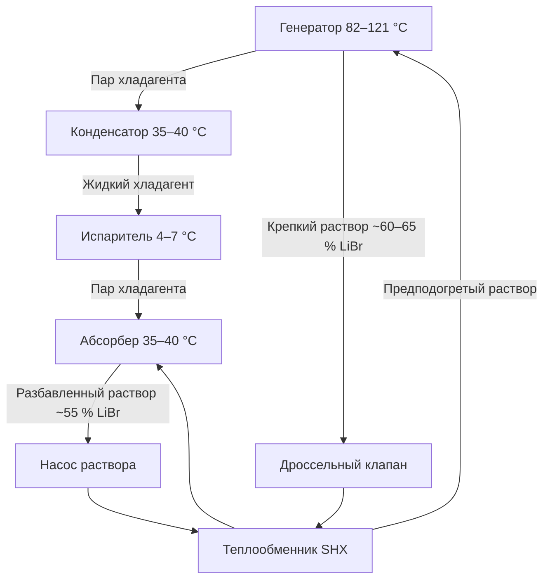

Одноступенчатые абсорбционные холодильные машины (АХМ) — наиболее распространённая конфигурация абсорбционной технологии. Они используют низкотемпературную тепловую энергию (82–121 °C) для производства холода с минимальным потреблением электроэнергии (20–40 Вт/кВт охлаждения). Это делает их идеальными для утилизации отработанного тепла промышленных процессов, систем когенерации и солнечного теплоснабжения.

## Термодинамика одноступенчатого цикла

Первый закон термодинамики для системы:


$$Q_g + Q_e = Q_a + Q_c + W_p$$


где $Q_g$ — тепловой ввод в генератор; $Q_e$ — холодопроизводительность испарителя; $Q_a$ — тепло в абсорбере; $Q_c$ — тепло в конденсаторе; $W_p$ — работа насоса раствора (пренебрежимо мала).

Коэффициент производительности:


$$\text{COP} = \frac{Q_e}{Q_g + W_p} \approx \frac{Q_e}{Q_g}$$


Для одноступенчатых систем LiBr–H₂O: COP = 0,65–0,75. Ниже, чем у двухступенчатых (COP 1,0–1,2), но достаточно при бесплатном или дешёвом источнике тепла.

## Фазы цикла

**Генератор:** горячая вода 82–121 °C или пар 0,08–0,10 МПа нагревает раствор LiBr, испаряя воду-хладагент. Остающийся раствор содержит ~60–65 % LiBr.

**Конденсатор:** пар конденсируется при ~37 °C и давлении насыщения ~6,6 кПа, отдавая тепло охлаждающей воде 29 °C.

**Испаритель:** жидкий хладагент расширяется до ~0,83 кПа ($T_{\text{нас}} \approx 7$ °C), испаряется и охлаждает воду холодного контура.

**Абсорбер:** пар хладагента поглощается концентрированным LiBr; выделяется тепло абсорбции ~1700 кДж/кг, отводимое охлаждающей водой 29–35 °C. Разбавленный раствор (~55 % LiBr) возвращается в генератор.

## Требования к источнику тепла


| Источник | Диапазон температур | Типовое применение |
|----------|--------------------|--------------------|
| Горячая вода | 82–121 °C | Районное теплоснабжение, солнечные коллекторы |
| Пар низкого давления | 0,08–0,10 МПа | Промышленные отходы тепла, когенерация |
| Прямое горение | 82–127 °C | Природный газ, пропан |
| Технологическое тепло | 82–121 °C | Охлаждающие жидкости двигателей, конденсат |


Требуемый тепловой ввод генератора:


$$Q_g = \frac{Q_e}{\text{COP}} = \dot{m}_g \cdot c_p \cdot \Delta T_g$$


**Пример (SI).** АХМ 1750 кВт охлаждения (500 т), COP = 0,70:

$$Q_g = \frac{1750}{0{,}70} = 2500 \text{ кВт}$$

При горячей воде $\Delta T = 11$ °C расход теплоносителя:

$$\dot{m}_g = \frac{2500}{4{,}186 \times 11} = 54{,}3 \text{ кг/с} = 195 \text{ м}^3/\text{ч}$$

## Интеграция с солнечными тепловыми системами

Одноступенчатые АХМ оптимально сочетаются с вакуумными трубчатыми коллекторами (КПД $\eta_c = 0{,}40$–0,55 при 121 °C) или параболическими желобчатыми коллекторами.

Требуемая площадь коллекторов:


$$A_c = \frac{Q_g}{\eta_c \cdot I}$$


где $I$ — интенсивность солнечной радиации, кВт/м².

**Пример.** АХМ 350 кВт охлаждения (COP 0,70), $Q_g = 500$ кВт, $I = 0{,}788$ кВт/м², $\eta_c = 0{,}50$:

$$A_c = \frac{500}{0{,}50 \times 0{,}788} = 1269 \text{ м}^2$$

Тепловой аккумулятор буферизирует прерывистость солнечной радиации: типовой объём на 2–4 ч полной нагрузки. Солнечная доля покрытия (solar fraction) достигает 0,4–0,7 в солнечных климатах; резервный источник (природный газ) обеспечивает непрерывную работу.

## Зависимость COP от условий эксплуатации


| Параметр | Изменение | Воздействие на COP |
|----------|----------|--------------------|
| Температура входа в генератор | +5,6 °C | +0,03–0,04 |
| Температура генератора | −5,6 °C | −0,03–0,04 |
| Температура охлаждающей воды | +2,8 °C | −0,05–0,07 |
| Температура холодной воды | −2,8 °C | −0,04–0,06 |


Более высокие температуры конденсаторной воды резко снижают COP: необходима градирня с эффективным управлением для минимизации температуры CW. Справочник ASHRAE (Systems and Equipment, гл. 18) содержит детальные карты производительности.

## Предотвращение кристаллизации

Граница кристаллизации LiBr зависит от концентрации и температуры раствора. Критические зоны возникновения:
- низкая температура охлаждающей воды (< 13 °C);
- очень низкая температура CHW (< 4 °C);
- длительная работа при нагрузке < 20 %;
- аварийная остановка без цикла разбавления.

Три защитных механизма:

1. **Цикл разбавления** — временное снижение теплового ввода в генератор для уменьшения концентрации раствора перед остановкой;
2. **Нагрев раствора** — поддержание минимальной температуры раствора в абсорбере и трубопроводах;
3. **Работа при ограниченной нагрузке** — программный запрет снижения ниже 10 % номинала во избежание локальной кристаллизации.

## Регулирование производительности

Производительность линейно зависит от теплового ввода в диапазоне 10–100 %:


$$Q_e = \text{COP} \times Q_g$$


Системы с горячей водой — трёхходовые клапаны модулируют расход горячей воды. Паровые системы — регулирующие клапаны давления или ступенчатое управление с тепловым аккумулятором.

Практический диапазон регулирования: 10–100 % номинала, ограниченный:
- минимальным расходом циркуляции раствора;
- границами кристаллизации при низких нагрузках;
- снижением КПД теплообменников при малых расходах.

## Расчёт мощности


$$Q_{\text{АХМ}} = \frac{Q_{\text{макс,нагрузка}}}{\text{КР}}$$


где КР — коэффициент разнообразия (0,70–0,95 для многозонных систем). При солнечном теплоснабжении соотношение площади коллектора к максимальной нагрузке: 1,2:1–1,5:1.

## Система очистки (purge system)

АХМ работает при давлении ниже атмосферного → постоянное удаление неконденсируемых газов обязательно. Система очистки обрабатывает 0,47–1,42 м³/ч паро-газовой смеси, возвращая хладагент и сбрасывая инертные газы. Частота цикла очистки: 1–4 раза/ч при нормальной работе.

## Экономика применения

Одноступенчатые АХМ экономически целесообразны при:
- доступном отработанном тепле промышленных процессов (срок окупаемости 2–5 лет);
- высоких солнечных ресурсах и параллельных нагрузках охлаждения и нагрева;
- тарифах на электроэнергию выше 0,08–0,10 $/кВт·ч в сочетании с дешёвым теплом;
- требованиях по снижению пикового потребления электроэнергии (экономия 0,5–0,8 кВт на кВт охлаждения).

Срок службы при правильном обслуживании: > 25 лет (превышает компрессионные машины).

## Обслуживание

- **Химия раствора:** ежегодный анализ концентрации LiBr и уровней ингибиторов;
- **Чистка трубок:** конденсатор и абсорбер — ежегодно или по результатам мониторинга тепловой эффективности;
- **Контроль очистки:** проверка работы purge-системы и возврата хладагента;
- **Герметичность вакуума:** ежегодное испытание на убыль давления (< 0,5 кПа/сут);
- **Калибровка датчиков:** температура, давление, концентрация — ежегодно.

## Нормативная база

- **AHRI 560** — испытание и рейтинг абсорбционных водоохладителей;
- **ASHRAE 90.1** — минимальный COP для абсорбционных машин при расчёте базовой эффективности;
- **ASHRAE Handbook — HVAC Systems and Equipment**, гл. 18;
- **EN 14511** — испытания при номинальных условиях;
- **СП 60.13330.2020** — проектирование систем холодоснабжения.
