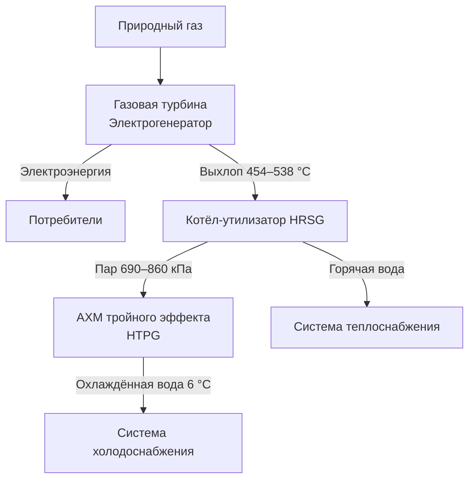

Абсорбционные холодильные машины тройного эффекта (triple-effect absorption chillers) — вершина технологии теплового охлаждения, достигающая COP порядка 1,7 через три последовательные ступени генерации хладагента. Принцип — каскадное извлечение дополнительной холодопроизводительности из каждого понижающегося температурного потенциала. При таком уровне эффективности абсорбционное охлаждение по первичной энергии приближается или превосходит компрессионные машины в регионах с угольной генерацией электроэнергии.

## Трёхступенчатое тепловое сжатие

Три ступени генератор–конденсатор–абсорбер работают при последовательно снижающихся температурах и давлениях:

1. **Высокотемпературный генератор (HTPG):** получает первичный тепловой ввод при > 260 °C от газовой горелки или выхлопного тепла ГТУ. Производит пар хладагента при наибольшем давлении.

2. **Среднетемпературный генератор (MTPG):** пар HTPG конденсируется здесь, передавая скрытую теплоту для следующей ступени генерации.

3. **Низкотемпературный генератор (LTPG):** пар MTPG конденсируется, приводя третью ступень. Температура 82–99 °C.

Все три потока хладагента объединяются в одном конденсаторе. Испаритель и абсорбер работают так же, как в одно- и двухступенчатых машинах.

Улучшение COP при добавлении каждой ступени:


| Конфигурация | COP | Температура источника тепла |
|-------------|-----|-----------------------------|
| Одноступенчатая | 0,65–0,75 | 82–121 °C |
| Двухступенчатая | 1,0–1,2 | 138–193 °C |
| Трёхступенчатая | 1,6–1,7 | > 260 °C |


**Пример (SI).** АХМ тройного эффекта, мощность охлаждения 2100 кВт, COP = 1,70:

$$Q_g = \frac{2100}{1{,}70} = 1235 \text{ кВт}$$

Тепло источника с учётом КПД горелки 0,84:
$$Q_{\text{топл}} = \frac{1235}{0{,}84} = 1470 \text{ кВт}$$

При LHV природного газа 37,3 МДж/м³ расход газа:
$$\dot{V}_{\text{газ}} = \frac{1470 \times 3600}{37300} = 142 \text{ м}^3/\text{ч}$$

## Системы газовых горелок

Высокотемпературный генератор нагревается интегрированной газовой горелкой (природный газ или пропан). Требования к системе сгорания:

- Модуляция 25–100 % тепловой мощности для соответствия нагрузке охлаждения;
- КПД сгорания > 85 % через конденсационный теплообменник, рекуперирующий скрытую теплоту дымовых газов;
- Герметичная топка с раздельными каналами забора воздуха горения и отвода дымовых газов, исключающая попадание продуктов сгорания в помещение;
- Возможность двухтопливной работы (природный газ / пропан) для обеспечения резервирования.

Температура дымовых газов на выходе из горелки: 260–320 °C. Потенциал рекуперации: 25–35 % от теплового ввода, используется для предподогрева воздуха горения или производства горячей воды.

## Требования к высокотемпературному источнику

Рабочая температура > 260 °C — принципиальное ограничение технологии тройного эффекта. Допустимые источники:

- Прямые газовые горелки — единственный практичный вариант для автономных установок;
- Выхлоп газовых турбин (454–538 °C) — через HRSG производит пар 690–860 кПа, достаточный для HTPG;
- Выхлопные газы дизельных двигателей (350–450 °C) — через котёл-утилизатор.

Источники при 160–193 °C (горячая вода высокого давления) и пар < 800 кПа непригодны для HTPG.

## Диапазон мощности и применение

Коммерческие АХМ тройного эффекта: 1050–3500 кВт (300–1000 т охлаждения) на единицу, несколько машин параллельно — до 10 500+ кВт.

**Оптимальные объекты:**
- Больницы и университеты: 2800–7000 кВт суммарной мощности;
- Промышленные объекты с выхлопным теплом ГТД: 1750–3500 кВт;
- Системы районного охлаждения: несколько установок;
- Центры обработки данных с КОХПЭ: 1050–2100 кВт.

## Отвод тепла и размер градирни

Тройной эффект отвергает в градирню:


$$Q_{\text{отверж}} = Q_{\text{охл}} \times \left(1 + \frac{1}{\text{COP}}\right) = Q_{\text{охл}} \times \left(1 + \frac{1}{1{,}7}\right) \approx 1{,}59 \times Q_{\text{охл}}$$


Для сравнения: компрессионный чиллер — $1{,}25 \times Q_{\text{охл}}$. Градирня для АХМ тройного эффекта пропорционально крупнее.

**Расчёт для 2100 кВт охлаждения:**
$$Q_{\text{отверж}} = 2100 \times 1{,}59 = 3339 \text{ кВт}$$

## Интеграция с КОХПЭ (тригенерация)

Системы комбинированного производства холода, тепла и электроэнергии (КОХПЭ) используют выхлопные газы ГТД как источник тепла для тройного эффекта:


$$\text{EUF} = \frac{E_{\text{электр}} + Q_{\text{охл}} + Q_{\text{отопл}}}{Q_{\text{топливо}}} = 0{,}70\text{–}0{,}85$$


против 30–40 % КПД обычных раздельных систем. Охлаждение становится побочным продуктом выработки электроэнергии, обеспечивая исключительную экономию первичной энергии.

## Производительность при частичной нагрузке

Модуляция горелки 25–100 % обеспечивает диапазон регулирования 4:1 без выключения машины. Абсорбционные системы сохраняют относительно стабильный COP в широком диапазоне нагрузок — в отличие от центробежных компрессорных машин, у которых эффективность падает ниже 40–50 % нагрузки.

При параллельной работе нескольких установок: базовая нагрузка покрывается одной машиной при полной нагрузке, остальные модулируют или отключаются — оптимальная стратегия последовательного включения.

## Химия раствора и материалы

Высокотемпературная работа HTPG требует усиленных пакетов ингибиторов коррозии. Стали при температурах > 200 °C подвергаются ускоренной коррозии в растворах LiBr; обязательно молибдат лития или органические карбоксилаты в концентрации согласно ASHRAE 15. Диапазон концентрации раствора по трём эффектам: крепкий раствор из HTPG — максимально концентрированный (~67–68 % LiBr, вблизи границы кристаллизации). Контроль состояния раствора критически важен.

## Система управления

PLC-контроллер координирует:
- интенсивность горения горелки по сигналу нагрузки охлаждения;
- концентрацию раствора по ступеням;
- алгоритмы предотвращения кристаллизации с блокировкой при критических параметрах;
- интерфейс с BMS для удалённого мониторинга и управления.

Снижение шума — важное преимущество абсорбционных машин перед компрессионными: отсутствие высокооборотного компрессора снижает уровень шума на 10–20 дБ.

## Экологические показатели

АХМ тройного эффекта на природном газе производят прямые выбросы NOx, CO и CO₂ от сгорания. Однако при сравнении с электрическими чиллерами по первичной энергии:
- в регионах с угольной генерацией (КПД 35–40 %) абсорбционная машина с COP 1,7 генерирует ~40–60 % от CO₂ компрессионной машины;
- в регионах с газовой генерацией (КПД 55 %) преимущество меньше;
- в регионах с высокой долей ВИЭ — электрическая машина предпочтительнее.

## Экономический анализ


| Параметр | Значение |
|----------|---------|
| Первоначальная стоимость | 5200–8200 $/кВт охлаждения |
| Целевое соотношение газ/электроэнергия | < 0,3 ($/кВт·ч газ) / ($/кВт·ч электр.) |
| Простой срок окупаемости | 5–12 лет |
| Срок службы | > 25–30 лет |
| Стоимость обслуживания | Ниже, чем компрессионных машин (меньше движущихся частей) |


Анализ жизненного цикла (LCC) должен включать: влияние тарифов на спрос (demand charges), экономию на пиковых электрических нагрузках, долговечность оборудования и доступные налоговые льготы на когенерацию / ВИЭ.

## Монтажные требования

- Конструктивная опора для значительной массы (> 100 кг/кВт охлаждения);
- Раздельные каналы воздуха горения и дымоудаления с выходом согласно нормам пожарной безопасности;
- Газоснабжение с регулятором давления на вводе;
- Градирня, рассчитанная на $1{,}59 \times Q_{\text{охл}}$;
- Акустические требования: уровень шума ниже, чем у компрессионных машин той же мощности, что упрощает размещение в черте городской застройки.

## Нормативная база

- **AHRI 560** — испытание и рейтинг абсорбционных чиллеров, включая машины тройного эффекта;
- **ASHRAE 90.1** — требования к COP и управлению для расчёта базовой линии;
- **ASHRAE 15-2019** — безопасность холодильных систем (сгорание, вентиляция, материалы);
- **ASHRAE Handbook — HVAC Systems and Equipment**, гл. 18: Sorption Cooling;
- **EN 14511 / EN 14825** — испытания при номинальных и частичных нагрузках;
- **СП 60.13330.2020** — проектирование систем холодоснабжения.
