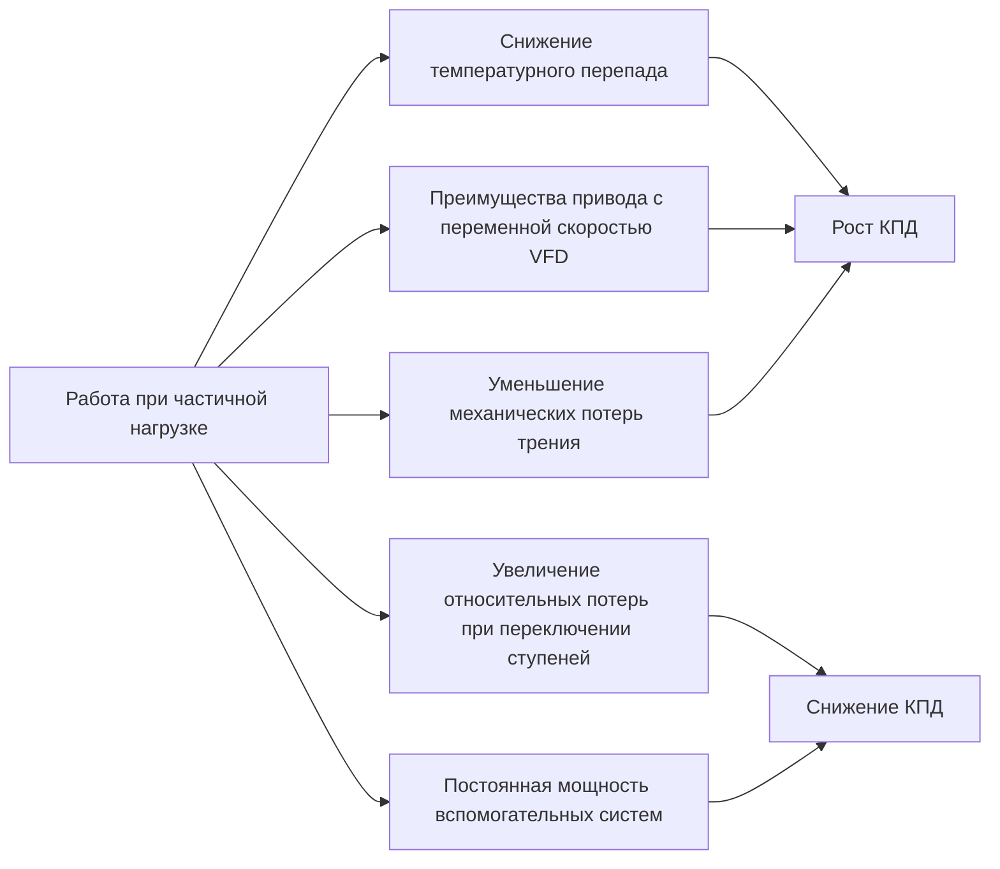
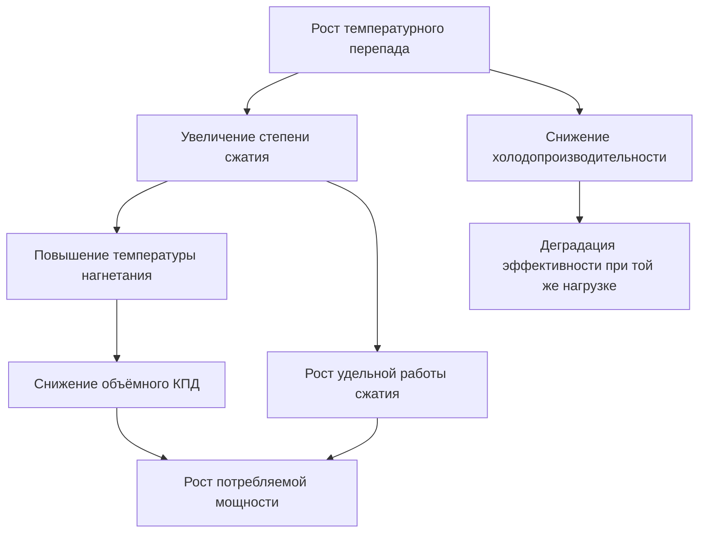

Производительность холодильной машины (chiller) — это соотношение между холодопроизводительностью и потребляемой мощностью при различных условиях эксплуатации. Понимание характеристик производительности позволяет инженеру оптимизировать проектирование системы, прогнозировать энергопотребление и выявлять эксплуатационные неэффективности на ранней стадии.

## Показатели эффективности

### Коэффициент производительности (COP — Coefficient of Performance)

Фундаментальный термодинамический показатель эффективности холодильной машины:


\text{COP} = \frac{Q_{\text{evap}}}{W_{\text{comp}}} = \frac{\text{Холодопроизводительность (кВт)}}{\text{Мощность компрессора (кВт)}}


Для идеального парокомпрессионного цикла теоретический максимум COP определяется эффективностью Карно (Carnot efficiency):


\text{COP}_{\text{Carnot}} = \frac{T_{\text{evap}}}{T_{\text{cond}} - T_{\text{evap}}}


где температуры выражены в абсолютных единицах (Кельвин). Реальные машины достигают 40–60 % КПД Карно из-за необратимостей процессов сжатия, теплопередачи и трения.

### Удельное энергопотребление: кВт/кВт и EER

В инженерной практике эффективность часто выражают в кВт/кВт (потребляемая электрическая мощность на единицу холодопроизводительности) или через EER (Energy Efficiency Ratio):


\text{кВт/кВт} = \frac{3{,}517}{\text{COP}}



\text{EER} \;[\text{Вт/Вт}] = \text{COP}


Меньшее значение кВт/кВт означает более высокую эффективность. Высокоэффективные центробежные машины с водяным охлаждением достигают 0,45–0,55 кВт/кВт при стандартных условиях AHRI 550/590. Воздухоохлаждаемые винтовые чиллеры работают в диапазоне 0,9–1,2 кВт/кВт.

## Производительность при полной и частичной нагрузке

### Стандартные условия испытаний при полной нагрузке

AHRI 550/590 устанавливает следующие базовые условия:


| Тип чиллера | Выходная температура охлаждённой воды (CHWS) | Входная температура воды конденсатора (CWS) | Температура наружного воздуха |
|---|---|---|---|
| Водяное охлаждение (water-cooled) | 6,7 °C | 29,4 °C | — |
| Воздушное охлаждение (air-cooled) | 6,7 °C | — | 35,0 °C |


Полнонагрузочная эффективность задаёт базовый уровень, однако реальная машина работает при полной нагрузке лишь малую долю годового времени. Большинство чиллеров находятся в диапазоне 20–60 % расчётной мощности на протяжении 80 % часов эксплуатации.

### Характеристика при частичной нагрузке

Эффективность чиллера нелинейно меняется с нагрузкой. Центробежные и винтовые машины, как правило, улучшают КПД при снижении нагрузки — из-за уменьшения потерь в двигателе и оптимизированной степени сжатия. Спиральные (scroll) и поршневые (reciprocating) компрессоры могут ухудшать КПД при глубокой частичной нагрузке вследствие потерь на переключение ступеней и фиксированной мощности вспомогательных систем.

## Интегральное значение при частичной нагрузке (IPLV)

Стандарт AHRI 550/590 вводит метрику IPLV (Integrated Part Load Value) — взвешенное среднее значение эффективности при четырёх уровнях нагрузки:


\text{IPLV} = 0{,}01\,A + 0{,}42\,B + 0{,}45\,C + 0{,}12\,D


где:
- **A** — EER при нагрузке 100 %, температура CWS 29,4 °C;
- **B** — EER при нагрузке 75 %, CWS 23,9 °C;
- **C** — EER при нагрузке 50 %, CWS 18,3 °C;
- **D** — EER при нагрузке 25 %, CWS 12,8 °C.

Весовые коэффициенты отражают типичное распределение нагрузки в коммерческих зданиях умеренного климата. Значение IPLV позволяет более точно прогнозировать годовое энергопотребление, чем одна лишь полнонагрузочная эффективность.

### Нестандартное значение (NPLV — Non-Standard Part Load Value)

Для климатов с иным профилем температур AHRI допускает расчёт NPLV: весовые коэффициенты нагрузки сохраняются, но температуры охлаждающей воды задаются под конкретный объект. Это даёт более реалистичную оценку для нестандартных условий эксплуатации.

## Температурный перепад (Lift) и его влияние на КПД

### Определение перепада

Температурный перепад (lift) — разность температур насыщения хладагента между конденсатором и испарителем:


\text{Lift} = T_{\text{cond}} - T_{\text{evap}}


При практических расчётах с использованием температур воды:


\text{Lift} = \bigl(T_{\text{LCW}} + \text{Approach}_{\text{evap}}\bigr) - \bigl(T_{\text{ECW}} - \text{Approach}_{\text{cond}}\bigr)


где $T_{\text{LCW}}$ — температура уходящей охлаждённой воды (leaving chilled water), $T_{\text{ECW}}$ — температура входящей охлаждающей воды (entering condenser water), Approach — разность температур между хладагентом и водой на выходе теплообменника.

### Влияние перепада на потребление мощности

Потребляемая мощность компрессора примерно линейно растёт с увеличением перепада:


\frac{W_2}{W_1} \approx \frac{\text{Lift}_2}{\text{Lift}_1}


Увеличение перепада на 5,6 °C, как правило, повышает потребляемую мощность на 15–25 % в зависимости от типа и конструкции машины.


| Увеличение перепада | Примерный рост мощности |
|---|---|
| +2,8 °C | 8–12 % |
| +5,6 °C | 15–25 % |
| +8,3 °C | 25–40 % |


## Температура подхода (Approach Temperature)

### Подход испарителя

Подход испарителя (evaporator approach) характеризует интенсивность теплопередачи:


\text{Approach}_{\text{evap}} = T_{\text{LCW}} - T_{\text{evap,sat}}


Типичный диапазон: 1,1–2,2 °C. На значение влияют:
- **Коэффициент загрязнения (fouling factor)**: накипь, биологические отложения, взвешенные частицы;
- **Расход воды**: снижение расхода увеличивает approach;
- **Площадь теплообменника**: при недостаточной площади approach растёт;
- **Заряд хладагента**: недозаряд снижает смачиваемость поверхности испарителя.

### Подход конденсатора


\text{Approach}_{\text{cond}} = T_{\text{cond,sat}} - T_{\text{LCW,cond}}


Типичный диапазон: 0,6–1,7 °C. Рост значений сигнализирует о загрязнении, недостаточном расходе или деградации поверхности теплообменника. Регулярная механическая очистка труб и программа водоподготовки поддерживают проектные approach-температуры.

## Факторы деградации производительности

### Загрязнение теплообменных поверхностей (Fouling)

Загрязнение создаёт дополнительное тепловое сопротивление, снижая холодопроизводительность и КПД. AHRI включает в стандартные условия испытаний нормированные коэффициенты загрязнения:


| Качество воды | Коэффициент загрязнения Rf, м²·К/Вт |
|---|---|
| Чистая вода градирни | 0,000044 |
| Обработанная вода градирни | 0,000088 |
| Городской водопровод | 0,000176 |
| Речная вода | 0,00035–0,00053 |


При отсутствии надлежащего обслуживания загрязнение снижает производительность на 5–30 % в год.

### Нарушения заряда хладагента

**Недозаряд (undercharge)**: снижает смачиваемость испарителя, увеличивает перегрев пара и уменьшает холодопроизводительность. Потребляемая мощность при этом остаётся практически постоянной — КПД падает.

**Перезаряд (overcharge)**: затапливает конденсатор жидким хладагентом, снижает эффективную площадь теплообмена, повышает давление конденсации и мощность компрессора.

### Неконденсирующиеся газы (NCG — Non-Condensable Gases)

Воздух и другие NCG накапливаются в верхней части конденсатора, создавая дополнительное тепловое сопротивление и искусственно повышая давление конденсации. Концентрация NCG 1 % по объёму увеличивает потребление мощности приблизительно на 3–5 %.

### Механический износ компрессора

Износ рабочего колеса центробежного компрессора, зазоров роторов винтового компрессора или деталей поршневого механизма снижает объёмный КПД. Снижение производительности 1–3 % в год соответствует нормальному износу; ускоренная деградация требует диагностики.

### Загрязнение маслом контура хладагента

Избыток масла в холодильном контуре покрывает поверхности теплообменников, особенно критично для затопленных испарителей (flooded evaporators). При концентрации масла выше 3–5 % теплопередача существенно ухудшается, approach-температуры растут, холодопроизводительность падает.

## Расчётный пример: оценка деградации КПД

**Исходные данные.** Центробежный чиллер с водяным охлаждением, холодопроизводительность 1000 кВт. При проектных условиях: $T_{\text{LCW}} = 6{,}7\,°\text{C}$, $T_{\text{ECW}} = 29{,}4\,°\text{C}$, lift = 28 °C, кВт/кВт = 0,55.

**Ситуация.** Загрязнение конденсатора увеличило approach с 1,5 до 3,5 °C. Подход испарителя вырос с 1,2 до 2,2 °C.

**Новый перепад:**


\text{Lift}_{\text{new}} = (6{,}7 + 2{,}2) - (29{,}4 - 3{,}5) = 8{,}9 - 25{,}9 = \ldots


Точнее: $\text{Lift}_{\text{new}} = (29{,}4 + 3{,}5) + (2{,}2 - 6{,}7) = 32{,}9 - 4{,}5 = 28{,}4\,°\text{C}$... Скорректируем расчёт по формуле перепада с учётом обоих approach:


\Delta \text{Lift} = \Delta\text{Approach}_{\text{cond}} + \Delta\text{Approach}_{\text{evap}} = 2{,}0 + 1{,}0 = 3{,}0\,°\text{C}


Прирост мощности при увеличении lift на 3,0 °C (≈ 0,55 × 3,0/28 × 20 % = ~1,2 % на °C):


\Delta W \approx 1{,}5\,\% \times 3{,}0 = 4{,}5\,\%


Новое потребление: $W = 1000 \times 0{,}55 \times 1{,}045 = 574{,}8\,\text{кВт}$ вместо 550 кВт. Перерасход — около 25 кВт. За 2000 часов сезонной работы это даёт примерно **50 000 кВт·ч лишних затрат**.

## Мониторинг производительности

Непрерывный мониторинг позволяет выявить деградацию на ранней стадии:


\text{Performance Ratio} = \frac{\text{Текущий кВт/кВт}}{\text{Базовый кВт/кВт при тех же условиях}}


Если коэффициент превышает 1,05–1,10 — требуется техническое обслуживание. Нормализация по перепаду, нагрузке и условиям окружающей среды позволяет отделить изменения производительности от операционных вариаций.

## Требования ASHRAE 90.1 к эффективности чиллеров

ASHRAE 90.1-2019 устанавливает минимальные требования эффективности для центрального холодоснабжения. Предусмотрены два пути соответствия:


| Тип чиллера | Размер | Путь A (полная нагрузка, кВт/кВт) | Путь B (IPLV, кВт/кВт) |
|---|---|---|---|
| Центробежный, водяное охлаждение | < 527 кВт | 1,071 | 0,986 |
| Центробежный, водяное охлаждение | 527–1055 кВт | 1,071 | 0,986 |
| Центробежный, водяное охлаждение | ≥ 1055 кВт | 0,986 | 0,918 |
| Винтовой, водяное охлаждение | Все размеры | 1,214 | 1,072 |
| Воздушное охлаждение | Все размеры | 1,761 | 1,548 |


Путь A акцентирован на полнонагрузочной эффективности; Путь B — на показателях частичной нагрузки через IPLV. Большинство современных объектов выигрывают от выбора оборудования по Пути B, поскольку преобладающий режим эксплуатации — частичная нагрузка.

Аналогичные требования для европейского рынка содержатся в стандартах EN 14511 и EN 14825 (сезонный коэффициент SEPR), а также регламенте ЕС по экодизайну (Regulation 2016/2281). В российской практике расчётные параметры систем холодоснабжения регламентирует СП 60.13330.2020 (актуализация СНиП 41-01-2003).

---

Оптимизация производительности холодильной машины требует понимания взаимосвязи между перепадом, нагрузкой и эффективностью теплообменника. Работа при частичной нагрузке преобладает в годовом балансе энергопотребления, поэтому IPLV является более значимым показателем, чем полнонагрузочный кВт/кВт. Регулярное техническое обслуживание — поддержание проектных approach-температур, удаление неконденсирующихся газов и контроль заряда хладагента — обеспечивает сохранение паспортной производительности на протяжении всего расчётного срока службы оборудования.
