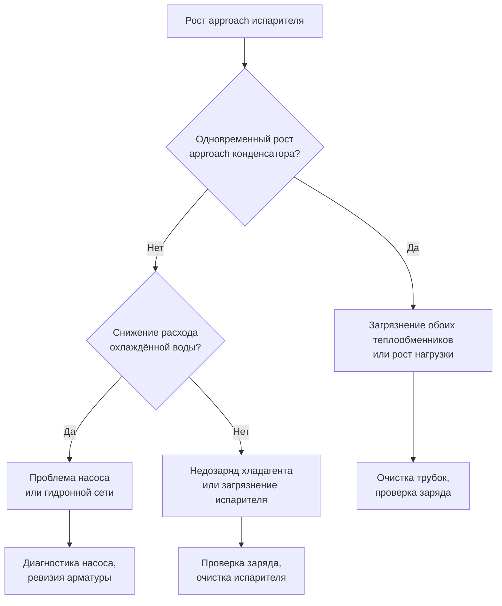

Рабочие параметры холодильной машины определяют термодинамические границы, в которых функционирует парокомпрессионный цикл. Эти параметры напрямую влияют на производительность, эффективность и долговечность компонентов через своё воздействие на степень сжатия, интенсивность теплопередачи и состояние хладагента. Понимание взаимосвязей параметров позволяет оптимизировать режим работы холодильной установки в безопасных эксплуатационных границах.

## Температура подачи охлаждённой воды (CHWS)

Температура выходящей из испарителя охлаждённой воды (Chilled Water Supply, CHWS) — ключевой параметр, определяющий тепловую нагрузку системы распределения холода. Для систем комфортного кондиционирования:


| Применение | CHWS, °C |
|---|---|
| Комфортное кондиционирование (стандартное) | 6,0–7,5 |
| Комфортное кондиционирование (высокий ΔT) | 6,7–9,0 |
| Технологическое охлаждение | 2,0–16,0 |
| Децентрализованное охлаждение серверных | 12–20 |


Каждое повышение CHWS на 0,6 °C улучшает КПД чиллера приблизительно на 1,5–2 %. Выбор CHWS при проектировании балансирует требования осушки воздуха (dew point control), пропускную способность терминального оборудования и энергетическую эффективность чиллера. Стратегии сброса температуры (chilled water reset) используют эту зависимость в реальном времени.

## Температура возврата охлаждённой воды (CHWR) и перепад ΔT

Температура возврата (Chilled Water Return, CHWR) вместе с CHWS определяет рабочий перепад ΔT на стороне охлаждённой воды:


\Delta T_{\text{CHW}} = T_{\text{CHWR}} - T_{\text{CHWS}}


Стандартный проектный ΔT = 5,6 °C (10 °F) при CHWS 6,7 °C и CHWR 12,2 °C. Расход охлаждённой воды определяется через уравнение теплового баланса:


Q = \dot{m} \cdot c_p \cdot \Delta T \quad \Rightarrow \quad \dot{m} = \frac{Q}{c_p \cdot \Delta T}


При $Q = 1000$ кВт, $\Delta T = 5{,}6$ °C, $c_p = 4{,}19$ кДж/(кг·К):


\dot{m} = \frac{1000}{4{,}19 \times 5{,}6} \approx 42{,}6\ \text{кг/с} \approx 153\ \text{м³/ч}


### Деградация ΔT (Low Delta-T Syndrome)

Снижение фактического ΔT ниже проектного значения (low delta-T syndrome) — распространённая эксплуатационная проблема. Причины:

- байпас на терминальном оборудовании при перезакрытых клапанах;
- неправильная балансировка гидронной сети;
- перегрузка чиллера выше проектной производительности;
- переохлаждение воды в режиме малой нагрузки.

Деградация ΔT вынуждает увеличивать расход насосов для поддержания той же тепловой мощности, что снижает суммарную эффективность установки.

## Расход охлаждённой воды через испаритель

Расход влияет на интенсивность теплопередачи, перепад давления и склонность к загрязнению. Проектные критерии:

- скорость воды в трубках испарителя: 0,6–1,2 м/с (ниже, чем в конденсаторе, из-за меньшей загрязняемости);
- **минимальный расход**: обеспечивает защиту от замерзания и достаточную теплопередачу;
- **максимальный расход**: ограничивается допустимым перепадом давления и риском эрозии трубок.

Системы с переменным расходом (variable flow) снижают энергопотребление насосов при частичной нагрузке, сохраняя минимально необходимый расход через работающий чиллер (как правило, не менее 40 % проектного).

## Температура охлаждающей воды на входе в конденсатор (CWS)

Температура охлаждающей воды на входе в конденсатор (Condenser Water Supply, CWS) — один из наиболее значимых параметров, влияющих на эффективность чиллера. Вода от градирни:

- типичный диапазон: 18–29 °C в зависимости от температуры влажного термометра (wet-bulb temperature) и КПД градирни;
- каждые 0,6 °C снижения CWS улучшают кВт/кВт чиллера на 1–2 %.

Возможности свободного охлаждения (free cooling / waterside economizing) возникают, когда CWS приближается к температуре возврата охлаждённой воды — тогда тепловой пункт или теплообменник (economizer heat exchanger) может обеспечить охлаждение без работы компрессора.

## Температура возврата охлаждающей воды из конденсатора (CWR)

Вода, выходящая из конденсатора, несёт тепло, отведённое из цикла охлаждения:


Q_{\text{cond}} = Q_{\text{evap}} + P_{\text{comp}} = \dot{m}_{\text{CW}} \cdot c_p \cdot (T_{\text{CWR}} - T_{\text{CWS}})


Типичный ΔT охлаждающей воды: 4,4–6,7 °C. Аномально высокий CWR может указывать на снижение расхода охлаждающей воды или загрязнение конденсатора.

## Расход охлаждающей воды через конденсатор

Проектные критерии для конденсаторной стороны:
- скорость в трубках: 0,9–1,8 м/с (выше, чем в испарителе — для интенсификации теплоотдачи и снижения загрязнения);
- снижение расхода приводит к росту температуры конденсации и падению КПД;
- избыточный расход даёт убывающий прирост теплопередачи при квадратичном росте потерь давления.

## Температура подхода (Approach Temperature)

Approach — разность температур между хладагентом и водой на выходе теплообменника, характеризующая эффективность теплопередачи.

### Подход испарителя (Evaporator Approach)


\text{Approach}_{\text{evap}} = T_{\text{CHWS}} - T_{\text{evap,sat}}


Для затопленных испарителей (flooded evaporators): 0,6–1,7 °C; для DX (direct expansion): 1,7–2,8 °C.

Рост approach испарителя со временем сигнализирует о:
- накоплении загрязнения на трубках;
- снижении заряда хладагента (недозаряд);
- накоплении неконденсирующихся газов.

### Подход конденсатора (Condenser Approach)


\text{Approach}_{\text{cond}} = T_{\text{cond,sat}} - T_{\text{CWR}}


Кожухотрубные конденсаторы с водяным охлаждением: 1–2 °C. Воздухоохлаждаемые конденсаторы: 5,6–11 °C к температуре сухого термометра наружного воздуха. Испарительные конденсаторы: 2,8–5,6 °C к температуре влажного термометра.

## Температурный перепад (Lift)

Температурный перепад (temperature lift) — разность температур насыщения хладагента между конденсатором и испарителем — непосредственно определяет степень сжатия и потребляемую мощность:


\text{Lift} = T_{\text{cond,sat}} - T_{\text{evap,sat}}


Практический расчёт через параметры воды:


\text{Lift} = (T_{\text{CWR}} + \text{Approach}_{\text{cond}}) - (T_{\text{CHWS}} - \text{Approach}_{\text{evap}})


Типичный lift для комфортного охлаждения: 19–31 °C. Каждое увеличение lift на 0,6 °C повышает потребляемую мощность компрессора приблизительно на 1,5–2,5 %.

## Степень сжатия и её последствия

Степень сжатия (compression ratio) связана с lift через уравнение состояния хладагента:


r_c = \frac{P_{\text{cond}}}{P_{\text{evap}}}


Для R-134a при $T_{\text{evap}} = 3\,°\text{C}$ ($P_{\text{evap}} \approx 308$ кПа) и $T_{\text{cond}} = 35\,°\text{C}$ ($P_{\text{cond}} \approx 888$ кПа):


r_c = \frac{888}{308} \approx 2{,}88


Допустимые диапазоны степеней сжатия по типам компрессоров:


| Тип компрессора | Диапазон степени сжатия |
|---|---|
| Центробежный (одноступенчатый) | 2,5–4,5 |
| Центробежный (двухступенчатый) | 6–10 |
| Винтовой | 3–8 |
| Спиральный | 3–6 |
| Поршневой | 4–12 |


Чрезмерная степень сжатия вызывает перегрев нагнетательного газа, ускоренный износ компонентов и срабатывание тепловой защиты.

## Температуры насыщения хладагента и диагностика

Температуры насыщения хладагента в испарителе и конденсаторе определяются давлениями хладагента и свойствами конкретного хладагента. Мониторинг давлений позволяет рассчитать температуры насыщения и, следовательно, approach-температуры и lift без непосредственного измерения температуры хладагента.

Диагностика по отклонению параметров от базовых значений:

## Проверка теплового баланса

Точность мониторинга производительности подтверждается сходимостью расчётов со стороны испарителя и конденсатора:

**Холодопроизводительность через испаритель:**


Q_{\text{evap}} = \dot{m}_{\text{CHW}} \cdot c_p \cdot (T_{\text{CHWR}} - T_{\text{CHWS}})


**Тепловой баланс через конденсатор:**


Q_{\text{cond}} = \dot{m}_{\text{CW}} \cdot c_p \cdot (T_{\text{CWR}} - T_{\text{CWS}})



Q_{\text{cond}} = Q_{\text{evap}} + P_{\text{comp}}


Расхождение между $Q_{\text{evap}}$ и ($Q_{\text{cond}} - P_{\text{comp}}$) не должно превышать 5–10 % — это указывает на достаточную точность измерений. Систематическое расхождение свидетельствует об ошибках калибровки датчиков.

## Расчётный пример: влияние параметров на эффективность

**Объект**: центробежный чиллер с водяным охлаждением, R-134a, $Q_{\text{nom}} = 2000$ кВт, базовое кВт/кВт = 0,55 при стандартных условиях AHRI.

**Фактические условия**: $T_{\text{CHWS}} = 6{,}7$ °C, $T_{\text{CHWR}} = 12{,}2$ °C, $T_{\text{CWS}} = 32$ °C (вместо 29,4 °C по AHRI).

**Оценка роста lift:**


\Delta \text{Lift} = 32{,}0 - 29{,}4 = 2{,}6\ °\text{C}


**Оценка роста мощности** (приблизительно 2 % на 1 °C роста lift):


\Delta P \approx 2{,}6 \times 2\,\% = 5{,}2\,\%


**Фактическое кВт/кВт:**


\text{кВт/кВт}_{\text{fact}} \approx 0{,}55 \times 1{,}052 = 0{,}579


**Потребляемая мощность**: $P = 2000 \times 0{,}579 = 1158$ кВт вместо 1100 кВт. Перерасход — 58 кВт. При 3000 часах работы в год: **174 000 кВт·ч** дополнительных затрат только из-за повышенной температуры охлаждающей воды.

## Сезонные вариации параметров и оптимизация

Рабочие параметры существенно меняются в течение года вследствие изменения наружных условий:

- **Летний режим**: максимальный lift, наименьший КПД, условия дня проектирования;
- **Межсезонье**: сниженный lift благодаря более низким CWS, значительное улучшение КПД;
- **Зимний режим**: при необходимости работы — минимальный lift, максимальный КПД, риск нарушения давления конденсации.

Оптимизация холодильной установки использует сезонные возможности через правильные алгоритмы управления (condenser water reset, chilled water reset) и надлежащую последовательность включения оборудования.

## Параметры защитных блокировок


| Параметр | Предупреждение | Отключение |
|---|---|---|
| Минимальная температура CHWS | 2 °C | 1 °C |
| Максимальное давление нагнетания | 90 % от расчётного | 100 % |
| Минимальное давление всасывания | — | Зависит от хладагента |
| Максимальная температура нагнетания | 90 °C | 110 °C |
| Минимальный расход CHWR | — | < 40 % проектного |
| Дифференциал давления масла | < 150 кПа | < 100 кПа |


Правильная настройка уставок защитных блокировок критична для баланса между защитой оборудования и ложными срабатываниями. Требования к системам защиты чиллеров в российской практике регламентируются СП 60.13330.2020 и техническими условиями производителей.

---

Мониторинг и управление рабочими параметрами составляют фундамент эффективной и надёжной эксплуатации холодильной машины. Систематический анализ трендов — approach-температур, ΔT воды, lift и кВт/кВт в нормализованных условиях — позволяет своевременно выявить деградацию производительности и планировать техническое обслуживание до наступления отказов.
