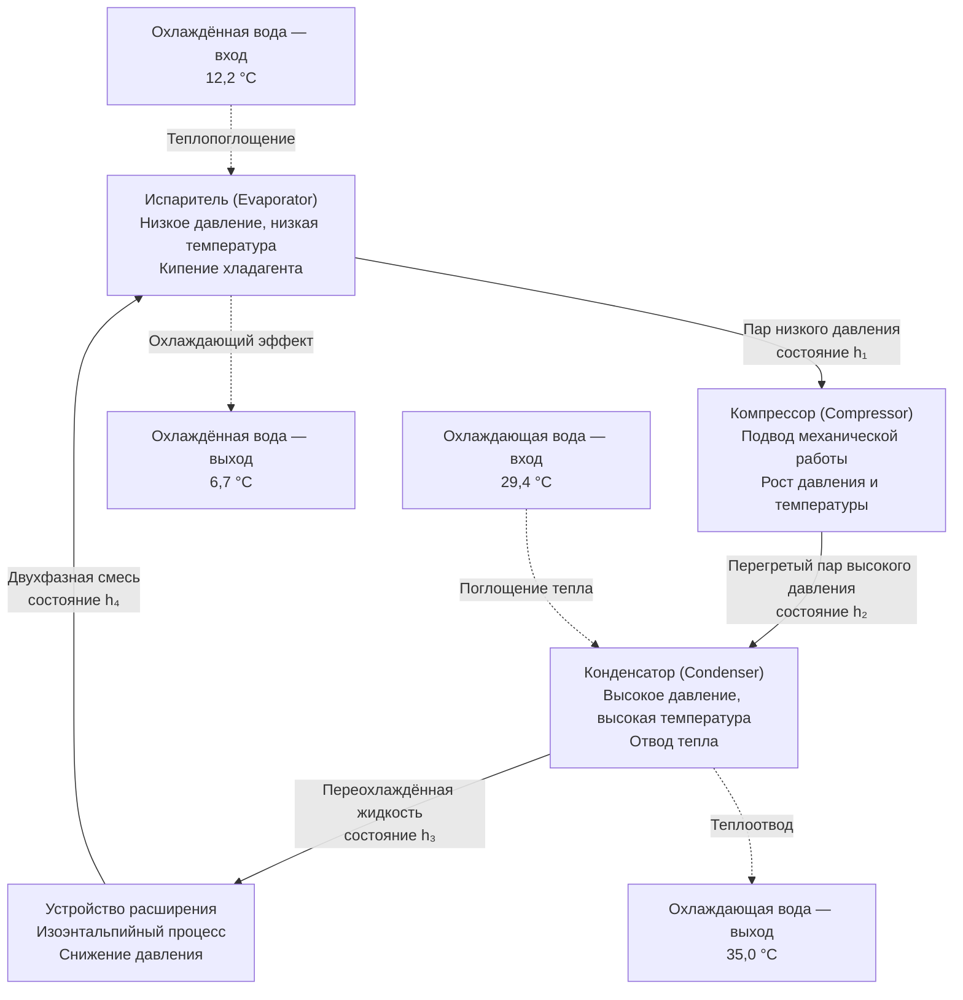

Паровые компрессионные холодильные машины (vapor compression chillers) доминируют в коммерческих и промышленных системах централизованного холодоснабжения благодаря термодинамически эффективному использованию фазовых переходов хладагента для переноса тепла от охлаждённой воды к теплоотводящей среде. Понимание основ физики цикла, конструктивных особенностей компонентов и метрик производительности — обязательное условие для грамотного выбора, эксплуатации и оптимизации этих систем.

## Термодинамика парокомпрессионного цикла

Парокомпрессионный цикл (vapor compression cycle, VCC) реализует четыре последовательных термодинамических процесса, используя свойства фазового перехода хладагента для перемещения тепловой энергии против её естественного градиента.

### Анализ процессов цикла

**1. Изоэнтропное сжатие** (1→2). Насыщенный или слегка перегретый пар поступает в компрессор. Работа сжатия на единицу массы хладагента:


w_{\text{comp}} = h_2 - h_1 \quad [\text{кДж/кг}]


Суммарная мощность компрессора:


P_{\text{comp}} = \dot{m} \cdot (h_2 - h_1) \quad [\text{кВт}]


**2. Изобарная конденсация** (2→3). Перегретый пар последовательно проходит зону десупергрева (desuperheating), зону конденсации и зону переохлаждения (subcooling):


Q_{\text{cond}} = \dot{m} \cdot (h_2 - h_3) \quad [\text{кВт}]


**3. Изоэнтальпийное расширение** (3→4). Переохлаждённая жидкость дросселируется в устройстве расширения (расширительный вентиль, электронный экспансионный клапан EXV), $h_3 = h_4$.

**4. Изобарное испарение** (4→1). Хладагент кипит в испарителе, поглощая тепло от охлаждённой воды:


Q_{\text{evap}} = \dot{m} \cdot (h_1 - h_4) \quad [\text{кВт}]


### Коэффициент производительности цикла


\text{COP}_{\text{ref}} = \frac{Q_{\text{evap}}}{P_{\text{comp}}} = \frac{h_1 - h_4}{h_2 - h_1}


### Теоретический максимум: цикл Карно


\text{COP}_{\text{Carnot}} = \frac{T_{\text{evap}}}{T_{\text{cond}} - T_{\text{evap}}}


При стандартных условиях AHRI ($T_{\text{CHWS}} = 6{,}7$ °C, $T_{\text{CWS}} = 29{,}4$ °C, $T_{\text{evap,sat}} \approx 3$ °C = 276,15 К, $T_{\text{cond,sat}} \approx 35$ °C = 308,15 К):


\text{COP}_{\text{Carnot}} = \frac{276{,}15}{308{,}15 - 276{,}15} = \frac{276{,}15}{32} \approx 8{,}6


Реальные чиллеры достигают 40–65 % от теоретического КПД Карно. Основные источники потерь: необратимость сжатия (изоэнтропный КПД 70–85 %), температурные перепады в теплообменниках (approach 1–3 °C) и потери в двигателе (КПД 92–97 %).

## Критерии выбора хладагента


| Хладагент | ODP | GWP (100 лет) | Tnorm. кипения, °C | Статус |
|---|---|---|---|---|
| R-134a | 0 | 1430 | -26,1 | Постепенный вывод (ЕС F-Gas Reg.) |
| R-513A | 0 | 631 | -29,2 | Альтернатива с низким GWP |
| R-1234ze(E) | 0 | 6 | -19,0 | Низкий GWP, класс A2L |
| R-1233zd(E) | 0 | 1 | 18,3 | Низкое давление, центробежные |
| R-515B | 0 | 299 | -25,3 | Появляющаяся альтернатива |


ASHRAE Standard 34 классифицирует безопасность хладагентов. ASHRAE Standard 15 регламентирует требования к конструкции холодильных систем и их установке в зданиях. В России применение хладагентов регулируется Техническим регламентом Таможенного союза ТР ТС 010/2011 и постановлениями об озоноразрушающих веществах.

## Технологии компрессоров

### Центробежный компрессор (Centrifugal Compressor)

Применяется в диапазоне производительности 700–35 000+ кВт. Динамическое сжатие: рабочее колесо (impeller) сообщает кинетическую энергию пару, которая преобразуется в энергию давления в диффузоре.

Характеристики:
- изоэнтропный КПД: 75–85 %;
- степень сжатия одной ступени: 2,5–4,5 (одноступенчатые), до 10 (двухступенчатые);
- модуляция производительности — через VFD (наилучший вариант) или входные направляющие лопатки (IGV);
- минимальная стабильная нагрузка: 10–15 % (ограничение помпажа, surge).

### Винтовой компрессор (Screw Compressor)

Применяется в диапазоне 100–3500 кВт. Объёмное вытеснение через сопряжённые роторы (ведущий 4+/ведомый 6 заходов).

Характеристики:
- изоэнтропный КПД: 65–75 %;
- непрерывная модуляция производительности через золотниковый клапан (slide valve): 10–100 %;
- впрыск масла обеспечивает уплотнение, охлаждение, смазку;
- встроенный экономайзер повышает эффективность при частичной нагрузке.

### Спиральный компрессор (Scroll Compressor)

Применяется в диапазоне 7–700 кВт (в тандемных конфигурациях — до нескольких МВт). Объёмное вытеснение через орбитальное движение неподвижной и подвижной спиралей.

Характеристики:
- объёмный КПД > 95 %;
- изоэнтропный КПД: 60–70 %;
- минимум движущихся деталей — высокая надёжность;
- цифровое управление (digital scroll) обеспечивает бесступенчатую модуляцию.

### Поршневой компрессор (Reciprocating Compressor)

Применяется в диапазоне 18–529 кВт. Объёмное вытеснение через возвратно-поступательное движение поршня.

Характеристики:
- изоэнтропный КПД: 65–75 %;
- ступенчатая разгрузка цилиндров;
- высокий уровень вибрации, необходима виброизоляция;
- совместимость с широким спектром хладагентов.

### Матрица сравнения компрессоров


| Тип компрессора | Диапазон, кВт | КПД при частичной нагрузке | Обслуживание | Начальная стоимость |
|---|---|---|---|---|
| Центробежный | 700–35 000+ | Отличный с VFD | Низкое | Высокая |
| Винтовой | 100–3500 | Очень хороший | Умеренное | Умеренная |
| Спиральный | 7–700 | Хороший / отличный | Минимальное | Низкая–умеренная |
| Поршневой | 18–529 | Удовлетворительный | Высокое | Низкая |


## Конструкция теплообменников

### Испаритель (Evaporator)

Кожухотрубные испарители (shell-and-tube) доминируют в крупных чиллерах. В затопленных испарителях (flooded type) хладагент находится на стороне кожуха, охлаждённая вода — внутри трубок. Управляющее уравнение теплопередачи:


Q = U \cdot A \cdot \text{LMTD}



\text{LMTD} = \frac{\Delta T_1 - \Delta T_2}{\ln(\Delta T_1 / \Delta T_2)}


Полное термическое сопротивление:


\frac{1}{U} = \frac{1}{h_{\text{evap}}} + \frac{t_{\text{tube}}}{k_{\text{tube}}} + \frac{1}{h_{\text{water}}} + R_f


Профилированные трубки (rifled, micro-fin, turbo) увеличивают $h_{\text{evap}}$ на 200–400 % через развитую поверхность и интенсификацию пузырькового кипения.

### Конденсатор (Condenser)

Водяные конденсаторы аналогичной кожухотрубной конструкции рассчитываются с учётом трёх зон:
- зона десупергрева (desuperheating): 10–15 % общего теплосъёма;
- зона конденсации: 70–80 %;
- зона переохлаждения (subcooling): 5–15 %.

Коэффициент теплоотдачи при конденсации плёнки Нуссельта:


h_{\text{cond}} = 0{,}725 \left[\frac{g\,\rho_l (\rho_l - \rho_v)\,k_l^3\,h_{fg}}{\mu_l\,\Delta T\,D}\right]^{0{,}25}


## Метрики эффективности и сертификация

### Удельное энергопотребление кВт/кВт


\text{кВт/кВт} = \frac{P_{\text{вход}}\ [\text{кВт}]}{Q_{\text{холод}}\ [\text{кВт}]}


Связь с COP: $\text{COP} = 1 / (\text{кВт/кВт})$.


| Тип чиллера | Полная нагрузка (кВт/кВт) | IPLV (кВт/кВт) |
|---|---|---|
| Воздушное охлаждение, спиральный | 1,00–1,20 | 0,80–1,00 |
| Воздушное охлаждение, винтовой | 0,95–1,10 | 0,75–0,90 |
| Водяное охлаждение, центробежный | 0,50–0,62 | 0,40–0,52 |
| Водяное охлаждение, винтовой | 0,60–0,75 | 0,50–0,65 |
| Центробежный с магн. подшипниками | 0,42–0,55 | 0,32–0,45 |


### IPLV по AHRI 550/590


\text{IPLV} = 0{,}01\,A + 0{,}42\,B + 0{,}45\,C + 0{,}12\,D


где A, B, C, D — эффективность при 100, 75, 50, 25 % нагрузки соответственно. Улучшение IPLV на 30–40 % относительно полнонагрузочного значения типично для машин с VFD и оптимизированным управлением.

## Требования ASHRAE 90.1 и минимальные нормативы эффективности

ASHRAE 90.1-2019 устанавливает минимальные требования через Путь A (полная нагрузка) и Путь B (IPLV). Международный рынок ориентируется также на EN 14511 (тест при стандартных условиях) и EN 14825 (сезонный SCOP/SEPR). СП 60.13330.2020 задаёт параметры систем климатизации в российском строительстве, не устанавливая прямых метрик кВт/кВт; соответствие энергетической эффективности здания оценивается через СП 50.13330 (тепловая защита зданий) и класс энергоэффективности.

---

Понимание термодинамических основ парокомпрессионного цикла, принципов работы различных типов компрессоров и механизмов теплопередачи в теплообменниках является фундаментом для грамотного проектирования, эксплуатации и диагностики систем централизованного холодоснабжения. Оптимизация параметров цикла — температурного перепада, approach-температур и режима частичной нагрузки — определяет реальное годовое энергопотребление чиллерной установки.
