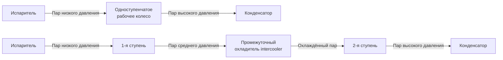
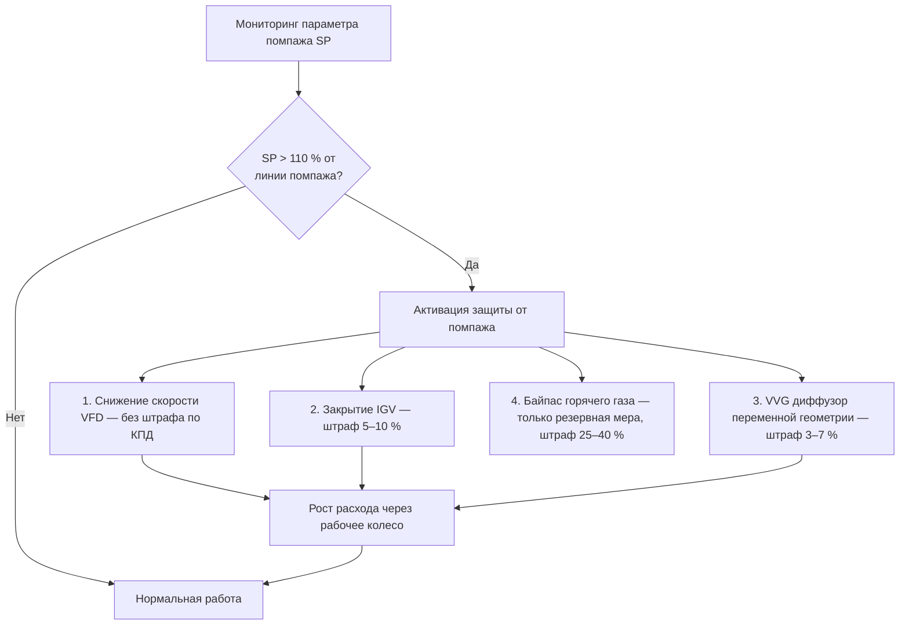

Центробежные холодильные машины занимают доминирующее положение в сегменте высокой производительности (350–35 000+ кВт) благодаря принципу динамического сжатия, обеспечивающему высокую эффективность в крупных коммерческих зданиях, системах районного охлаждения (district cooling) и на промышленных объектах. В отличие от компрессоров объёмного вытеснения, центробежные машины сообщают кинетическую энергию пару хладагента через высокоскоростные рабочие колёса, преобразуя скорость в давление в диффузорных каналах.

## Динамика рабочего колеса и физика сжатия

Процесс центробежного сжатия подчиняется фундаментальным законам механики жидкости. Пар хладагента поступает в глаз рабочего колеса (impeller eye) при радиусе $r_1$ и уходит с периферии при радиусе $r_2$.

Уравнение Эйлера для турбомашины определяет теоретический напор:


h_{\text{th}} = \frac{U_2 V_{t2} - U_1 V_{t1}}{g_c}


где $U = \omega r$ — окружная скорость лопатки, $V_t$ — тангенциальная составляющая абсолютной скорости. При нулевом входном закручивании ($V_{t1} = 0$):


h_{\text{th}} = \frac{U_2^2}{g_c}\left(1 - \frac{c_2}{U_2}\tan\beta_2\right)


Коэффициент скольжения (slip factor) $\sigma$ учитывает отклонение потока от идеальной картины:


\sigma = 1 - \frac{\sqrt{\cos\beta_2}}{Z^{0{,}7}}


где $Z$ — число лопаток, $\beta_2$ — угол выхода лопатки (типично 50–70° для холодильных применений). Изоэнтропный КПД современных рабочих колёс: 75–85 %.

## Одноступенчатые и двухступенчатые конфигурации


| Параметр | Одноступенчатый | Двухступенчатый |
|---|---|---|
| Степень сжатия | 2,5–4,5 : 1 | 6–10 : 1 (суммарная) |
| Диапазон кВт/кВт | 0,55–0,65 | 0,45–0,55 |
| Диапазон мощности | 350–7000 кВт | 1000–35 000+ кВт |
| Типичные хладагенты | R-134a, R-513A | R-134a, R-1233zd(E) |
| Возможный lift | 17–28 °C | 33–50 °C |
| Запас до помпажа | Средний | Улучшенный |
| Надбавка стоимости | Базовая | +25–40 % |


Двухступенчатые конструкции с промежуточным охлаждением обеспечивают на 15–20 % меньшее энергопотребление при высоком lift по сравнению с одноступенчатыми аналогами (данные ASHRAE RP-1738).

## Технология магнитных подшипников (Magnetic Bearing Technology)

Активные магнитные подшипники (AMB — Active Magnetic Bearings) подвешивают ротор в электромагнитном поле без механического контакта, устраняя потребность в масляной системе смазки.

Принцип управления: датчики положения отслеживают смещение ротора с точностью до микрона. Контроллер регулирует токи электромагнитов, поддерживая центральное положение:


F_{\text{mag}} = \frac{B^2 A}{2\mu_0} = K_i\,i^2


где $B$ — индукция магнитного потока, $A$ — площадь полюса, $i$ — ток катушки, $\mu_0$ — магнитная постоянная. Современные контроллеры работают с частотой дискретизации 10–20 кГц, обеспечивая динамическую жёсткость (5–10)·10⁶ Н/м.

**Преимущества чиллеров с магнитными подшипниками:**

- **Нулевое загрязнение маслом** холодильного контура — устраняет деградацию теплопередачи в теплообменниках;
- **Работа VFD от 10 до 100 %** без ограничений по смазке при малой нагрузке;
- **Снижение паразитных потерь** — прирост эффективности 1–2 % по сравнению с масляными системами;
- **Прогностическое обслуживание** через непрерывный мониторинг вибраций с точностью до мкм;
- **Ресурс подшипников 20+ лет** при отсутствии контактного износа.

Резервные подшипники приземления (landing bearings) обеспечивают механическую защиту при потере питания или экстремальных ударных нагрузках. AHRI 550/590 включает специальные процедуры испытаний для чиллеров с AMB.

## Управление помпажом (Surge Control)

Помпаж (surge) — критическая нестабильность рабочего процесса, при которой поток через компрессор периодически реверсируется вследствие превышения давления конденсации над давлением, создаваемым рабочим колесом. Сопровождается резкими колебаниями давления, вибрацией и акустическим ударом.

Линия помпажа определяет минимально стабильный расход при каждой скорости рабочего колеса. Параметр помпажа:


SP = \frac{\dot{m}\,\sqrt{T_{\text{in}}}}{P_{\text{in}}} \cdot \frac{1}{N}


При приближении $SP$ к значению 110 % от точки помпажа алгоритм управления вводит защитные меры:

**Стратегии управления помпажом** в порядке предпочтения:

1. **VFD** — основной способ, нулевой штраф по эффективности;
2. **IGV (Inlet Guide Vanes)** — закручивание входного потока, уменьшает эффективный lift;
3. **VVG (Variable Vane Geometry)** — регулируемый диффузор, корректирует восстановление давления;
4. **Байпас горячего газа (Hot Gas Bypass, HGB)** — устаревший метод, применяется только как резервная защита.

## Оптимизация привода с переменной частотой (VFD — Variable Frequency Drive)

Законы подобия (affinity laws) связывают параметры чиллера при изменении частоты вращения:


\frac{\dot{m}_2}{\dot{m}_1} = \frac{N_2}{N_1}; \qquad \frac{\Delta P_2}{\Delta P_1} = \left(\frac{N_2}{N_1}\right)^2; \qquad \frac{P_2}{P_1} = \left(\frac{N_2}{N_1}\right)^3


Кубическая зависимость мощности от частоты обеспечивает исключительную эффективность при частичной нагрузке. При снижении производительности до 50 % теоретическое потребление мощности снижается до 12,5 %; с учётом постоянных потерь реально достигается 15–20 %.

Практические аспекты применения VFD:
- потери в инверторе: 2–3 % при полной нагрузке, 3–5 % при малой;
- синусоидальные выходные фильтры улучшают КПД двигателя и снижают ЭМС-помехи;
- соответствие IEEE 519: THD по напряжению < 5 % на шинах;
- коррекция коэффициента мощности встроена в современные системы VFD.

ASHRAE 90.1-2019 обязывает применять VFD на центробежных чиллерах мощностью ≥ 1055 кВт в большинстве применений.

## Выбор хладагента для центробежных чиллеров


| Хладагент | GWP | Степень сжатия | Относительная эффективность | Статус |
|---|---|---|---|---|
| R-134a | 1430 | 3,2–3,8 | Базовая | Вывод по EU F-Gas 2024 |
| R-513A | 631 | 3,0–3,5 | -2 до +1 % | Переходная альтернатива |
| R-1233zd(E) | 1 | 8–12 | +3 до +8 % | Низкое давление, высокая эффективность |
| R-1234ze(E) | 6 | 3,5–4,2 | -5 до -2 % | A2L, требует дополнительных мер безопасности |


Хладагент R-1233zd(E) — хладагент низкого давления (low-pressure refrigerant): в испарителе давление ниже атмосферного. Требует системы вакуумирования (purge unit) для удаления воздуха при утечке. Обеспечивает превосходную эффективность в двухступенчатых конструкциях. Протоколы вакуумирования и контроля утечек специфицированы в AHRI Guideline N.

## Конверт эксплуатации (Performance Envelope)

Характеристика центробежного компрессора описывается в координатах «напор — расход» при постоянных частотах вращения. Конверт эксплуатации ограничен:

- **Линия помпажа** (левая граница) — минимально стабильный расход;
- **Линия запирания** (правая граница) — ограничение скоростью звука в проходном сечении (choke);
- **Линия максимальной скорости** (верхняя граница) — механические/тепловые пределы подшипников и ротора;
- **Линия минимальной скорости** (нижняя граница) — обычно 30–40 % скорости проектирования.

Современные чиллеры с VFD и AMB обеспечивают диапазон регулирования 10–100 % без вспомогательного управления производительностью.

## Практический пример: расчёт снижения мощности при VFD

**Чиллер**: центробежный, $Q_{\text{nom}} = 3000$ кВт, кВт/кВт = 0,52 при полной нагрузке, VFD.

**Условие частичной нагрузки**: 50 % производительности ($Q = 1500$ кВт). Скорость рабочего колеса снижена до $N_2 / N_1 = 0{,}75$ (реальное снижение учитывает рост lift при снижении температуры охлаждающей воды).

**Теоретическое снижение мощности:**


\frac{P_2}{P_1} = \left(0{,}75\right)^3 = 0{,}422


**Фактическое потребление при 50 % нагрузки** (с учётом постоянных потерь):


P_{\text{act}} \approx 3000 \times 0{,}52 \times 0{,}50 \times \frac{0{,}42}{0{,}50} \approx 655\ \text{кВт}


**кВт/кВт при 50 % нагрузки:**


\text{кВт/кВт}_{50\%} = \frac{655}{1500} \approx 0{,}437


Снижение удельного потребления с 0,52 до 0,437 кВт/кВт — улучшение КПД на 16 % — типично для центробежных чиллеров с VFD при 50 % нагрузки.

## Применения большой мощности

Центробежные чиллеры используются в системах, требующих:

- **Районное охлаждение (district cooling)**: суммарная мощность 20 000–100 000+ кВт в установке из нескольких машин;
- **Центры обработки данных (ЦОД)**: непрерывная работа, резервирование N+1, требования к надёжности 99,99 %;
- **Производственные объекты**: технологическое охлаждение с точным управлением температурой;
- **Медицинские кампусы**: работа 24/7, высокие требования к резервированию;
- **Крупные коммерческие объекты**: офисные башни, торговые центры, гостиницы.

Параллельные и последовательные конфигурации чиллеров оптимизируют ступенчатость под различные профили нагрузок. Алгоритмы секвенирования минимизируют суммарную мощность установки через оптимальное распределение нагрузки между машинами на основе кривых эффективности реального времени.

---

**Ссылки на стандарты:**
- ASHRAE Handbook — HVAC Systems and Equipment, Chapter 38: Compressors
- AHRI Standard 550/590-2023: Performance Rating of Water-Chilling and Heat Pump Water-Heating Packages Using the Vapor Compression Cycle
- ASHRAE Standard 90.1-2019: Energy Standard for Buildings Except Low-Rise Residential Buildings
- ASHRAE Research Project RP-1738: Two-Stage Centrifugal Chiller Performance Optimization
- AHRI Guideline N: Preventing Surge in Centrifugal Chillers
- СП 60.13330.2020: Отопление, вентиляция и кондиционирование воздуха
