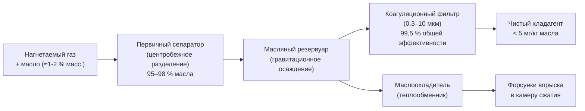

Винтовые холодильные машины (screw chillers) занимают сегмент средней производительности (35–3500 кВт) благодаря объёмному вытеснению при сжатии через сцепляющиеся спиральные роторы. Технология обеспечивает превосходную эффективность при частичной нагрузке, непрерывную бесступенчатую модуляцию производительности и исключительную надёжность. Масляное охлаждение при сжатии снижает температуру нагнетания значительно ниже, чем у поршневых компрессоров, при сохранении высокого объёмного КПД в широком диапазоне условий.

## Конструкция и принцип работы двухвинтового компрессора

Конфигурация с двумя параллельными роторами: ведущий ротор (обычно 4 выступа) и ведомый ротор (6 впадин) сопрягаются без контакта — разделены масляной плёнкой толщиной 10–30 мкм. При вращении роторов межлопастные пространства прогрессивно уменьшаются от стороны всасывания к стороне нагнетания, сжимая хладагент.


### Физика процесса сжатия

Встроенное объёмное отношение (built-in volume ratio) $V_i$ определяет геометрическую степень сжатия до открытия порта нагнетания:


V_i = \frac{V_{\text{всасывание}}}{V_{\text{нагнетание}}} = \left(\frac{P_{\text{нагн}}}{P_{\text{всас}}}\right)^{1/n}


где $n$ — показатель политропы (1,05–1,15 при впрыске масла). Наивысшая эффективность достигается, когда $V_i$ соответствует рабочей степени сжатия. Отклонение вызывает потери:

- **недосжатие** (under-compression): $P_{\text{внутр}} < P_{\text{нагн}}$ при открытии порта → дополнительная работа при выбросе;
- **пересжатие** (over-compression): $P_{\text{внутр}} > P_{\text{нагн}}$ → обратный удар при открытии порта.

Объёмный КПД остаётся высоким (85–95 %) благодаря положительному вытеснению и масляному уплотнению:


\eta_v = \frac{\dot{m}_{\text{факт}}}{\rho_{\text{всас}} \cdot V_{\text{swept}} \cdot N}


Потребление мощности компрессора:


P_{\text{comp}} = \frac{\dot{m} \cdot (h_{\text{нагн}} - h_{\text{всас}})}{\eta_{\text{comp}}}


где $\eta_{\text{comp}} = 0{,}68$–0,75 для современных конструкций.

## Одновинтовой компрессор (Single-Screw Compressor)

Одновинтовые компрессоры используют один цилиндрический главный ротор со спиральными канавками и два звездообразных ведомых ротора, расположенных симметрично под углом 90°. Конфигурация обеспечивает:
- естественный баланс радиальных сил на главном роторе;
- пониженные нагрузки на подшипники по сравнению с двухвинтовыми;
- более длительный ресурс подшипников.


| Параметр | Двухвинтовой | Одновинтовой |
|---|---|---|
| Диапазон мощности | 35–3500 кВт | 70–1750 кВт |
| кВт/кВт при частичной нагрузке | 0,50–0,60 | 0,52–0,62 |
| Вибрация | Низкая | Очень низкая |
| Ресурс подшипников | 60 000–80 000 ч | 80 000–100 000 ч |
| Эффективность сепарации масла | ≥ 99,5 % | ≥ 99,0 % |
| Интервал замены масла | 8000–10 000 ч | 10 000–12 000 ч |


## Регулирование производительности золотниковым клапаном (Slide Valve)

Золотниковый клапан обеспечивает бесступенчатую модуляцию производительности от 100 % до 10–25 % путём осевого перемещения клапана, изменяющего:

1. Задержку начала сжатия — часть газа рециркулирует на всасывание;
2. Эффективную рабочую длину роторов;
3. Объёмный КПД в диапазоне регулирования.

```mermaid
flowchart TB
    A[Сигнал управления производительностью] --> B{Алгоритм управления\nПИД-регулятор}
    B --> C[Гидравлический или электрический привод\nзолотникового клапана]
    C --> D[Положение клапана x]
    D --> E["Эффективная длина ротора L_eff"]
    E --> F[Объём сжатия и расход]
    F --> G[Холодопроизводительность Q]
    G --> H{Датчик нагрузки\n(температура воды)}
    H --> B
```

Зависимость производительности от положения золотника:


Q_{\text{cap}} = Q_{\text{design}} \cdot \frac{L_{\text{eff}}(x)}{L_{\text{total}}} \cdot \eta_v(x)


Потребление мощности при частичной нагрузке:


P_{\text{part}} = P_{\text{full}} \cdot \left[\left(\frac{Q_{\text{part}}}{Q_{\text{full}}}\right)^{0{,}7} + 0{,}15\right]


Показатель степени < 1,0 обеспечивает IPLV значительно лучше полнонагрузочного значения.

## Масляное охлаждение и разделение масла

Масло в винтовом компрессоре выполняет три функции:

1. **Уплотнение**: заполняет зазоры между роторами и корпусом (10–30 мкм), предотвращая перетечки хладагента;
2. **Охлаждение**: поглощает тепло сжатия, снижая температуру нагнетания на 22–33 °C;
3. **Смазка**: защищает подшипники и поверхности роторов от износа.

### Термодинамика масляного охлаждения

Полиолэфирное (POE) масло впрыскивается в камеру сжатия и поглощает тепло:


\dot{Q}_{\text{oil}} = \dot{m}_{\text{oil}} \cdot c_p \cdot \Delta T_{\text{oil}}


Расход масла: 10–20-кратный по отношению к расходу хладагента. Нагрев масла: 11–22 °C. Масляное охлаждение приближает процесс к изотермическому — температуры нагнетания на 44–67 °C ниже, чем у поршневых компрессоров при аналогичной степени сжатия.

### Система разделения масла



Перепад давления на форсунках впрыска:


\Delta P_{\text{inj}} = P_{\text{oil,pump}} - P_{\text{compression,pocket}}


Типовое значение: 345–690 кПа для обеспечения мелкодисперсного распыления масла.

## Переменное объёмное отношение (VVR — Variable Volume Ratio)

Продвинутые конструкции включают подвижный упор (Vi slide) в дополнение к золотниковому клапану. Это позволяет регулировать встроенное объёмное отношение $V_i$ в соответствии с фактическими рабочими условиями.

Потери при недосжатии:


P_{\text{loss,under}} = \int_{V_i}^{V_d} (P_{\text{нагн}} - P_{\text{внутр}}) \, dV


Потери при пересжатии:


P_{\text{loss,over}} = \int_{V_i}^{V_d} (P_{\text{внутр}} - P_{\text{нагн}}) \, dV


VVR минимизирует эти потери, корректируя $V_i$ на основе текущего соотношения давлений $P_{\text{нагн}} / P_{\text{всас}}$, что особенно ценно при сезонных изменениях температуры охлаждающей воды.

## Цикл с экономайзером (Economizer Cycle)

Экономайзер повышает производительность и эффективность на 10–20 % через промежуточный впрыск хладагента при промежуточном давлении.

### Термодинамика экономайзера

Оптимальное давление испарителя-экономайзера (flash tank):


P_{\text{econ}} = \sqrt{P_{\text{всас}} \cdot P_{\text{нагн}}}


При $P_{\text{всас}} = 300$ кПа и $P_{\text{нагн}} = 1000$ кПа:


P_{\text{econ}} = \sqrt{300 \times 1000} = \sqrt{300\,000} \approx 548\ \text{кПа}


Прирост холодопроизводительности:


\Delta Q_{\text{econ}} = \dot{m}_{\text{main}} \cdot h_{fg,\text{econ}} \cdot x_{\text{flash}}


где $x_{\text{flash}}$ — доля вскипания в flash-бake (обычно 0,15–0,25), $h_{fg,\text{econ}}$ — теплота парообразования при давлении экономайзера.

Мощность компрессора растёт менее пропорционально приросту холодопроизводительности:


\frac{\Delta P}{\Delta Q} < 1{,}0


Итог — улучшение COP на 8–15 % при проектных условиях.

## Расчётный пример: сравнение эффективности с экономайзером и без

**Чиллер**: винтовой, R-513A, $Q_{\text{nom}} = 500$ кВт, $T_{\text{CHWS}} = 6{,}7$ °C, $T_{\text{CWS}} = 29{,}4$ °C.

**Без экономайзера**: кВт/кВт = 0,60.

**С экономайзером** (улучшение 12 %): кВт/кВт = $0{,}60 / 1{,}12 = 0{,}536$.

**Экономия мощности:**


\Delta P = 500 \times (0{,}600 - 0{,}536) = 500 \times 0{,}064 = 32\ \text{кВт}


**Годовая экономия** при 3000 часах работы и стоимости электроэнергии 8 руб/кВт·ч:


\text{Экономия} = 32 \times 3000 \times 8 = 768\,000\ \text{руб/год}


## Применения винтовых холодильных машин

Винтовые чиллеры оптимальны для:
- **коммерческих зданий** 5000–50 000 м²: умеренная производительность, переменная нагрузка;
- **технологического охлаждения**: пластмассы, металлообработка, химия;
- **районного охлаждения малого масштаба**: несколько взаимно резервирующих машин;
- **холодильных складов**: низкотемпературный диапазон, высокая степень сжатия.

## Выбор хладагента


| Хладагент | GWP | Применение | Примечания |
|---|---|---|---|
| R-134a | 1430 | Водяное охлаждение | Вывод по EU F-Gas с 2024 |
| R-513A | 631 | Новые установки, retrofit | Прямая замена R-134a |
| R-1234ze(E) | 6 | Приоритет экологии | A2L, производительность немного ниже |
| R-515B | 299 | Сбалансированный выбор | Появляющаяся альтернатива |


## Требования ASHRAE 90.1 и AHRI 550/590

**Путь A** (полная нагрузка), водяное охлаждение:
- кВт/кВт ≤ 0,640 (< 527 кВт);
- кВт/кВт ≤ 0,600 (527–1055 кВт).

**Путь B** (IPLV), водяное охлаждение:
- IPLV ≤ 0,540 (< 527 кВт);
- IPLV ≤ 0,500 (527–1055 кВт).

Современные высокоэффективные винтовые чиллеры с VVR, экономайзером и VFD достигают 0,45–0,55 кВт/кВт при полной нагрузке и 0,35–0,45 кВт/кВт IPLV — значительно превышая нормативные минимумы.

## Системное исполнение

### Водяное охлаждение (Water-Cooled)
- Испаритель: кожухотрубный или паяный пластинчатый;
- Конденсатор: кожухотрубный с развитой поверхностью;
- Градирня: открытая или закрытая схема;
- Возможность интеграции водяного экономайзера (waterside economizer) при低 температурах охлаждающей воды.

### Воздушное охлаждение (Air-Cooled)
- Микроканальные (microchannel) или оребрённые (fin-and-tube) конденсаторы;
- Вентиляторы конденсатора с VFD для управления давлением конденсации;
- Управление при отрицательных наружных температурах — работа до -29 °C с алгоритмами head pressure control;
- Пониженная сложность (отсутствие градирни, нет рисков легионеллы).

Выбор между конфигурациями: воздушное охлаждение потребляет на 20–30 % больше электроэнергии, но имеет более низкие первоначальные и эксплуатационные затраты в регионах с ограниченным водоснабжением.

---

Источники: ASHRAE Handbook — HVAC Systems and Equipment, Chapter 38; AHRI Standard 550/590-2023; ASHRAE Standard 90.1-2022; EN 14511:2022; СП 60.13330.2020.
