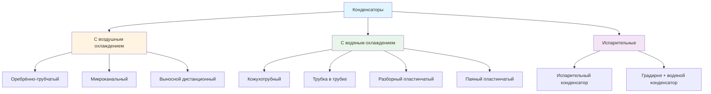

Конденсатор — критический теплообменный аппарат в цикле парокомпрессионной холодильной машины (vapor-compression refrigeration cycle). Он отводит теплоту, поглощённую испарителем (evaporator), плюс энергию, подведённую компрессором (compressor), в тепловой сток — наружный воздух, воду или испарительно-охлаждаемый воздух. При этом хладагент претерпевает фазовое превращение (phase transition) из пара в жидкость при повышенном давлении, обеспечивая непрерывную работу цикла.

## Основные принципы теплоотвода

Полный тепловой поток в конденсаторе превышает холодопроизводительность испарителя, что следует из первого закона термодинамики:


Q_c = Q_e + W_{\text{comp}}


Где:
- $Q_c$ — теплоотвод в конденсаторе, кВт
- $Q_e$ — холодопроизводительность испарителя, кВт
- $W_{\text{comp}}$ — мощность привода компрессора, кВт

Для эффективного оборудования коэффициент теплоотвода (heat rejection factor, HRF) составляет 1,20–1,30:


\text{HRF} = \frac{Q_c}{Q_e}


Тепловой поток через конденсатор выражается также через параметры хладагента:


Q_c = \dot{m}_r \cdot (h_2 - h_4)


Где:
- $\dot{m}_r$ — массовый расход хладагента, кг/с
- $h_2$ — энтальпия на выходе компрессора (нагнетании), кДж/кг
- $h_4$ — энтальпия жидкого хладагента на выходе конденсатора, кДж/кг

### Расчётный пример (SI)

Холодильная машина с R-410A. Холодопроизводительность $Q_e = 200$ кВт, мощность компрессора $W_{\text{comp}} = 60$ кВт.


Q_c = 200 + 60 = 260 \text{ кВт}



\text{HRF} = \frac{260}{200} = 1{,}30


Это означает, что конденсатор должен рассеивать в окружающую среду на 30 % больше теплоты, чем производит испаритель.

## Температурный напор и температура подхода

Теплопередающая способность конденсатора определяется разностью температур между хладагентом и охлаждающей средой:


TD = T_{\text{конд}} - T_{\text{среды}}


Для конденсаторов с водяным охлаждением температура подхода (approach temperature) характеризует термическую эффективность:


\Delta T_{\text{подх}} = T_{\text{конд}} - T_{\text{воды,вых}}


Типовая температура подхода для кожухотрубных конструкций — 3–6 °C (согласно AHRI 450).

## Типы и конфигурации конденсаторов

### Конденсаторы с воздушным охлаждением (air-cooled condensers)

Теплоприёмником служит наружный воздух. Конструкция — оребрённо-трубчатые змеевики (fin-tube coils): медные трубки, алюминиевые рёбра, A-образная или горизонтальная компоновка. Интенсивность теплопередачи:


Q = U \cdot A \cdot \text{LMTD}


Где:
- $U$ — общий коэффициент теплопередачи (overall heat transfer coefficient), Вт/(м²·К)
- $A$ — площадь поверхности теплообмена, м²
- LMTD — логарифмическая средняя разность температур (log mean temperature difference), °C

Конденсаторы с воздушным охлаждением работают при температурах конденсации на 8–17 °C выше температуры наружного воздуха. Микроканальные конденсаторы (microchannel condensers) снижают заряд хладагента на 40–60 % и повышают теплообмен, однако чувствительны к загрязнению воздуха.

### Кожухотрубные конденсаторы (shell-and-tube condensers)

Доминирующий тип с водяным охлаждением для коммерческих и промышленных применений. Хладагент конденсируется в межтрубном пространстве (shell side), охлаждающая вода движется по трубкам (tube side). Ключевые параметры проектирования:

- Число ходов (passes): 1, 2, 4 или 6
- Наружный диаметр трубок: 15,9; 19,1 или 25,4 мм
- Скорость воды: 1,2–3,7 м/с (для предотвращения биообрастания и осадков)
- Коэффициент загрязнения (fouling factor): 0,000045–0,000176 м²·К/Вт (чистая вода, по AHRI 450)

Потеря давления на стороне воды — уравнение Дарси–Вейсбаха:


\Delta P = f \cdot \frac{L}{D} \cdot \frac{\rho v^2}{2}


### Пластинчатые теплообменники (plate heat exchangers)

Гофрированные металлические пластины с прокладками (gasket) или паяные (brazed plate heat exchanger, BPHE). Преимущества:

- Компактность: объём в 3–5 раз меньше кожухотрубного
- Высокая турбулентность и коэффициенты теплопередачи
- Лёгкая корректировка числа пластин при изменении нагрузки
- Рабочее давление BPHE: до 3100 кПа — подходит для R-410A и CO₂

### Испарительные конденсаторы (evaporative condensers)

Комбинируют испарение воды и теплоотвод воздухом, обеспечивая температуры конденсации, близкие к температуре влажного термометра (wet-bulb temperature) наружного воздуха. Эффективный температурный напор:


TD_{\text{эфф}} = T_{\text{конд}} - T_{\text{вт}}


Где $T_{\text{вт}}$ — температура влажного термометра окружающего воздуха. Испарительные конденсаторы работают при температурах конденсации на 6–11 °C выше $T_{\text{вт}}$, что даёт экономию мощности компрессора 20–30 % по сравнению с воздушным охлаждением.

## Сравнительная таблица конденсаторов


| Тип | Превышение над теплостоком | Капитальные затраты | Эксплуатационные затраты | Потребление воды | Обслуживание |
|---|---|---|---|---|---|
| С воздушным охлаждением | 8–17 °C выше Т_нв | Низкие | Высокие | Нет | Низкое |
| Кожухотрубный (водяной) | 3–6 °C выше Т_вх воды | Высокие | Низкие | Умеренное | Умеренное |
| Испарительный | 6–11 °C выше Т_вт | Средние | Низкие | Высокое | Высокое |
| Паяный пластинчатый | 3–6 °C выше Т_вх воды | Средние | Низкие | Умеренное | Низкое |


## Стандарты AHRI для аттестации конденсаторов

Институт кондиционирования воздуха, отопления и холодоснабжения (Air-Conditioning, Heating, and Refrigeration Institute, AHRI) устанавливает стандартные условия аттестации:

**AHRI 460** — Производительность выносных конденсаторов с механической вытяжкой и воздушным охлаждением (remote mechanical-draft air-cooled condensers). Стандартные условия:
- Температура входящего воздуха: 35 °C по сухому термометру
- Температура конденсации: зависит от хладагента
- Высота над уровнем моря: нормальная (стандартная плотность воздуха)

**AHRI 450** — Производительность конденсаторов с водяным охлаждением. Стандартные условия:
- Температура входящей воды: 29 °C
- Расход воды: 0,054 л/(с·кВт) холодопроизводительности
- Коэффициент загрязнения: 0,000045 м²·К/Вт

Производители обязаны публиковать сертифицированные данные о производительности и потерях давления, что обеспечивает стандартизированный выбор и сравнение оборудования.

## Критерии выбора при проектировании

1. **Климат**: воздушное охлаждение — для умеренного климата; испарительное — для жаркого сухого
2. **Наличие воды**: конденсаторы с водяным охлаждением требуют стабильного водоснабжения или градирни
3. **Ограничения по площади**: пластинчатые теплообменники минимизируют занимаемое пространство
4. **Стоимость энергии**: снижение температуры конденсации напрямую уменьшает мощность компрессора
5. **Ресурсы технического обслуживания**: испарительные конденсаторы требуют водоподготовки и периодической чистки
6. **Нормативные требования**: ограничения по сбросу воды и температуре выбросов
7. **Акустика**: конденсаторы с воздушным охлаждением создают 60–75 дБ(А) на расстоянии 3 м (ASHRAE Handbook — HVAC Systems and Equipment, глава 39)

## Переохлаждение жидкости (subcooling)

Охлаждение жидкого хладагента ниже температуры насыщения при давлении конденсатора улучшает производительность цикла:


\Delta T_{\text{пох}} = T_{\text{нас}} - T_{\text{жидк}}


Типовое переохлаждение — 4–8 °C. Оно предотвращает образование паровых пузырей (flash gas) в жидкостной линии, обеспечивает стабильную работу расширительного клапана и увеличивает холодопроизводительность цикла примерно на 0,5–1,0 % на каждый градус переохлаждения (ASHRAE Handbook — Fundamentals, глава 2).

Правильный выбор, расчёт и техническое обслуживание конденсатора непосредственно определяют эффективность всей холодильной системы. Недостаточный теплоотвод ведёт к росту давления конденсации, снижению холодопроизводительности, перегреву и ускоренному износу компрессора.
