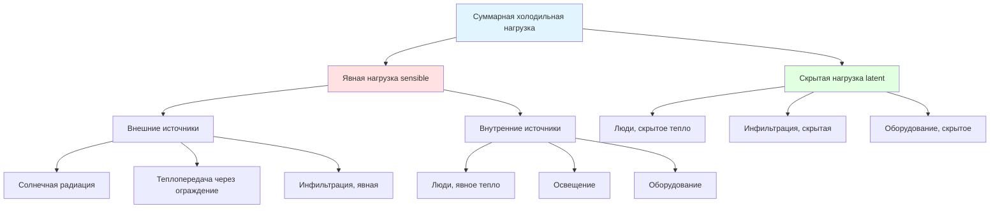

Расчёт холодильной нагрузки (cooling load calculation) определяет необходимую скорость отвода теплоты для поддержания заданных параметров внутреннего микроклимата. Точные расчёты нагрузок являются обязательным условием правильного подбора оборудования HVAC и энергоэффективного проектирования систем согласно ASHRAE Handbook — Fundamentals (глава 18) и ASHRAE 183.

## Фундаментальные концепции

### Теплопоступления и холодильная нагрузка

**Теплопоступление (heat gain)** — скорость поступления или выделения теплоты в помещении:


q_{\text{пост}} = q_{\text{внешн}} + q_{\text{внутр}}


**Холодильная нагрузка (cooling load)** — скорость отвода теплоты из воздуха помещения для поддержания заданной температуры. Из-за тепловой массы ограждений холодильная нагрузка отстаёт по времени от мгновенного теплопоступления:


q_{\text{охл}}(t) \neq q_{\text{пост}}(t)


**Коэффициент радиационного запаздывания (radiant time factor, RTF)** — доля радиационного теплопоступления, переходящая в мгновенную холодильную нагрузку. Остаток накапливается в тепловой массе ограждений и выделяется с задержкой.

### Состав холодильной нагрузки

## Методы расчёта нагрузки

### Метод CLTD/CLF

Упрощённый метод с использованием предварительно рассчитанных коэффициентов. Применяется для жилых и лёгких коммерческих зданий.

**Стены и кровля:**


q = U \times A \times \text{CLTD}_{\text{корр}}


Корректировка CLTD (cooling load temperature difference — разность температур при холодильной нагрузке):


\text{CLTD}_{\text{корр}} = \text{CLTD} + (25{,}5 - T_{\text{пом}}) + (T_{\text{нв,ср}} - T_{\text{нв,расч}})


**Окна (солнечная составляющая):**


q_{\text{солн}} = A \times \text{SHGC} \times \text{SC} \times \text{CLF}


Где SHGC (solar heat gain coefficient) — коэффициент солнечного теплопоступления; SC (shading coefficient) — коэффициент затенения; CLF (cooling load factor) — учитывает тепловую задержку.

**Ограничения метода:** фиксированные типы конструкций, ограниченная географическая применимость, упрощённый учёт тепловой массы. Метод устарел и заменён методом RTS.

### Метод временных рядов радиации (radiant time series, RTS)

Рекомендованный ASHRAE метод (с 2001 г.) с разделением радиационного и конвективного теплового воздействия.

**Процедура:**
1. Расчёт мгновенных теплопоступлений (солнечные, через ограждение, внутренние)
2. Разделение на конвективную (немедленная нагрузка) и радиационную (задержанная) составляющие
3. Применение коэффициентов RTF для преобразования радиационных поступлений в нагрузку:


q_{\text{рад,нагр}}(t) = \sum_{i=0}^{23} q_{\text{рад,пост}}(t-i) \times \text{RTF}_i


Где $\text{RTF}_i$ — коэффициент временного ряда излучения для задержки $i$ часов.

**Преимущества:** точный учёт тепловой массы, применимость к любым типам зданий, соответствие принципам теплового баланса, реализован в большинстве расчётных программ.

### Метод теплового баланса (heat balance method, HBM)

Наиболее строгий подход — решение уравнений энергетического баланса для всех поверхностей и воздуха помещения одновременно.

**Баланс наружной поверхности:**


\alpha I_{\text{солн}} + q_{\text{LWR}} + q_{\text{конв,нар}} = q_{\text{конд}}


Где $\alpha I_{\text{солн}}$ — поглощённое солнечное излучение; $q_{\text{LWR}}$ — длинноволновый лучистый обмен; $q_{\text{конв,нар}}$ — наружная конвекция; $q_{\text{конд}}$ — теплопроводность через ограждение.

**Баланс внутренней поверхности:**


q_{\text{конд}} + q_{\text{LWR,вн}} + q_{\text{солн,пропущ}} = q_{\text{конв,вн}}


**Баланс воздуха помещения:**


\sum q_{\text{конв,вн}} + q_{\text{инф}} + q_{\text{внутр}} = q_{\text{охл}}


Метод реализован в EnergyPlus и DOE-2. Применяется для исследований, детального анализа, почасового энергомоделирования.

## Явная и скрытая холодильная нагрузка

### Явная нагрузка (sensible cooling load)

Теплота, изменяющая температуру воздуха:


q_{\text{явн}} = \dot{m} \cdot c_p \cdot (T_{\text{обр}} - T_{\text{прит}})


Источники: солнечная радиация через остекление, теплопроводность через ограждение, явное тепло людей, освещение, оборудование, инфильтрация и вентиляция.

### Скрытая нагрузка (latent cooling load)

Поступление влаги, требующей осушения:


q_{\text{скр}} = \dot{m} \cdot h_{fg} \cdot (W_{\text{обр}} - W_{\text{прит}})


Где $h_{fg} = 2501$ кДж/кг при 0 °C. Источники: люди (испарение, дыхание), инфильтрация и вентиляция влажного воздуха, технологическое оборудование.

### Коэффициент явного тепла (sensible heat ratio, SHR)


\text{SHR} = \frac{q_{\text{явн}}}{q_{\text{явн}} + q_{\text{скр}}}


Типовые значения:
- Жилые здания: 0,70–0,80
- Офисные здания: 0,80–0,90
- Аудитории с высокой заполняемостью: 0,60–0,70
- Серверные залы: 0,95–1,00

SHR определяет требования к температуре точки росы на воздухоохладителе и необходимую мощность осушения.

## Определение пиковой нагрузки

### Проектные условия ASHRAE

ASHRAE публикует климатические данные с параметрами 0,4 %; 1,0 % и 2,0 % (частота превышения):


| Параметр | Описание | Область применения |
|---|---|---|
| 0,4% DB/MCWB | Температура превышается 35 ч/год | Критические объекты (больницы, ЦОД) |
| 1,0% DB/MCWB | Температура превышается 88 ч/год | Стандартные коммерческие здания |
| 2,0% DB/MCWB | Температура превышается 175 ч/год | Жилые здания, некритичные применения |


### Коэффициенты разнообразия и запаса

**Разнообразие (diversity)**: компоненты нагрузок редко достигают пика одновременно:


q_{\text{пик,факт}} < \sum q_{\text{пик,компон}}


Примеры: восточные и западные окна имеют пик солнечной нагрузки в разное время; использование офисного оборудования неодновременно; освещение в разных зонах работает по разным расписаниям.

**Современная практика**: чрезмерные коэффициенты запаса (более 10–15 %) приводят к завышению мощности оборудования, частым пусковым циклам, плохому осушению и снижению срока службы оборудования.

## Порядок расчёта нагрузки

**Шаг 1 — Исходные данные по зданию**: геометрия и ориентация, конструкции ограждений, типы и размеры окон, расписание и плотность присутствия людей, удельная мощность оборудования и освещения.

**Шаг 2 — Проектные условия**: наружные расчётные температура и влажность (из климатических данных ASHRAE или СП 131.13330); уставки температуры и влажности внутри; поправка на высоту над уровнем моря.

**Шаг 3 — Расчёт теплопоступлений**: внешние (солнечное, через ограждение, инфильтрация) и внутренние (люди, освещение, оборудование); почасовой профиль при методе RTS или HBM.

**Шаг 4 — Преобразование в холодильные нагрузки**: применение коэффициентов CLTD/CLF, или коэффициентов RTF, или решение уравнений теплового баланса.

**Шаг 5 — Анализ пиковой нагрузки**: определение часа пика для каждой зоны; расчёт одновременного пика системы; разделение на явную и скрытую составляющие; вычисление SHR.

**Шаг 6 — Подбор оборудования**: оборудование охлаждения подбирается по пиковой нагрузке с проверкой производительности при частичной нагрузке и SHR.

## Пример расчёта (SI)

Типичное офисное здание в умеренном климате:


| Источник теплопоступления | Явная, кВт | Скрытая, кВт | Суммарная, кВт |
|---|---|---|---|
| Солнечная радиация через окна | 45 | 0 | 45 |
| Теплопередача через ограждение | 25 | 0 | 25 |
| Инфильтрация | 5 | 8 | 13 |
| Вентиляция (наружный воздух) | 15 | 22 | 37 |
| Люди | 12 | 18 | 30 |
| Освещение | 35 | 0 | 35 |
| Оборудование | 28 | 2 | 30 |
| **Итого** | **165** | **50** | **215** |



\text{SHR} = \frac{165}{215} = 0{,}77


Расход приточного воздуха при разности температур 10 °C между приточным воздухом и помещением:


\dot{m} = \frac{q_{\text{явн}}}{c_p \cdot \Delta T} = \frac{165}{1{,}006 \times 10} = 16{,}4 \text{ кг/с}



\dot{V} = \frac{16{,}4}{1{,}2} = 13{,}7 \text{ м}^3/\text{с} = 49\,200 \text{ м}^3/\text{ч}


## Типичные ошибки

1. **Неправильная ориентация здания** — приводит к существенным ошибкам в расчёте солнечной нагрузки на фасады с большой площадью остекления
2. **Игнорирование тепловой массы** — предположение о лёгкой конструкции для массивных зданий завышает пиковую нагрузку на 20–40 %
3. **Нереалистичные внутренние нагрузки** — использование максимальных плотностей людей, освещения и оборудования, никогда не совпадающих по пику одновременно
4. **Неверные климатические данные** — использование данных соседнего города вместо фактических данных объекта
5. **Неучтённая вентиляция** — нагрузка от наружного воздуха составляет 20–40 % суммарной нагрузки
6. **Игнорирование высоты над уровнем моря** — плотность воздуха ниже на 17 % на высоте 1500 м
7. **Наложение избыточных коэффициентов запаса** — приводит к завышению мощности на 30–50 %

## Расчётное программное обеспечение

- **Carrier HAP** (Hourly Analysis Program) — комплексный анализ нагрузок и энергопотребления
- **Trane TRACE 3D Plus** — почасовое энергомоделирование
- **EnergyPlus** — метод теплового баланса, открытое ПО от US DOE
- **DesignBuilder** — графический интерфейс к EnergyPlus

## Нормативные документы

- **ASHRAE Handbook — Fundamentals, глава 18** — комплексные методы расчёта нагрузок
- **ASHRAE 183** — расчёт пиковых холодильных и тепловых нагрузок в зданиях
- **ASHRAE 90.1-2022** — минимальные требования к энергоэффективности зданий
- **СП 60.13330.2020** — системы отопления, вентиляции и кондиционирования; расчётные параметры
- **СП 131.13330.2020** — строительная климатология; климатические данные по регионам России
