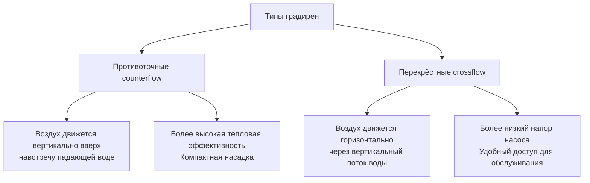

Градирня (cooling tower) — устройство испарительного теплоотвода (evaporative heat rejection), передающее теплоту от охлаждающей воды в атмосферу за счёт частичного испарения воды. Градирни — критические компоненты систем кондиционирования с водяным охлаждением, промышленных процессов и энергетических объектов. Физический принцип: прямой контакт воды и воздуха обеспечивает испарение незначительной доли воды, что отводит скрытую теплоту из оставшегося потока.

## Классификация градирен

### По принципу движения воздуха

**Градирни с механической тягой (mechanical-draft cooling towers)**

*Вытяжные (induced-draft)* — вентилятор расположен на выходе воздуха (сверху) и вытягивает воздух через насадку. Скорость воздуха на входе низкая, на выходе — высокая, что снижает рециркуляцию выхлопа. Составляют около 80 % установок механической тяги. Обеспечивают лучшие характеристики при минимальном видимом факеле.

*Нагнетательные (forced-draft)* — вентилятор расположен снизу и нагнетает воздух вверх. Более высокая скорость на входе увеличивает риск рециркуляции. Преимущество — упрощённый доступ к вентилятору для обслуживания; предпочтительны для малопрофильных установок.

**Градирни с естественной тягой (natural-draft cooling towers)**

Используют силы плавучести: тёплый влажный воздух внутри башни легче холодного снаружи. Гиперболические бетонные конструкции высотой более 100 м; применяются на крупных электростанциях. Не требуют мощности вентилятора, но чувствительны к атмосферным условиям и требуют значительных капитальных вложений.

### По конфигурации потоков воды и воздуха

## Сравнение противоточных и перекрёстных градирен


| Параметр | Противоток (counterflow) | Перекрёстный поток (crossflow) |
|---|---|---|
| Контакт вода–воздух | Вертикальный, встречные направления | Горизонтально-вертикальный, перпендикулярный |
| Тепловая эффективность | Выше (подход лучше на 0,3–0,8 °C) | Средняя |
| Напор насоса | Выше (распределение под давлением) | Ниже (распределение самотёком) |
| Площадь насадки | Меньше для той же мощности | На 15–25 % больше |
| Доступ для обслуживания | Ограничен во время работы | Превосходный — внешний доступ к соплам |
| Защита от замерзания | Сложнее | Лучше — можно изолировать секции |
| Перепад давления воздуха | 150–200 Па | 100–150 Па |
| Капитальная стоимость | На 5–10 % выше для той же нагрузки | Ниже начальные инвестиции |


## Теплотехнические основы

### Мощность теплоотвода


Q = \dot{m}_w \cdot c_p \cdot (T_{\text{вх}} - T_{\text{вых}})


Где:
- $Q$ — мощность теплоотвода, кВт
- $\dot{m}_w$ — массовый расход воды, кг/с
- $c_p = 4{,}186$ кДж/(кг·К) — удельная теплоёмкость воды
- $T_{\text{вх}}$, $T_{\text{вых}}$ — температуры воды на входе и выходе, °C

### Диапазон и подход

**Диапазон (range)** — разность температур воды:


\text{Диапазон} = T_{\text{вх}} - T_{\text{вых}}


Диапазон определяется тепловой нагрузкой системы, которую обслуживает градирня, а не самой градирней.

**Подход (approach)** — разность между температурой воды на выходе и температурой влажного термометра входящего воздуха:


\text{Подход} = T_{\text{вых}} - T_{\text{вт,вх}}


Меньший подход указывает на лучшую тепловую эффективность, но требует большей и более дорогой градирни. Типовые значения:


| Категория | Подход, °C | Применение |
|---|---|---|
| Высокая эффективность | 3–4 | Чиллеры с высоким EER, интенсивная эксплуатация |
| Стандартная | 4–6 | Коммерческие здания (основная практика) |
| Экономичная | 6–8 | Менее ответственные процессы, ограниченный бюджет |


### Скорость испарения

Приблизительно 1 % циркулирующей воды испаряется на каждые 6 °C диапазона:


\dot{m}_{\text{исп}} = \frac{Q}{\lambda} = \frac{\dot{m}_w \cdot c_p \cdot \Delta T}{\lambda}


Где $\lambda \approx 2300$ кДж/кг — скрытая теплота парообразования при типичных условиях.

### Расчётный пример (SI)

**Данные**: чиллер 1000 кВт холодопроизводительности; теплоотвод $Q = 1300$ кВт (HRF = 1,30); диапазон 5 °C; температура влажного термометра $T_{\text{вт}} = 25$ °C; проектный подход = 4 °C.

**Температура воды на выходе из градирни:** $T_{\text{вых}} = 25 + 4 = 29$ °C; на входе: $T_{\text{вх}} = 29 + 5 = 34$ °C.

**Расход воды:**


\dot{m}_w = \frac{Q}{c_p \cdot \Delta T} = \frac{1300}{4{,}186 \times 5} = 62{,}1 \text{ кг/с} = 223{,}6 \text{ м}^3/\text{ч}


**Скорость испарения:**


\dot{m}_{\text{исп}} = \frac{1300}{2300} = 0{,}565 \text{ кг/с} \approx 2034 \text{ л/ч}


**Расход продувки** при 4 циклах концентрирования: $2034 / (4 - 1) = 678$ л/ч. Суммарная потребность в подпиточной воде: $2034 + 678 = 2712$ л/ч.

## Стандарты проектирования

### Стандарты CTI (Cooling Technology Institute)

- **CTI STD-201** — сертификация тепловой производительности водяных градирен механической тяги
- **CTI ATC-105** — приёмочные испытания водяных градирен; процедуры измерения расходов, температур, влажного термометра и мощности вентилятора
- **CTI STD-111** — номенклатура для промышленных водяных градирен

Сертификация CTI подтверждает соответствие публикуемым гарантиям производительности при заданных условиях расхода воды, диапазона, температуры влажного термометра и подхода.

### Требования ASHRAE 90.1-2022

ASHRAE 90.1 устанавливает минимальные требования к энергоэффективности градирен для систем комфортного охлаждения:
- Ограничения мощности вентилятора: выражены в кВт на нормируемый кубометр в час
- Обязательное управление переменной скоростью вентилятора для систем мощностью свыше 7,5 кВт
- Градирни должны обеспечивать работу при частичной нагрузке с регулируемым воздушным потоком

ASHRAE Handbook — HVAC Systems and Equipment (глава 40) содержит комплексные методы выбора, компоновки трубопроводов, водоподготовки и стратегий зимней консервации.

## Эксплуатационные соображения

**Выбор размера**: оптимизация первоначальных затрат и операционных расходов. Завышение (меньший подход) снижает потребление воды и энергию насоса, но увеличивает капитальные затраты. Анализ жизненного цикла (life-cycle cost analysis) определяет экономический оптимум.

**Водоподготовка (water treatment)**: испарение концентрирует растворённые вещества, требуя продувки и химической обработки. Параметры воды:
- Жёсткость (CaCO₃): 100–300 мг/л
- pH: 6,5–8,5
- Циклы концентрирования: 3–6
- Биоцидная обработка против Legionella: обязательна (ASHRAE 12-2000)

**Зимняя консервация**: в холодном климате применяют подогрев поддона (basin heater), двухскоростные или регулируемые вентиляторы, модулирующие заслонки и обратный слив воды при останове. Согласно СП 60.13330.2020, зимнее регулирование должно исключать обледенение насадки и поддона при $T_{\text{нв}} < 0$ °C.

**Подавление шлейфа (plume abatement)**: видимый паровой шлейф нежелателен вблизи жилых и деловых зданий. Градирни с подавлением шлейфа используют вторичные воздушные каналы или теплообменники рекуперации для смешения насыщенного выхлопного воздуха с сухим — ценой снижения тепловой эффективности и удорожания конструкции.

**Акустика**: уровень звука вентилятора — 75–85 дБ(А) на расстоянии 1 м. Для встроенных объектов применяют шумозащитные экраны и вентиляторы с малой окружной скоростью. ASHRAE Handbook — HVAC Applications (глава 48) содержит методику акустического расчёта.

## Верификация производительности

Полевые испытания по CTI ATC-105 подтверждают, что фактическая производительность соответствует проектным спецификациям. Измерения выполняются при стабилизированных условиях: расходы воды, температуры входа и выхода, температура влажного термометра воздуха, мощность вентилятора. Результаты нормируются к проектным условиям с помощью характеристических кривых градирни (cooling tower curves) для подтверждения соответствия производительности, диапазона и подхода.

Нормативные документы: **CTI STD-201**; **CTI ATC-105**; **ASHRAE 90.1-2022**; **ASHRAE Handbook — HVAC Systems and Equipment, глава 40**; **СП 60.13330.2020**.
