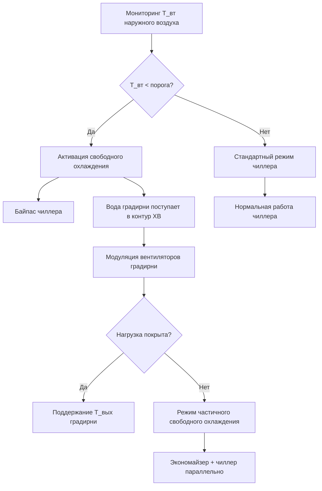

Свободное охлаждение (free cooling) с использованием градирни — стратегия, при которой благоприятные климатические условия позволяют обеспечивать охлаждение здания без механического холодильного цикла. Водяной экономайзер (water-side economizer) использует разность между низкой температурой влажного термометра наружного воздуха и тепловой нагрузкой здания, обеспечивая существенную экономию электроэнергии при прямом или косвенном теплообмене.

## Принцип водяного экономайзера

Тепловой баланс определяет возможность применения свободного охлаждения:


Q_{\text{охл}} = \dot{m}_{\text{вк}} \cdot c_p \cdot (T_{\text{вк,вых}} - T_{\text{вк,вх}})


Где $\dot{m}_{\text{вк}}$ — расход конденсаторной воды, кг/с; $T_{\text{вк,вых}}$ и $T_{\text{вк,вх}}$ — температуры на выходе и входе конденсаторного контура.

**Критерий активации свободного охлаждения**: градирня должна производить воду с температурой ниже заданной температуры хладоносителя на выходе (chilled water supply, CHWS) с учётом температурного напора теплообменника:


T_{\text{гр,вых}} \leq T_{\text{хх,подача}} - \Delta T_{\text{подх}}


Типовые значения $\Delta T_{\text{подх}}$: 2,8–5,6 °C — зависят от эффективности теплообменника.

## Схемы водяного экономайзера

### Прямая схема (direct economizer)

Вода из градирни подаётся непосредственно в контур холодной воды здания, полностью исключая чиллер в режиме экономайзера. Максимальная эффективность, минимальные потери в промежуточном теплообменнике.

**Ограничения прямой схемы**: качество воды критично — требуется непрерывная химическая обработка и фильтрация (минимум 200 мкм, рекомендуется 100 мкм) для защиты теплообменных поверхностей от биообрастания. Риск заражения закрытого контура открытой водой градирни.


| Аспект | Прямая схема | Косвенная схема |
|---|---|---|
| Тепловая эффективность | Максимальная | Ниже на ΔT подхода теплообменника |
| Энергопотребление насосов | Меньше (один контур) | Больше (два контура) |
| Требования к качеству воды | Критические | Умеренные |
| Риск биообрастания | Высокий (открытый контур) | Низкий |
| Защита от замерзания | Необходима | Проще управляется |
| Стоимость оборудования | Ниже | Выше (теплообменник) |


### Косвенная схема (indirect economizer)

Пластинчато-рамный (или паяный пластинчатый) теплообменник разделяет контур воды градирни и закрытый контур хладоносителя. Обеспечивает эксплуатационную гибкость и защиту закрытой системы от загрязнения.

**Эффективность теплообменника:**


\varepsilon = \frac{T_{\text{хх,вх}} - T_{\text{хх,вых}}}{T_{\text{хх,вх}} - T_{\text{вк,вх}}}


Высокоэффективные пластинчатые теплообменники достигают $\varepsilon = 0{,}75$–$0{,}85$. Температурный напор:


\Delta T_{\text{подх}} = \frac{T_{\text{хх,вх}} - T_{\text{вк,вх}}}{1/\varepsilon - 1}


**Подбор площади теплообменника:**


A = \frac{Q}{U \cdot \text{LMTD}}


Где $U = 3500$–$5500$ Вт/(м²·К) для пластинчатых теплообменников в турбулентном режиме потока; LMTD — логарифмическая средняя разность температур для противоточной схемы.

**Расчётный пример (SI)**

Система чиллер + градирня: $Q = 800$ кВт; температура хладоносителя 12/18 °C; температура воды градирни 8/14 °C (подход 4 °C к хладоносителю); $U = 4500$ Вт/(м²·К).


\text{LMTD} = \frac{(18-14)-(12-8)}{\ln\frac{18-14}{12-8}} = \frac{4-4}{\ln 1} \to 4 \text{ °C}


(симметричный случай; реально при асимметрии — рассчитывается формульно)


A = \frac{800\,000}{4500 \times 4} = 44{,}4 \text{ м}^2



| Компонент | Спецификация | Назначение |
|---|---|---|
| Пластины | Нержавеющая сталь 316L | Коррозионная стойкость к воде градирни |
| Температурный напор | 2,8–5,6 °C | Определяет требуемую площадь |
| Перепад давления | 35–70 кПа каждая сторона | Гидравлический баланс |
| Фильтр на стороне градирни | 100 мкм | Защита пластин от засорения |
| Управляющие клапаны | 2-ходовые модулирующие | Регулирование расхода по нагрузке |


## Стратегия сброса температуры конденсатора

Сброс температуры конденсаторной воды (condenser water reset) оптимизирует баланс между эффективностью чиллера и потенциалом свободного охлаждения. Более низкая температура охлаждающей воды повышает COP чиллера, но сокращает число часов в режиме экономайзера.

Типовой закон сброса:


T_{\text{вк,подача}} = T_{\text{вк,расч}} - K \cdot (T_{\text{нв,вт,расч}} - T_{\text{нв,вт}})


Где $K = 0{,}5$–$0{,}8$ — коэффициент сброса; $T_{\text{нв,вт}}$ — текущая температура влажного термометра.

## Режимы работы и логика управления

**Полное свободное охлаждение**: градирня полностью покрывает нагрузку; чиллер отключён; вентиляторы градирни модулируются для поддержания заданной температуры хладоносителя:


\dot{m}_{\text{гр}} \cdot c_p \cdot (T_{\text{вк,подача}} - T_{\text{вк,обр}}) \geq Q_{\text{нагр}}


**Частичное свободное охлаждение (chiller assist)**: градирня предварительно охлаждает воду перед чиллером; снижает температурный подъём (lift) и повышает COP:


\text{COP}_{\text{частичн}} \approx \text{COP}_{\text{расч}} \cdot \left(1 + \frac{\Delta T_{\text{предохл}}}{\Delta T_{\text{подъём,расч}}}\right)^{1{,}2}


**Логика переходов:**
1. Вход в режим свободного охлаждения: при $T_{\text{гр,вых}} < T_{\text{хх,подача}} - 2{,}8$ °C в течение 5 мин
2. Выход из режима: при $T_{\text{гр,вых}} > T_{\text{хх,подача}} - 1{,}1$ °C в течение 3 мин
3. Зона гистерезиса: 1,7 °C между порогами включения/отключения во избежание частых переключений

## Расчёт энергосбережения

**Энергия вентиляторов градирни:**


E_{\text{вент}} = \sum_{h=1}^{8760} P_{\text{вент}} \cdot \text{PLR}_h \cdot \eta_{\text{дв}}^{-1}


**Сэкономленная энергия чиллера:**


E_{\text{экон}} = \sum_{\text{СО}} \frac{Q_h}{\text{COP}_{\text{чилл}}} - E_{\text{вент},h} - E_{\text{нас,доп}}


**Часы свободного охлаждения по климатическим зонам:**


| Климатическая зона | Характеристика | Часы свободного охлаждения, ч/год | Экономия электроэнергии, % |
|---|---|---|---|
| 1A (жарко-влажный) | Тропики | 150–400 | 5–12 |
| 3A (тёплый-влажный) | Юг Европейской России | 800–1500 | 15–25 |
| 4A (смешанный-влажный) | Средняя полоса | 1500–2500 | 25–35 |
| 5A (холодный-влажный) | Урал, Сибирь | 2500–3500 | 35–45 |
| 6A (очень холодный) | Север России | 3500–5500 | 45–60 |


**Срок окупаемости:**


T_{\text{ок}} = \frac{C_{\text{ТО}} + C_{\text{АСУ}} + C_{\text{монт}}}{E_{\text{экон}} \cdot C_{\text{элэн}}}


Типовые сроки окупаемости: 2–5 лет в зависимости от климата, стоимости электроэнергии и числа часов эксплуатации.

## Проектные соображения

**Защита от замерзания**: в климатических зонах с $T_{\text{нв}} < 0$ °C добавляют гликоль (снижает эффективность теплопередачи на 5–15 %) или предусматривают опорожнение теплообменника при останове.

**Контроль качества воды** для косвенных систем:
- pH: 7,5–9,0
- Электропроводность: < 2000 мкСм/см
- Взвешенные вещества: < 50 мг/л
- Хлориды: < 200 мг/л

**Гидравлическое балансирование**: VFD на насосах конденсаторного и хладоносительного контуров снижают паразитные потери при частичной нагрузке, поддерживая оптимальные расходы для теплообменника.

**Автоматизация**: ASHRAE Guideline 36 (High-Performance Sequences of Operation for HVAC Systems) содержит рекомендуемые алгоритмы управления переходами режимов и оптимизации температуры конденсаторной воды.

Нормативные документы: **ASHRAE 90.1-2022**; **ASHRAE Handbook — HVAC Systems and Equipment, глава 40**; **CTI STD-201**; **СП 60.13330.2020**.
