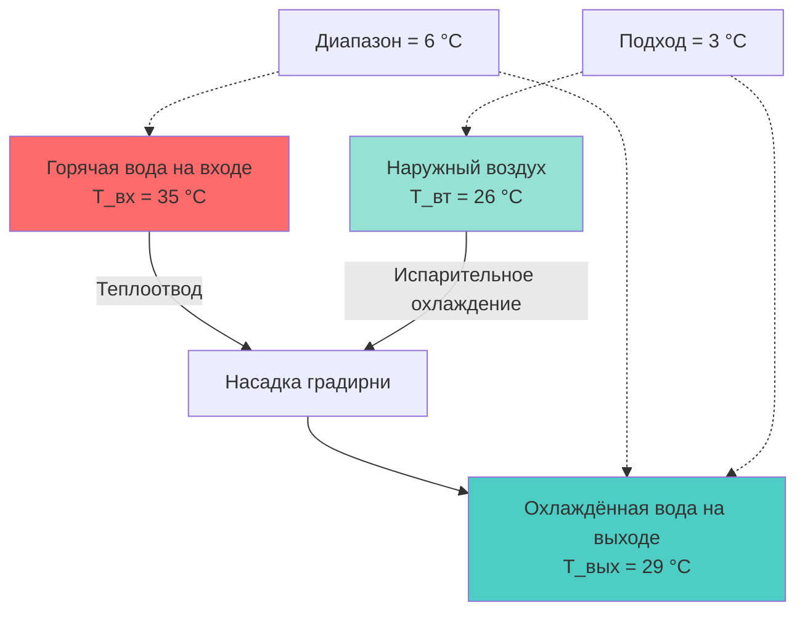
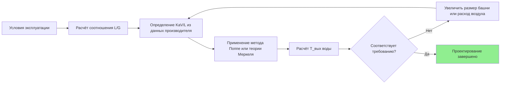

Производительность градирни количественно характеризует способность устройства испарительного теплоотвода рассеивать тепловую нагрузку. Анализ производительности основан на психрометрических принципах, управляющих тепло- и массообменом между потоками воды и воздуха. Методология оценки регламентирована стандартами CTI STD-201 и CTI ATC-105.

## Фундаментальные параметры производительности

### Диапазон и подход

**Диапазон (range)** — разность температур воды:


\text{Диапазон} = T_{\text{вх}} - T_{\text{вых}}


Диапазон характеризует тепловую нагрузку на градирню и определяется требованиями системы, которую обслуживает башня.

**Подход (approach)** — разность между температурой выходящей воды и температурой влажного термометра входящего воздуха:


\text{Подход} = T_{\text{вых}} - T_{\text{вт,вх}}


Подход измеряет термическую эффективность градирни. Меньший подход — лучшая производительность, но требует большей площади насадки и расхода воздуха.

### Расчётный пример (SI)

**Данные**: вода на входе $T_{\text{вх}} = 35$ °C; температура влажного термометра $T_{\text{вт}} = 26$ °C; диапазон 6 °C; проектный подход 3 °C. Проверка: $T_{\text{вых}} = 26 + 3 = 29$ °C; диапазон $= 35 - 29 = 6$ °C.

**Расход воды** при $Q = 700$ кВт:


\dot{m}_w = \frac{Q}{c_p \cdot \text{Диапазон}} = \frac{700}{4{,}186 \times 6} = 27{,}9 \text{ кг/с} = 100{,}4 \text{ м}^3/\text{ч}


## Мощность теплоотвода


Q = \dot{m}_w \cdot c_p \cdot \text{Диапазон} = \dot{m}_w \cdot 4{,}186 \cdot (T_{\text{вх}} - T_{\text{вых}})


Для практических расчётов при расходе в м³/ч:


Q \text{ (кВт)} \approx \frac{1{,}163 \times \dot{V}_w \text{ (м}^3/\text{ч)} \times \text{Диапазон (°C)}}{1}


## Влияние температуры влажного термометра

Температура влажного термометра (wet-bulb temperature, $T_{\text{вт}}$) фундаментально ограничивает производительность градирни: испарительное охлаждение не может снизить температуру воды ниже $T_{\text{вт}}$ входящего воздуха. Термодинамический движущий потенциал:


\Delta T_{\text{движ}} = T_w - T_{\text{вт,нас}}


Где $T_{\text{вт,нас}}$ — температура насыщения на границе раздела вода–воздух.


| T_вт, °C | T_вых при подходе 3 °C | T_вых при подходе 5,5 °C | Влияние на производительность |
|---|---|---|---|
| 22 | 25 | 27,5 | Отличная производительность |
| 26 | 29 | 31,5 | Проектное условие CTI |
| 29 | 32 | 34,5 | Сниженная производительность |
| 32 | 35 | 37,5 | Существенное ограничение |


При росте $T_{\text{вт}}$ движущий потенциал паров снижается, что уменьшает скорость испарения и требует увеличения размера башни.

## Эффективность насадки

Эффективность насадки $\varepsilon$ (fill efficiency):


\varepsilon = \frac{T_{\text{вх}} - T_{\text{вых}}}{T_{\text{вх}} - T_{\text{вт}}} = \frac{\text{Диапазон}}{\text{Диапазон} + \text{Подход}}


Безразмерный параметр в диапазоне 0–1; более высокое значение — более эффективный теплообмен.


| Тип насадки | Диапазон эффективности | Соотношение L/G | Применение |
|---|---|---|---|
| Плёночная (ПВХ) | 0,70–0,85 | 0,8–1,5 | Чистая вода, высокая эффективность |
| Разбрызгивающая | 0,60–0,75 | 1,0–2,0 | Умеренное загрязнение |
| Капельная | 0,50–0,65 | 1,5–3,0 | Сильное загрязнение |


Плёночная насадка достигает лучшей производительности благодаря тонким плёнкам воды, максимизирующим площадь поверхности на единицу объёма. Перепад давления через неё:


\Delta P_{\text{нас}} = K \cdot L \cdot \left(\frac{\dot{m}_w}{A}\right)^n


Где $K$ — коэффициент сопротивления насадки; $n = 1{,}5$–$2{,}0$.

## Соотношение L/G и баланс воздух–вода

Соотношение жидкости к газу (liquid-to-gas ratio, L/G) — фундаментальный параметр производительности:


\text{L/G} = \frac{\dot{m}_w}{\dot{m}_a}


Где $\dot{m}_w$ — расход воды, кг/ч; $\dot{m}_a$ — расход сухого воздуха, кг/ч.

Типовые значения: 0,75–1,50 для противоточных башен. Зависимость подхода от L/G:


\text{Подход} \propto (\text{L/G})^{0{,}6 \div 0{,}8}


Удвоение L/G увеличивает подход на 50–75 %, требуя большего объёма насадки.

## Стандартные условия оценки CTI

Институт технологии охлаждения (Cooling Technology Institute, CTI) устанавливает стандартизированные условия для сертификации производительности согласно CTI STD-201:

- Температура горячей воды на входе: 35 °C
- Температура холодной воды на выходе: 29 °C
- Диапазон: 6 °C
- Температура влажного термометра воздуха: 26 °C
- Подход: 3 °C

**Характеристическое уравнение башни (методология Меркеля):**


\frac{\text{KaV}}{\text{L}} = \int_{T_{\text{вых}}}^{T_{\text{вх}}} \frac{c_p \, dT_w}{h_{\text{нас}}(T_w) - h_a}


Где $\text{KaV}$ — коэффициент башни (коэффициент массопередачи × объём); $h_{\text{нас}}$ — энтальпия насыщенного воздуха при температуре воды; $h_a$ — энтальпия входящего воздуха. Этот интеграл характеризует внутренний теплообменный потенциал башни, независимо от условий эксплуатации.

## Удельный расход воды на единицу мощности

Системы конденсаторной воды типично работают при 0,054–0,075 л/(с·кВт). Стандартный расход — 0,054 л/(с·кВт) по AHRI 550/590 — получен из:


\dot{V} \text{ (л/(с·кВт))} = \frac{1}{c_p \cdot \text{Диапазон}} = \frac{1}{4{,}186 \times 6} = 0{,}0398


С учётом коэффициента безопасности 15–25 % принимается 0,054 л/(с·кВт).


| Удельный расход, л/(с·кВт) | Диапазон, °C | Влияние на подход | Размер башни | Энергопотребление насоса |
|---|---|---|---|---|
| 0,040 | 9 | Меньший подход возможен | Меньше | Ниже |
| 0,054 | 6 | Стандартный подход | Стандарт | Стандарт |
| 0,072 | 4,5 | Больший подход | Больше | Выше |


## Энергопотребление

Общая мощность системы:


P_{\text{сист}} = P_{\text{вент}} + P_{\text{нас}}


**Мощность вентилятора:**


P_{\text{вент}} = \frac{\dot{V}_{\text{возд}} \cdot \Delta P_{\text{стат}}}{\eta_{\text{вент}} \cdot 1000}


Статическое давление для вытяжных башен: 50–125 Па.

**Мощность насоса конденсаторной воды:**


P_{\text{нас}} = \frac{\dot{V}_w \cdot H_{\text{полн}} \cdot \rho_w \cdot g}{\eta_{\text{нас}} \cdot 1000}


Оптимизация производительности требует балансирования между этими потребителями при соблюдении требования к подходу согласно ASHRAE 90.1-2022.

## Верификация производительности в полевых условиях

Приёмочные испытания по CTI ATC-105 проводятся при стабилизированных условиях эксплуатации. Измеряются:
- Расходы воды (±5 % от проектного)
- Температуры на входе и выходе (±0,6 °C для подхода)
- Температура влажного термометра воздуха (±1,1 °C)
- Мощность вентилятора

Результаты нормируются к проектным условиям с использованием характеристических кривых башни для подтверждения соответствия диапазона, подхода и L/G.

Нормативные документы: **CTI STD-201**; **CTI ATC-105**; **ASHRAE 90.1-2022**; **ASHRAE Handbook — HVAC Systems and Equipment, глава 40**.
