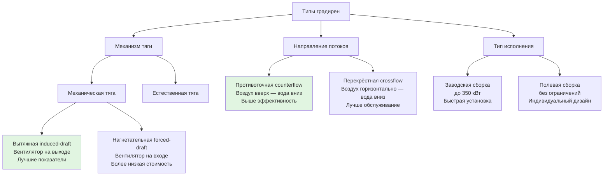

Градирни отводят тепло от систем HVAC с водяным охлаждением и промышленных процессов в атмосферу посредством испарительного охлаждения. Выбор типа зависит от требуемой тепловой мощности, доступного пространства, целевых показателей энергоэффективности и бюджета. Рассматриваются три классификационных признака: механизм создания тяги, направление потоков воды и воздуха, тип исполнения.

## Классификация по механизму тяги

### Вытяжные градирни (induced-draft)

Вентилятор расположен на выходе воздуха (сверху) и вытягивает воздух вверх через насадку. Скорость выброса: 7,6–12,7 м/с — снижает рециркуляцию тёплого влажного выхлопа обратно во всасывание. Составляют ~80 % установок механической тяги. КПД вентилятора: 70–80 %.

Вентилятор контактирует с горячим влажным воздухом → требуется влагостойкое исполнение (стеклопластик, оцинковка). Более равномерное распределение воздуха по сечению насадки по сравнению с нагнетательными.

Мощность вентилятора:


P_{\text{вент}} = \frac{\dot{V}_{\text{возд}} \cdot \Delta P_{\text{стат}}}{\eta_{\text{вент}} \cdot 1000}


Где $\dot{V}_{\text{возд}}$ — расход воздуха, м³/с; $\Delta P_{\text{стат}} = 76$–$152$ Па (типично для вытяжных противоточных); $\eta_{\text{вент}} = 0{,}70$–$0{,}80$; результат в кВт.

### Нагнетательные градирни (forced-draft)

Вентилятор расположен у основания или сбоку — нагнетает воздух через насадку. Скорость выброса: 2,5–4,1 м/с → повышенный риск рециркуляции насыщенного выхлопного воздуха. Вентилятор работает в прохладном сухом воздухе → стандартное исполнение двигателя, удлинённый ресурс. Более низкая начальная стоимость по сравнению с вытяжными; требует на 20–30 % большей площади плана для той же производительности.

### Градирни с естественной тягой (natural-draft)

Тяга возникает под действием сил плавучести — разность плотности тёплого воздуха внутри и холодного снаружи. Уравнение тяги:


\Delta P_{\text{тяги}} = g \cdot H \cdot (\rho_{\text{нар}} - \rho_{\text{вн}})


Для типовых условий ($T_{\text{нар}} = 20$ °C, $T_{\text{вн}} = 35$ °C, $H = 100$ м): $\Delta P_{\text{тяги}} \approx 49$ Па — достаточно для скорости воздуха 3–5 м/с. Гиперболические железобетонные конструкции высотой 30–200 м. Нет потребления мощности вентилятором, но характеристики сильно зависят от климатических условий. Экономически целесообразны при тепловой нагрузке свыше 350 кВт (крупные объекты энергетики).

## Конфигурации потоков вода–воздух

### Противоточная конфигурация (counterflow)

Воздух движется вертикально вверх, вода падает вниз через насадку. Максимальная тепловая движущая сила: горячая вода контактирует с предварительно нагретым воздухом, выходящая холодная вода — с самым холодным воздухом.

Эффективность теплообмена:


\varepsilon = \frac{T_{\text{вх}} - T_{\text{вых}}}{T_{\text{вх}} - T_{\text{вт}}}


Типовые значения: $\varepsilon = 0{,}65$–$0{,}75$. Требует напорного распределения воды (насос подаёт воду выше насадки), что увеличивает потребление насоса на 3–4,5 м водяного столба по сравнению с перекрёстной.

### Перекрёстная конфигурация (crossflow)

Воздух движется горизонтально через насадку, вода падает вертикально. Гравитационное распределение воды (hot basin) — не требует давления. Перепад давления воздуха ниже (25–51 Па). Эффективность: $\varepsilon = 0{,}60$–$0{,}70$ — на 5–8 % ниже противоточной. Требует на 15–25 % большей площади насадки для той же нагрузки. Лучший доступ для обслуживания внутренних компонентов.

## Сравнительная таблица конфигураций


| Параметр | Противоточная | Перекрёстная | Примечания |
|---|---|---|---|
| Тепловая эффективность | 0,65–0,75 | 0,60–0,70 | Противоточная на 5–8 % лучше |
| Температурный подход | 3–4 °C | 4–5 °C | Приближение к T_вт |
| Площадь насадки (отн.) | 1,0 | 1,15–1,25 | На единицу мощности |
| Высота насадки | 1,8–2,4 м | 1,2–1,8 м | Типичные диапазоны |
| Распределение воды | Напорное (форсунки) | Гравитационный поддон | Разница в напоре насоса |
| Дополнительный напор насоса | +3–4,5 м | Базовый | Статический подъём |
| Скорость воздуха через насадку | 120–180 м/мин | 90–150 м/мин | Лицевая скорость |
| Доступ для обслуживания | Ограничен | Лучше (внешний) | Инспекция форсунок |
| Защита от замерзания | Сложнее | Проще (секционирование) | |
| Потери на унос | 0,0005–0,001 % | 0,001–0,002 % | Доля от расхода воды |


## Расчёт мощности теплоотвода


Q = \dot{m}_w \cdot c_p \cdot (T_{\text{вх}} - T_{\text{вых}})


**Пример** для системы HVAC с $Q_{\text{чилл}} = 350$ кВт и HRF = 1,20: требуемый теплоотвод $Q_{\text{гр}} = 420$ кВт; при диапазоне 5 °C и температуре выходящей воды 30 °C:


\dot{m}_w = \frac{420}{4{,}186 \times 5} = 20{,}1 \text{ кг/с} = 72{,}3 \text{ м}^3/\text{ч}


## Типы исполнения

**Заводская сборка (factory-assembled)**: мощность до 350 кВт на секцию; готовность к работе «из коробки»; монтаж 1–2 недели; ограниченные возможности кастомизации; заводской контроль качества.

**Полевая сборка (field-erected)**: нет практических ограничений по мощности; индивидуальный дизайн; монтаж 2–4 месяца; оптимизация под конкретные условия площадки; предпочтительна для нагрузок свыше 1–2 МВт.

## Стандарты и критерии сертификации

- **CTI STD-201** — сертификация тепловых характеристик
- **CTI ATC-105** — приёмочные испытания водяных градирен
- **ASHRAE 90.1-2022** — требования к эффективности и обязательное применение VFD

Сертификационные допуски CTI при номинальных условиях ($T_{\text{вт}} = 26$ °C, диапазон 5 °C, подход 4 °C, расход ±5 %):
- Подход: ±0,6 °C
- Диапазон: ±1,1 °C
- Расход воды: ±5 %

## Критерии выбора

1. **Тепловая нагрузка**: естественная тяга экономически оправдана только свыше 350 кВт
2. **Доступное пространство**: противоточная занимает меньшую площадь; естественная требует значительной высоты
3. **Стоимость энергии**: вытяжные наиболее эффективны; естественная исключает мощность вентилятора
4. **Начальный бюджет**: нагнетательные — наименее дорогие; естественная — наиболее капиталоёмкая
5. **Философия обслуживания**: перекрёстные обеспечивают лучший доступ к соплам
6. **Качество воды**: определяет тип насадки для всех конфигураций
7. **Ограничения по шуму**: естественная тяга — наиболее тихая; нагнетательные — наиболее шумные
8. **Риск замерзания**: перекрёстные проще изолировать посекционно

Оптимальный выбор для большинства коммерческих применений HVAC (35–1750 кВт) — вытяжная противоточная градирня: лучший баланс тепловой эффективности, компактности и стоимости. Перекрёстные предпочтительны при приоритете обслуживания и снижении напора насоса. Естественная тяга — только для крупных промышленных объектов и электростанций.
