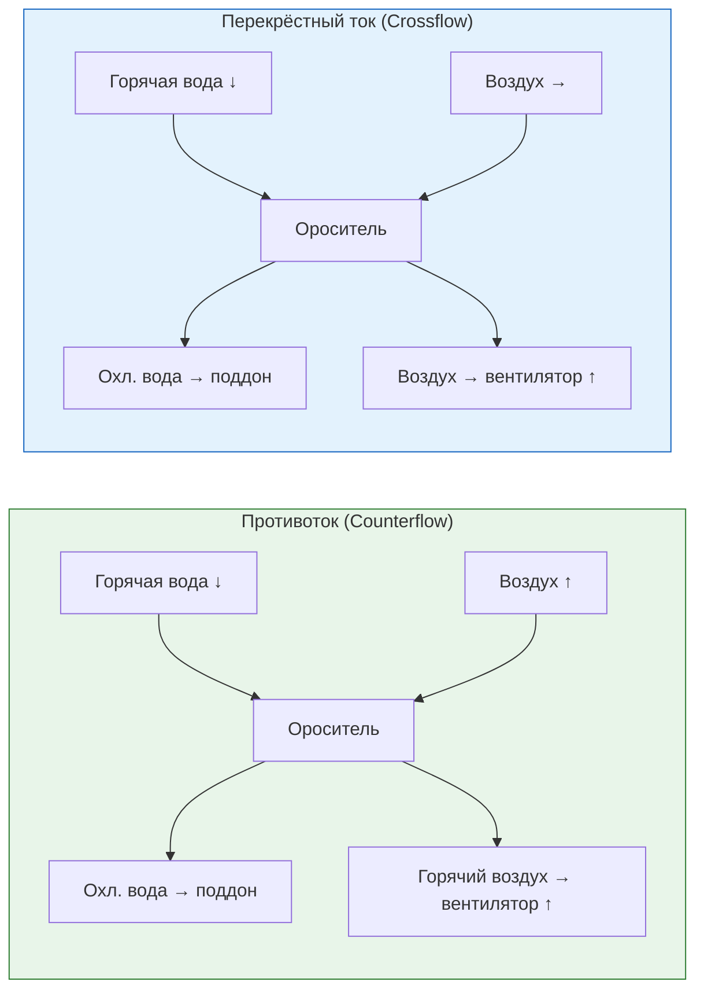

## Общие сведения

Башня охлаждения с вытяжной тягой (induced-draft cooling tower) — аппарат, в котором осевой вентилятор (axial fan), установленный в верхней части корпуса, создаёт разрежение и активно вытягивает воздух через слой оросителя. Горячая вода распределяется над оросителем сверху и стекает вниз, а воздух движется навстречу (counterflow) или перпендикулярно (crossflow) водяному потоку. Охлаждённая вода собирается в поддоне (basin) в основании башни.

Вытяжная тяга обеспечивает независимость производительности от метеорологических условий и позволяет достичь приближения к температуре мокрого термометра (wet-bulb approach) в диапазоне 2–5 °C. Эффективность составляет 75–95 % от теоретически достижимого охлаждения. Схема широко применяется на ТЭЦ, в чиллерных установках, промышленном охлаждении и в крупных центрах обработки данных.

Принципиальное отличие от принудительной тяги (forced-draft): вентилятор расположен на выходе воздушного потока, а не на входе. Это снижает турбулентность в зоне оросителя, уменьшает риск рециркуляции выходящего воздуха и повышает однородность распределения воздуха по сечению башни.

## Физические принципы

Вентилятор вытяжной тяги создаёт разрежение, индуцируя поток воздуха снизу вверх (counterflow) или сбоку (crossflow) через ороситель. Движущей силой теплообмена является разность энтальпий между водой и воздухом.

Уравнение теплового баланса по воде:


Q = \dot{m}_{\text{w}} \cdot c_{p,\text{w}} \cdot (T_{\text{in}} - T_{\text{out}})


где $Q$ — тепловая нагрузка, кВт; $\dot{m}_{\text{w}}$ — массовый расход воды, кг/с; $c_{p,\text{w}} \approx 4{,}18$ кДж/(кг·К); $T_{\text{in}}$, $T_{\text{out}}$ — температуры воды на входе и выходе, °C.

Уравнение Меркела (Merkel equation) для числа единиц переноса (NTU):


\text{NTU} = \int_{T_{\text{out}}}^{T_{\text{in}}} \frac{c_{p,\text{w}} \, dT}{h_{\text{sat}}(T) - h_{\text{a}}}


где $h_{\text{sat}}(T)$ — энтальпия насыщенного воздуха при температуре воды $T$; $h_{\text{a}}$ — энтальпия воздуха в данной точке. Этот интеграл решается численно по данным психрометрических таблиц.

Плотность воздуха для расчёта массового расхода:


\rho_{\text{a}} = \frac{p_{\text{atm}}}{R_s \cdot T_{\text{abs}}}


где $p_{\text{atm}}$ — атмосферное давление, Па; $R_s = 287$ Дж/(кг·К); $T_{\text{abs}}$ — абсолютная температура воздуха, К.

## Компоненты и конструкция

### Осевой вентилятор (верхнее расположение)

Вентилятор размещается в диффузорном цилиндре (fan stack) на кровле башни. Осевые вентиляторы с лопастями переменного шага (variable-pitch axial fans) обеспечивают гибкое регулирование расхода воздуха без изменения числа оборотов. Цилиндр снижает потери при выходе потока и уменьшает унос (drift).


| Параметр | Единица | Рабочий диапазон |
|---|---|---|
| Диаметр ротора | м | 1,0–3,5 |
| Число оборотов | об/мин | 400–1 200 |
| Развиваемое статическое давление | Па | 50–300 |
| Объёмный расход воздуха | м³/ч | 5 000–200 000 |
| Мощность электродвигателя | кВт | 7,5–200 |


Электродвигатели — влагозащищённого исполнения IP55/IP65 (IEC 60034). Ременная или редукторная передача (gear drive) снижает число оборотов вентилятора при высоком крутящем моменте. Частотные преобразователи (VFD) позволяют сократить мощность пропорционально кубу скорости вращения при снижении нагрузки.

### Ороситель (fill media)

**Плёночный ороситель** (film fill): гофрированные ПВХ- или ПП-пластины, уложенные под углом 45–60°; вода стекает тонкой плёнкой (0,3–1 мм) по поверхности; удельная поверхность контакта 200–350 м²/м³; расход воды 2,5–5 м³/(м²·ч). Рекомендуется для чистой воды с TDS < 500 мг/л.

**Брызговой ороситель** (splash fill): деревянные рейки или пластиковые элементы, разбивающие воду на капли; удельная поверхность 100–150 м²/м³; менее эффективен, но устойчив к загрязнениям и жёсткой воде (TDS > 1 000 мг/л).

### Каплеуловители (drift eliminators)

Устанавливаются между оросителем и вентилятором. Волокнистые или сотовые ПВХ-каплеуловители снижают унос до 0,001–0,005 % от циркуляционного расхода при скорости воздуха 2–4 м/с, что соответствует требованиям ASHRAE 90.1-2019.

### Поддон (cold water basin)

Железобетонный или стальной поддон в основании башни. Объём — 1,5–3-минутный запас воды при номинальном расходе. Внутри размещаются распределительные форсунки, перегородки для равномерного распределения потока и дренажный штуцер. Электрообогрев поддона предусматривается при возможных отрицательных температурах наружного воздуха.

## Схемы движения потоков

### Противоток (counterflow)

Вода падает сверху вниз, воздух движется снизу вверх. Обеспечивает максимальный контактный потенциал и наибольшую тепловую эффективность (до 85 %). Применяется в крупных промышленных и энергетических установках, где требуется глубокое охлаждение при умеренных расходах воздуха.

### Перекрёстный ток (crossflow)

Вода падает вниз, воздух входит горизонтально с одной или обеих сторон и движется через ороситель поперечно. Более компактная конструкция, меньшая высота; эффективность 70–78 %. Применяется в мобильных, модульных и коммерческих установках.





## Методика расчёта

### Коэффициент воздушности (air-to-water ratio)


\beta = \frac{\dot{m}_{\text{a}}}{\dot{m}_{\text{w}}}


Типовые значения: при противотоке — $\beta = 1{,}2$–$1{,}8$; при перекрёстном токе — $\beta = 1{,}0$–$1{,}5$. Повышение $\beta$ улучшает приближение к мокрому термометру, но увеличивает энергопотребление вентилятора.

### Температура подхода и эффективность


\Delta t_{\text{app}} = T_{\text{out}} - T_{\text{wb,in}}



\eta_{\text{tower}} = \frac{T_{\text{in}} - T_{\text{out}}}{T_{\text{in}} - T_{\text{wb,in}}}


Типовой диапазон эффективности вытяжной тяги: 75–85 %.

### Расчётный пример (SI)

**Условие:** противоточная башня; $T_{\text{in}} = 38$ °C; $T_{\text{out}} = 30$ °C; $T_{\text{wb,in}} = 26$ °C; $\dot{m}_{\text{w}} = 120$ кг/с.

Тепловая нагрузка:


Q = 120 \times 4{,}18 \times (38 - 30) = 4013 \text{ кВт}


Температура подхода: $30 - 26 = 4$ °C.

Эффективность: $\eta = (38 - 30)/(38 - 26) = 0{,}667 = 66{,}7$ %.

### Мощность вентилятора


P_{\text{fan}} = \frac{\Delta P_{\text{total}} \cdot \dot{V}_{\text{a}}}{10^3 \cdot \eta_{\text{fan}}}


где $\Delta P_{\text{total}}$ — суммарные потери давления (ороситель + каплеуловитель + корпус), Па; $\dot{V}_{\text{a}}$ — объёмный расход воздуха, м³/с; $\eta_{\text{fan}}$ — КПД вентилятора, 0,70–0,85.

**Пример:** $\dot{V}_{\text{a}} = 50$ м³/с; $\Delta P = 180$ Па; $\eta_{\text{fan}} = 0{,}80$:


P_{\text{fan}} = \frac{180 \times 50}{10^3 \times 0{,}80} = 11{,}25 \text{ кВт}


## Регулирование производительности

- **VFD (частотный преобразователь):** снижение мощности пропорционально кубу скорости вращения; экономия 20–40 % при нагрузках 60–80 % от номинальной.
- **Регулировка шага лопастей:** механическое изменение угла лопаток осевого вентилятора; поддерживает заданный расход воздуха при переменном сопротивлении оросителя.
- **Циклический пуск/останов:** включение/отключение вентилятора для поддержания температуры воды в заданном диапазоне при малых нагрузках.
- **Многоскоростные двигатели (2/4 полюса):** ступенчатое переключение скорости 750/1 500 об/мин — бюджетная альтернатива VFD.

## Применение в системах ОВК


| Область применения | Расход воды | Тепловой перепад |
|---|---|---|
| Водяной чиллер (water-cooled chiller) | 20–500 м³/ч | 5–8 K |
| Замкнутый контур охлаждения (closed-loop) | 5–200 м³/ч | 5–10 K |
| Технологическое охлаждение | 50–500 м³/ч | 5–15 K |
| Малые установки (жилые, коммерческие) | 5–50 м³/ч | 5 K |
| Крупные ТЭЦ | 500–10 000 м³/ч | 8–15 K |


Чиллеры с водяным конденсатором (water-cooled chiller) в паре с вытяжными башнями охлаждения достигают коэффициента COP 5,0–6,5, тогда как аналогичные чиллеры с воздушным конденсатором — COP 2,8–3,5. Экономия электроэнергии составляет 20–35 % в годовом исчислении.

## Нормативная база

- **ASHRAE Handbook — HVAC Systems and Equipment (2020)** — методология расчёта и подбора башен охлаждения, психрометрические методы.
- **ASHRAE 90.1-2019** — требования к минимальной эффективности и управлению: коэффициент уноса ≤ 0,002 % расхода; обязательность VFD при мощности башни > 7,5 кВт.
- **ASHRAE 188-2021** (Legionellosis: Risk Management for Building Water Systems) — план управления рисками легионеллёза; периодичность контроля.
- **CTI ATC-105S (Cooling Technology Institute)** — методика полевых (site) и заводских испытаний производительности башен; сертификация.
- **EN 14705:2005 / EN 14706:2005** — европейские методы испытания башен охлаждения (противоток и перекрёстный ток).
- **СП 60.13330.2020** — актуализированный СНиП 41-01-2003; раздел по системам охлаждения, требования к размещению градирен, шуму, санитарным зонам.
- **СП 89.13330.2016** — внутренние санитарно-технические системы; требования к трубопроводам конденсаторных контуров.

## Практические рекомендации

### Справочные значения параметров


| Параметр | Единица | Рабочий диапазон |
|---|---|---|
| Приближение к мокрому термометру (approach) | °C | 2–5 |
| Эффективность башни | % | 75–85 |
| Тепловой перепад (cooling range) | K | 5–15 |
| Коэффициент воздушности (counterflow) | — | 1,3–1,6 |
| Удельная мощность вентилятора | Вт/(м³/ч) | 0,5–2,0 |
| Поверхностная нагрузка по воде | м³/(м²·ч) | 2–8 |
| Потери воды на унос (с каплеуловителем) | % расхода | 0,001–0,005 |


### Профилактика легионеллёза

Температура воды в поддоне должна поддерживаться выше 20 °C; для активных биоцидных программ — ниже 25 °C (неблагоприятно для Legionella pneumophila). Требования согласно ASHRAE 188-2021 и СанПиН 2.1.3684-21:

- постоянная остаточная концентрация хлора: 0,2–0,5 мг/л;
- ударная обработка биоцидами: не реже одного раза в месяц;
- полный микробиологический анализ воды: ежеквартально;
- физическая очистка оросителя и поддона: раз в год (перед пуском сезона).

### Типичные ошибки проектирования

1. **Недооценка гидравлического сопротивления при загрязнённом оросителе.** Запас давления вентилятора должен быть не менее 25 % сверх расчётного.
2. **Малый объём поддона.** При объёме менее 1,5 мин циркуляционного расхода возникают кавитационные проблемы на насосе и нестабильность уровня воды.
3. **Демонтаж каплеуловителей.** Снижение сопротивления ценой кратного увеличения уноса и риска легионеллёза — недопустимо.
4. **Пренебрежение потерями напора в конденсаторном трубопроводе.** Приводит к недостаточному расходу воды через башню и перегреву конденсатора.
5. **Отсутствие байпасного клапана при низких наружных температурах.** При $t_{\text{нар}} < 5$ °C без байпаса возможно обмерзание поддона и оросителя.
