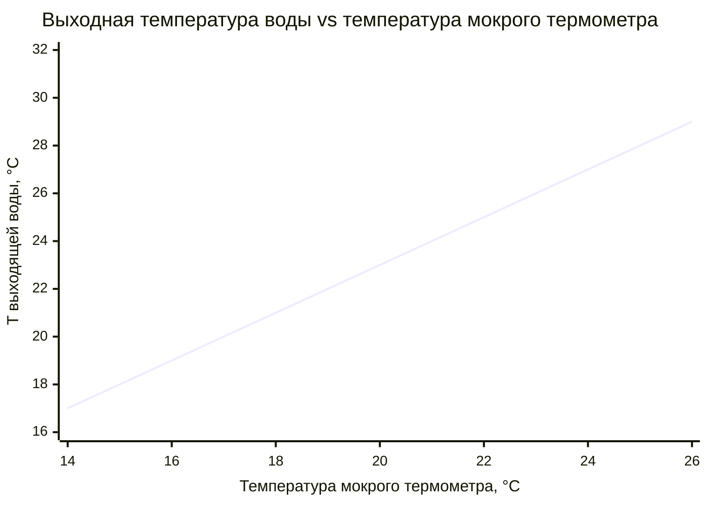

## Общие сведения

Башни охлаждения с естественной тягой (natural draft cooling towers, NDCT) — самые крупные и энергетически эффективные охладители воды в промышленности и энергетике. В отличие от механических башен, они не используют вентиляторы: движение воздуха обеспечивается исключительно конвекцией, вызванной разницей плотностей холодного наружного воздуха и нагретого воздуха внутри башни. Это обеспечивает минимальные эксплуатационные энергозатраты и высокую надёжность.

Естественная тяга применяется главным образом на тепловых (ТЭС) и атомных (АЭС) электростанциях, в металлургии и нефтепереработке — везде, где требуется охлаждение огромных объёмов циркуляционной воды (свыше 10 000 м³/ч). Башни высотой 50–200 м и диаметром основания 50–150 м создают перепад давления 25–60 Па, достаточный для движения воздуха со скоростью 3–6 м/с через сечение без какого-либо механического побуждения.

Конструктивно башни естественной тяги почти всегда выполняются в форме гиперболоида вращения — геометрической оболочки, оптимальной по аэродинамике и конструктивной прочности одновременно.

## Физические принципы естественной тяги

### Зависимость плотности воздуха от температуры

Плотность воздуха убывает с ростом температуры согласно уравнению состояния:


\rho(T) = \frac{p_{\text{атм}}}{R_{\text{s}} \cdot T}


где $p_{\text{атм}} \approx 101{,}3$ кПа — атмосферное давление; $R_{\text{s}} = 287$ Дж/(кг·К) — удельная газовая постоянная воздуха; $T$ — абсолютная температура, К.

При температуре наружного воздуха 20 °C: $\rho_{\text{нар}} = 101\,300 / (287 \times 293) = 1{,}205$ кг/м³.
При температуре воздуха внутри башни 38 °C: $\rho_{\text{внут}} = 101\,300 / (287 \times 311) = 1{,}135$ кг/м³.

### Перепад давления естественной тяги

Подъёмная сила (тяга), создаваемая колонной тёплого воздуха высотой $H$:


\Delta P_{\text{тяга}} = g \cdot H \cdot (\rho_{\text{нар}} - \rho_{\text{внут}})


**Расчётный пример (SI):** $H = 120$ м; $\rho_{\text{нар}} = 1{,}205$ кг/м³; $\rho_{\text{внут}} = 1{,}135$ кг/м³:


\Delta P_{\text{тяга}} = 9{,}81 \times 120 \times (1{,}205 - 1{,}135) = 82{,}4 \text{ Па}


Из 82,4 Па часть расходуется на преодоление гидравлического сопротивления оросителя и конструктивных элементов (25–45 Па); остаток обеспечивает кинетическую энергию потока воздуха.

### Расход воздуха при естественной тяге


G_{\text{a}} = A_{\text{вх}} \cdot \sqrt{\frac{2 \cdot \Delta P_{\text{тяга}}}{\rho_{\text{ср}} \cdot (1 + \zeta)}}


где $A_{\text{вх}}$ — площадь входного сечения, м²; $\zeta$ — суммарный коэффициент местных сопротивлений оросителя, распределительной системы и конструктивных элементов (0,5–1,5); $\rho_{\text{ср}}$ — среднее значение плотности воздуха.

## Компоненты и конструкция

### Гиперболическая форма оболочки

Форма гиперболоида вращения оптимальна по трём критериям:

1. **Аэродинамическая эффективность:** суженное сечение у основания ускоряет входящий воздух; расширение кверху снижает скорость в верхней части и минимизирует потери при выходе потока.
2. **Конструктивная прочность:** оболочка двоякой кривизны равномерно распределяет нагрузки от собственного веса и ветра; характерное «горлышко» (throat) является точкой минимального поперечного сечения.
3. **Минимальный расход материала:** максимальная площадь рабочего сечения при минимальной поверхности оболочки.


| Положение сечения | Диаметр, м |
|---|---|
| Входное отверстие (низ, уровень земли) | 80–150 |
| Горлышко (throat, ~1/3 высоты) | 50–100 |
| Выходное отверстие (верх) | 90–160 |


Конструктивно башни возводятся из предварительно напряжённого железобетона. Толщина оболочки: 0,6–1,2 м у основания, 0,2–0,4 м в средней части. Армирование обеспечивает расчётный срок службы 40–50 лет.

### Высота башни и охлаждаемая мощность


| Тип объекта | Высота башни, м | Охлаждаемая тепловая мощность, МВт |
|---|---|---|
| Малые ТЭС | 50–80 | 100–200 |
| Средние ТЭС | 100–140 | 300–600 |
| Крупные АЭС | 150–200 | 600–1 200 |


Эмпирическое правило: на каждые 100 МВт охлаждаемой мощности при оптимальной конструкции требуется приблизительно 10–20 м высоты башни.

### Система орошения и ороситель

Горячая вода поступает в башню снизу и распределяется над оросителем через:

- **форсуночные коллекторы** (spray nozzles): равномерное распределение при низком напоре;
- **желобные системы** (trough distribution): для больших диаметров;
- **трубчатые коллекторы с форсунками**: при давлении 0,05–0,15 МПа.

Ороситель:

- **Брызговой** (splash fill): деревянные или пластиковые перекладины; удельная поверхность 150–250 м²/м³; высота 1,5–2,5 м; хорошо переносит загрязнённую воду.
- **Плёночный** (film fill): ПВХ-пластины; удельная поверхность 200–400 м²/м³; высота 2–4 м; выше эффективность, но чувствителен к отложениям.

Гидравлическое сопротивление оросителя в номинальном режиме: 10–25 Па.

### Входные направляющие каналы и дефлекторы

Воздух поступает в башню через кольцевой зазор между основанием оболочки и землёй. Входные направляющие стойки (air inlet louvers) обеспечивают:

- равномерное распределение воздуха по периметру;
- снижение завихрений у основания;
- предотвращение попадания брызг в окружающую среду.

Высота входного зазора: 7–15 м. Скорость воздуха во входном сечении: 2–4 м/с.

## Методы расчёта и проектирования

### Баланс естественной тяги

Рабочая точка башни определяется равенством тяги и суммарных потерь давления:


\Delta P_{\text{тяга}} = \Delta P_{\text{ороситель}} + \Delta P_{\text{вход}} + \Delta P_{\text{выход}} + \Delta P_{\text{конструкция}}


Типовые составляющие: ороситель — 15–25 Па; вход — 5–10 Па; выход — 3–7 Па; конструкция — 2–5 Па. Итого требуется 25–47 Па при номинальном расходе.

### Тепловой баланс


Q = G_{\text{w}} \cdot c_{\text{w}} \cdot (T_{\text{вх}} - T_{\text{вых}})


где $G_{\text{w}}$ — массовый расход воды, кг/с; $c_{\text{w}} = 4{,}18$ кДж/(кг·К).

**Расчётный пример (SI):** АЭС, расход циркуляционной воды $G_{\text{w}} = 1\,200$ кг/с; перепад температур $\Delta T = 10$ К:


Q = 1\,200 \times 4{,}18 \times 10 = 50\,160 \text{ кВт} \approx 50 \text{ МВт}


Минимально достижимая температура выходящей воды:


T_{\text{вых,min}} = T_{\text{мт}} + (2\div 5) \text{ К}


где $T_{\text{мт}}$ — температура по мокрому термометру наружного воздуха. Разница 2–3 К соответствует современным оросителям с эффективностью 70–85 %.

### Отношение расходов воздуха и воды (L/G ratio)


\frac{L}{G} = 1{:}4 \div 1{:}8


где $L$ — расход воды (м³/ч), $G$ — расход воздуха (м³/ч). При отношении $L/G > 1{:}3$ эффективность охлаждения существенно снижается из-за недостаточного контакта воздуха с водой.

## Влияние климатических условий на производительность

Производительность башни естественной тяги существенно зависит от параметров наружного воздуха. При повышении температуры мокрого термометра (wet-bulb temperature) на 1 °C требуемая высота башни для сохранения той же выходной температуры воды возрастает на 2–4 %.





## Применение в промышленности и энергетике

### Основные области применения

Башни естественной тяги — основной элемент систем циркуляционного охлаждения на:

- **Атомных электростанциях (АЭС):** охлаждение конденсаторов паровых турбин; тепловая мощность одной башни — 600–1 200 МВт. Типовые российские АЭС («Балаковская», «Нововоронежская»): 2–4 башни высотой 150–175 м.
- **Тепловых электростанциях (ТЭС):** циркуляционное охлаждение в парогазовых циклах (Rankine cycle); расход воды 5 000–20 000 м³/ч на блок.
- **Металлургических комбинатах:** охлаждение доменных печей, прокатных станов, конверторов.
- **Нефтеперерабатывающих и нефтехимических заводах:** охлаждение технологических потоков, конденсаторов ректификационных колонн.
- **Химических предприятиях:** теплообмен в экзотермических реакционных процессах.

### Преимущества и ограничения

**Преимущества:**
- минимальное электропотребление: только насос подачи воды (50–200 кВт против 500–2 000 кВт для механических башен сопоставимой мощности);
- чрезвычайно высокая надёжность и долговечность (расчётный срок службы 40–60 лет);
- практически неограниченная единичная мощность (до 1 200 МВт в одной башне);
- независимость от перебоев электроснабжения.

**Ограничения:**
- высокая капитальная стоимость: 20–80 млн USD за крупную башню;
- медленный отклик на изменение нагрузки (тепловая инерция системы);
- видимый выброс водяного пара (fog plume) — экологические и эстетические ограничения;
- необходимость значительного земельного участка и соответствующих санитарных зон;
- зависимость производительности от температуры и влажности наружного воздуха.

## Нормативная база

- **ASHRAE Handbook — HVAC Systems and Equipment (2020)** — принципы проектирования систем охлаждения; психрометрические методы.
- **ISO 13575:2012** — термины, определения и методы классификации башен охлаждения.
- **EN 14705:2005 / EN 14706:2005** — испытание башен охлаждения на месте эксплуатации.
- **ГОСТ 12.1.003-2014** — допустимые уровни шума: 80 дБ(А) на рабочих местах.
- **СП 60.13330.2020** — актуализированный СНиП 41-01-2003; требования к системам промышленного охлаждения, проектированию градирен.
- **СП 41-101-2003** (переиздание) — проектирование и строительство охладительных устройств промышленных объектов.
- **СанПиН 2.1.3684-21** — профилактика легионеллёза; план управления водой в градирнях.

## Практические рекомендации

### Проектирование и эксплуатация


| Параметр | Единица | Типовое значение |
|---|---|---|
| Высота башни | м | 80–175 |
| Диаметр основания | м | 70–130 |
| Расход циркуляционной воды | м³/ч | 5 000–100 000 |
| Расход воздуха | м³/ч | 500 000–5 000 000 |
| Перепад температур (cooling range) | К | 8–15 |
| Эксплуатационное электропотребление | кВт | 50–200 |
| Создаваемая естественная тяга | Па | 30–80 |
| Скорость воздуха на входе | м/с | 2–4 |
| Скорость воздуха в горлышке (throat) | м/с | 5–10 |


### Защита от замерзания в холодном климате

При температурах наружного воздуха ниже –10 °C:

- подмешивание части горячей воды к холодной для поддержания температуры выходящей воды выше 4 °C;
- применение гибридных систем (добавление механических вентиляторов при низких температурах);
- сезонная перераспределение нагрузки между ячейками башни.

### Контроль биообрастания и качества воды

- Свободный хлор в циркуляционной воде: 0,3–1,0 мг/л (непрерывно).
- Ударная хлорация: 2–5 мг/л, продолжительность 4 ч, периодичность раз в месяц.
- ПЦР-контроль Legionella pneumophila: не реже одного раза в квартал.
- Механическая очистка оросителя: один раз в 3–5 лет.
- Замена оросителя (film fill): каждые 10–15 лет при плановом обслуживании.

### Контроль видимого шлейфа пара (plume)

Видимый выброс водяного пара (fog plume) создаётся при смешении тёплого насыщенного воздуха из башни с холодным наружным воздухом. Нормирование по СП 60.13330 и региональным требованиям. Методы снижения:

- применение гибридных башен (wet-dry, hybrid cooling towers) — подмешивание сухого воздуха;
- установка плюм-редукторов (plume abatement systems);
- ограничение высоты над кровлей соседних зданий.
