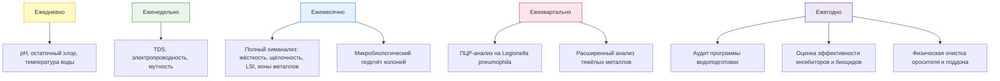

## Общие сведения

Водоподготовка в градирнях — критически важный аспект надёжной и экономичной работы систем охлаждения. При испарении часть воды покидает систему в виде пара, унося скрытую теплоту парообразования, тогда как растворённые соли и минералы остаются в циркуляционном контуре и постепенно концентрируются. Без надлежащего контроля это ведёт к образованию накипи на теплообменных поверхностях, коррозии металлических элементов и размножению микроорганизмов — в первую очередь Legionella pneumophila.

Согласно ASHRAE 188-2021 (Legionellosis: Risk Management for Building Water Systems) и EN 13623:2015 (Treatment of water used in evaporative cooling systems), эффективная программа водоподготовки обеспечивает:

- поддержание растворённых солей в диапазонах, исключающих отложения;
- защиту металлических поверхностей от коррозии;
- контроль биологического загрязнения и предотвращение легионеллёза.

## Физические процессы в циркуляционной воде

### Испарение и концентрирование

При работе градирни часть воды испаряется, унося скрытую теплоту. Массовый расход испаренной воды:


\dot{m}_{\text{исп}} = \frac{Q_{\text{охл}}}{r}


где $Q_{\text{охл}}$ — тепловая нагрузка, кВт; $r \approx 2\,450$ кДж/кг — скрытая теплота парообразования.

**Расчётный пример (SI):** $Q_{\text{охл}} = 500$ кВт:


\dot{m}_{\text{исп}} = \frac{500}{2\,450} = 0{,}204 \text{ кг/с} = 0{,}735 \text{ м}^3/\text{ч}


Объёмная доля испарения типично составляет 0,5–2 % от циркуляционного расхода.

Поскольку растворённые соли не испаряются, их концентрация в циркуляционной воде возрастает. Цикл концентрации (concentration ratio, CR):


\text{CR} = \frac{\text{TDS}_{\text{цирк}}}{\text{TDS}_{\text{подпитка}}}


где TDS — общее содержание растворённых веществ, мг/л.

### Унос (drift) и механические потери

Унос (drift) — отрыв мелких капель воды воздушным потоком. В современных башнях с ПВХ-каплеуловителями (drift eliminators) потери на унос составляют 0,001–0,005 % от циркуляционного расхода (ASHRAE 90.1-2019). Без каплеуловителей — 1–5 %.

## Циклы концентрации и расчёт продувки

### Расчёт цикла концентрации

Баланс для стационарного режима:


\text{CR} = \frac{\dot{V}_{\text{исп}} + \dot{V}_{\text{унос}} + \dot{V}_{\text{прод}}}{\dot{V}_{\text{прод}} + \dot{V}_{\text{унос}}}


### Расход продувки (blowdown)


\dot{V}_{\text{прод}} = \frac{\dot{V}_{\text{исп}} + \dot{V}_{\text{унос}}}{\text{CR} - 1} - \dot{V}_{\text{унос}}


**Расчётный пример (SI):** $\dot{V}_{\text{исп}} = 0{,}735$ м³/ч; $\dot{V}_{\text{унос}} = 0{,}01$ м³/ч (0,1 % расхода); целевой CR = 4:


\dot{V}_{\text{прод}} = \frac{0{,}735 + 0{,}01}{4 - 1} - 0{,}01 = 0{,}238 \text{ м}^3/\text{ч}


Суммарный расход подпиточной воды: $\dot{V}_{\text{исп}} + \dot{V}_{\text{унос}} + \dot{V}_{\text{прод}} \approx 0{,}985$ м³/ч.

Типовые значения CR для систем с химической обработкой: 3–5 для обычных вод; 2–3 для жёстких вод (Ca²⁺ + Mg²⁺ > 200 мг/л CaCO₃).

## Требования к параметрам воды

### Подпиточная вода (makeup water)


| Параметр | Рекомендуемый диапазон | Допустимый максимум |
|---|---|---|
| pH | 6,5–8,0 | 4,0–9,0 |
| TDS, мг/л | < 500 | 1 000 |
| Общая жёсткость (CaCO₃), мг/л | < 200 | 400 |
| Щёлочность (CaCO₃), мг/л | 50–150 | — |
| Кремний (SiO₂), мг/л | < 50 | 100 |
| Хлориды, мг/л | < 100 | 200 |
| Сульфаты, мг/л | < 100 | 200 |
| Железо и марганец, мг/л | < 0,3 | 1,0 |
| Микробиологическое загрязнение, КОЕ/мл | < 10⁴ | — |


### Циркуляционная вода (рабочий диапазон)


| Параметр | Целевой диапазон | Единица |
|---|---|---|
| Цикл концентрации (CR) | 3–5 | — |
| pH | 7,5–8,0 | — |
| TDS | 800–1 500 | мг/л |
| Общая жёсткость | 200–500 | мг/л CaCO₃ |
| Щёлочность | 100–200 | мг/л CaCO₃ |
| Индекс Ланжелье (LSI) | –0,5 до +0,3 | — |
| Остаточный хлор | 0,3–0,8 | мг/л |
| Электропроводность | 1 200–2 000 | мкСм/см |


## Индекс Ланжелье (LSI) и риск накипи

Индекс насыщения Ланжелье (Langelier Saturation Index, LSI) — количественная оценка склонности воды к образованию карбонатных отложений или коррозии:


\text{LSI} = \text{pH}_{\text{факт}} - \text{pH}_{\text{насыщ}}


где $\text{pH}_{\text{насыщ}}$ рассчитывается по номограмме Ланжелье с учётом температуры, щёлочности и жёсткости.

Интерпретация:

- **LSI < –0,5:** вода агрессивная, риск коррозии металлических поверхностей.
- **–0,5 ≤ LSI ≤ +0,5:** стабильная вода, оптимальный диапазон.
- **LSI > +0,5:** риск осаждения CaCO₃ (карбонатная накипь).

Смежный показатель — индекс стабильности Ризнара (Ryznar Stability Index, RSI):


\text{RSI} = 2 \cdot \text{pH}_{\text{насыщ}} - \text{pH}_{\text{факт}}


При RSI < 6 — тенденция к образованию накипи; при RSI > 8 — к коррозии.

## Программы химической обработки

### Ингибиторы накипи (scale inhibitors)

**Полифосфаты и фосфонаты:**
- Механизм: адсорбция на центрах зарождения кристаллов CaCO₃, замедление кристаллизации (threshold effect).
- Дозировка: 5–25 мг/л по фосфору.

**Полимерные диспергаторы (акриловые, малеиновые сополимеры):**
- Механизм: хелатирование Ca²⁺ и Mg²⁺; удержание мелкодисперсных частиц во взвешенном состоянии.
- Дозировка: 5–20 мг/л.

**Силикатные ингибиторы:**
- Для предотвращения кремниевой накипи (SiO₂); концентрация в системе < 100 мг/л.
- Растворимые силикаты натрия (Na₂SiO₃): 50–100 мг/л.

### Ингибиторы коррозии (corrosion inhibitors)


| Тип | Концентрация | Механизм | Примечание |
|---|---|---|---|
| Молибдаты (MoO₄²⁻) | 150–300 мг/л | Пассивирующая плёнка | Экологически приемлемы |
| Нитриты (NO₂⁻) | 200–500 мг/л | Анодная пассивация | Несовместимы с хлоридами > 200 мг/л |
| Азолы (BZT, TT) | 1–5 мг/л | Защита меди/латуни | Применяются совместно |
| Фосфаты/Цинк | 5–20 мг/л P | Катодная и анодная | Синергия с ингибиторами накипи |
| Хроматы | до 200 мг/л | Высокоэффективно | Токсичны, запрещены в ЕС |


### Биоциды (biocides)

**Окислители:**

- **Хлор:** наиболее распространён; остаточная концентрация 0,2–0,8 мг/л Cl₂; активен при pH 7,0–7,6; летуч, требует постоянного дозирования.
- **Бром:** эффективнее хлора при pH > 7,5; применяется в виде BCDMH (бромхлордиметилгидантоин); 0,2–0,5 мг/л остаточного брома.
- **Диоксид хлора (ClO₂):** 0,1–0,3 мг/л; высокоэффективен против биоплёнок (biofilm); не зависит от pH.

**Неокислители:**

- **Изотиазолоны (MIT, BIT, CMIT):** 10–50 мг/л; медленного действия; широкий спектр активности; применяются для профилактики.
- **Четвертичные аммониевые соединения (ЧАС):** 5–50 мг/л; хорошо совместимы с окислителями; возможно пенообразование.
- **Глутаральдегид:** 50–200 мг/л; ударные обработки 1–2 раза в месяц.

Ротация биоцидов (чередование типов) обязательна для предотвращения адаптации микроорганизмов. Рекомендуется чередовать окислительный и неокислительный биоцид ежемесячно.

## Образование накипи: химические реакции и меры предотвращения

### Карбонатная накипь (CaCO₃)

Основной тип отложений при pH > 8 и температуре > 40 °C:


\text{Ca}^{2+} + 2\,\text{HCO}_3^- \rightarrow \text{CaCO}_3\downarrow + \text{H}_2\text{O} + \text{CO}_2


Меры предотвращения: поддержание LSI в диапазоне –0,5…+0,5; дозирование ингибиторов; умягчение подпиточной воды при жёсткости > 200 мг/л CaCO₃.

### Кремниевая накипь (SiO₂)

Образуется при концентрации SiO₂ > 100 мг/л и температуре > 45 °C. Предотвращение: ограничение SiO₂ в подпиточной воде < 50 мг/л; снижение CR при высоком содержании кремния; предварительная обработка (обратный осмос).

### Сульфатные и фосфатные отложения

При избыточном дозировании фосфатных ингибиторов в жёсткой воде возможно образование апатита Ca₃(PO₄)₂. Контроль: ограничение концентрации ортофосфатов до 10–20 мг/л P.

## Контроль биологического загрязнения и легионеллёз

### Факторы риска

Legionella pneumophila активно размножается при температуре воды 25–45 °C (оптимум 35–40 °C). Факторы, усиливающие риск:

- застойные зоны в трубопроводах и поддоне;
- накопление карбонатных и биологических отложений (укрывные места для бактерий);
- недостаточная концентрация биоцидов;
- pH < 7,0 или > 9,0 (снижение активности хлора).

### Программа контроля (ASHRAE 188-2021)

Четыре уровня мер:

1. **Химическая дезинфекция:** постоянная остаточная концентрация хлора 0,2–0,5 мг/л; ударные обработки 2–5 мг/л продолжительностью 4 ч; применение неокислительных биоцидов 1–2 раза в месяц.

2. **Физические методы:** УФ-излучение (254 нм) интенсивностью 30–100 мДж/см² в линии циркуляции; электрохимическая активация.

3. **Конструктивные меры:** устранение мёртвых зон в трубопроводах; регулярная промывка и очистка поддона и оросителя.

4. **Мониторинг и документирование:** ПЦР-анализ воды на Legionella — ежеквартально; культуральный метод при концентрации > 100 КОЕ/100 мл — дополнительный контроль.

### Пороговые значения согласно нормативам


| Документ | Предельное значение | Действие при превышении |
|---|---|---|
| ASHRAE 188-2021 | < 1 000 КОЕ/л | Ударная обработка биоцидами |
| ВОЗ (WHO) Guideline | < 100 КОЕ/100 мл | Немедленная дезинфекция |
| СанПиН 2.1.3684-21 | < 100 КОЕ/л | Временное отключение системы |
| EN 13623:2015 | Отсутствие | Немедленное расследование |


## Схема программы мониторинга воды





## Применение в системах HVAC

### Коммерческие и общественные здания

В офисных центрах, гостиницах, больницах и торговых комплексах циркуляционная вода в градирне требует постоянного контроля. Типовой расход циркуляции: 10–100 л/с при тепловом напоре 5–8 K. Химическая программа подбирается по результатам анализа местной водопроводной воды и климатической зоны объекта.

В жарких климатических зонах (юг России, Средняя Азия):

- испарение достигает 2–3 % расхода;
- повышенный риск карбонатной накипи при жёсткой воде;
- рекомендуемый CR = 4–5 с усиленным дозированием ингибиторов накипи (20–30 мг/л).

В холодных зонах (Урал, Сибирь, Северо-Запад):

- испарение 0,5–1,5 %;
- риск недонасыщения воды (LSI < –0,5) и питтинговой коррозии;
- необходим тщательный контроль pH и концентрации ингибиторов коррозии.

### Промышленные системы охлаждения

Для промышленных объектов с большим расходом воды (> 100 м³/ч) рекомендуется автоматическая система дозирования химреагентов (online dosing system) с непрерывным контролем pH и электропроводности. Рекомендованный CR для промышленных объектов: 5–8 при условии надлежащей системы предварительной обработки подпиточной воды.

## Нормативная база

- **ASHRAE 188-2021** — Legionellosis: Risk Management for Building Water Systems; обязательные требования к плану управления водой.
- **ASHRAE 189.1-2020** — Standard for the Design of High-Performance Green Buildings; требования к водоэффективности и качеству воды.
- **ASHRAE 90.1-2019** — ограничения по уносу (drift ≤ 0,002 % расхода); требования к VFD при мощности > 7,5 кВт.
- **EN 13623:2015** — Chemicals used for treatment of water intended for human consumption; требования к промышленному охлаждению.
- **ISO 8044:2020** — Corrosion of metals and alloys: terms and definitions.
- **СП 60.13330.2020** — актуализированный СНиП 41-01-2003; требования к системам охлаждения и водоподготовке.
- **СанПиН 2.1.3684-21** — санитарно-эпидемиологические требования к содержанию территорий городских и сельских поселений; градирни.
- **ГОСТ 31952-2012** — устройства водоочистки; общие требования к эффективности.

## Практические рекомендации

### Типовые дозировки химических реагентов


| Реагент | Дозировка | Основание |
|---|---|---|
| Ингибитор накипи (фосфонат) | 5–20 мг/л | по активному веществу |
| Ингибитор коррозии (молибдат) | 150–250 мг/л MoO₄²⁻ | по иону молибдата |
| Биоцид-окислитель (хлор) | 0,3–0,8 мг/л Cl₂ | непрерывно |
| Биоцид-неокислитель (изотиазолон) | 20–30 мг/л | 1 раз в месяц |
| Диспергатор (акрилат) | 5–10 мг/л | непрерывно |


### Типичные ошибки и последствия

1. **Игнорирование расчёта LSI** — непредвиденное образование карбонатной накипи; снижение коэффициента теплопередачи конденсатора на 10–25 %.
2. **Недостаточный контроль биоцидов** — развитие Legionella, биообрастание трубопроводов; юридическая ответственность при вспышках легионеллёза.
3. **Завышение CR без усиления ингибиторов** — осаждение силикатов и фосфатов; засорение оросителя.
4. **Игнорирование качества подпиточной воды** — ускоренное накопление загрязнений, необходимость увеличения продувки.
5. **Нарушение ротации биоцидов** — адаптация микроорганизмов к одному типу биоцида; потеря эффективности дезинфекции.

### Начальные параметры для новых систем

При отсутствии специального анализа подпиточной воды рекомендуется консервативная стартовая установка:

- CR = 3 (расширить до 4–5 после месяца наблюдений);
- дозировка ингибитора накипи: 15 мг/л;
- дозировка ингибитора коррозии: 150 мг/л;
- остаточный хлор: 0,5 мг/л непрерывно;
- целевой pH: 7,8.

После первого месяца эксплуатации следует провести полный анализ воды и скорректировать программу.
