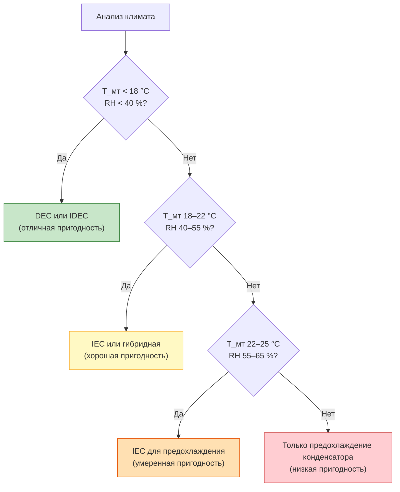

## Общие сведения

Испарительное охлаждение (evaporative cooling) использует термодинамический процесс испарения воды для снижения температуры приточного воздуха при минимальном потреблении электроэнергии. Охлаждающий эффект достигается за счёт превращения явного тепла (sensible heat) воздуха в скрытое тепло испарения (latent heat) воды, не требуя компрессорного оборудования.

Системы испарительного охлаждения обеспечивают EER (energy efficiency ratio) 15–40 против 8–14 для традиционных парокомпрессионных установок при подходящих климатических условиях. Экономия электроэнергии составляет 60–80 % по сравнению с механическим охлаждением. Платой за это является потребление воды и зависимость эффективности от влажности наружного воздуха.

Стандарты ASHRAE Handbook — Fundamentals и ASHRAE 90.1 предусматривают использование испарительного предохлаждения (evaporative pre-cooling) как одной из мер повышения энергоэффективности систем HVAC, особенно в климатических зонах 1–5 по ASHRAE.

## Психрометрические основы

### Процесс адиабатического насыщения

Испарительное охлаждение протекает вдоль линии постоянной температуры мокрого термометра (wet-bulb temperature, $T_{\text{мт}}$) на психрометрической диаграмме. Процесс является адиабатическим (без теплообмена с окружающей средой), и энтальпия воздуха остаётся постоянной:


h_1 \approx h_2 \quad (\text{пренебрегая работой насоса})


Максимально достижимое снижение температуры (wet-bulb depression):


\Delta T_{\text{max}} = T_{\text{сх}} - T_{\text{мт}}


где $T_{\text{сх}}$ — температура по сухому термометру (dry-bulb, DB), °C; $T_{\text{мт}}$ — температура по мокрому термометру, °C.

### Эффективность насыщения (saturation efficiency)

Степень использования теоретического охлаждающего потенциала:


\varepsilon = \frac{T_{\text{сх,вх}} - T_{\text{сх,вых}}}{T_{\text{сх,вх}} - T_{\text{мт,вх}}}


Типовые значения:
- прямое испарительное охлаждение (DEC): 70–95 %;
- косвенное (IEC): 50–80 %;
- двухступенчатое косвенно-прямое (IDEC): 90–120 % (суммарная, возможно превышение 100 % относительно $T_{\text{мт}}$).

### Энергоэффективность

Испарительные охладители потребляют только мощность вентиляторов и насосов:


\text{EER}_{\text{исп}} = \frac{Q_{\text{охл}}}{W_{\text{вент}} + W_{\text{насос}}}


**Расчётный пример (SI):** $Q_{\text{охл}} = 50$ кВт; $W_{\text{вент}} = 1{,}2$ кВт; $W_{\text{насос}} = 0{,}15$ кВт:


\text{EER} = \frac{50}{1{,}2 + 0{,}15} = 37{,}0


Для сравнения: воздушный DX-чиллер даёт EER = 10–14 при тех же условиях.

## Обзор типов систем

### Прямое испарительное охлаждение (DEC, Direct Evaporative Cooling)

Приточный воздух контактирует с водой непосредственно. Температура воздуха снижается, влагосодержание возрастает. Процесс движется к температуре мокрого термометра. Относительная влажность на выходе достигает 85–95 %, что ограничивает применение при высокой наружной влажности.

**Область применения:** регионы с расчётной $T_{\text{мт}} < 18$ °C и наружной относительной влажностью < 40 % (сухой климат).

### Косвенное испарительное охлаждение (IEC, Indirect Evaporative Cooling)

Первичный воздух (подаваемый в помещение) охлаждается без увлажнения через теплообменник. Вторичный (рабочий) поток воздуха проходит испарительное охлаждение и отводится наружу. Влага в первичный поток не поступает.

**Область применения:** офисы, ЦОДы, медицинские учреждения; наружная влажность до 60 %.

### Двухступенчатое охлаждение (IDEC, Indirect-Direct Evaporative Cooling)

Последовательно применяются косвенная и прямая ступени. Совокупная эффективность превышает 100 % по $T_{\text{мт}}$, позволяя подать воздух холоднее температуры мокрого термометра наружного воздуха. Подробнее — в разделе «Двухступенчатое испарительное охлаждение».

## Сравнение систем


| Параметр | DEC | IEC | IDEC |
|---|---|---|---|
| Добавление влаги в приточный воздух | Да | Нет | Незначительно (только DEC-ступень) |
| Максимальная эффективность по $T_{\text{мт}}$ | 70–95 % | 50–80 % | 90–120 % |
| Мин. достижимая температура подачи | $T_{\text{мт}} + 1{,}5$ °C | $T_{\text{мт}} + 3$ °C | ниже $T_{\text{мт}}$ |
| Применимость при влажном климате | Ограничена | Умеренная | Умеренная |
| Капитальные затраты | Низкие | Средние | Высокие |
| Потребление воды, л/(кВт·ч охл.) | 2,5–4,0 | 1,5–3,0 | 3,5–5,5 |
| Применимые климатические зоны (ASHRAE) | 1–3 | 1–4 | 1–4 |


## Применимость в различных климатических зонах

### Жаркий сухой климат (идеальные условия)

- Разница $T_{\text{сх}} - T_{\text{мт}} > 11$ °C.
- Расчётная $T_{\text{мт}} < 18$ °C.
- Наружная относительная влажность < 30 %.

Примеры регионов: Астрахань, Волгоград, Ставропольский край, Средняя Азия, Ближний Восток, юго-запад США.

### Умеренный климат (условно пригодный)

- Разница $T_{\text{сх}} - T_{\text{мт}}$ от 6 до 11 °C.
- Наружная влажность 30–50 %.

Рекомендуется IEC или IDEC; гибридная схема с механическим резервом для влажных периодов.

### Жаркий влажный климат (ограниченная пригодность)

- Разница $T_{\text{сх}} - T_{\text{мт}} < 5$ °C.
- Влажность > 60 %.

Применяется только испарительное предохлаждение воздуха конденсатора (indirect pre-cooling of condenser air), что снижает температуру конденсации чиллера.





## Применение в системах HVAC

### Коммерческие здания

- **Склады и распределительные центры:** высокий объём воздуха, низкая требуемая точность климат-контроля — DEC является экономически оптимальным выбором.
- **ЦОДы (data centers):** IEC или IDEC по ASHRAE TC 9.9 Guidelines; расширенный температурный диапазон (expanded envelope) позволяет использовать испарительное охлаждение до 70–90 % годовых часов в подходящем климате.
- **Торговые центры, школы, спортзалы:** IDEC при $T_{\text{мт}} < 18$ °C.

### Промышленные объекты

- **Охлаждение турбинного воздуха (inlet air cooling):** испарительное предохлаждение повышает мощность газовой турбины на 1–2 % на каждый 1 °C снижения температуры входного воздуха.
- **Комфортное охлаждение рабочих зон** в цехах с выделением тепла.

### Жилые здания

- Традиционные «болотные охладители» (swamp coolers): DEC, мощность 940–4 700 м³/ч; регионы с $T_{\text{мт}} < 16$ °C.
- Гибридные системы: мини-сплит как резервная ступень при высокой влажности.

## Потребление воды

Удельное потребление воды на испарение:


\dot{m}_{\text{вода}} = \frac{Q_{\text{охл}}}{r} \approx 0{,}41 \text{ кг/кВт·ч охлаждения}


Дополнительная продувка для предотвращения концентрирования минералов при CR = 3–4: 30–40 % объёма испарения. Суммарное потребление: 3,5–5,0 л/(кВт·ч охлаждения), или приблизительно 11–15 л/тонн·ч (в американских единицах).

## Выбор системы


| Категория климата | Расч. $T_{\text{мт}}$, °C | Ч/год при $T_{\text{мт}} > 18$ °C | Рекомендуемый тип |
|---|---|---|---|
| Отличная | < 16,7 | < 100 | DEC или IDEC |
| Хорошая | 16,7–19,4 | 100–300 | IDEC или гибрид |
| Удовлетворительная | 19,4–22,2 | 300–600 | IEC или гибрид |
| Плохая | > 22,2 | > 600 | Только предохлаждение |


Методология подбора включает:

1. Анализ климатических данных (интервальный метод, bin analysis): распределение $T_{\text{мт}}$ по часам года.
2. Определение расчётной точки: 1 % (консервативно), 2,5 % (стандартно) или 5 % (экономично) годовых по $T_{\text{мт}}$.
3. Расчёт достижимой температуры подачи и потребного расхода воздуха.
4. Оценка годового потребления воды и энергии.
5. Технико-экономическое сравнение с альтернативами (механическое охлаждение, гибрид).

## Нормативная база

- **ASHRAE Handbook — Fundamentals (2021)** — психрометрика, диаграммы влажного воздуха; методы расчёта процессов испарительного охлаждения.
- **ASHRAE 90.1-2019** — требования к предварительному охлаждению наружного воздуха; нормативы экономайзера.
- **ASHRAE Standard 55-2020** — тепловой комфорт; ограничения по влажности в помещении ($W \leq 12$ г/кг).
- **AHRI 1250P / AHRI 920** — методика испытаний и рейтинг производительности испарительных охладителей.
- **EN 14511:2022** — испытание тепловых насосов и чиллеров; контекст для гибридных систем.
- **СП 60.13330.2020** — актуализированный СНиП 41-01-2003; требования к параметрам приточного воздуха и системам кондиционирования.
- **ГОСТ Р 56246-2014** — системы вентиляции и кондиционирования; методы энергетических испытаний.
