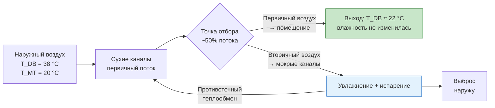

## Общие сведения

Косвенное испарительное охлаждение (indirect evaporative cooling, IEC) обеспечивает охлаждение приточного воздуха без добавления влаги, преодолевая главное ограничение прямых (DEC) систем. Первичный (подаваемый в помещение) воздух охлаждается через теплообменник рабочим потоком, который, в свою очередь, охлаждается испарением воды и затем выбрасывается наружу.

Поскольку первичный воздух не контактирует с водой, его влагосодержание и влажность не изменяются. Это открывает возможность применения IEC в помещениях, чувствительных к влажности: офисах, центрах обработки данных, музеях, медицинских учреждениях. Косвенное охлаждение также применяется в умеренно влажном климате, где DEC уже неэффективно.

Стандарты: AHRI 1250P (Performance Rating of Indirect Evaporative Coolers), ASHRAE TC 9.9 (ЦОДы), EN 14511-2022, СП 60.13330.2020.

## Принципы работы

### Двухпоточная концепция

IEC использует два отдельных воздушных потока, разделённых теплопередающей поверхностью:

**Первичный поток (primary / product air):**
- воздух, подаваемый в кондиционируемое помещение;
- проходит по «сухой» стороне теплообменника;
- температура снижается; влагосодержание не изменяется.

**Вторичный поток (secondary / working air):**
- рабочий воздух, охлаждаемый испарением воды;
- проходит по «мокрой» стороне теплообменника;
- поглощает тепло от первичного потока;
- выбрасывается наружу.

### Теплообмен между потоками

Тепловой поток через поверхность теплообменника:


Q = U \cdot A \cdot \Delta T_{\text{ср}}


где $U$ — коэффициент теплопередачи, Вт/(м²·К); $A$ — площадь поверхности, м²; $\Delta T_{\text{ср}}$ — среднелогарифмическая разность температур (LMTD).

Охлаждение первичного воздуха:


T_{\text{1,вых}} = T_{\text{1,вх}} - \varepsilon_{\text{сх}} \cdot (T_{\text{1,вх}} - T_{\text{2,мт,вх}})


где $\varepsilon_{\text{сх}}$ — эффективность по сухому термометру; $T_{\text{2,мт,вх}}$ — температура мокрого термометра вторичного воздуха на входе.

### Эффективность IEC по мокрому термометру

Стандартный показатель качества IEC — эффективность по температуре мокрого термометра:


\varepsilon_{\text{мт}} = \frac{T_{\text{1,вх}} - T_{\text{1,вых}}}{T_{\text{1,вх}} - T_{\text{2,мт,вх}}}


Типовые значения: 50–80 % для стандартных конструкций; 80–90 % для регенеративных (цикл Майсотенко).

**Расчётный пример (SI):** $T_{\text{1,вх}} = 38$ °C; $T_{\text{2,мт}} = 20$ °C; $\varepsilon_{\text{мт}} = 0{,}70$:


T_{\text{1,вых}} = 38 - 0{,}70 \times (38 - 20) = 38 - 12{,}6 = 25{,}4 \text{ °C}


Температура по мокрому термометру первичного воздуха на выходе: равна температуре на входе (влагосодержание не изменилось).

## Типы теплообменников

### Пластинчатые теплообменники (plate heat exchangers)

Чередующиеся каналы для первичного (сухая сторона) и вторичного (мокрая сторона) потоков из алюминия или полимерных материалов.


| Конфигурация потоков | Эффективность по $T_{\text{мт}}$, % | $\Delta P$, Па |
|---|---|---|
| Поперечный ток (crossflow) | 50–65 | 50–100 |
| Противоток (counterflow) | 60–75 | 75–150 |
| Комбинированный | 65–75 | 75–120 |


Алюминиевые пластины — высокий коэффициент теплопередачи ($U = 30$–80 Вт/(м²·К)), но требуют защиты от коррозии при жёсткой воде. Полипропиленовые — коррозионностойкие, $U = 10$–30 Вт/(м²·К).

### Трубчатые теплообменники (tube heat exchangers)

Первичный воздух движется внутри труб; вторичный — снаружи по увлажнённым трубам. Конструкция более прочная и проще в обслуживании; эффективность несколько ниже пластинчатой.

### Теплообменники с тепловыми трубками (heat pipe exchangers)

Двухфазный механизм: рабочее тело испаряется в горячей секции и конденсируется в холодной. Отсутствие перекрёстного загрязнения потоков. Применяются в ЦОДах и чистых помещениях.

### Регенеративные теплообменники (цикл Майсотенко, M-Cycle)

Передовая конструкция, позволяющая охладить первичный воздух ниже температуры мокрого термометра:

1. Первичный воздух предварительно охлаждается в сухих каналах.
2. Часть предохлаждённого воздуха отводится в увлажнённые каналы.
3. Испарительное охлаждение в мокрых каналах.
4. Противоточный теплообмен с первичным потоком.

Результат: эффективность по точке росы 80–90 %; температура подачи приближается к точке росы входящего воздуха. Это наиболее совершенная из одноступенчатых IEC-технологий.





## Производительность систем IEC

### Сравнение приближения к $T_{\text{мт}}$ по типам


| Тип IEC | Приближение к $T_{\text{мт}}$, °C | Эффективность, % |
|---|---|---|
| Поперечно-пластинчатый | 8–14 | 50–65 |
| Противоточно-пластинчатый | 6–11 | 60–75 |
| Регенеративный (M-Cycle) | 3–6 | 80–90 |


### Соотношение расходов первичного и вторичного воздуха


k = \frac{\dot{m}_{\text{вторич}}}{\dot{m}_{\text{первич}}}


Типовой диапазон: $k = 0{,}3$–$1{,}0$. Повышение $k$ улучшает эффективность охлаждения, но увеличивает мощность вторичного вентилятора и расход воды.

### Холодопроизводительность (явное охлаждение)


\dot{Q}_{\text{sensible}} = \dot{m}_{\text{первич}} \cdot c_{p,\text{a}} \cdot (T_{\text{1,вх}} - T_{\text{1,вых}})


**Расчётный пример (SI):** $\dot{m}_{\text{первич}} = 5{,}94$ кг/с (около 18 000 м³/ч); $T_{\text{вх}} = 38$ °C; $T_{\text{вых}} = 25{,}4$ °C:


\dot{Q} = 5{,}94 \times 1{,}006 \times 12{,}6 = 75{,}4 \text{ кВт}


### Суммарная мощность вентиляторов

Оба потока требуют мощности:


W_{\text{total}} = \frac{\dot{V}_{\text{1}} \cdot \Delta P_{\text{1}}}{\eta_{\text{1}}} + \frac{\dot{V}_{\text{2}} \cdot \Delta P_{\text{2}}}{\eta_{\text{2}}}


EER для IEC-системы: 20–35 (против EER = 10–14 для DX-охлаждения).

## Конфигурации систем

### Автономные IEC-установки

Заводского изготовления; включают теплообменник, первичный и вторичный вентиляторы, систему орошения:

- производительность 5 000–50 000 м³/ч первичного воздуха;
- монтаж на кровле или вне здания.

### Интеграция в централизованную ОВУ

Секция IEC внутри приточной установки (air handling unit, AHU):

- предохлаждает наружный воздух перед охладительной батареей (cooling coil);
- снижает нагрузку на механическое охлаждение на 20–40 %;
- выполняет функцию рекуперации энергии (energy recovery ventilator, ERV).

### Гибридные системы IEC + DX

- IEC обеспечивает первичное охлаждение.
- DX-контур (прямое расширение) дообрабатывает воздух до целевых параметров.
- Автоматическое переключение режимов по уставке температуры подачи.

### Применение в ЦОДах

IEC и IDEC всё активнее используются в центрах обработки данных согласно ASHRAE TC 9.9:

- расширенный допустимый температурный диапазон (A1–A4): $T_{\text{вх,серв}} = 15$–45 °C;
- коэффициент PUE (Power Usage Effectiveness) снижается с 1,5–1,8 (традиционные DX-системы) до 1,1–1,3;
- часы работы без механического охлаждения: 70–90 % годовых в подходящем климате.

## Преимущества перед прямым испарительным охлаждением

### Отсутствие увлажнения первичного воздуха

Влажность подаваемого воздуха не изменяется, что критично для:

- серверных помещений и ЦОДов (допустимый диапазон влажности по ASHRAE TC 9.9: 8–80 % RH, предпочтительно 20–80 %);
- музеев, архивов, реставрационных мастерских;
- хирургических операционных и чистых помещений;
- офисных зданий с внутренней влажностью > 50 % RH.

### Более широкая климатическая применимость

IEC эффективно при наружной влажности до 60 % RH — условиях, при которых DEC уже практически бесполезно. Это расширяет географию применения на большую часть умеренного климата Европы и России.

### Качество подаваемого воздуха

Отсутствие контакта воды с первичным воздухом:

- исключает риск микробиологического заражения воздуха;
- не требует обработки рецир куляционного воздуха дезинфицирующими препаратами;
- нет переноса химических реагентов водоподготовки в помещение.

## Нормативная база

- **AHRI 1250P** — Performance Rating of Indirect Evaporative Coolers; методика испытаний и рейтинг.
- **ASHRAE TC 9.9** — Thermal Guidelines for Data Processing Environments; стандарты применения IEC в ЦОДах.
- **ASHRAE 90.1-2019** — требования к энергоэффективности; учёт IEC в расчёте экономии энергии.
- **EN 14511-1:2022** — Air conditioners, liquid chilling packages and heat pumps; контекст для гибридных систем.
- **EN 14825:2022** — Testing conditions and seasonal performance assessment.
- **СП 60.13330.2020** — параметры приточного воздуха; допустимые уровни влажности.
- **ГОСТ Р 56246-2014** — методы энергетических испытаний систем кондиционирования.
