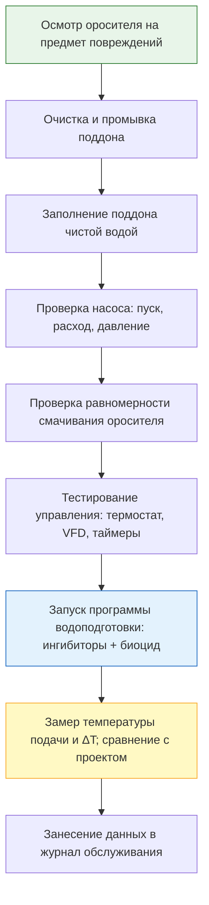

## Общие сведения

Техническое обслуживание и управление качеством воды — определяющие факторы производительности, энергоэффективности и долговечности систем испарительного охлаждения. В испарительных охладителях вода циркулирует в открытом контуре, что создаёт условия для концентрирования растворённых солей, биологического роста и образования отложений. Без надлежащего ухода ороситель зарастает накипью, насос изнашивается преждевременно, а в системе могут развиться патогенные микроорганизмы, включая Legionella pneumophila.

Согласно ASHRAE 188-2021, EN 13623:2015 и СанПиН 2.1.3684-21, владелец здания обязан разработать и поддерживать задокументированный план управления водой (Water Management Plan, WMP) для всех систем, создающих аэрозоль воды.

## Физические процессы и концентрирование воды

### Испарение и минерализация

При испарении вода покидает контур в виде пара, тогда как растворённые соли остаются. Концентрация солей в поддоне (sump) возрастает пропорционально числу циклов концентрации:


\text{TDS}_{\text{поддон}} = \text{TDS}_{\text{подпитка}} \times \text{CR}


**Пример:** при $\text{TDS}_{\text{подпитка}} = 300$ мг/л и CR = 4: $\text{TDS}_{\text{поддон}} = 1\,200$ мг/л. Такая концентрация превышает порог насыщения карбонатом кальция и требует химической обработки.

### Расчёт продувки для поддержания CR


\dot{V}_{\text{прод}} = \frac{\dot{V}_{\text{исп}}}{\text{CR} - 1}


**Пример:** $\dot{V}_{\text{исп}} = 10$ л/мин; CR = 4:


\dot{V}_{\text{прод}} = \frac{10}{4 - 1} = 3{,}3 \text{ л/мин}


## Требования к качеству воды

### Параметры подпиточной воды (makeup water)


| Параметр | Допустимый диапазон | Уровень тревоги |
|---|---|---|
| Общая жёсткость, мг/л CaCO₃ | < 150 | > 300 |
| TDS, мг/л | < 500 | > 1 000 |
| pH | 7,0–8,5 | < 6,5 или > 9,0 |
| Железо, мг/л | < 0,3 | > 0,5 |
| Кремний (SiO₂), мг/л | < 50 | > 100 |
| Хлориды, мг/л | < 100 | > 250 |


Если подпиточная вода не соответствует требованиям: рекомендуется умягчение (ионный обмен) или обратный осмос для жёстких вод с жёсткостью > 200 мг/л CaCO₃.

### Образование карбонатной накипи (CaCO₃)

Осаждение карбоната кальция происходит при:


[\text{Ca}^{2+}][\text{CO}_3^{2-}] > K_{sp}


Риск усиливают: высокая температура воды (> 40 °C), высокий pH (> 8,2), высокая жёсткость, недостаточная продувка.

Контроль индексом Ланжелье (LSI):


\text{LSI} = \text{pH}_{\text{факт}} - \text{pH}_{\text{насыщ}}


- LSI < –0,5: риск коррозии;
- –0,5 ≤ LSI ≤ +0,5: стабильная вода;
- LSI > +0,5: риск накипи.

## Предотвращение накипи

### Химические ингибиторы

- **Полифосфаты:** 5–20 мг/л; модификаторы кристаллов CaCO₃; наиболее распространены.
- **Фосфонаты:** 2–10 мг/л; эффективны при высоких температурах.
- **Полимерные диспергаторы (акрилаты):** 5–15 мг/л; удерживают микрочастицы во взвеси.

### Умягчение подпиточной воды

Ионный обмен (натрий-катионит):
- снижает Ca²⁺ и Mg²⁺ до < 30 мг/л CaCO₃;
- значительно продлевает срок службы оросителя (целлюлозного);
- совместим со всеми типами биоцидов.

## Биологический контроль и профилактика легионеллёза

### Факторы риска

Legionella pneumophila активно размножается при температуре воды 25–45 °C. Испарительные охладители создают идеальные условия: тёплая вода, мелкодисперсный аэрозоль. Дополнительные факторы риска:

- застойные зоны в поддоне и трубопроводах;
- накопление биологических отложений и карбонатной накипи — питательная среда для бактерий;
- недостаточная концентрация биоцидов.

### Программа обработки биоцидами


| Тип биоцида | Концентрация | Механизм | Режим применения |
|---|---|---|---|
| Хлор (NaOCl) | 0,2–0,8 мг/л Cl₂ | Окислительный | Непрерывно |
| Бром (BCDMH) | 0,2–0,5 мг/л | Окислительный | Непрерывно / ударно |
| Диоксид хлора (ClO₂) | 0,1–0,3 мг/л | Окислительный | Непрерывно |
| Изотиазолон (MIT/BIT) | 10–50 мг/л | Неокислительный | 1 раз в месяц |
| ЧАС (четвертичные аммониевые) | 5–30 мг/л | Неокислительный | 1–2 раза в месяц |
| Глутаральдегид | 50–200 мг/л | Неокислительный | Ударно раз в месяц |


Ротация биоцидов (чередование типов) — обязательное условие для предотвращения адаптации микроорганизмов.

### Нормативные пороговые значения Legionella

- **ASHRAE 188-2021:** < 1 000 КОЕ/л — профилактическая обработка; > 1 000 КОЕ/л — немедленная ударная дезинфекция.
- **СанПиН 2.1.3684-21:** < 100 КОЕ/л; превышение — временный вывод из работы и дезинфекция.
- **ВОЗ / WHO:** обнаружение = немедленное расследование источника.

## Обслуживание оросительного материала

### Жёсткий целлюлозный ороситель (rigid cellulose media)

**График осмотра:**
- еженедельно: визуальный контроль на предмет водорослей, расслоений, биообрастания;
- ежемесячно: проверка равномерности смачивания; замер перепада давления;
- сезонно: промывка под давлением (водой не более 0,5 МПа); обработка биоцидом.

**Процедура промывки:**
1. Отключить систему; слить поддон.
2. Удалить крупный мусор вручную.
3. Промыть чистой водой (без моющих средств — разрушают пропитку).
4. Нанести биоцидный раствор распылением.
5. Просушить при хранении (при длительном простое).

**Критерии замены:** снижение эффективности насыщения > 10 %; физическое разрушение (расслоение, деформация); стойкий биологический запах; неустранимые отложения.

Типовой срок службы: 5–10 лет при надлежащем обслуживании.

### Ороситель из аспеновой стружки (aspen pads)

- Осмотр: ежемесячно.
- Замена: каждые 1–3 сезона (или при сжатии до < 70 % первоначальной толщины).
- Простая замена: вытащить изношенный блок, вставить новый (без инструментов).

## Обслуживание компонентов системы

### Распределительная система воды

- Проверка и очистка форсунок от карбонатных отложений: ежемесячно.
- Контроль уровня и перелива в желобных системах: еженедельно.
- Проверка равномерности смачивания оросителя: еженедельно.
- Очистка фильтр-сеток перед насосом: ежемесячно.

### Поддон и насос (sump and pump)

**Регулярное обслуживание:**
- удаление осадка из поддона: ежемесячно;
- проверка поплавкового клапана и уровня воды: еженедельно;
- контроль производительности насоса (по манометру и расходомеру): ежемесячно;
- осмотр рабочего колеса на предмет кавитационного износа: ежегодно.

**Сезонное обслуживание:**
- полный слив и мойка поддона: весна, осень;
- осмотр уплотнений и прокладок насоса;
- проверка электрических соединений и изоляции двигателя.

### Воздушная сторона

**Вентилятор и двигатель:**
- смазка подшипников (если предусмотрено конструкцией): каждые 6 месяцев;
- контроль натяжения приводного ремня (при ременной передаче): ежемесячно;
- очистка лопастей вентилятора: сезонно;
- замер потребляемого тока двигателя (сравнение с номинальным): ежемесячно.

**Воздухозаборная решётка:**
- очистка фильтрующих сеток от пыли, листьев, насекомых: еженедельно в период работы;
- проверка и регулировка воздушных клапанов (dampers): сезонно.

## Сезонные процедуры

### Пуск (весна/начало сезона охлаждения)





### Остановка (осень/конец сезона охлаждения)

1. Слить полностью всю воду из системы (поддон, трубопроводы, насос).
2. Очистить поддон и ороситель.
3. Обработать ороситель биоцидным раствором; оставить на просушку.
4. Закрыть или загерметизировать воздухозаборные отверстия.
5. Отключить электропитание; снять плавкие вставки (при необходимости).
6. Задокументировать состояние оборудования в журнале обслуживания.

### Защита от замерзания при зимней эксплуатации

При эксплуатации при температуре наружного воздуха ниже 0 °C:

- слив воды при каждой остановке > 4 ч;
- обогрев поддона электрическим кабелем (10–30 Вт/м²);
- утепление наружных трубопроводов;
- применение незамерзающих жидкостей (пропиленгликоль 20–30 %) при невозможности слива.

## Сводная таблица графика обслуживания


| Периодичность | Работы |
|---|---|
| Ежедневно | Визуальный осмотр; проверка уровня воды |
| Еженедельно | Очистка воздухозаборной сетки; контроль смачивания оросителя; проверка распределения воды |
| Ежемесячно | Анализ качества воды (pH, TDS, жёсткость); осмотр оросителя; проверка насоса; замер ΔT |
| Ежеквартально | ПЦР-анализ на Legionella; глубокий осмотр всех компонентов |
| Сезонно | Пуск / останов по регламенту; промывка под давлением; смазка подшипников |
| Ежегодно | Оценка необходимости замены оросителя; аудит программы водоподготовки |


## Документация и план управления водой (WMP)

### Журналы обслуживания

Обязательные записи:

- результаты анализов качества воды (с датой, значением, подписью ответственного);
- расход и наименование химических реагентов (с датой дозирования);
- состояние оросителя и отметки о необходимости замены;
- выполненные ремонты (описание, дата, исполнитель);
- наработанные часы работы за сезон.

### Содержание плана управления водой (ASHRAE 188-2021)

Согласно ASHRAE 188-2021, WMP должен включать:

1. Схему системы с обозначением точек риска (hazard analysis).
2. Критические контрольные точки (critical control points, CCP).
3. Контрольные значения параметров воды (уставки и диапазоны тревоги).
4. Корректирующие действия при выходе за пределы уставок.
5. Процедуры верификации (проверки) эффективности программы.
6. Документирование всех результатов и отклонений.

## Нормативная база

- **ASHRAE 188-2021** — Legionellosis: Risk Management for Building Water Systems; обязательный WMP для систем, создающих аэрозоль.
- **ASHRAE 12-2020** — Minimizing the Risk of Legionellosis; практические рекомендации.
- **EN 13623:2015** — Treatment of water used in evaporative cooling systems; требования к химической обработке.
- **ISO 11731:2017** — Water quality — Enumeration of Legionella; методика лабораторного анализа.
- **СанПиН 2.1.3684-21** — требования к содержанию территорий; профилактика инфекционных болезней в системах охлаждения.
- **МУ 3.1.2.2412-08** (Роспотребнадзор) — Легионеллёз; профилактика в системах кондиционирования.
- **СП 60.13330.2020** — требования к обслуживанию систем вентиляции и кондиционирования.

## Практические рекомендации

### Типичные ошибки при обслуживании

1. **Демонтаж оросителя для «увеличения расхода воздуха»** — прямой путь к росту Legionella и потере эффективности.
2. **Применение единственного биоцида без ротации** — выживание адаптированных штаммов микроорганизмов.
3. **Отсутствие анализа воды до первого пуска после зимовки** — риск вспышки легионеллёза в начале сезона.
4. **Промывка целлюлозного оросителя горячей водой (> 50 °C) или агрессивными моющими средствами** — уничтожение пропитки, быстрое биологическое разрушение.
5. **Игнорирование осадка в поддоне** — питательная среда для микроорганизмов; дополнительный источник жёсткости воды.

### Первоначальный запуск новой системы

При вводе в эксплуатацию нового оборудования:

- провести первичную промывку и дезинфекцию системы (шоковое хлорирование 5–10 мг/л Cl₂ на 2 ч);
- сбросить промывочную воду; заполнить системой с установленными параметрами;
- снять контрольные параметры (температура подачи, ΔT, расход воздуха) и внести в паспорт оборудования.
