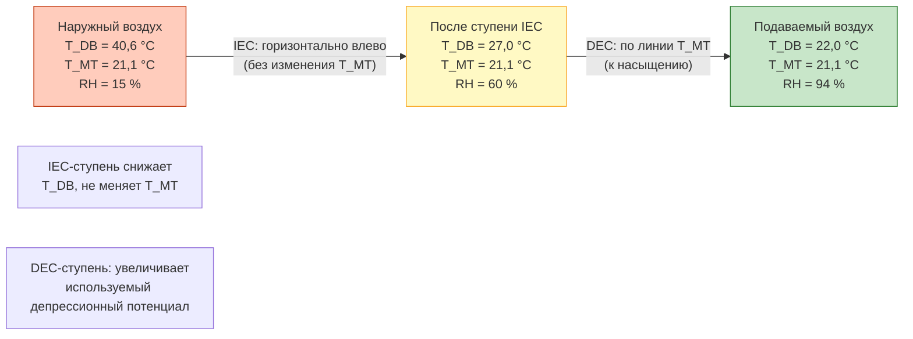
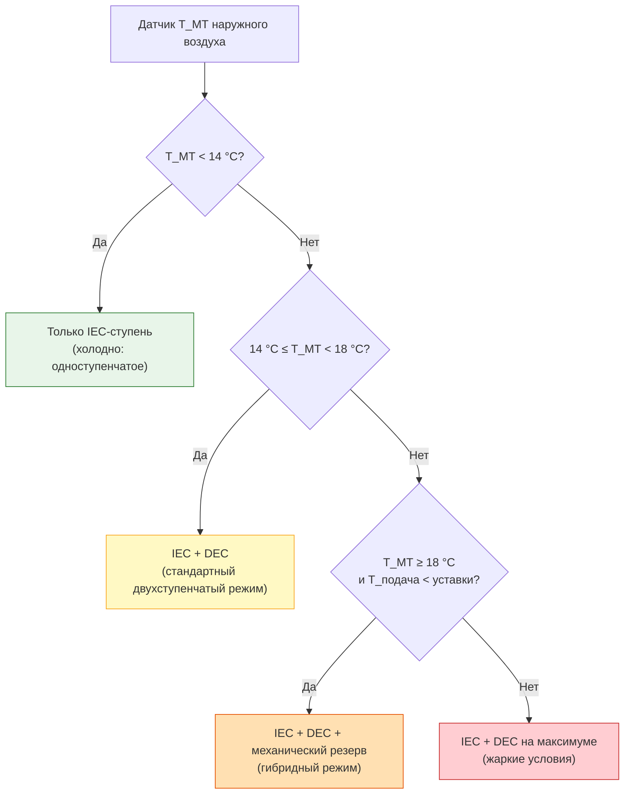

## Общие сведения

Двухступенчатое косвенно-прямое испарительное охлаждение (indirect-direct evaporative cooling, IDEC) объединяет в последовательную схему косвенную (IEC) и прямую (DEC) ступени. Такая конфигурация позволяет достичь температуры подаваемого воздуха ниже температуры мокрого термометра наружного воздуха — результата, термодинамически недостижимого ни в одноступенчатой IEC, ни в DEC.

В IEC-ступени первичный воздух предохлаждается без увлажнения, а его температура мокрого термометра остаётся неизменной. Это увеличивает располагаемый перепад температур для DEC-ступени. При одновременно высокой эффективности обеих ступеней суммарная эффективность системы по мокрому термометру превышает 100 %, и температура подачи опускается ниже $T_{\text{мт}}$ наружного воздуха.

Системы IDEC наиболее эффективны при расчётной $T_{\text{мт}} < 18$ °C и наружной относительной влажности < 50 %. Стандарты: AHRI 1250P, ASHRAE 90.1-2019, СП 60.13330.2020.

## Термодинамический анализ

### Ступень 1 — Косвенное охлаждение (IEC)

Первичный воздух охлаждается без изменения влагосодержания:


T_{\text{1,вых}} = T_{\text{нар}} - \varepsilon_{\text{IEC}} \cdot (T_{\text{нар}} - T_{\text{мт,нар}})


Температура мокрого термометра после IEC-ступени остаётся равной наружной:


T_{\text{мт,1}} = T_{\text{мт,нар}} = \text{const}


### Ступень 2 — Прямое охлаждение (DEC)

Предварительно охлаждённый воздух с сохранённой $T_{\text{мт}}$ проходит прямое испарительное охлаждение:


T_{\text{подача}} = T_{\text{1,вых}} - \varepsilon_{\text{DEC}} \cdot (T_{\text{1,вых}} - T_{\text{мт,1}})


### Суммарная эффективность по мокрому термометру

Подставив выражение для $T_{\text{1,вых}}$, получим:


\varepsilon_{\text{total}} = \varepsilon_{\text{IEC}} + \varepsilon_{\text{DEC}} \cdot (1 - \varepsilon_{\text{IEC}})


**Пример:** $\varepsilon_{\text{IEC}} = 0{,}70$; $\varepsilon_{\text{DEC}} = 0{,}85$:


\varepsilon_{\text{total}} = 0{,}70 + 0{,}85 \times (1 - 0{,}70) = 0{,}70 + 0{,}255 = 0{,}955


Итоговая температура подачи:


T_{\text{подача}} = T_{\text{нар}} - \varepsilon_{\text{total}} \cdot (T_{\text{нар}} - T_{\text{мт,нар}})


## Расчётный пример

**Исходные данные:** $T_{\text{нар}} = 40{,}6$ °C; $T_{\text{мт,нар}} = 21{,}1$ °C; $\varepsilon_{\text{IEC}} = 0{,}70$; $\varepsilon_{\text{DEC}} = 0{,}85$.

**Ступень 1 (IEC):**


T_{\text{1,вых}} = 40{,}6 - 0{,}70 \times (40{,}6 - 21{,}1) = 40{,}6 - 13{,}65 = 26{,}95 \text{ °C}


**Ступень 2 (DEC):**


T_{\text{подача}} = 26{,}95 - 0{,}85 \times (26{,}95 - 21{,}1) = 26{,}95 - 4{,}97 = 21{,}98 \text{ °C}


**Вывод:** температура подачи 22,0 °C ниже температуры мокрого термометра наружного воздуха 21,1 °C — что недостижимо ни одноступенчатой DEC, ни IEC.

### Сравнение производительности при разных условиях


| $T_{\text{нар}}$, °C | $T_{\text{мт}}$, °C | Только DEC ($\varepsilon = 85$ %), °C | IDEC ($\varepsilon_{\text{IEC}} = 70\%, \varepsilon_{\text{DEC}} = 85\%$), °C |
|---|---|---|---|
| 40,6 | 21,1 | 23,9 | 22,0 |
| 37,8 | 18,9 | 21,7 | 20,2 |
| 35,0 | 18,3 | 21,1 | 19,8 |
| 32,2 | 17,8 | 20,0 | 18,8 |


## Психрометрический процесс на h-d-диаграмме





## Компоненты системы

### Интегрированные заводские агрегаты (packaged IDEC units)

Полностью собранные двухступенчатые охладители:

- косвенный теплообменник (пластинчатый или регенеративный);
- секция прямого орошения (жёсткий целлюлозный ороситель);
- два независимых водяных контура (или общий поддон);
- первичный и вторичный вентиляторы (один общий или раздельные);
- интегрированная автоматика.

Диапазон производительности: 1 500–15 000 м³/ч первичного воздуха.

### Сборные системы для крупных объектов

Индивидуальные конфигурации с отдельными модулями IEC и DEC:

- интеграция с центральными ОВУ (AHU) через секционные короба;
- возможность многоступенчатых схем (IEC + IEC + DEC) для сверхнизких температур;
- применение в ЦОДах, крупных промышленных объектах.

### Водяные системы

Каждая ступень требует отдельного управления водой:

**Контур IEC (вторичный поток):**
- орошение мокрой стороны теплообменника;
- расход испарения меньше, чем в DEC-ступени;
- продувка для контроля CR; CR = 3–5.

**Контур DEC (первичный поток):**
- распределение воды по сечению оросителя;
- более высокая скорость испарения;
- общий или раздельный поддон с IEC-контуром.

## Управление системой IDEC

### Поэтапная логика управления





### VFD-управление вентиляторами

- **Первичный вентилятор:** скорость задаётся по расходу подаваемого воздуха или уставке давления в воздуховоде.
- **Вторичный вентилятор:** скорость задаётся по уставке температуры подачи; балансирует эффективность охлаждения и потребление энергии вентилятора.
- **Насосы обоих контуров:** регулируются по уровню воды в поддоне и расходу орошения.

## Энергоэффективность

### Сравнение с механическим DX-охлаждением


| Метрика | IDEC | DX (прямое расширение) |
|---|---|---|
| EER при расч. условиях | 30–50 | 10–14 |
| Удельная мощность, кВт/кВт охл. | 0,02–0,03 | 0,07–0,10 |
| Расход воды, л/(кВт·ч) | 3,5–5,5 | 0 |
| Снижение пиковой нагрузки | 60–75 % | Базовый уровень |
| CO₂-эквивалент охлаждения | Низкий | Высокий (утечки ХА) |


### Годовой энергетический анализ (bin analysis)

Годовое потребление энергии по интервальному методу:


E_{\text{год}} = \sum_{i} t_i \cdot \frac{\dot{Q}_i}{\text{EER}_i}


где $t_i$ — количество часов в интервале; $\dot{Q}_i$ — охлаждающая мощность; $\text{EER}_i$ — эффективность при условиях данного интервала.

**Расчётный пример (SI):** объект в Астрахани ($T_{\text{мт,1\%}} = 19{,}5$ °C); нагрузка 200 кВт; IDEC с EER = 38 при расчётных условиях:


E_{\text{пик}} = \frac{200}{38} = 5{,}3 \text{ кВт эл.}


Против DX-системы с EER = 12: $E_{\text{пик}} = 200/12 = 16{,}7$ кВт — экономия 68 % в пиковых условиях.

## Применение

### Коммерческие здания

Отличная пригодность для:

- офисных зданий в сухом климате (ASHRAE климатические зоны 1–4);
- торговых и логистических центров;
- спортивных комплексов и досуговых объектов;
- школ и университетов.

### ЦОДы (Data Centers)

Приоритетное применение:

- максимальное количество «freecooling hours» (часов без механического охлаждения);
- снижение PUE c 1,5–1,8 до 1,1–1,3;
- соответствие ASHRAE TC 9.9 A1–A4;
- механическое охлаждение как резерв для пиковых нагрузок.

Примеры: Microsoft, Google, Meta используют IDEC в ЦОДах в климатических зонах 3–5 (Западный Техас, Нидерланды, Ирландия).

### Промышленные объекты

- Комфортное охлаждение производственных помещений (сборочные цеха, склады);
- технологическое охлаждение при допустимой умеренной влажности;
- предохлаждение воздуха конденсатора чиллеров с воздушным охлаждением.

## Проектные требования и ограничения

### Климатическая пригодность

IDEC наиболее эффективно при:

- расчётной $T_{\text{мт}} < 18$ °C;
- $T_{\text{DB}} - T_{\text{мт}} > 11$ °C;
- наружной влажности < 50 % по расчётным условиям;
- продолжительном летнем сезоне.

### Управление влажностью

DEC-ступень добавляет влагу в первичный воздух. Необходимо учитывать:

- допустимый уровень влажности для конкретного применения (офис: ≤ 60 % RH; ЦОД: 20–80 %);
- возможность байпасирования DEC-ступени в периоды с высокой внутренней влажностью;
- дополнительная вентиляция для разбавления внутренней влажности.

### Водопотребление

Суммарное потребление при работе обеих ступеней:


\dot{m}_{\text{вода}} \approx \frac{\dot{Q}_{\text{total}}}{r} + \dot{V}_{\text{прод}}


Типовое значение: 4,3–6,5 л/(кВт·ч охлаждения), или 15–22 л/(тонн·ч). При дефиците воды необходима технико-экономическая оценка целесообразности применения IDEC против DX-системы.

### Капитальные затраты и срок окупаемости

Стоимость IDEC-оборудования на 30–60 % выше, чем DEC-аналога. Срок окупаемости дополнительных инвестиций при разнице в стоимости электроэнергии 6–8 руб/кВт·ч: 3–7 лет в зависимости от режима работы (количества часов в год).

## Нормативная база

- **AHRI 1250P** — Performance Rating of Indirect Evaporative Coolers; рейтинговые условия для IDEC.
- **AHRI 920-2020** — Performance Rating of Direct Evaporative Coolers; применяется к DEC-ступени.
- **ASHRAE 90.1-2019** — раздел 6.5: требования к экономайзерам; признание IDEC как меры энергоэффективности.
- **ASHRAE TC 9.9** — Thermal Guidelines for Data Processing Environments; расширенный температурный диапазон.
- **EN 14511-1:2022** — испытание тепловых насосов и чиллеров; контекст для гибридных IDEC/DX-систем.
- **EN 14825:2022** — сезонная эффективность и методика испытаний.
- **СП 60.13330.2020** — актуализированный СНиП 41-01-2003; параметры приточного воздуха, требования к воздухообмену.
- **ГОСТ Р 56246-2014** — методы энергетических испытаний систем кондиционирования.

## Практические рекомендации

### Типичные ошибки при проектировании

1. **Применение IDEC при расч. $T_{\text{мт}} > 20$ °C.** При высокой влажности ни IEC, ни DEC не дают достаточного охлаждения; инвестиции в двухступенчатую систему не окупаются.
2. **Недооценка расхода воды.** Проектирование без учёта потребления воды обеими ступенями приводит к нехватке давления и расхода подпиточной воды.
3. **Отсутствие байпаса DEC-ступени.** Без возможности обхода прямой ступени система накапливает избыточную влажность в переходные периоды.
4. **Игнорирование качества воды.** При жёсткой воде целлюлозный ороситель засоряется за один сезон; необходима водоподготовка или синтетический ороситель.
5. **Неправильный подбор мощности первичного вентилятора.** Двухступенчатая система имеет более высокое аэродинамическое сопротивление, чем одноступенчатая; запас по давлению — не менее 25 %.
