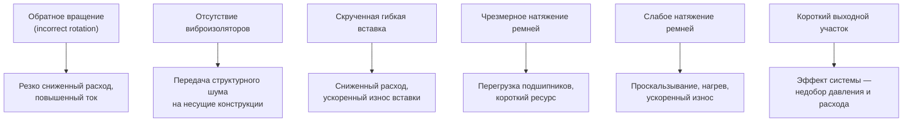

Качество монтажа вентилятора напрямую определяет, достигнет ли оборудование паспортных аэродинамических характеристик. Ошибки при установке вызывают эффект системы (system effect), снижающий фактический расход и давление относительно паспортных значений, а также провоцируют преждевременный износ подшипников и ременной передачи. Настоящий материал излагает требования и лучшие практики в соответствии с AMCA 201, AMCA 204 и ASHRAE Handbook — HVAC Systems and Equipment, гл. 21 «Air-Moving Devices».

## Подготовка к монтажу

### Обследование места установки

Перед началом монтажных работ проверяют следующее.

**Несущая способность.** Расчёт ведут на суммарную статическую нагрузку (масса вентилятора, двигателя, рамы и инерционного основания) плюс динамические нагрузки от дисбаланса ротора. Для вентиляторов на инерционных основаниях (inertia bases) динамическая нагрузка принимается равной не менее 50 % статической.

**Зазоры для обслуживания.** Необходимо обеспечить свободный доступ для демонтажа двигателя, замены ремней, замеров вибрации, лубрикации подшипников и чистки рабочего колеса. Минимальный проход — 900 мм с одной из сторон агрегата.

**Параметры электроснабжения.** Напряжение, число фаз и номинальный ток защитного аппарата должны соответствовать паспортной табличке двигателя (motor nameplate).

**Конфигурация воздуховодов.** Прямые участки на входе и выходе, необходимые для минимизации эффекта системы: не менее 4 диаметров (или эквивалентных диаметров) на входе и не менее 2,5 диаметров на выходе (AMCA 201).

**Пути доставки.** Габаритные размеры агрегата сопоставляют с размерами проёмов, лестничных маршей и монтажных люков.

### Входной контроль оборудования

При приёмке на объекте выполняют следующие действия:

1. Осматривают оборудование на наличие транспортных повреждений — вмятин корпуса, трещин в раме, изгиба вала.
2. Сравнивают данные паспортной таблички (ток, мощность, напряжение, частота вращения) со спецификацией проекта.
3. Проворачивают вал вручную — вращение должно быть свободным, без заеданий и посторонних звуков.
4. Проверяют состояние подшипников, шкивов (sheaves) и ремней: задиры, трещины, следы перегрева.
5. Проверяют комплектность поставки по упаковочному листу.

## Виброизоляция

### Выбор виброизоляторов

Тип и жёсткость виброизолятора определяются частотой вынужденных колебаний, которая прямо пропорциональна частоте вращения вентилятора. Принцип подбора: собственная частота изолятора должна составлять не более 30–40 % от частоты вынужденных колебаний.


| Частота вращения, об/мин | Тип изолятора | Статический прогиб |
|---|---|---|
| Более 1000 | Резина / неопрен (rubber / neoprene pad) | 6–13 мм |
| 500–1000 | Стальная пружина (steel spring) | 25–51 мм |
| Менее 500 | Стальная пружина усиленная | 51–102 мм |


Для ответственных применений (технические этажи над обитаемыми помещениями, операционные, студии звукозаписи, апартаменты класса «люкс») применяют инерционные основания (inertia bases) в сочетании с пружинными изоляторами — суммарный статический прогиб не менее 50 мм. Масса бетонного инерционного основания обычно составляет не менее двойной массы агрегата.

### Конструктивные требования к опорному основанию

Бетонная подушка (concrete inertia pad) должна удовлетворять следующим условиям:
- толщина не менее 100 мм;
- выступ за габарит монтажной рамы не менее 150 мм с каждой стороны;
- отклонение от горизонтали не более 3 мм на длине 3 м;
- анкерные болты устанавливают в соответствии с монтажным шаблоном производителя;
- бетон выдерживают до достижения нормативной прочности (не менее 28 сут) перед закреплением оборудования.

### Нагрузка на виброизоляторы

Для равномерного нагружения изоляторов проверяют распределение нагрузки. При четырёх опорных точках нагрузка на каждую:


F_i = \frac{m_{\text{агр}} \cdot g \cdot x_i}{4}\ \text{(Н)}


где $m_{\text{агр}}$ — масса агрегата в сборе, кг; $x_i$ — поправочный коэффициент на смещение центра тяжести. На практике используют данные нагрузок от производителя агрегата.

## Выравнивание привода

### Ременная передача

**Выравнивание шкивов.** Неправильное выравнивание ускоряет износ ремней и подшипников и создаёт дополнительные вибрации.

1. Угловое рассогласование осей шкивов (angular misalignment) — не более 0,5°; измеряют угловым лазерным прибором.
2. Параллельное смещение торцовых плоскостей шкивов (parallel / offset misalignment) — выявляют укладкой поверочной линейки по торцам шкивов; допуск — не более 1 мм на 600 мм пролёта.
3. Межосевое расстояние — в соответствии с требованиями производителя ремней для данной передачи.
4. При необходимости положение двигателя корректируют по монтажным пазам рамы.

**Натяжение ремней.** Рекомендуемый прогиб ремня в средней точке пролёта:


f = \frac{L_{\text{пролёт}}}{64}


Для клиновых ремней (V-belts) к середине пролёта прикладывают усилие 45–67 Н перпендикулярно ремню и измеряют прогиб. Новые ремни прирабатываются и вытягиваются — повторную проверку натяжения выполняют через 24–48 ч работы.

Правила монтажа ремней:
- запрещено надевать ремни на шкив с усилием рычагом или отвёрткой;
- при замене комплектного набора ремней (matched belts) заменяют весь набор;
- рабочие поверхности шкивов очищают от масла и абразивных загрязнений.

### Прямой привод и гибкие муфты

Для гибких муфт (flexible couplings):
- угловое рассогласование — не более 0,025 мм на 1 мм диаметра полумуфты;
- радиальное (параллельное) смещение — не более 0,05 мм;
- применяют индикаторные часы или лазерный центровщик (laser shaft alignment tool);
- результаты замеров фиксируют в акте центровки с подписью ответственного специалиста.

## Подключение к воздуховодам

### Эффект системы (System Effect)

Нарушения конфигурации соединений на входе и выходе вентилятора вызывают дополнительные потери давления — эффект системы. Эти потери не входят в паспортную характеристику вентилятора и должны суммироваться с расчётным аэродинамическим сопротивлением системы при подборе (AMCA 201).


| Конфигурация входа | Потеря давления |
|---|---|
| Прямой воздуховод длиной не менее 4 эквивалентных диаметров | 0 Па |
| Колено 90° непосредственно у входа | 12–48 Па |
| Вход непосредственно из плenary-камеры без направляющего кольца | 6–18 Па |
| Регулирующая заслонка у входного патрубка | 2–7 Па |


Требования к выходному участку:
- минимум 2,5 эквивалентных диаметра прямого воздуховода;
- угол раскрытия диффузора не более 7° на сторону, иначе возникает отрыв потока;
- поворот на выходе — в направлении вращения рабочего колеса;
- исключить немедленное разветвление или сужение сразу после выходного патрубка.

### Гибкие вставки

Гибкие вставки (flexible connections) изолируют структурный шум и вибрацию вентилятора от системы воздуховодов.

Требования к установке:
- длина 100–150 мм;
- вставка не должна находиться в скрученном или растянутом положении в рабочем состоянии;
- рабочее давление и температура — в пределах паспортных данных на гибкую вставку;
- огнестойкое исполнение (fire-rated) — там, где это предписывают нормы пожарной безопасности.

### Герметичность воздуховодов

Соединения воздуховодов уплотняют:
- прокладками во фланцевых стыках;
- герметиком в раструбных соединениях;
- класс герметичности не ниже класса C по SMACNA — допустимая утечка не более 4 % расчётного расхода.

## Электрические подключения

### Проводка двигателя

- Рабочее напряжение, число фаз и частота питания должны соответствовать паспортной табличке двигателя.
- Сечение кабелей выбирают по расчётному рабочему току с учётом длины и условий прокладки (ПУЭ, ГОСТ Р МЭК 60364).
- Отключающее устройство устанавливают в зоне прямой видимости двигателя (линия прямой видимости).
- Защитное заземление выполняют в соответствии с требованиями ПУЭ, раздел 7.
- Защита от перегрузки — тепловое реле или электронный мотор-протектор, откалиброванный по номинальному току.

### Преобразователи частоты (VFD)

- Минимальное и максимальное расстояния между VFD и двигателем — по таблицам производителя преобразователя.
- При длине кабеля выше рекомендованного предела — установка выходного реактора или du/dt-фильтра для защиты изоляции обмоток.
- Экранированный кабель двигателя обязателен при наличии требований ЭМС и при длине свыше 10 м.
- Линейный реактор на входе VFD снижает гармонические искажения (THDi) до уровня, требуемого IEEE 519-2022.
- До первого пуска выполняют полное параметрирование привода: время разгона/торможения, минимальная/максимальная скорость, уставки защит, данные таблички двигателя.

### Цепи управления

- Слаботочные цепи управления прокладывают в отдельных кабельных лотках, не совмещая с силовыми кабелями.
- Вблизи VFD и частотных цепей применяют экранированный кабель для аналоговых сигналов.
- Цепи блокировок безопасности (safety interlocks, в том числе реле протока воздуха) проверяют до подачи питания на двигатель.

## Предпусковые проверки

### Механические проверки

1. Снять транспортировочные стопоры вала и рабочего колеса.
2. Проверить моменты затяжки болтов крепления рамы, подшипниковых корпусов и шкивов — по таблицам производителя.
3. Убедиться в наличии и типе смазки в подшипниках согласно инструкции по эксплуатации.
4. Повторно проверить натяжение и выравнивание ремней.
5. Убедиться в установке всех защитных кожухов ременного привода и муфты.
6. Проверить зазор между рабочим колесом и входным кольцом (inlet cone) по чертежам сборочного узла.

### Проверка безопасности

- Ограждения ременного привода, муфт и шкивов установлены и надёжно закреплены.
- Открытые входные отверстия защищены сетчатыми экранами (mesh guard).
- Предупреждающие таблички и разметка зон опасности нанесены в соответствии с требованиями по охране труда.
- Предусмотрены штатные точки для навешивания замков (LOTO — lock-out/tag-out) при техническом обслуживании.

## Процедура первого пуска

### Проверка направления вращения

До выхода на рабочую скорость:

1. Подать питание на мгновение (режим «jog») и убедиться, что направление вращения рабочего колеса совпадает со стрелкой на корпусе.
2. При неверном направлении переключить любые две фазы на клеммной колодке двигателя.

### Последовательность пуска

1. **Кратковременный пуск** (30 с): оценивают наличие посторонних шумов и вибрации.
2. **Продолжительный пуск** (15–30 мин): контролируют температуру корпусов подшипников — не должна превышать 70 °C при выходе на стационарный режим.
3. **Работа под нагрузкой**: открывают регулирующие клапаны и выводят систему на расчётный режим; измеряют ток, давление и расход.

### Измерения при пуске


| Параметр | Метод измерения | Норма |
|---|---|---|
| Ток двигателя (по всем фазам) | Токоизмерительные клещи | Не более $I_{\text{ном}}$ |
| Частота вращения | Тахометр (контактный или бесконтактный) | В соответствии со спецификацией |
| Статическое давление на входе/выходе | Дифференциальный манометр | Согласно паспортной характеристике |
| Температура подшипников | Контактный или ИК-термометр | До +70 °C |
| Виброскорость (RMS, мм/с) | Виброметр, октавные полосы | По AMCA 204 |


### Приёмочные нормы вибрации (AMCA 204 / ISO 14694)


| Категория | Виброскорость RMS, мм/с | Типичная область применения |
|---|---|---|
| BV-1 | ≤ 0,51 | Точные процессы, чистые помещения |
| BV-3 | ≤ 1,27 | Стандартное коммерческое HVAC |
| BV-5 | ≤ 3,81 | Промышленная вентиляция |


Измерения проводят в трёх взаимно перпендикулярных направлениях (горизонтальном, вертикальном и осевом) на каждом подшипниковом узле при работе агрегата в стационарном режиме.

## Документация

После завершения монтажа и первого пуска оформляют следующие документы:

- акт центровки привода (значения углового и параллельного рассогласования);
- протокол проверки натяжения ремней с указанием усилия и измеренного прогиба;
- замеры рабочего тока двигателя по всем фазам при номинальном режиме;
- значения статического давления на входе и выходе вентилятора;
- значения виброскорости по всем точкам и направлениям;
- температуры подшипников в стационарном режиме;
- дату, подписи ответственных специалистов и номер акта ввода в эксплуатацию.

## Типичные ошибки монтажа и их последствия


| Симптом | Вероятная причина | Рекомендуемое действие |
|---|---|---|
| Ток выше номинального | Обратное вращение; чрезмерное натяжение ремней | Проверить направление вращения; отрегулировать натяжение |
| Расход ниже расчётного | Эффект системы; частично закрытый клапан | Улучшить конфигурацию соединений; открыть клапан |
| Повышенная вибрация | Рассогласование привода; дисбаланс ротора | Выровнять привод; выполнить балансировку рабочего колеса |
| Перегрев подшипников | Избыточная смазка; рассогласование | Удалить лишнюю смазку; провести центровку |
| Посторонний шум при работе | Визг ремней; износ подшипника | Натянуть ремни; заменить подшипник |


Строгое соблюдение приведённых требований обеспечивает соответствие фактической производительности вентилятора паспортной характеристике и многолетнюю надёжную работу оборудования с минимальным числом отказов.
