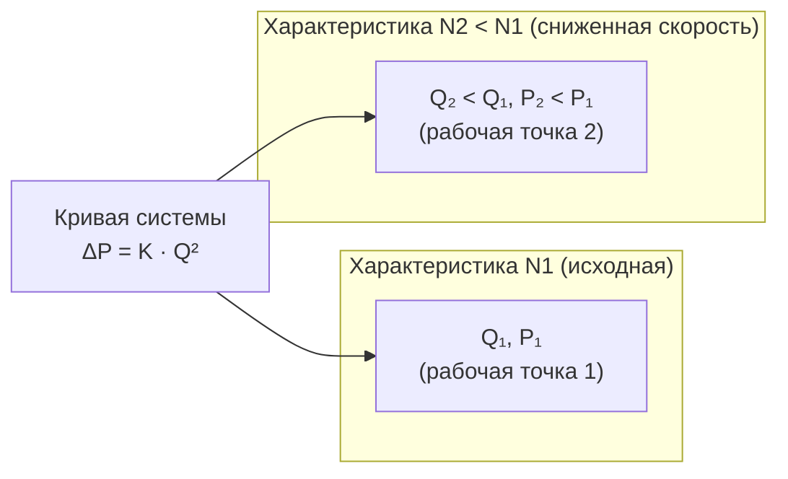

Законы подобия вентиляторов (fan laws, similarity laws) — математические соотношения, описывающие, как изменяются объёмный расход воздуха, давление и потребляемая мощность при изменении частоты вращения рабочего колеса, его диаметра или плотности перемещаемой среды. Соотношения выводятся из теории размерностей и гарантируют динамическое подобие при сохранении геометрии рабочего колеса и положения рабочей точки относительно зоны наилучшей эффективности (BEP).

Законы подобия — необходимый инструмент при проектировании систем переменного объёма воздуха (VAV), оценке работы вентиляторов на высотных объектах и обосновании энергосберегающих мероприятий.

## Три основных закона подобия

### Закон 1 — расход пропорционален частоте вращения


\frac{Q_2}{Q_1} = \frac{N_2}{N_1}


Объёмный расход изменяется прямо пропорционально частоте вращения. Увеличение скорости на 10 % даёт прирост расхода на 10 %.

### Закон 2 — давление пропорционально квадрату частоты вращения


\frac{P_2}{P_1} = \left(\frac{N_2}{N_1}\right)^2


Статическое или полное давление изменяется пропорционально квадрату отношения скоростей. Увеличение скорости на 10 % повышает давление на 21 % ($1{,}10^2 = 1{,}21$).

### Закон 3 — мощность пропорциональна кубу частоты вращения


\frac{W_2}{W_1} = \left(\frac{N_2}{N_1}\right)^3


Мощность на валу изменяется пропорционально кубу отношения скоростей. Это кубическое соотношение — физическое обоснование высокой рентабельности преобразователей частоты (VFD). Увеличение скорости на 10 % увеличивает мощность на 33 % ($1{,}10^3 = 1{,}33$); снижение скорости на 20 % сокращает мощность на 49 %.

## Сводная таблица изменений при регулировании скорости


| Параметр | Степень зависимости | При $N_2/N_1 = 1{,}10$ | При $N_2/N_1 = 0{,}80$ |
|---|---|---|---|
| Расход $Q$ | Линейная ($N^1$) | +10 % | −20 % |
| Давление $P$ | Квадратичная ($N^2$) | +21 % | −36 % |
| Мощность $W$ | Кубическая ($N^3$) | +33 % | −49 % |


Следствие: снижение расхода на 20 % обеспечивает почти двукратную экономию электроэнергии — ключевое преимущество систем VAV с VFD перед системами с постоянным расходом (CAV).

## Законы масштабирования по диаметру

Для двух геометрически подобных вентиляторов с диаметрами рабочих колёс $D_1$ и $D_2$, работающих при одинаковой окружной скорости на периферии:


\frac{Q_2}{Q_1} = \left(\frac{D_2}{D_1}\right)^3



\frac{P_2}{P_1} = \left(\frac{D_2}{D_1}\right)^2



\frac{W_2}{W_1} = \left(\frac{D_2}{D_1}\right)^5


### Одновременное изменение скорости и диаметра

При изменении как частоты вращения, так и диаметра рабочего колеса (общий случай):


Q_2 = Q_1 \cdot \frac{N_2}{N_1} \cdot \left(\frac{D_2}{D_1}\right)^3



P_2 = P_1 \cdot \left(\frac{N_2}{N_1}\right)^2 \cdot \left(\frac{D_2}{D_1}\right)^2 \cdot \frac{\rho_2}{\rho_1}



W_2 = W_1 \cdot \left(\frac{N_2}{N_1}\right)^3 \cdot \left(\frac{D_2}{D_1}\right)^5 \cdot \frac{\rho_2}{\rho_1}


## Влияние плотности воздуха

### Коррекция по плотности

Паспортные кривые производительности публикуются для стандартных условий ($\rho_0 = 1{,}204$ кг/м³ при 20 °C, 101,325 кПа). При отклонении фактической плотности:


\frac{P_{\text{факт}}}{P_{\text{стд}}} = \frac{\rho_{\text{факт}}}{\rho_0}, \qquad \frac{W_{\text{факт}}}{W_{\text{стд}}} = \frac{\rho_{\text{факт}}}{\rho_0}


Объёмный расход $Q$ при той же частоте вращения и том же положении на характеристике не изменяется. Меняются лишь массовый расход, развиваемое давление и потребляемая мощность — пропорционально плотности.

### Высотная поправка

Атмосферное давление убывает с высотой над уровнем моря, снижая плотность воздуха:


\rho_h \approx \rho_0 \cdot \frac{p_h}{p_0}


где $p_h$ — барометрическое давление на данной высоте, кПа; $p_0 = 101{,}325$ кПа.


| Высота над уровнем моря | Коэффициент плотности $\rho_h / \rho_0$ | Относительное давление и мощность |
|---|---|---|
| 0 м (уровень моря) | 1,00 | 100 % |
| 610 м | 0,93 | 93 % |
| 1524 м | 0,83 | 83 % |
| 3048 м | 0,69 | 69 % |


На высоте 1524 м вентилятор развивает лишь 83 % паспортного давления при той же частоте вращения. Для компенсации необходимо увеличить частоту вращения или выбрать вентилятор большего размера. Проектировщик обязан учесть высоту при подборе оборудования для горных регионов.

### Влияние температуры воздуха


\frac{\rho_2}{\rho_1} = \frac{T_1}{T_2} \qquad (T\ \text{— абсолютная температура, К})


**Пример.** Горячий технологический воздух $T_2 = 60$ °C = 333 К; стандартные условия $T_1 = 20$ °C = 293 К:


\frac{\rho_2}{\rho_1} = \frac{293}{333} = 0{,}88


Вентилятор развивает 88 % паспортного давления и потребляет 88 % паспортной мощности при той же частоте вращения.

## Взаимодействие с кривой системы

### Уравнение кривой системы

Аэродинамическое сопротивление сети воздуховодов описывается параболой второго порядка:


\Delta P_{\text{сист}} = K_{\text{сист}} \cdot Q^2


где $K_{\text{сист}}$ — коэффициент сопротивления системы, Па·с²/м⁶, постоянный при неизменной конфигурации воздуховодов и открытых регуляторах.

### Рабочая точка

Вентилятор работает в точке пересечения своей кривой с кривой системы. При изменении частоты вращения рабочая точка перемещается по кривой системы. Это подтверждается соотношением для постоянного $K_{\text{сист}}$:


\frac{Q_2}{Q_1} = \sqrt{\frac{P_2}{P_1}}


## Практические применения

### Экономия энергии при регулировании VFD

При снижении расхода с 100 % до 60 % с помощью VFD:


\frac{W_2}{W_1} = \left(\frac{Q_2}{Q_1}\right)^3 = 0{,}60^3 = 0{,}216


Потребляемая мощность составит лишь 22 % от номинала — экономия 78 %.


| Метод регулирования | Потребляемая мощность | Экономия |
|---|---|---|
| Преобразователь частоты (VFD) | 22 % | 78 % |
| Входные направляющие лопатки (IGV, inlet guide vanes) | 55–65 % | 35–45 % |
| Дроссельная заслонка на выходе (outlet damper) | 70–80 % | 20–30 % |
| Дроссельная заслонка на входе (inlet damper) | 50–60 % | 40–50 % |


### Числовой пример — изменение частоты вращения

Исходные данные: $Q_1 = 10\,000$ м³/ч, $P_1 = 500$ Па, $W_1 = 3{,}0$ кВт при $N_1 = 1000$ об/мин, $\rho = \text{const}$.

Параметры при $N_2 = 800$ об/мин:


Q_2 = 10\,000 \times \frac{800}{1000} = 8000\ \text{м}^3/\text{ч}



P_2 = 500 \times \left(\frac{800}{1000}\right)^2 = 500 \times 0{,}64 = 320\ \text{Па}



W_2 = 3{,}0 \times \left(\frac{800}{1000}\right)^3 = 3{,}0 \times 0{,}512 = 1{,}54\ \text{кВт}


Снижение частоты вращения на 20 % даёт экономию 49 % при сокращении расхода на 20 %.

### Определение требуемой частоты вращения

Задача: при $Q_1 = 10\,000$ м³/ч и $N_1 = 1000$ об/мин определить частоту вращения $N_2$ для обеспечения $Q_2 = 12\,500$ м³/ч:


N_2 = N_1 \times \frac{Q_2}{Q_1} = 1000 \times \frac{12\,500}{10\,000} = 1250\ \text{об/мин}


Перед увеличением скорости необходимо убедиться, что двигатель выдержит возросшую мощность ($W \propto N^3$, рост в $1{,}25^3 \approx 1{,}95$ раза) и что вентилятор соответствует требуемому классу прочности по AMCA 99.

## Ограничения применения законов подобия

### Только геометрически подобные вентиляторы

Законы масштабирования по диаметру применимы исключительно к вентиляторам с одинаковыми:
- углами лопаток на входе и выходе;
- отношением диаметра ступицы к диаметру рабочего колеса;
- числом и профилем лопаток.

Масштабирование между конструктивно различными вентиляторами требует натурных испытаний.

### Работа в зоне устойчивой характеристики

Законы подобия корректны только в устойчивой (правой) части кривой вентилятора — правее зоны срыва потока (stall) или помпажа (surge). При работе в нестабильной зоне прогнозы законов подобия становятся недостоверными.

### КПД не остаётся постоянным

Законы подобия неявно предполагают, что КПД при масштабировании остаётся постоянным. В действительности максимальный КПД достигается только вблизи BEP, а при отходе от расчётной точки снижается. Кроме того, VFD вносит незначительные дополнительные потери при частичных нагрузках.

### Эффект системы не учитывается

Законы описывают поведение самого вентилятора. Потери на эффект системы (system effect) из-за нарушений конфигурации воздуховодных соединений добавляются к сопротивлению системы отдельно и не масштабируются законами подобия.

## Годовой анализ энергопотребления

Для оценки экономии при установке VFD применяют расчёт по зонам нагрузки (bin method):


\Delta W_{\text{год}} = \sum_{i} \tau_i \cdot \left[ W_{\text{базов},i} - W_{\text{VFD},i} \right]


где $\tau_i$ — число часов работы в зоне нагрузки $i$; $W_{\text{базов},i}$ — мощность без VFD (дросселирование); $W_{\text{VFD},i}$ — мощность с VFD.

Типичный простой срок окупаемости VFD для систем VAV в европейском или российском климате — 2–4 года при стоимости электроэнергии 0,10–0,20 €/кВт·ч и годовом фонде работы 4000–7000 ч.

Законы подобия вентиляторов — фундаментальный инструмент проектировщика HVAC, обеспечивающий точное прогнозирование производительности оборудования при изменении эксплуатационных условий и строгое обоснование энергосберегающих технических решений.
