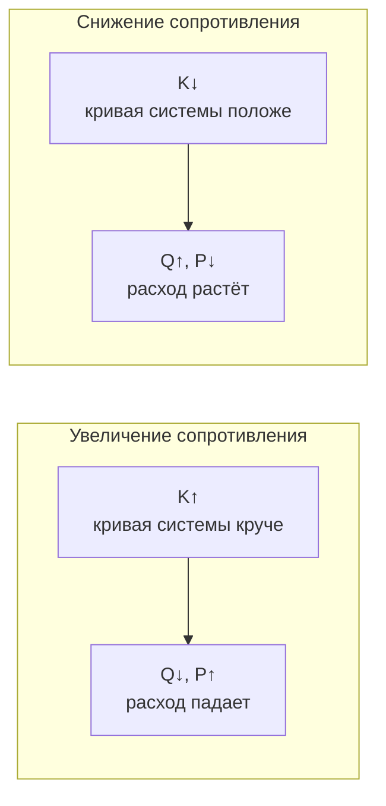

Характеристики производительности вентилятора (fan performance) определяют способность оборудования перемещать воздух при заданных условиях. Понимание кривых производительности, критериев эффективности и границ устойчивой работы обязательно для правильного подбора вентилятора и эксплуатации системы в оптимальном режиме.

## Компоненты кривой производительности

Полная характеристика вентилятора (согласно AMCA 210 / ASHRAE 51) включает четыре взаимосвязанные кривые, строящиеся на одном графике в зависимости от объёмного расхода:

1. **Кривая давление–расход (pressure-volume curve)** — статическое или полное давление в зависимости от $Q$.
2. **Кривая мощности (power curve)** — мощность на валу $W$ в зависимости от $Q$.
3. **Кривая КПД (efficiency curve)** — полный или статический КПД в зависимости от $Q$.
4. **Зона устойчивой работы (stable operating range)** — диапазон $Q$ правее зоны помпажа или срыва.

## Давления вентилятора

### Определения давлений

**Полное давление вентилятора (Fan Total Pressure, FTP):**


FTP = TP_{\text{вых}} - TP_{\text{вх}}


**Статическое давление вентилятора (Fan Static Pressure, FSP):**


FSP = FTP - VP_{\text{вых}}


**Скоростное (динамическое) давление (velocity pressure, VP):**


VP = \frac{\rho\, V^2}{2}


Для стандартного воздуха ($\rho = 1{,}204$ кг/м³):


VP\ [\text{Па}] = 0{,}602\, V^2\ [\text{м/с}]


### Пример — скоростное давление и статическое давление вентилятора

Воздух выходит из патрубка вентилятора со скоростью $V = 10$ м/с при $\rho = 1{,}20$ кг/м³:


VP_{\text{вых}} = \frac{1{,}20 \times 10^2}{2} = 60{,}0\ \text{Па}


Если $FTP = 450$ Па, то:


FSP = 450 - 60 = 390\ \text{Па}


При подборе по статическому давлению необходимо убедиться, что эти 60 Па скоростного давления действительно «теряются» на выходе из системы, а не используются полезно.

## Формы кривых по типу рабочего колеса


| Тип рабочего колеса | Форма кривой | Характерные особенности |
|---|---|---|
| Загнутые вперёд (forward-curved, FC) | Крутая, S-образная | Пик давления левее BEP; мощность возрастает с расходом (overloading) |
| Загнутые назад плоские (backward-inclined, BI) | Пологая, монотонно падающая | Самоограничивающаяся мощность; широкий устойчивый диапазон |
| Профилированные (airfoil backward-curved) | Аналогична BI, чуть круче | Максимальный КПД; мощность не превышает номинала |
| Осевые (axial) | Прогиб в зоне малых расходов | Выраженная зона срыва потока |
| Радиальные (radial blade) | Относительно пологая | Высокое давление при нулевом расходе; устойчивы к загрязнению |


## Рабочая точка

### Кривая системы

Аэродинамическое сопротивление системы воздуховодов описывается квадратичной зависимостью:


\Delta P_{\text{сист}} = K_{\text{сист}} \cdot Q^2


где $K_{\text{сист}}$ — коэффициент сопротивления системы, Па·с²/м⁶. Коэффициент определяется суммарным сопротивлением воздуховодов, фильтров, батарей и концевых устройств при неизменных положениях заслонок.

### Нахождение рабочей точки

Вентилятор работает в точке пересечения своей паспортной характеристики с кривой системы:


P_{\text{вент}}(Q) = P_{\text{сист}}(Q)


Эта точка однозначно определяет объёмный расход, давление, потребляемую мощность и КПД при данной частоте вращения и плотности воздуха.

### Сдвиг рабочей точки

**Увеличение сопротивления** (засорился фильтр, прикрыта заслонка): рабочая точка смещается влево по кривой вентилятора — расход падает, давление растёт.

**Снижение сопротивления** (открыт байпас, демонтирован элемент системы): рабочая точка смещается вправо — расход растёт, давление падает. При значительном снижении возможна перегрузка двигателя у вентиляторов с характеристикой «overloading» (FC-тип).

## КПД вентилятора

### Определения КПД

**Полный механический КПД (total efficiency):**


\eta_T = \frac{Q \cdot FTP}{W_{\text{вал}}}


**Статический КПД (static efficiency):**


\eta_s = \frac{Q \cdot FSP}{W_{\text{вал}}}


где $Q$ — м³/с, давление — Па, $W_{\text{вал}}$ — Вт.

**Мощность на валу (shaft power, brake power):**


W_{\text{вал}} = \frac{Q \cdot FTP}{\eta_T}


**Полная входная электрическая мощность:**


W_{\text{эл}} = \frac{W_{\text{вал}}}{\eta_{\text{дв}} \cdot \eta_{\text{привод}}}


где $\eta_{\text{дв}}$ — КПД электродвигателя; $\eta_{\text{привод}}$ — КПД передачи (0,95–0,98 для ременного привода, 1,00 для прямого).

### Точка наилучшей эффективности (BEP)

Кривая КПД имеет выраженный максимум — зону наилучшей эффективности (Best Efficiency Point, BEP). Проектируют вентилятор для работы вблизи BEP; допустимое отклонение рабочей точки — не более 20 % от $Q_{\text{BEP}}$ по расходу. Работа далеко от BEP приводит к повышенным шуму, вибрации и ускоренному износу.


| Тип рабочего колеса | Пиковый $\eta_T$, % |
|---|---|
| Профилированный загнутый назад (airfoil backward-curved) | 80–88 |
| Плоский загнутый назад (backward-inclined) | 75–82 |
| Осевой с направляющим аппаратом (vane-axial) | 70–82 |
| Загнутый вперёд (forward-curved) | 60–70 |
| Радиальный (radial blade) | 55–70 |
| Пропеллерный (propeller) | 40–60 |


## Помпаж и срыв потока

### Помпаж центробежного вентилятора (Surge)

Помпаж (surge) возникает при смещении рабочей точки влево от пика давления на характеристике центробежного вентилятора. Признаки:

- периодическая обратная прокачка воздуха, слышимая как характерный «хлопающий» звук;
- резкий рост шума и вибрации;
- нестабильный ток двигателя;
- возможное механическое повреждение рабочего колеса и подшипников при длительном воздействии.

Для предотвращения помпажа рабочую точку выбирают правее зоны нестабильности — как правило, при расходе не менее 60–70 % от максимального. В системах VAV с VFD минимальную частоту вращения ограничивают так, чтобы при любой нагрузке сохранялась устойчивая работа.

### Срыв потока осевого вентилятора (Stall)

Срыв потока (stall) — отрыв пограничного слоя на лопастях при высоком статическом давлении и малом расходе. Признаки:

- резкое падение развиваемого давления и КПД;
- рост уровня шума, характерный шипящий звук;
- перемежающиеся нестабильные колебания потока.

Зона срыва проявляется на кривой осевого вентилятора в виде характерного прогиба (dip). Рабочую точку располагают правее этого прогиба.

## Производительность в нестандартных условиях

### Влияние высоты над уровнем моря

На высоте $h$ плотность воздуха $\rho_h < \rho_0$:


\rho_h = \rho_0 \cdot \frac{p_h}{p_0}


При той же частоте вращения вентилятор обеспечивает тот же объёмный расход $Q$, но развивает меньшее давление и потребляет меньшую мощность — пропорционально отношению плотностей.

### Влияние температуры


\frac{\rho_T}{\rho_0} = \frac{T_0}{T}


Горячий воздух менее плотен: давление и мощность снижаются, объёмный расход сохраняется, массовый расход уменьшается.

### Числовой пример коррекции по высоте и температуре

Кривая вентилятора задана для стандартных условий $\rho_0 = 1{,}204$ кг/м³. Определить фактическую производительность при $t = 50$ °C и высоте 1000 м ($p_h = 90{,}0$ кПа):


\rho_h = 1{,}204 \times \frac{90{,}0}{101{,}325} = 1{,}204 \times 0{,}888 = 1{,}069\ \text{кг/м}^3



\rho_{h,T} = 1{,}069 \times \frac{293}{323} = 1{,}069 \times 0{,}907 = 0{,}970\ \text{кг/м}^3



\text{Коэффициент плотности} = \frac{0{,}970}{1{,}204} = 0{,}806


Давление и мощность составят 80,6 % от паспортных значений. Расход $Q$ остаётся неизменным.

## Параллельная и последовательная работа

### Параллельная работа (Parallel Operation)

При параллельном включении двух вентиляторов в одну систему суммарная характеристика получается горизонтальным сложением расходов при одинаковом давлении:


Q_{\text{итого}} = Q_1 + Q_2, \qquad P_{\text{общ}} = P_{\text{единичн}}


Рекомендуется применять идентичные вентиляторы во избежание нарушения баланса нагрузки. Фактическое распределение расхода определяется пересечением суммарной характеристики с кривой системы. Каждый вентилятор должен находиться в устойчивой зоне при любом режиме нагрузки — в противном случае один из них может войти в помпаж.

### Последовательная работа (Series Operation)

При последовательном включении давления суммируются, расход остаётся общим:


P_{\text{итого}} = P_1 + P_2, \qquad Q_{\text{общ}} = Q_{\text{единичн}}


Второй вентилятор в ряду работает с уже подогретым или уплотнённым воздухом — его паспортное давление и мощность пересчитывают с учётом изменения плотности. Последовательная схема применяется в системах высокого давления: тоннельная вентиляция, промышленные технологические процессы с длинными воздуховодами.

## Испытания и верификация производительности

### Лабораторные испытания (AMCA 210 / ASHRAE 51)

Стандартизированные конфигурации испытательных стендов:
- камера с многоточечной решёткой сопел (nozzle chamber);
- трубка Пито с профилированием скорости по сечению;
- вход в камеру (inlet chamber) и выход в камеру (outlet chamber).

Условия испытания: $\rho = 1{,}20$ кг/м³ ($t = 20$ °C, $p = 101{,}325$ кПа). Результаты представляют в виде безразмерных коэффициентов давления, расхода и мощности для масштабирования на любые рабочие условия.

### Натурные измерения

Проверка производительности смонтированного вентилятора по трубке Пито:


Q = V_{\text{ср}} \cdot A_{\text{вод}}


где $V_{\text{ср}}$ — средняя скорость в воздуховоде по профилю трубки Пито, м/с; $A_{\text{вод}}$ — площадь поперечного сечения воздуховода, м². Измеренные значения $Q$ и $P$ сравнивают с паспортной кривой с учётом поправки на плотность воздуха и потерь на эффект системы (AMCA 201).

### Допуски по AMCA 210


| Параметр | Допуск |
|---|---|
| Объёмный расход при номинальном давлении | ±10 % |
| Давление при номинальном расходе | ±10 % |
| Пиковый КПД | −5 % от заявленного значения |


## Рекомендации по выбору рабочей точки

Последовательность действий при проектировании:

1. Рассчитать требуемый расход $Q_{\text{расч}}$ и статическое давление $P_{\text{расч}}$ системы.
2. Прибавить запас: расход +10 %, давление +20 % для учёта засорения фильтров и неточностей расчёта.
3. Прибавить потери на эффект системы $\Delta P_{\text{SE}}$ (AMCA 201).
4. Нанести расчётную точку на кривые вентиляторов-кандидатов.
5. Убедиться, что рабочая точка находится в устойчивой зоне правее помпажа / срыва.
6. Проверить КПД в рабочей точке — не ниже 80 % от пикового.
7. Убедиться, что мощность двигателя с коэффициентом запаса 1,10–1,15 перекрывает мощность на валу во всём диапазоне характеристики.
8. Для систем VAV проверить устойчивость при минимальном расходе (обычно 40–50 % от расчётного).

Знание характеристик производительности вентилятора позволяет выбрать оборудование, работающее в зоне высокого КПД на всём расчётном диапазоне нагрузок, обеспечивая низкое энергопотребление и долговечность механических компонентов.
