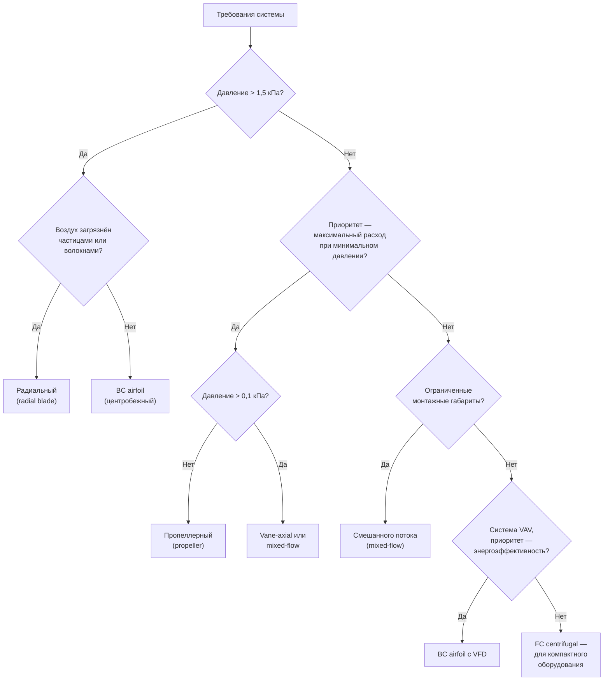

В системах HVAC применяют несколько конструктивно различных типов вентиляторов, каждый из которых оптимален для определённого сочетания расхода воздуха, давления, КПД и акустических требований. Знание аэродинамических особенностей каждого типа позволяет выбрать оборудование, наиболее соответствующее конкретной задаче.

## Центробежные вентиляторы (Centrifugal Fans)

Центробежные вентиляторы ускоряют воздух в радиальном направлении от оси вращения. Рабочее колесо передаёт импульс воздуху, после чего спиральный корпус (volute casing) преобразует кинетическую энергию в статическое давление за счёт постепенно расширяющегося сечения.

### Вентиляторы с загнутыми вперёд лопатками (Forward-Curved, FC)

**Конструкция:**
- многолопастное рабочее колесо, 24–64 лопатки;
- лопатки изогнуты в направлении вращения;
- компактный спиральный корпус;
- относительно невысокая окружная скорость.


| Параметр | Типичные значения |
|---|---|
| Полный КПД $\eta_T$ | 60–70 % |
| Развиваемое давление | До 1,25 кПа |
| Кривая мощности | Возрастающая с расходом (overloading) |
| Уровень шума | Умеренно повышенный на низких частотах |


**Применение:** вентиляторные доводчики (FCU), приточные установки небольшой мощности, бытовые газовые печи (furnaces), оборудование с чистым воздухом.

**Преимущества:** компактность, экономичная конструкция, тихая работа вблизи расчётной точки.

**Ограничения:** S-образная кривая давление–расход создаёт зону нестабильности левее пика давления; двигатель необходимо выбирать с запасом на перегрузку, так как мощность возрастает при увеличении расхода сверх расчётного.

### Вентиляторы с плоскими загнутыми назад лопатками (Backward-Inclined, BI)

**Конструкция:**
- 10–16 плоских лопаток, отклонённых против направления вращения;
- самоограничивающаяся характеристика мощности (non-overloading);
- более высокая окружная скорость по сравнению с FC.


| Параметр | Типичные значения |
|---|---|
| Полный КПД $\eta_T$ | 75–82 % |
| Развиваемое давление | До 2,0 кПа |
| Кривая мощности | Монотонно снижается за пиком — «самоограничение» |
| Уровень шума | Ниже, чем у FC; доминируют средние и высокие частоты |


**Применение:** центральные кондиционеры (AHU), системы VAV, применения с умеренными требованиями к КПД.

**Преимущества:** более высокий КПД, чем у FC; устойчивая кривая без зоны помпажа; безопасный выбор двигателя — мощность не уходит в «разнос».

**Ограничения:** чувствительность к загрязнению воздуха — частицы прилипают к вогнутой стороне лопатки; более высокая стоимость по сравнению с FC.

### Вентиляторы с профилированными загнутыми назад лопатками (Airfoil Backward-Curved, BC Airfoil)

**Конструкция:**
- 10–16 лопаток аэродинамического профиля (airfoil cross-section);
- минимальное профильное сопротивление за счёт обтекаемой формы лопатки;
- наивысший КПД среди центробежных конструкций.


| Параметр | Типичные значения |
|---|---|
| Полный КПД $\eta_T$ | 80–88 % |
| Развиваемое давление | До 2,5 кПа |
| Кривая мощности | Самоограничивающаяся |
| Уровень шума | Наименьший среди центробежных типов |


**Применение:** крупные центральные кондиционеры с требованиями ASHRAE 90.1, чистые помещения (cleanrooms), системы VAV с приоритетом энергоэффективности.

**Преимущества:** максимальный КПД и минимальный шум среди центробежных вентиляторов; самоограничивающаяся мощность упрощает подбор двигателя.

**Ограничения:** более высокая стоимость изготовления; полые аэродинамические лопатки не предназначены для загрязнённого или влажного воздуха.

### Вентиляторы с радиальными лопатками (Radial Blade)

**Конструкция:**
- 6–12 прямых лопаток, направленных по радиусу;
- простая, прочная конструкция с широкими проходными сечениями;
- самоочищающееся рабочее колесо — частицы не задерживаются.


| Параметр | Типичные значения |
|---|---|
| Полный КПД $\eta_T$ | 55–70 % |
| Развиваемое давление | До 5 кПа |
| Кривая мощности | Возрастающая |
| Уровень шума | Высокий |


**Применение:** пневматический транспорт материалов, системы пылеудаления, промышленные вытяжки, коррозионные и абразивные среды.

**Преимущества:** устойчивость к засорению частицами и волокнами; способность развивать высокое давление; простота изготовления и обслуживания.

**Ограничения:** низкий КПД; высокий уровень шума; не рекомендован для коммерческого HVAC при наличии альтернативы.

## Осевые вентиляторы (Axial Fans)

Осевые вентиляторы создают поток воздуха параллельно оси вращения. Они обеспечивают высокий объёмный расход при относительно невысоком статическом давлении.

### Пропеллерные вентиляторы (Propeller Fans)

**Конструкция:**
- 2–8 лопастей, закреплённых на ступице без кольцевого корпуса;
- прямой или ременной привод;
- нет входного или выходного патрубка.


| Параметр | Типичные значения |
|---|---|
| Полный КПД $\eta_T$ | 40–60 % |
| Развиваемое давление | До 0,12 кПа |
| Объёмный расход | Высокий относительно размера |
| Уровень шума | Умеренно высокий |


**Применение:** общеобменная вентиляция промышленных помещений, градирни (cooling towers), воздушные конденсаторы (air-cooled condensers), сельскохозяйственная вентиляция.

**Преимущества:** простая конструкция, низкая стоимость, высокая подача воздуха при минимальном статическом давлении.

**Ограничения:** практически не развивает полезного статического давления; неприемлем для систем с воздуховодами и значимым аэродинамическим сопротивлением.

### Трубчато-осевые вентиляторы (Tube-Axial Fans)

**Конструкция:**
- рабочее колесо пропеллерного типа в цилиндрическом корпусе;
- частичное выпрямление вихревого потока за счёт корпуса;
- двигатель расположен в воздушном потоке или вынесен за корпус.


| Параметр | Типичные значения |
|---|---|
| Полный КПД $\eta_T$ | 50–65 % |
| Развиваемое давление | До 0,5 кПа |
| Объёмный расход | Высокий |
| Уровень шума | Умеренный |


**Применение:** повысители давления в воздуховодах (duct booster fans), вытяжные системы, окрасочные камеры (spray booths), вентиляция подземных автостоянок.

**Преимущества:** компактность, прямой монтаж в воздуховод, хороший баланс расхода и давления при умеренной стоимости.

**Ограничения:** вращательный вихрь на выходе снижает КПД при отсутствии направляющего аппарата; кривая давление–расход менее выражена, чем у vane-axial.

### Осевые вентиляторы с направляющим аппаратом (Vane-Axial Fans)

**Конструкция:**
- рабочее колесо пропеллерного типа с входными и/или выходными направляющими лопатками (guide vanes);
- направляющий аппарат устраняет вращательный вихрь, преобразуя кинетическую энергию вращательного движения в статическое давление;
- доступны исполнения с регулируемым углом установки лопастей (variable pitch).


| Параметр | Типичные значения |
|---|---|
| Полный КПД $\eta_T$ | 65–82 % |
| Развиваемое давление | До 1,5 кПа |
| Объёмный расход | Высокий |
| Уровень шума | Ниже, чем у трубчато-осевых |


**Применение:** крупные центральные кондиционеры, тоннельная и шахтная вентиляция, промышленные технологические процессы.

**Преимущества:** высокий КПД; компактность при высоком давлении; исполнение с переменным шагом лопастей обеспечивает широкий диапазон регулирования без VFD.

**Ограничения:** более высокая стоимость; шум возрастает при работе вне расчётного режима.

## Вентиляторы смешанного потока (Mixed-Flow Fans)

**Конструкция:**
- рабочее колесо с угловым (коническим) профилем — промежуточное между осевым и центробежным;
- цилиндрический или конический корпус;
- на выходе из рабочего колеса присутствуют как осевая, так и радиальная составляющие скорости.

**Характеристики:** КПД 70–80 %, давление 0,5–1,5 кПа, компактные осевые габариты при давлении, характерном для лёгких центробежных вентиляторов.

**Применение:** встраиваемые в воздуховод устройства, системы с ограниченными монтажными габаритами, модернизация (retrofit) существующих систем, вентиляция подземных автостоянок и тоннелей.

## Специализированные конструкции

### Камерные (plug) вентиляторы

Центробежное рабочее колесо без спирального корпуса монтируют непосредственно в разгрузочную плену (plenum chamber). Несколько рабочих колёс могут работать параллельно в едином блоке (plug fan array). Конструкция обеспечивает упрощённый доступ для обслуживания, гибкость размещения выходных каналов и снижение потерь на эффект системы.

### Встраиваемые центробежные вентиляторы (Inline Centrifugal Fans)

Центробежное рабочее колесо в корпусе осевой конфигурации с прямолинейным входным и выходным патрубком. Обеспечивает более высокое давление по сравнению с трубчато-осевым вентилятором при сохранении линейной воздуховодной трассы.

### Кровельные и настенные вытяжки (Roof / Wall Exhausters)

Специализированные исполнения для удаления воздуха из зданий:
- центробежные с вертикальным или горизонтальным выбросом;
- пропеллерные прямого привода;
- всепогодный корпус из оцинкованной стали или нержавейки;
- встроенные обратные клапаны (backdraft dampers).

### Потолочные вентиляторы большого диаметра HVLS (High-Volume Low-Speed)

Потолочные вентиляторы диаметром 3–7 м, вращающиеся со скоростью 20–60 об/мин. Создают однородную циркуляцию воздуха в высоких промышленных зданиях, складах и спортивных залах, снижая температурную стратификацию и улучшая тепловой комфорт без значительного потребления электроэнергии.

## Сводное сравнение типов вентиляторов


| Тип | КПД, % | Давление | Расход | Наилучшая область применения |
|---|---|---|---|---|
| FC центробежный | 60–70 | Низкое–среднее | Высокий | FCU, RTU, встроенное оборудование |
| BI центробежный | 75–82 | Среднее | Средний | AHU, VAV системы |
| BC airfoil | 80–88 | Среднее–высокое | Средний | Крупные AHU, чистые помещения |
| Радиальный | 55–70 | Высокое | Низкий | Пневмотранспорт, пылеудаление |
| Пропеллерный | 40–60 | Очень низкое | Очень высокий | Градирни, конденсаторы, вентиляция |
| Трубчато-осевой | 50–65 | Низкое–среднее | Высокий | Duct boosters, вытяжки |
| Vane-axial | 65–82 | Среднее | Высокий | Тоннели, крупные AHU |
| Смешанного потока | 70–80 | Среднее | Средний–высокий | Встраиваемые, реконструкция |


## Алгоритм выбора типа вентилятора

Выбор оптимального типа вентилятора с учётом аэродинамических характеристик, требований к КПД и условий эксплуатации — основа энергоэффективной, надёжной и акустически комфортной системы HVAC.
