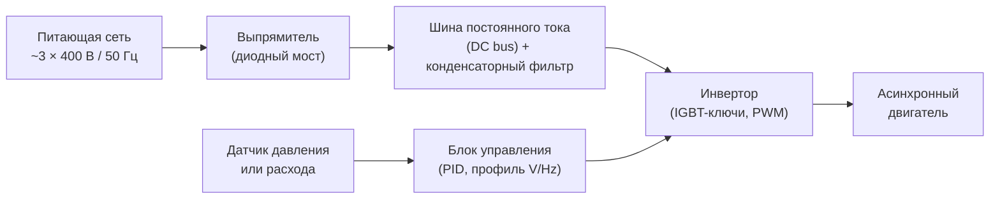

Регулирование скорости вентилятора — наиболее эффективный способ снижения потребления электроэнергии в системах с переменным расходом воздуха. Кубическая зависимость мощности от частоты вращения (третий закон подобия) означает, что даже умеренное снижение скорости даёт непропорционально большую экономию. ASHRAE 90.1-2022, раздел 6.5.3, обязывает применять регулирование скорости для вентиляторов мощностью свыше 0,75 кВт в системах VAV (variable air volume).

## Преобразователи частоты (Variable Frequency Drive, VFD)

### Принцип работы

Преобразователь частоты изменяет скорость асинхронного двигателя путём изменения частоты и напряжения питания. Синхронная скорость:


N_s = \frac{120 \cdot f}{p}\ [\text{об/мин}]


где $f$ — частота питающей сети, Гц; $p$ — число полюсов обмотки статора.

**Пример.** Двигатель с $p = 4$, $f_1 = 50$ Гц: $N_s = 1500$ об/мин; при $f_2 = 40$ Гц: $N_s = 1200$ об/мин. Снижение частоты на 20 % уменьшает расход на 20 % и потребляемую мощность на 49 % (закон куба).

### Структура силовой цепи VFD

**Выпрямитель (rectifier):** диодный мост преобразует переменный ток в постоянный.

**Шина постоянного тока (DC bus):** конденсаторный фильтр сглаживает пульсации напряжения.

**Инвертор (inverter):** транзисторные ключи IGBT генерируют квазисинусоидальное напряжение переменной частоты методом широтно-импульсной модуляции (PWM).

**Блок управления:** обрабатывает задание от системы BAS / BACnet, реализует ПИД-алгоритм и функции защиты.

### Закон управления напряжение/частота (V/Hz)

Для поддержания постоянного магнитного потока и крутящего момента при изменении частоты:


\frac{U}{f} = \text{const}


При снижении частоты ниже номинальной напряжение снижается пропорционально. Работа выше номинальной частоты (режим ослабления поля) в системах HVAC не применяется. Современные приводы также поддерживают векторное управление (sensorless vector control), обеспечивающее более точный контроль момента при низких частотах.

## EC-двигатели (Electronically Commutated Motors)

### Технология

EC-двигатель — синхронный двигатель с ротором на постоянных магнитах и встроенной электронной коммутацией. Обеспечивает истинную синхронную скорость без скольжения, присущего асинхронным двигателям. Интегрированная электроника управления позволяет реализовать аналоговый вход задания скорости (0–10 В или 4–20 мА) без внешнего VFD.


| Параметр | EC-двигатель | VFD + асинхронный двигатель |
|---|---|---|
| КПД при частичной нагрузке | 80–92 % | 70–85 % |
| Габариты | Единый компактный блок | Отдельный привод + двигатель |
| Диапазон мощностей | До 3,7 кВт (оптимально) | От 0,37 кВт до нескольких МВт |
| ЭМС | Встроенные фильтры | Требует экранирования кабелей |
| Стоимость обслуживания | Минимальная (нет щёток) | Средняя (подшипники, привод) |


**Области применения EC-двигателей:** вентиляторные доводчики (FCU), концевые блоки VAV, небольшие вытяжные установки, печи с переменным расходом, дисплейные витрины холодильного оборудования. При мощности свыше 4–5 кВт экономически предпочтительна схема VFD + стандартный асинхронный двигатель.

## Расчёт экономии энергии

### Закон куба

Потребляемая мощность вентилятора изменяется как куб отношения расходов (или частот вращения):


\frac{W_2}{W_1} = \left(\frac{Q_2}{Q_1}\right)^3 = \left(\frac{N_2}{N_1}\right)^3



| Расход воздуха, % | Частота вращения, % | Мощность вентилятора, % | Экономия, % |
|---|---|---|---|
| 100 | 100 | 100 | 0 |
| 80 | 80 | 51 | 49 |
| 60 | 60 | 22 | 78 |
| 50 | 50 | 13 | 87 |
| 40 | 40 | 6 | 94 |


### КПД цепи привода

Фактическое потребление электроэнергии с учётом потерь в VFD и двигателе:


W_{\text{эл}} = \frac{W_{\text{вент}}}{\eta_{\text{VFD}} \cdot \eta_{\text{дв}}}


Типичные значения: $\eta_{\text{VFD}} = 0{,}95$–$0{,}98$; $\eta_{\text{дв}}$ при частичной нагрузке — 0,88–0,95 (класс IE3 по IEC 60034-30).

### Числовой пример экономии

**Исходные данные:** вентилятор 11 кВт, 6000 ч/год. Режимы нагрузки: 50 % времени — 100 % расход; 50 % времени — 70 % расход. Без VFD при частичном расходе применяется дроссельная заслонка (75 % от номинальной мощности). Тариф — 0,15 €/кВт·ч.

**Без VFD:**


W_{\text{год}} = 11 \times 3000 + 11 \times 0{,}75 \times 3000 = 33\,000 + 24\,750 = 57\,750\ \text{кВт·ч}


**С VFD при 70 % расхода:** $W = 11 \times 0{,}70^3 = 11 \times 0{,}343 = 3{,}77$ кВт:


W_{\text{год}} = 11 \times 3000 + 3{,}77 \times 3000 = 33\,000 + 11\,310 = 44\,310\ \text{кВт·ч}


**Годовая экономия:** $57\,750 - 44\,310 = 13\,440$ кВт·ч — $13\,440 \times 0{,}15 = 2016$ €/год.

## Технические требования к применению VFD

### Минимальная частота вращения

**Механические ограничения:**
- самовентилируемые двигатели TEFC (totally enclosed fan-cooled) требуют минимального собственного обдува — как правило, не ниже 20–25 % от номинальной скорости;
- при скоростях ниже 300–400 об/мин снижается эффективность жидкостной смазки подшипников;
- рекомендуемый нижний предел настройки VFD — 20–30 % от $N_{\text{ном}}$.

**Системные ограничения:**
- нормы ASHRAE 62.1 задают минимальный объём наружного воздуха, ниже которого снижение скорости недопустимо;
- датчики давления и расхода теряют достоверность вблизи нуля;
- ПИД-регулятор может терять устойчивость на малых расходах.

### Совместимость с двигателем

**Двигатели для работы с VFD (inverter-duty motors, NEMA MG-1 Part 31):**
- усиленная изоляция обмоток класса F или H;
- конструкция, обеспечивающая охлаждение при малой скорости;
- устойчивость к импульсным перенапряжениям (dU/dt) от PWM-сигнала;
- широкий диапазон частот вращения с постоянным допустимым моментом.

**Стандартные двигатели:** допустимы при диапазоне регулирования не ниже 50 % номинальной скорости и при обязательной установке входного или выходного реактора.

### Гармоники и качество электроэнергии

Преобразователи частоты генерируют гармонические токи нечётных порядков (5-я, 7-я, 11-я...), искажающие форму сетевого напряжения. Нормирование — IEEE 519-2022 (для точки общего подключения к сети, PCC).

**Меры снижения гармоник:**
- линейный реактор на входе VFD (3–5 % реактивного напряжения) — наиболее распространённое решение;
- реактор на шине постоянного тока;
- 12- или 18-пульсные выпрямители для мощных приводов (>75 кВт);
- активный входной рекуперативный преобразователь (active front end, AFE);
- пассивные LC-фильтры гармоник.

### Длина кабеля двигателя

Высокочастотные фронты напряжения PWM вызывают отражённые волны, опасные для изоляции при длинных кабелях. При длине кабеля выше порогового значения, указанного производителем (обычно 50–150 м), устанавливают выходной реактор или du/dt-фильтр.

## Интеграция в систему автоматизации здания (BAS)

### Сигналы управления


| Протокол или сигнал | Характеристика |
|---|---|
| 0–10 В постоянного тока | Аналоговый задатчик скорости |
| 4–20 мА | Токовая петля (высокая помехоустойчивость) |
| BACnet MS/TP или BACnet IP | Цифровая сеть BAS, полный мониторинг |
| Modbus RTU | Промышленный протокол |
| Дискретные входы | Фиксированные скорости (jog, 50 %, 100 %) |


### Встроенный ПИД-регулятор

Большинство современных VFD имеют встроенный ПИД-регулятор, поддерживающий заданное давление или расход без внешнего контроллера:


u(t) = K_p \cdot e(t) + K_i \int_0^t e(\tau)\,d\tau + K_d \frac{de(t)}{dt}


где $e(t)$ — отклонение измеренного давления от уставки.

**Применения встроенного ПИД:**
- поддержание статического давления в воздуховоде системы VAV;
- поддержание постоянного расхода (с датчиком перепада давления или расходомером);
- управление по температуре в помещении.

### Функции защиты

Обязательные функции защиты VFD:
- защита от понижения напряжения (undervoltage);
- защита от перенапряжения при рекуперативном торможении (overvoltage);
- токовая защита двигателя и инвертора (overcurrent);
- термозащита двигателя по сигналу термистора PTC/NTC;
- защита от замыкания на землю (earth fault).

## Требования ASHRAE 90.1 к регулированию скорости

ASHRAE 90.1-2022, раздел 6.5.3 (Fan Control), устанавливает:

- вентиляторы систем VAV мощностью более 0,75 кВт оснащают VFD или сервоприводом входного направляющего аппарата (IGV);
- при снижении нагрузки VAV-системы до 50 % расчётного расхода скорость вентилятора должна снижаться до 66 % или менее;
- ввод в эксплуатацию системы регулирования документируют в протоколе пусконаладки (commissioning report).

## Монтаж и настройка VFD

### Условия эксплуатации


| Параметр | Типичный диапазон |
|---|---|
| Температура окружающей среды | 0–40 °C |
| Относительная влажность | 5–95 % (без конденсации) |
| Высота над уровнем моря | До 1000 м без снижения мощности |
| Степень защиты корпуса | IP20 (шкафной монтаж) или IP55 (открытый монтаж) |


Выше 1000 м допустимую мощность снижают согласно кривой производителя — обычно на 1 % на каждые 100 м сверх 1000 м.

### Ключевые параметры настройки

- время разгона (acceleration time) — 5–30 с, исходя из допустимого пускового тока сети;
- время торможения (deceleration time) — 5–60 с;
- минимальная частота — 15–25 Гц для исключения механических резонансов и помпажа;
- максимальная частота — 50–55 Гц, как правило не выше номинала двигателя;
- характеристика V/Hz или режим векторного управления;
- данные таблички двигателя (ток, напряжение, мощность, частота);
- параметры ПИД при использовании встроенного регулятора давления.

## Экономический анализ

### Простой срок окупаемости


T_{\text{ок}} = \frac{C_{\text{VFD}} + C_{\text{монтаж}}}{\Delta W_{\text{год}} \cdot c_{\text{эл}}}\ [\text{лет}]


где $\Delta W_{\text{год}}$ — годовая экономия электроэнергии, кВт·ч; $c_{\text{эл}}$ — тариф, €/кВт·ч.

### Стоимость жизненного цикла (LCC)


LCC = C_0 + \sum_{y=1}^{n} \frac{C_{\text{энерг},y} + C_{\text{обсл},y}}{(1 + r)^y}


где $C_0$ — начальные капитальные затраты; $r$ — ставка дисконтирования; $n$ — расчётный срок службы (15–20 лет для VFD, 20–25 лет для EC-двигателей).

**Практический ориентир.** Для вентиляторов мощностью 5–30 кВт в системах VAV при годовом фонде работы 4000–8000 ч и тарифе 0,12–0,20 €/кВт·ч простой срок окупаемости VFD составляет 1–3 года. Потенциальные субсидии от энергосбытовых организаций сокращают его дополнительно.

### Требования к подтверждению экономии

Условия большинства программ субсидирования предполагают:
- протокол пусконаладки (commissioning report) с замерами расхода и давления;
- мониторинг фактического энергопотребления в течение 6–12 мес. после ввода;
- соответствие двигателя классу энергоэффективности не ниже IE3 по IEC 60034-30.

Регулирование скорости вентиляторов — одна из наиболее экономически эффективных мер энергосбережения в системах HVAC, обеспечивающая сокращение потребления электроэнергии на 40–80 % в режиме частичной нагрузки и окупаемость инвестиций в течение 1–3 лет при типичных российских и европейских тарифах.
