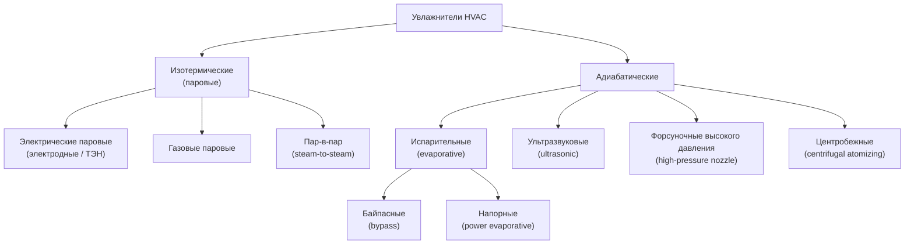

Увлажнители добавляют влагу в воздушный поток для поддержания относительной влажности в нормативных диапазонах. Надлежащий контроль влажности предотвращает деградацию строительных конструкций, дискомфорт персонала, накопление статического электричества и рост числа респираторных заболеваний. Ниже представлен анализ типов увлажнителей, термодинамики процессов и критериев подбора в соответствии со стандартами ASHRAE 55/62.1, СП 60.13330 и ГОСТ Р 52539.

## Термодинамика увлажнения

Увлажнение повышает влагосодержание воздуха $d$ (г/кг сухого воздуха). Процесс протекает по двум принципиально различным термодинамическим путям.

**Изотермическое увлажнение (isothermal humidification).** Водяной пар вводится в поток воздуха извне. Влагосодержание повышается при практически неизменной температуре по сухому термометру. На $Id$-диаграмме процесс следует вертикально вверх при постоянной энтальпии сухого воздуха. Паровые увлажнители работают именно по этому пути.

**Адиабатическое увлажнение (adiabatic humidification).** Жидкая вода испаряется непосредственно в воздушный поток, забирая скрытую теплоту из самого воздуха. Влагосодержание растёт, а температура по сухому термометру снижается вдоль линии постоянной температуры по влажному термометру. Испарительные и распыляющие системы работают адиабатически.

## Расчёт нагрузки увлажнения

Требуемая производительность увлажнителя определяется из уравнения баланса масс влаги:


\dot{m}_{\text{воды}} = \dot{m}_{\text{возд}} \cdot (d_{\text{пр}} - d_{\text{вз}})\ [\text{кг/ч}]


где:
- $\dot{m}_{\text{воды}}$ — производительность увлажнителя, кг/ч;
- $\dot{m}_{\text{возд}}$ — массовый расход сухого воздуха, кг/ч;
- $d_{\text{пр}}$ — влагосодержание приточного воздуха, г/кг;
- $d_{\text{вз}}$ — влагосодержание вытяжного (рециркуляционного) воздуха, г/кг.

Для расчётов по объёмному расходу:


\dot{m}_{\text{воды}} = \frac{Q_{\text{возд}} \cdot \rho_{\text{возд}} \cdot (d_{\text{пр}} - d_{\text{вз}})}{1000}\ [\text{кг/ч}]


где $Q_{\text{возд}}$ — объёмный расход, м³/ч; $\rho_{\text{возд}} \approx 1{,}20$ кг/м³.

### Числовой пример (СИ)

**Условие:** кондиционируемое помещение площадью 500 м², высота 3,5 м, кратность воздухообмена $n = 4$ ч⁻¹. Зимний расчётный период: наружный воздух $t = -15$ °C, $d_{\text{ул}} = 0{,}8$ г/кг; требуемые условия в помещении $t = 20$ °C, $\varphi = 45\%$, $d_{\text{пр}} = 7{,}2$ г/кг.


Q_{\text{возд}} = 500 \times 3{,}5 \times 4 = 7000\ \text{м}^3/\text{ч}



\dot{m}_{\text{возд}} = 7000 \times 1{,}20 = 8400\ \text{кг/ч}



\dot{m}_{\text{воды}} = 8400 \times \frac{7{,}2 - 0{,}8}{1000} = 8400 \times 0{,}0064 = 53{,}8\ \text{кг/ч}


Тепловая мощность, необходимая для генерации пара в паровом увлажнителе:


Q_{\text{пар}} = \dot{m}_{\text{воды}} \cdot h_{fg} = 53{,}8 \times 2450 = 131\,810\ \text{кДж/ч} \approx 36{,}6\ \text{кВт}


## Классификация увлажнителей

## Паровые увлажнители (изотермические)

Паровые увлажнители генерируют пар внешним источником теплоты и вводят его в воздушный поток. Три основных исполнения:

**1. Электрические паровые генераторы.** Электродный тип (electrode type) пропускает переменный ток через минерализованную воду; выделяющееся джоулево тепло доводит воду до кипения. Концентрация минеральных солей самоограничивается автоматическим циклом дренажа и долива свежей воды. Резистивный тип (resistive / immersion heater) нагревает воду ТЭНами; обеспечивает точное управление производительностью изменением подводимой мощности.

**2. Газовые паровые генераторы.** Сжигание природного газа или пропана обеспечивает производительность свыше 100 кг/ч при более низкой стоимости пара в регионах с дешёвым газом.

**3. Преобразователи пар-в-пар (steam-to-steam).** Котловой пар нагревает чистую воду в теплообменнике; образующийся чистый пар без химических добавок котловой воды подаётся в воздушный поток. Обязательны для операционных, фармацевтических производств и пищевой промышленности.

**Преимущества паровых систем:** быстрый отклик (менее 2 мин), точная модуляция производительности (±2 % по $\varphi$), минимальное расстояние поглощения (1,0–1,5 м от точки ввода).

**Недостатки:** высокое потребление первичной энергии — 2480–4870 кДж/кг пара; необходима профилактика парового цилиндра и контроль легионеллы согласно СанПиН 2.1.3.2630-10 и ГОСТ Р 58771.

## Испарительные увлажнители (адиабатические)

Испарительные увлажнители подают воду на пористую насадку (увлажняющую кассету), через которую проходит воздушный поток. Испарение происходит за счёт явной теплоты самого воздуха.

**Байпасные (bypass evaporative).** Часть нагретого приточного воздуха отводится через насадку и возвращается в основной поток. Производительность ограничена; применяются в бытовых приточных установках.

**Напорные (power evaporative).** Вентилятор принудительно прокачивает воздух через насадку непосредственно в приточном воздуховоде. Производительность выше, чем у байпасного типа.

**Ограничения:** снижение температуры приточного воздуха на 3–8 °C требует компенсирующего доподогрева в холодный период. При нарушении обслуживания насадка становится рассадником микроорганизмов, включая Legionella pneumophila — требуется систематический контроль и замена кассет по регламенту.

## Распыляющие увлажнители

**Ультразвуковые (ultrasonic).** Пьезоэлектрический преобразователь вибрирует на частоте 1,7–2,4 МГц, создавая капли 1–10 мкм. Требуют деионизированной или деминерализованной воды (TDS < 50 мг/л) для предотвращения белого минерального осадка на поверхностях помещения. Расстояние полного поглощения капель в воздушном потоке — 0,6–1,2 м.

**Высокого давления (high-pressure nozzle).** Вода под давлением 5,5–20,7 МПа продавливается через форсунку с отверстием 0,13–0,51 мм, образуя капли 5–20 мкм. Производительность — 45–900 кг/ч. Наилучшая энергоэффективность среди всех распыляющих технологий (0,11–0,19 кВт·ч/кг). Рекомендуется вода, очищенная методом обратного осмоса.

**Пневматические (pneumatic / twin-fluid nozzle).** Сжатый воздух 0,3–0,7 МПа срезает поток воды в двухфазной форсунке, образуя капли 10–50 мкм. Производительность — 23–227 кг/ч. Высокое потребление сжатого воздуха делает систему дорогой в эксплуатации; применяется там, где инфраструктура сжатого воздуха уже имеется.

## Сравнительная таблица технологий увлажнения


| Параметр | Паровой | Испарительный | Ультразвуковой | Высокого давления |
|---|---|---|---|---|
| Тип процесса | Изотермический | Адиабатический | Адиабатический | Адиабатический |
| Потребление энергии | 2480–4870 кДж/кг | Только вентилятор | 50–100 Вт/(кг/ч) | 0,11–0,19 кВт/(кг/ч) |
| Время отклика | < 2 мин | 15–30 мин | 5–10 мин | 5–15 мин |
| Точность управления | ±2 % $\varphi$ | ±5–10 % $\varphi$ | ±3–5 % $\varphi$ | ±3–5 % $\varphi$ |
| Влияние на температуру воздуха | +2–5 °C | −3–8 °C | −2–5 °C | −2–5 °C |
| Требования к качеству воды | Средние | Низкие | Деионизированная | Обратный осмос |
| Частота технического обслуживания | Ежеквартально | Ежемесячно (кассеты) | Ежемесячно (преобразователь) | Дважды в год (насос) |
| Расстояние поглощения | 1,0–1,5 м | Не применимо | 0,6–1,2 м | 1,2–2,4 м |
| Начальная стоимость | Высокая | Низкая | Средняя | Высокая |


## Нормативные требования к влажности

**ASHRAE Standard 55-2020** (Thermal Environmental Conditions for Human Occupancy) рекомендует $\varphi = 30{-}60\%$ в занятых помещениях. При $\varphi < 25\%$ — высыхание слизистых оболочек, повышенная выживаемость аэрозольных вирусов и накопление статических зарядов. При $\varphi > 70\%$ — активный рост плесени и клещей домашней пыли.

**ASHRAE Standard 62.1-2019** (Ventilation for Acceptable Indoor Air Quality) рекомендует диапазон 40–60 % как оптимальный для минимизации биологических и химических рисков.

**СП 60.13330.2020** (Актуализированная редакция СНиП 41-01-2003) устанавливает нормируемые параметры микроклимата по категориям помещений (Приложение А): в холодный период для жилых и административных зданий $\varphi = 30{-}45\%$ (оптимальные значения).

**ГОСТ Р 52539-2006** (Чистота воздуха в лечебных учреждениях): $\varphi = 40{-}60\%$ для операционных, $30{-}60\%$ для палат.

## Методология подбора

1. Выполнить психрометрический расчёт для расчётного зимнего климатического режима и определить требуемое $\Delta d = d_{\text{пр}} - d_{\text{ул}}$.
2. Рассчитать производительность увлажнителя $\dot{m}_{\text{воды}}$ кг/ч.
3. Оценить совместимость адиабатического увлажнения с требованиями к температуре приточного воздуха: допустимо ли охлаждение на 3–8 °C или требуется доподогрев.
4. Оценить качество воды (TDS, жёсткость, микробиологический статус) и необходимую водоподготовку.
5. Определить доступные энергоносители: электроэнергия, природный газ, котловой пар, сжатый воздух.
6. Рассчитать совокупную стоимость владения (LCC) для сравниваемых вариантов.
7. Убедиться в достаточной длине прямого участка воздуховода после точки ввода для полного поглощения влаги.
8. Проверить совместимость с системой автоматизации здания (BAS): протоколы, сигналы блокировки при остановке вентилятора, аварийные сигналы.

Правильно подобранная система увлажнения обеспечивает поддержание нормативных параметров влажности при минимальных совокупных затратах на оборудование, энергию и техническое обслуживание.
