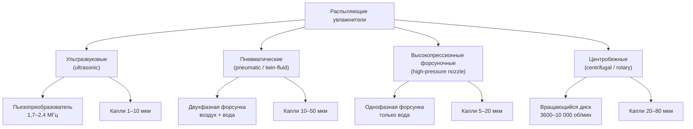

Распыляющие увлажнители вводят влагу в воздушный поток, механически разбивая воду на мелкодисперсный аэрозоль. В отличие от паровых систем, которым требуется полная теплота парообразования от внешнего источника, распыляющие системы используют механическую энергию для получения капель диаметром 1–80 мкм. Последующее испарение капель происходит адиабатически — за счёт явной теплоты воздуха: влагосодержание растёт, температура по сухому термометру снижается. Это делает распыляющие системы наиболее энергоэффективным инструментом увлажнения при достаточно высокой температуре приточного воздуха.

## Физические основы диспергирования

### Поверхностное натяжение и работа диспергирования

Разбивание объёма воды на капли требует преодоления поверхностного натяжения ($\gamma \approx 0{,}072$ Н/м при 20 °C) и создания новой поверхности. Удельная работа диспергирования пропорциональна суммарной площади создаваемых поверхностей:


W_{\text{дисп}} = \gamma \cdot \Delta A_{\text{пов}}


Для объёма воды $V$, разбитого на монодисперсные сферические капли диаметром $d$:
- число капель: $N = 6V / (\pi d^3)$;
- суммарная площадь: $A = N \cdot \pi d^2 = 6V / d$.

Площадь поверхности обратно пропорциональна диаметру капли. Мелкие капли (1–10 мкм) обеспечивают быстрое испарение благодаря высокому отношению площади к объёму, но требуют значительно большей удельной энергии диспергирования.

### Скорость испарения одиночной капли

Скорость испарения капли определяется законом массообмена:


\frac{dm}{dt} = h_m \cdot A \cdot (\rho_{s} - \rho_{\infty})


где $h_m$ — коэффициент массоотдачи, м/с; $A$ — площадь поверхности капли, м²; $\rho_{s}$ — плотность насыщенного пара у поверхности капли, кг/м³; $\rho_{\infty}$ — плотность пара в окружающем воздухе, кг/м³.

Для сферической капли в неподвижном воздухе (критерий Шервуда $Sh = 2$):


t_{\text{исп}} = \frac{d_0^2}{8\, D_v \cdot Sh \cdot \ln\!\left(\frac{1 - \varphi_{\infty}}{1 - 1}\right)}


Практически для капли начальным диаметром $d_0 = 10$ мкм при $t = 21$ °C и $\varphi_{\infty} = 30\%$ время полного испарения составляет 0,5–1,5 с. При скорости воздуха 2 м/с расстояние поглощения — 1–3 м.

## Технологии распыления

## Ультразвуковое увлажнение

### Механизм диспергирования

Пьезоэлектрический преобразователь вибрирует на частоте 1,7–2,4 МГц, формируя капиллярные волны на поверхности воды. При превышении амплитудой критического порога (критерий Рэлея) поверхность становится нестабильной и выбрасывает капли.

Диаметр капли по уравнению Лэнга (Lang equation):


d \approx 0{,}34 \cdot \left(\frac{8\pi\,\gamma}{\rho_w\, f^2}\right)^{1/3}


где $\gamma$ — поверхностное натяжение воды, Н/м; $\rho_w$ — плотность воды, кг/м³; $f$ — частота преобразователя, Гц.

При $f = 2$ МГц типичный диаметр капель составляет 3–5 мкм.

### Технические характеристики

- Производительность: 4,5–90 кг/ч (один блок).
- Потребление электроэнергии: 50–100 Вт·ч/кг увлажнения.
- Расстояние поглощения: 0,6–1,2 м от точки ввода.
- Требования к воде: TDS < 50 мг/л (деминерализованная или деионизированная вода).

**Проблема белой пыли.** При использовании необработанной воды минеральные соли, содержащиеся в каплях, после испарения оседают на поверхностях помещения в виде белого порошка (white dust). Предотвращение — обязательная водоподготовка методом обратного осмоса или ионного обмена.

### Применение

Ультразвуковые системы оптимальны для чистых помещений, музеев, архивов и центров обработки данных — там, где требуется минимальный размер капель, точное управление и компактный монтаж. Высокие затраты на водоподготовку компенсируются низким потреблением электроэнергии.

## Пневматическое распыление

### Механизм диспергирования

Двухфазные форсунки (twin-fluid nozzles) используют сжатый воздух (0,3–0,7 МПа) для аэродинамического срезания потока воды. Критерий Вебера характеризует устойчивость к распылению:


We = \frac{\rho_{\text{возд}} \cdot v_{\text{отн}}^2 \cdot d}{\gamma}


Устойчивое распыление начинается при $We > 12$ (критическое число Вебера). Более высокие давления воздуха дают более мелкие капли, но увеличивают потребление сжатого воздуха.

### Технические характеристики

- Производительность: 23–227 кг/ч.
- Давление воздуха: 276–690 кПа (избыточное).
- Диаметр капель: 10–50 мкм.
- Расстояние поглощения: 1,8–3,7 м.
- Потребление сжатого воздуха: 10–15 скфм на 1 кг/ч.

**Энергетика сжатого воздуха.** Стоимость сжатого воздуха существенна: при давлении 690 кПа мощность компрессора составляет около 0,15 кВт на 1 скфм. При норме 10 скфм на 1 кг/ч увлажнения удельное потребление — около 1,5 кВт/(кг/ч), что значительно выше, чем у форсуночных систем высокого давления или ультразвуковых.

**Применение:** объекты с существующей инфраструктурой сжатого воздуха (производственные цеха, лаборатории); применения, допускающие капли 10–50 мкм; производительность 23–227 кг/ч.

## Форсуночные системы высокого давления

### Механизм диспергирования

Вода под давлением 5,5–20,7 МПа продавливается через точечные отверстия диаметром 0,13–0,51 мм. Перепад давления ускоряет поток до 30–60 м/с; турбулентный распад струи образует капли 5–20 мкм.

Расход через одиночную форсунку:


Q_{\text{форс}} = C_d \cdot A_{\text{отв}} \cdot \sqrt{\frac{2\,\Delta P}{\rho_w}}


где $C_d \approx 0{,}6{-}0{,}7$ — коэффициент расхода для турбулентного течения; $A_{\text{отв}}$ — площадь отверстия, м²; $\Delta P$ — перепад давления, Па.

### Пример расчёта расхода форсунки

Отверстие диаметром 0,254 мм, $\Delta P = 10{,}3$ МПа:


A_{\text{отв}} = \frac{\pi \cdot (0{,}254 \times 10^{-3})^2}{4} = 5{,}07 \times 10^{-8}\ \text{м}^2



Q = 0{,}65 \times 5{,}07 \times 10^{-8} \times \sqrt{\frac{2 \times 10{,}3 \times 10^6}{1000}} = 1{,}5 \times 10^{-6}\ \text{м}^3/\text{с} \approx 0{,}09\ \text{л/мин}


На коллектор из 10 форсунок: $Q_{\text{кол}} = 10 \times 0{,}09 = 0{,}9$ л/мин $\approx 54$ кг/ч.

### Технические характеристики

- Производительность системы: 45–907 кг/ч.
- Давление воды: 5,5–20,7 МПа.
- Удельное потребление насоса: 0,11–0,19 кВт/(кг/ч).
- Расстояние поглощения: 1,2–2,4 м.
- Требования к воде: TDS < 200 мг/л (рекомендован обратный осмос).

**Применение:** крупные коммерческие и промышленные объекты, системы косвенного адиабатического охлаждения (indirect evaporative cooling) в наружном воздухе, адиабатическое предохлаждение конденсаторов.

## Центробежное распыление

### Механизм диспергирования

Вращающийся диск или чаша (3600–10 000 об/мин) выбрасывает воду радиально. Центробежная сила преодолевает поверхностное натяжение у края диска, формируя нити (ligaments), которые разрываются на капли.

Диаметр капель (Nukiyama-Tanasawa):


d \approx C \cdot \sqrt{\frac{\gamma}{\rho_w \cdot \omega^2 \cdot r^2}}


где $\omega$ — угловая скорость, рад/с; $r$ — радиус диска, м; $C$ — эмпирическая константа.

Диаметры капель — 20–80 мкм с широким распределением. Применение в HVAC ограничено из-за механической сложности, крупных капель и необходимости дополнительной сепарации.

## Сравнительная таблица технологий


| Параметр | Ультразвуковая | Пневматическая | Высокопрессионная форсунка | Центробежная |
|---|---|---|---|---|
| Диаметр капель, мкм | 1–10 | 10–50 | 5–20 | 20–80 |
| Давление воды | 3,4–34 кПа | 34–138 кПа | 5,5–20,7 МПа | Нет |
| Удельное потребление энергии | 50–100 Вт/(кг/ч) | ~1,5 кВт/(кг/ч) | 0,11–0,19 кВт/(кг/ч) | 0,3–0,6 кВт/(кг/ч) |
| Расстояние поглощения | 0,6–1,2 м | 1,8–3,7 м | 1,2–2,4 м | 1,5–3,0 м |
| Требования к воде | TDS < 50 мг/л | Фильтрация | TDS < 200 мг/л | Фильтрация |
| Производительность (один блок) | 4,5–90 кг/ч | 23–227 кг/ч | 45–907 кг/ч | 10–200 кг/ч |
| Частота обслуживания | Ежемесячно | Ежеквартально | Дважды в год | Ежеквартально |
| Риск белого осадка | Высокий | Средний | Низкий | Средний |


## Проектирование согласно ASHRAE

### Расчёт минимального расстояния поглощения

Достаточная длина прямого участка воздуховода от точки ввода аэрозоля до любого поворота, теплообменника или концевого устройства:


L_{\text{min}} = 1{,}5 \times \sqrt{\frac{Q_{\text{возд}}}{V_{\text{возд}}}}


где $Q_{\text{возд}}$ — расход воздуха, м³/ч; $V_{\text{возд}}$ — скорость воздуха, м/мин. К полученному результату добавляют коэффициент запаса 20–30 %.

**Пример.** $Q_{\text{возд}} = 5000$ м³/ч, $V_{\text{возд}} = 300$ м/мин:


L_{\text{min}} = 1{,}5 \times \sqrt{\frac{5000}{300}} = 1{,}5 \times 4{,}08 = 6{,}1\ \text{м}


С запасом 25 %: $L = 6{,}1 \times 1{,}25 \approx 7{,}7$ м.

### Управление производительностью

Модулирование расхода воды осуществляется одним из следующих методов:
- ступенчатое включение-выключение отдельных форсунок (секционированные коллекторы);
- изменение давления насоса (форсуночные системы высокого давления);
- изменение давления воздуха (пневматические системы);
- изменение мощности преобразователя (ультразвуковые системы).

Датчик точки росы или относительной влажности интегрируют в систему управления: уставку выбирают так, чтобы воздух в точке выхода из зоны увлажнения оставался ниже насыщения и исключалась конденсация на стенках воздуховода.

### Требования к качеству воды


| Тип системы | Максимальный TDS | Рекомендуемая водоподготовка |
|---|---|---|
| Ультразвуковая | 50 мг/л | Обратный осмос + деионизация |
| Высокопрессионная форсунка | 200 мг/л | Обратный осмос |
| Пневматическая | 500 мг/л | Механическая фильтрация, умягчение |
| Центробежная | 500 мг/л | Механическая фильтрация |


## Адиабатический эффект охлаждения

Все распыляющие системы обеспечивают адиабатическое охлаждение воздуха: теплота парообразования ($h_{fg} \approx 2450$ кДж/кг при 20 °C) извлекается из явного тепла воздуха.


\Delta t_{\text{охл}} = \frac{\dot{m}_{\text{воды}} \cdot h_{fg}}{\dot{m}_{\text{возд}} \cdot c_p}


**Пример.** $\dot{m}_{\text{воды}} = 50$ кг/ч, $\dot{m}_{\text{возд}} = 8400$ кг/ч, $c_p = 1{,}005$ кДж/(кг·К):


\Delta t_{\text{охл}} = \frac{50 \times 2450}{8400 \times 1{,}005} = \frac{122\,500}{8442} \approx 14{,}5\ ^{\circ}\text{C}


На практике такого охлаждения добиваются редко, так как оно ограничено разностью температур сухого и влажного термометров. Расчёт позволяет оценить реальный перепад температур и необходимость компенсирующего подогрева в холодный период.

## Руководство по выбору системы

**Ультразвуковые системы** — чистые помещения класса ISO 5–7, музеи, архивы, ЦОД. Минимальный размер капель, компактность, низкое потребление электроэнергии при соответствующей водоподготовке.

**Пневматические системы** — промышленные объекты с доступным сжатым воздухом; применения с умеренной производительностью 23–227 кг/ч; допустимы капли 10–50 мкм.

**Форсуночные системы высокого давления** — крупные коммерческие и промышленные объекты с производительностью 45–907 кг/ч; лучшая энергоэффективность среди распыляющих технологий; адиабатическое предохлаждение наружного воздуха на конденсаторах.

**Центробежные системы** — специализированные промышленные процессы, допускающие широкое распределение капель по размеру; применяются редко в коммерческом HVAC.
