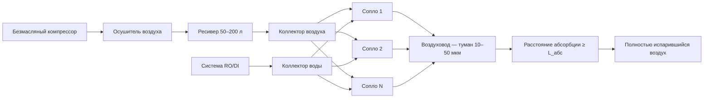

## Общее техническое описание

Форсунки с распылением сжатым воздухом (compressed-air atomizing humidifiers) используют двухфазные сопла, в которых поток сжатого воздуха смешивается с водой и формирует мелкодисперсный туман, испаряющийся в приточном воздушном потоке. Медианный диаметр капель (Sauter mean diameter, SMD) составляет 10–50 мкм, что обеспечивает полное испарение на практических длинах воздуховода. Кинетическая энергия воздуха выполняет функцию распылителя, исключая необходимость в высокопрессионных насосах, характерных для гидравлических систем. Области применения — прецизионное регулирование влажности в чистых помещениях, фармацевтических производствах, серверных залах, сельскохозяйственных теплицах, а также в установках, где быстрый отклик на изменение нагрузки важнее операционной стоимости.

## Принципы двухфазного распыления (Two-Fluid Atomization)

В соплах с внутренним смешиванием (internal-mix nozzles) потоки сжатого воздуха и воды объединяются в смесительной камере до выхода из отверстия. Турбулентное взаимодействие фаз разрушает водяную плёнку на капли с высокой удельной поверхностью. Массовое соотношение воздух/вода (air-to-liquid ratio, ALR) находится в диапазоне 0,2–0,5 кг/кг: повышение ALR уменьшает медианный диаметр капель, но увеличивает расход компрессора. Сопла с внешним смешиванием (external-mix nozzles) объединяют потоки после выхода из раздельных отверстий — они проще в очистке, но производят несколько более крупные капли. Конкретная геометрия смесительной камеры, диаметр сопла и угол конуса распыла нормируются производителем и определяют распределение капель по размерам (droplet size distribution, DSD).

## Характеристики размера капель 10–50 мкм

Диапазон 10–50 мкм является оптимальным компромиссом между скоростью испарения и удельной производительностью. Капли менее 10 мкм испаряются практически мгновенно, но их получение требует чрезмерного давления воздуха. Капли крупнее 50 мкм испаряются медленнее, нуждаются в увеличенном расстоянии абсорбции и способны достигать поверхностей в виде жидкой влаги.

Время испарения одиночной капли сферической формы подчиняется закону D²:


t_{\text{исп}} = \frac{d_0^2}{K_{\text{исп}}}


где:
- $d_0$ — начальный диаметр капли, м;
- $K_{\text{исп}}$ — константа испарения (evaporation constant), м²/с, зависящая от температуры, давления пара и коэффициента диффузии.

Для капли диаметром 30 мкм при 20 °C и 50 % относительной влажности (RH) $K_{\text{исп}} \approx 1{,}3 \times 10^{-9}$ м²/с, что даёт $t_{\text{исп}} \approx 0{,}7$ с. Это соответствует расстоянию абсорбции около 3–5 м при типичной скорости воздуха 4–6 м/с.

## Требования к воздушному компрессору

Для работы форсунок применяются безмасляные поршневые или спиральные компрессоры (oil-free scroll или reciprocating compressors), исключающие загрязнение масляным аэрозолем. Рабочее давление воздуха — 276–690 кПа (40–100 psig). Производительность компрессора рассчитывается из расхода воздуха на каждое сопло плюс запас 20 % на регулирование давления:


\dot{V}_{\text{комп}} = n_{\text{соп}} \cdot \dot{V}_{\text{соп}} \cdot 1{,}2


где $n_{\text{соп}}$ — число активных сопел, $\dot{V}_{\text{соп}}$ — нормативный расход воздуха через одно сопло (140–565 л/мин в зависимости от типоразмера). Накопительный ресивер (air receiver) сглаживает пульсации давления. Осушитель хладагентного типа (refrigerated air dryer) поддерживает точку росы не выше +3 °C, предотвращая конденсацию в распределительной сети.

## Полное испарение в воздуховоде и расстояние абсорбции

Расстояние абсорбции (absorption distance) — длина воздуховода от форсунок до первого препятствия (поворота, дроссельного клапана, катушки нагревателя), на которой происходит полное испарение. Его значение зависит от распределения размеров капель, скорости воздуха, температуры, уровня турбулентности и разности влагосодержаний.

Инженерная оценка по упрощённой формуле:


L_{\text{абс}} = \frac{K \cdot d_{50}^2 \cdot v_{\text{возд}}}{\Delta \varphi}


где:
- $K$ — эмпирическая константа, ≈ 0,04–0,08 (мс·%/мкм²/м);
- $d_{50}$ — медианный диаметр капли, мкм;
- $v_{\text{возд}}$ — скорость воздуха в воздуховоде, м/с;
- $\Delta \varphi$ — разница между насыщением и текущей RH, %.

**Пример расчёта.** Дано: $d_{50} = 30$ мкм, $v_{\text{возд}} = 5$ м/с, $\Delta \varphi = 40$ % (воздух 20 °C, RH 30 % — поглощающий потенциал до насыщения). При $K = 0{,}06$:

$$L_{\text{абс}} = \frac{0{,}06 \times 30^2 \times 5}{40} = \frac{270}{40} \approx 6{,}8 \text{ м}$$

Для прецизионных расчётов применяется моделирование методом вычислительной гидродинамики (CFD — computational fluid dynamics). Рекомендуемые значения по ASHRAE Handbook HVAC Systems and Equipment: 1,8–6 м в зависимости от условий.

## Требования к водоподготовке методом ОО/ДИ

Необработанная водопроводная вода содержит растворённые минералы (жёсткость 100–400 мг/л CaCO₃), которые при испарении капли остаются в виде твёрдой взвеси. Этот эффект, известный как «белая пыль» (white dust), загрязняет поверхности и оборудование помещения.

Водоподготовка методами обратного осмоса (reverse osmosis, RO) или деионизации (deionized water, DI) снижает TDS (total dissolved solids) до 10–50 мг/л. Мембраны RO обеспечивают отсечение 90–98 % растворённых ионов. Дополнительная полировка через смешанный ионообменный фильтр (mixed-bed DI) доводит TDS до < 1 мг/л — это требование для фармацевтических и микроэлектронных производств. Стоимость системы водоподготовки и расходные материалы (мембраны, смолы) учитываются при технико-экономическом сравнении технологий увлажнения.

## Конфигурация форсунок и коллекторов

Коллектор (manifold) несёт несколько сопел с межосевым расстоянием 300–900 мм, обеспечивающим равномерное поперечное распределение влаги по сечению воздуховода. Модульная конструкция позволяет добавлять сопла при росте нагрузки без демонтажа секции. Обратные клапаны (check valves) на каждом соплвом порту предотвращают дренаж при остановке системы. Расчёт перепада давления в коллекторе гарантирует, что давление в наиболее удалённом соплвом порту остаётся в допустимом диапазоне.





## Методы модуляции производительности

Производительность системы регулируется тремя способами:

1. **Ступенчатое включение сопел (staged nozzle activation).** Электромагнитные клапаны подключают или отключают группы сопел, давая дискретные ступени: при 8 соплах — шаг 12,5 % от номинала.
2. **Модуляция давления воздуха.** Привод переменной частоты (variable frequency drive, VFD) на компрессоре позволяет плавно изменять давление и, следовательно, расход воды через сопло. Недостаток: изменение давления смещает медианный диаметр капель.
3. **Комбинированное управление.** Ступенчатое включение обеспечивает грубое регулирование, а модуляция давления — точную подстройку внутри каждой ступени. Это оптимальный подход с точки зрения качества тумана и разрешения управления.

## Анализ стоимости эксплуатации

Доминирующий вклад в операционные затраты даёт производство сжатого воздуха: удельное энергопотребление составляет 15–35 Вт/(кг/ч) добавленной влаги. Для сравнения, электрический паровой увлажнитель требует около 700–800 Вт/(кг/ч). Таким образом, в условиях, когда отсутствие тепловой нагрузки на систему охлаждения важнее стоимости сжатого воздуха, технология оказывается экономически конкурентоспособной.


| Технология | Уд. энергозатраты, Вт/(кг/ч) | Тепловая нагрузка | Расстояние абсорбции |
|---|---|---|---|
| Сжатый воздух (compressed-air) | 15–35 | Нулевая | 1,8–6 м |
| Гидравлическое распыление (hydraulic) | 3–8 | Отрицательная (охлаждение) | 3–9 м |
| Электрический пар (electric steam) | 700–800 | Высокая | 0,3–1,5 м |
| Ультразвуковой (ultrasonic) | 25–60 | Нулевая | < 1 м |


## Требования к техническому обслуживанию

Плановое ТО включает:
- **Ежемесячно:** визуальный осмотр сопел на засорение и отложения; проверка давления воздуха и воды в точках контроля.
- **Ежеквартально:** замена фильтрующих элементов на линии подачи воды и воздуха; проверка производительности системы RO/DI по показателю TDS.
- **Раз в полгода:** очистка сопел — промывка слабым раствором лимонной кислоты или в ультразвуковой ванне; замена мембран RO согласно рекомендациям производителя.
- **Ежегодно:** ТО компрессора: замена масла (у масляных типов), замена воздушных фильтров, проверка ремней и подшипников; испытание предохранительного клапана ресивера.

## Стандарты и нормативная база

Проектирование систем с форсунками распыления сжатым воздухом выполняется в соответствии с:
- **ASHRAE Handbook — HVAC Systems and Equipment, Chapter 22** — требования к адиабатическим системам увлажнения;
- **ASHRAE Standard 62.1-2022** — качество внутреннего воздуха, ограничения по уносу влаги;
- **ASHRAE Standard 188-2018** — управление рисками легионеллёза в водных системах зданий;
- **СП 60.13330.2020** — отопление, вентиляция и кондиционирование воздуха (актуализация СНиП 41-01-2003).

## Сравнение с гидравлическим распылением


| Параметр | Сжатый воздух | Гидравлическое |
|---|---|---|
| Рабочее давление воды, кПа | 103–552 | 689–6895 |
| Медианный диаметр капель, мкм | 10–50 | 20–80 |
| Расстояние абсорбции, м | 1,8–6 | 3–9 |
| Уд. расход энергии, Вт/(кг/ч) | 15–35 | 3–8 |
| Требования к инфраструктуре | Компрессор + RO/DI | Насос высокого давления + RO/DI |
| Время отклика на сигнал управления | < 5 с | < 10 с |


Форсунки сжатым воздухом предпочтительны при ограниченном расстоянии абсорбции, необходимости быстрого отклика и наличии существующей инфраструктуры сжатого воздуха. Гидравлическое распыление экономичнее по операционным расходам при больших производительностях и достаточном расстоянии абсорбции.
