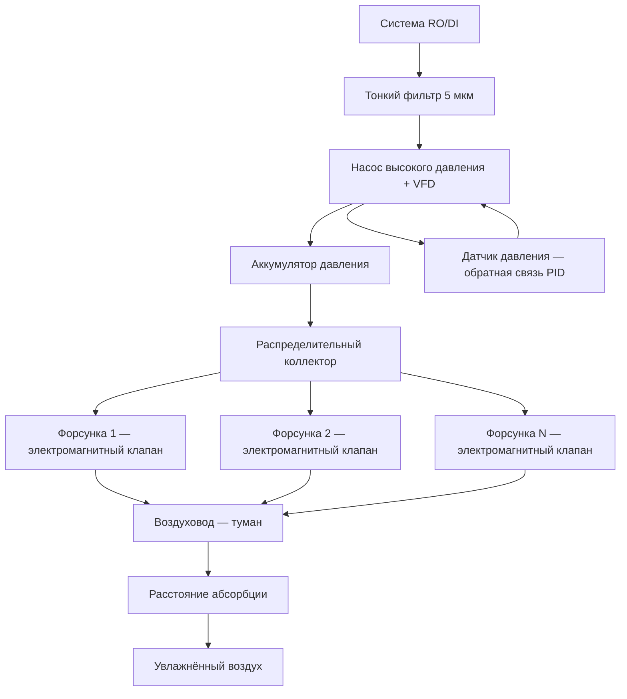

## Технический обзор

Гидравлические распыляющие увлажнители (hydraulic atomizing humidifiers) генерируют мелкодисперсный водяной туман, пропуская воду под высоким давлением через прецизионные отверстия форсунок без использования сжатого воздуха. Одножидкостный принцип (single-fluid atomization) исключает инфраструктуру компрессора и характерные для неё операционные затраты. Насосные агрегаты повышают давление воды от 689 до 6895 кПа (100–1000 psig), направляя её через прецизионные сопла, которые преобразуют потенциальную энергию давления в кинетическую, разрывая водяную плёнку на капли. Адиабатический характер процесса обеспечивает одновременное испарительное охлаждение (evaporative cooling) и увлажнение без подвода внешней теплоты. Области применения охватывают коммерческие здания, промышленные производства, центры обработки данных и системы предварительной обработки воздуха.

## Системы насосов высокого давления

Насосы прямого вытеснения (positive displacement pumps) — поршневые (piston), плунжерные (plunger) или диафрагменные (diaphragm) — создают давление, превышающее гидравлическое сопротивление форсунок. Мощность насоса определяется из уравнения:


P_{\text{насос}} = \frac{\dot{Q} \cdot \Delta p}{\eta_{\text{насос}}}


где:
- $\dot{Q}$ — объёмный расход воды, м³/с;
- $\Delta p$ — рабочее давление, Па;
- $\eta_{\text{насос}}$ — КПД насоса (обычно 0,70–0,85).

**Пример расчёта.** Расход воды 20 л/мин = 3,33 × 10⁻⁴ м³/с, давление 2758 кПа = 2,758 × 10⁶ Па, КПД 0,75:

$$P_{\text{насос}} = \frac{3{,}33 \times 10^{-4} \times 2{,}758 \times 10^6}{0{,}75} \approx 1{,}22 \text{ кВт}$$

Накопительные аккумуляторы давления (pressure accumulators) демпфируют пульсации возвратно-поступательных насосов и обеспечивают мгновенный запас производительности при резких изменениях нагрузки. Электроприводы переменной частоты (variable frequency drive, VFD) на насосных двигателях позволяют непрерывную модуляцию давления в диапазоне 10–100 %.

## Диапазон давления 689–6895 кПа и выбор режима

Рабочее давление определяет медианный диаметр капель (Sauter mean diameter, SMD) и, следовательно, расстояние абсорбции:


| Давление, кПа | Медианный диаметр, мкм | Расстояние абсорбции, м | Уд. мощность насоса, Вт/(кг/ч) |
|---|---|---|---|
| 689–1379 | 40–80 | 5–9 | 3–5 |
| 1379–4137 | 20–40 | 2,5–5 | 5–15 |
| 4137–6895 | 10–25 | 1,5–3 | 15–30 |


Типичные коммерческие установки работают при 1379–4137 кПа как оптимальный компромисс между производительностью и энергопотреблением. Системы ультратонкого тумана (ultra-fine mist) для специальных применений используют давления 5500–6900 кПа.

## Механика распыления через отверстие сопла

При прохождении жидкости через прецизионное отверстие (orifice) ламинарный поток высокого давления переходит в высокоскоростной турбулентный выброс. Аэродинамическая нестабильность, кавитация и поверхностное натяжение разрушают водяную плёнку на капли. Диаметр капель обратно пропорционален давлению и прямо пропорционален диаметру отверстия:


d_{50} \propto \frac{d_{\text{отв}}}{We^{1/2}}


где $We = \rho v^2 d_{\text{отв}} / \sigma$ — число Вебера (Weber number), $\sigma$ — поверхностное натяжение воды (≈ 0,072 Н/м при 20 °C). Геометрия отверстия (диаметр, отношение длины к диаметру $L/D$, угол входного конуса) задаётся производителем и определяет схему распыления: полный конус (full cone), полый конус (hollow cone) или плоский веер (flat fan). Материалы сопел — нержавеющая сталь, керамика или карбид вольфрама — обеспечивают стойкость к эрозии.

## Стратегии управления насосом (Modulating Pump Control)

Привод переменной частоты (VFD) обеспечивает непрерывное регулирование скорости насоса в диапазоне 10–100 % при сохранении заданного давления, поддерживая постоянный медианный диаметр капель. Это принципиально отличает модуляцию скорости от модуляции давления, при которой размер капель меняется вместе с давлением. PID-регуляторы (proportional-integral-derivative) поддерживают уставку давления при изменяющемся числе активных форсунок. Датчики давления замыкают контур управления; предохранительные клапаны сброса (pressure relief valves) защищают систему от превышения допустимого давления.

## Коллекторы ступенчатого включения форсунок

Несколько форсунок, установленных на распределительных коллекторах, обеспечивают ступенчатое управление производительностью и равномерное распределение влаги по поперечному сечению воздуховода. Электромагнитные клапаны (solenoid valves) с индивидуальным управлением позволяют подключать или отключать отдельные форсунки. При 8 форсунках и их ступенчатом включении шаг производительности составляет 12,5 %. Совместное применение ступенчатого включения и модуляции скорости насоса даёт плавный диапазон регулирования 10–100 %. Обратные клапаны (anti-drip valves) на каждой форсунке предотвращают капание при снижении давления ниже порога работы.





## Критические требования к фильтрации воды

Прецизионные отверстия форсунок с диаметром 0,1–0,5 мм требуют тонкой фильтрации подаваемой воды для предотвращения засорения и эрозии. Многоступенчатая фильтрация:


| Ступень | Тип фильтра | Степень очистки | Назначение |
|---|---|---|---|
| 1 | Сетчатый осадочный | 100 мкм | Удаление крупного мусора |
| 2 | Картриджный полипропилен | 25 мкм | Защита насоса |
| 3 | Картриджный полипропилен | 5 мкм | Защита форсунок |
| 4 | Система RO | < 0,001 мкм (TDS < 50 мг/л) | Предотвращение белой пыли |


Индикаторы дифференциального давления (differential pressure indicators) сигнализируют о необходимости замены фильтрующих элементов. Корпуса фильтров с быстросменными картриджами позволяют замену без депрессуризации системы.

## Расстояние абсорбции и испарительное охлаждение

Время испарения одиночной капли и, следовательно, расстояние абсорбции (absorption distance) определяются законом D²:


L_{\text{абс}} \approx v_{\text{возд}} \cdot \frac{d_{50}^2}{K_{\text{исп}}}


При более низком давлении (крупные капли 40–80 мкм) требуется расстояние 5–9 м; при высоком давлении (10–25 мкм) достаточно 1,5–3 м. Испарение сопровождается адиабатическим охлаждением (adiabatic cooling): снижение температуры сухого термометра достигает 5–11 °C в зависимости от начальных условий. Этот эффект снижает нагрузку на системы механического охлаждения в тёплый период.

## Анализ потребления энергии

Сравнение технологий увлажнения по удельной электрической мощности (Вт на каждый кг/ч добавленной влаги):


w_{\text{гидр}} = \frac{P_{\text{насос}}}{\dot{m}_{\text{вода}}} = \frac{\Delta p \cdot \dot{Q}}{\eta_{\text{насос}} \cdot \dot{m}_{\text{вода}}}


Для системы из примера выше: $\dot{m}_{\text{вода}} \approx 20$ кг/ч (при допущении, что весь расход испаряется), $P_{\text{насос}} = 1{,}22$ кВт, следовательно $w_{\text{гидр}} \approx 61$ Вт/(кг/ч). Это приблизительно на порядок ниже, чем у электрического парового увлажнителя (700–800 Вт/(кг/ч)), и сопоставимо с форсунками сжатого воздуха, но без тепловой нагрузки на систему кондиционирования.

## Интеграция водоподготовки

Предварительная обработка методом обратного осмоса (RO) или деионизации (DI) снижает TDS ниже 50 мг/л, устраняя образование белой пыли (white dust) и минеральных отложений на соплах. Умягчение воды (water softening) само по себе недостаточно: оно заменяет ионы кальция и магния на натрий, не снижая суммарный TDS. УФ-стерилизация (UV sterilization) в контуре рециркуляции подавляет биологический рост. Биоциды (biocides) применяются по протоколу ASHRAE 188 с надлежащим контролем дозирования и утилизацией промывных вод.

## Требования к техническому обслуживанию

- **Ежемесячно:** осмотр форсунок на засорение и эрозию отверстий; проверка давления и расхода в реперных точках.
- **Ежеквартально:** замена фильтрующих картриджей; проверка TDS воды; контроль состояния мембран RO.
- **Раз в полгода:** очистка форсунок в ультразвуковой ванне с раствором лимонной кислоты; проверка обратных клапанов на герметичность.
- **Ежегодно:** ревизия насоса (уплотнения, клапаны), диагностика VFD, поверка датчиков давления; замена мембран RO согласно графику.

Засорение или эрозия отверстий форсунок проявляется в изменении схемы факела распыла (spray pattern), снижении производительности и неравномерном распределении влаги по сечению. Своевременная замена изношенных форсунок из запасного фонда минимизирует простой системы.

## Стандарты и нормативная база

- **ASHRAE Handbook — HVAC Systems and Equipment, Chapter 22** — проектирование адиабатических систем увлажнения;
- **ASHRAE Standard 62.1-2022** — вентиляция и качество внутреннего воздуха; требования к элиминаторам влагоуноса;
- **ASHRAE Standard 188-2018** — управление рисками легионеллёза;
- **AHRI Standard 640** — коммерческие системы увлажнения;
- **СП 60.13330.2020** — отопление, вентиляция и кондиционирование воздуха.

## Преимущества и ограничения

**Преимущества:** низкое удельное энергопотребление по сравнению с паровыми системами; адиабатическое охлаждение снижает нагрузку на чиллеры в тёплый период; отсутствие продуктов сгорания; быстрый отклик системы с VFD; модульная масштабируемость производительности.

**Ограничения:** требования к расстоянию абсорбции ограничивают применение в стеснённых условиях реконструкции; адиабатическое охлаждение нежелательно в отопительный сезон (требуется доподогрев); жёсткая вода без надлежащей обработки ускоряет засорение форсунок; правильный ввод в эксплуатацию (балансировка форсунок, настройка алгоритма ступенчатого включения) критичен для достижения расчётных характеристик.
